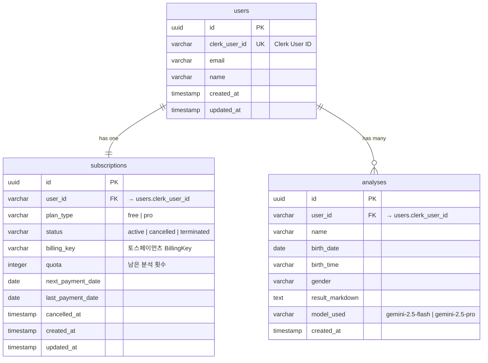
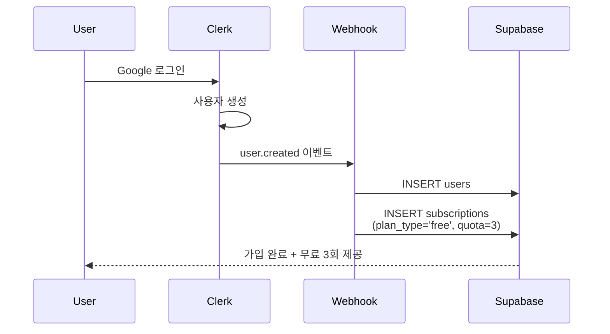
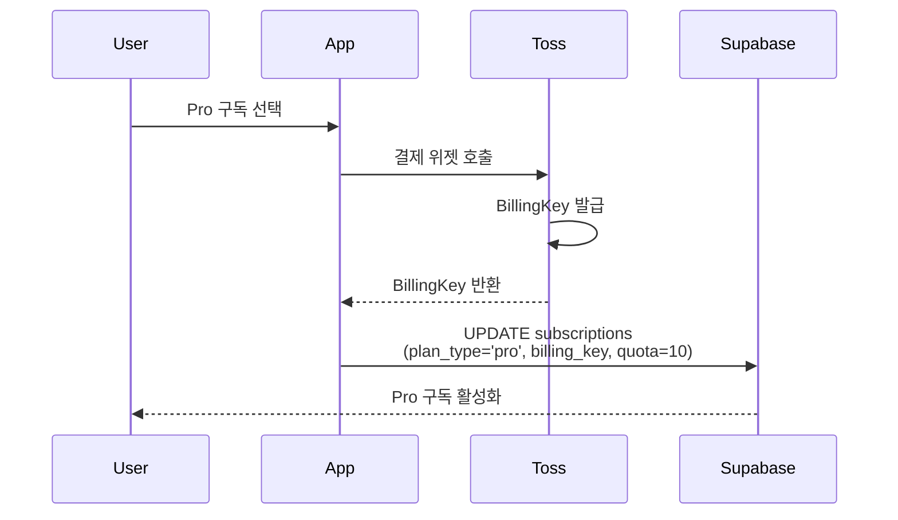
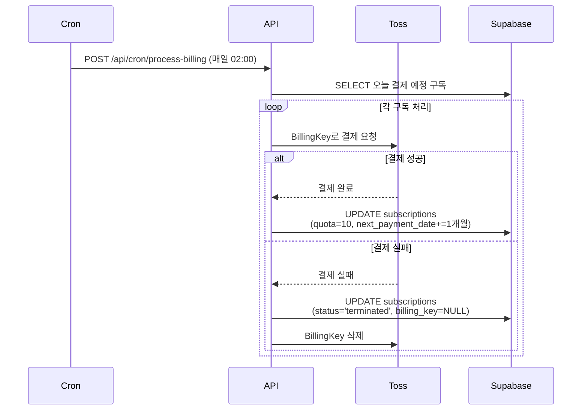
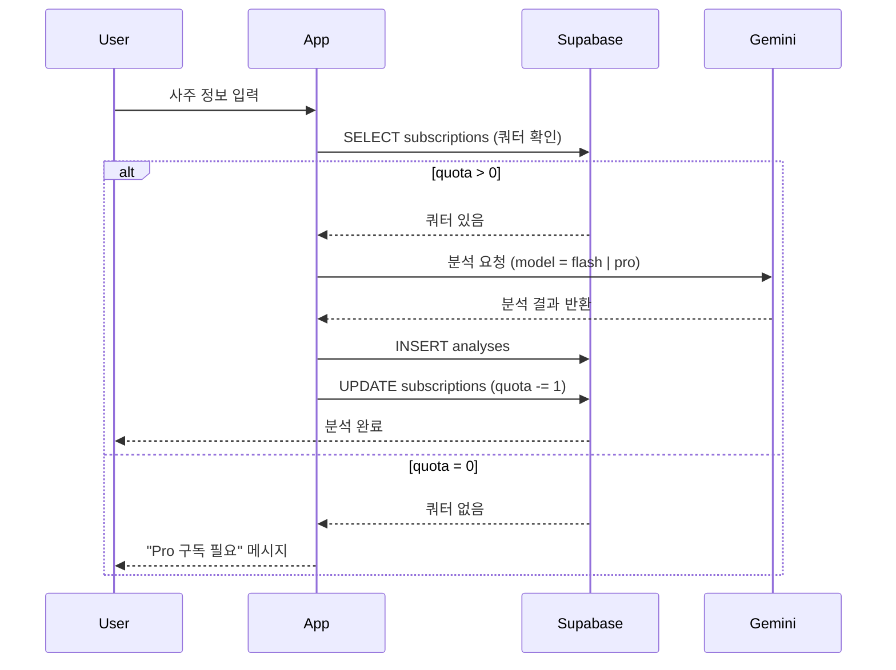

# 📊 데이터베이스 설계 문서

## 1. 데이터베이스 아키텍처 개요

### 1.1 기술 스택
- **DBMS**: PostgreSQL (Supabase)
- **ORM**: Supabase Client
- **인증**: Clerk (외부 인증 서비스, user_id는 Clerk의 user_id 참조)
- **결제**: 토스페이먼츠 (BillingKey 저장)

### 1.2 아키텍처 원칙
- **데이터 정규화**: 3NF(제3정규형) 준수
- **CASCADE 정책**: 사용자 삭제 시 관련 데이터 자동 삭제
- **타임스탬프**: 모든 테이블에 `created_at`, `updated_at` 포함
- **인덱싱**: 자주 조회되는 컬럼에 인덱스 설정
- **RLS 비활성화**: Supabase 가이드라인에 따라 Row Level Security 사용 안 함

### 1.3 데이터 흐름
```
[Clerk 인증] → [Webhook] → [users 테이블 생성] → [subscriptions 테이블 초기화]
                                    ↓
                          [사주 분석 요청] → [쿼터 확인]
                                    ↓
                          [Gemini API 호출] → [analyses 테이블 저장]
                                    ↓
                          [쿼터 차감] → [구독 정보 업데이트]
```

---

## 2. 테이블 스키마

### 2.1 `users` 테이블
**목적**: Clerk 사용자 정보를 Supabase에 동기화

| 컬럼명 | 타입 | 제약조건 | 설명 |
|--------|------|----------|------|
| `id` | UUID | PRIMARY KEY, DEFAULT uuid_generate_v4() | 내부 고유 ID |
| `clerk_user_id` | VARCHAR(255) | UNIQUE NOT NULL | Clerk User ID (외래키 역할) |
| `email` | VARCHAR(255) | NOT NULL | 사용자 이메일 |
| `name` | VARCHAR(100) | NULL | 사용자 이름 |
| `created_at` | TIMESTAMP | DEFAULT NOW() | 생성 시간 |
| `updated_at` | TIMESTAMP | DEFAULT NOW() | 수정 시간 |

**인덱스**:
```sql
CREATE INDEX idx_users_clerk_id ON users(clerk_user_id);
CREATE INDEX idx_users_email ON users(email);
```

**관계**:
- `subscriptions.user_id` → `users.clerk_user_id` (1:1)
- `analyses.user_id` → `users.clerk_user_id` (1:N)

---

### 2.2 `subscriptions` 테이블
**목적**: 사용자 구독 정보 및 쿼터 관리

| 컬럼명 | 타입 | 제약조건 | 설명 |
|--------|------|----------|------|
| `id` | UUID | PRIMARY KEY, DEFAULT uuid_generate_v4() | 구독 고유 ID |
| `user_id` | VARCHAR(255) | UNIQUE NOT NULL, FK → users(clerk_user_id) ON DELETE CASCADE | 사용자 ID |
| `plan_type` | VARCHAR(20) | NOT NULL, DEFAULT 'free' | 플랜 타입 ('free', 'pro') |
| `status` | VARCHAR(20) | NOT NULL, DEFAULT 'active' | 구독 상태 ('active', 'cancelled', 'terminated') |
| `billing_key` | VARCHAR(255) | NULL | 토스페이먼츠 BillingKey |
| `quota` | INTEGER | NOT NULL, DEFAULT 3 | 남은 분석 횟수 (무료: 3, Pro: 10) |
| `next_payment_date` | DATE | NULL | 다음 결제 예정일 |
| `last_payment_date` | DATE | NULL | 마지막 결제일 |
| `cancelled_at` | TIMESTAMP | NULL | 구독 취소 요청 시간 |
| `created_at` | TIMESTAMP | DEFAULT NOW() | 생성 시간 |
| `updated_at` | TIMESTAMP | DEFAULT NOW() | 수정 시간 |

**인덱스**:
```sql
CREATE INDEX idx_subscriptions_user_id ON subscriptions(user_id);
CREATE INDEX idx_subscriptions_status ON subscriptions(status);
CREATE INDEX idx_subscriptions_next_payment_date ON subscriptions(next_payment_date);
```

**관계**:
- `user_id` → `users.clerk_user_id` (FK, CASCADE DELETE)

**상태 전이도**:
```
[active] ←→ [cancelled] → [terminated]
   ↑            ↓
   └── reactivate ──┘
```

**비즈니스 규칙**:
- `plan_type = 'free'`: `quota = 3` (초기값), `billing_key = NULL`
- `plan_type = 'pro'`: `quota = 10`, `billing_key` 필수
- `status = 'cancelled'`: 결제일까지 Pro 유지, `cancelled_at` 기록
- `status = 'terminated'`: 즉시 해지, `billing_key = NULL`, `quota = 0`

---

### 2.3 `analyses` 테이블
**목적**: 사주 분석 이력 저장

| 컬럼명 | 타입 | 제약조건 | 설명 |
|--------|------|----------|------|
| `id` | UUID | PRIMARY KEY, DEFAULT uuid_generate_v4() | 분석 고유 ID |
| `user_id` | VARCHAR(255) | NOT NULL, FK → users(clerk_user_id) ON DELETE CASCADE | 사용자 ID |
| `name` | VARCHAR(100) | NOT NULL | 분석 대상자 이름 |
| `birth_date` | DATE | NOT NULL | 생년월일 |
| `birth_time` | VARCHAR(10) | NULL | 출생 시간 (HH:MM 형식, 미상 가능) |
| `gender` | VARCHAR(10) | NOT NULL | 성별 ('male', 'female') |
| `result_markdown` | TEXT | NOT NULL | Gemini 분석 결과 (마크다운 형식) |
| `model_used` | VARCHAR(50) | NOT NULL | 사용된 AI 모델 ('gemini-2.5-flash', 'gemini-2.5-pro') |
| `created_at` | TIMESTAMP | DEFAULT NOW() | 분석 생성 시간 |

**인덱스**:
```sql
CREATE INDEX idx_analyses_user_id ON analyses(user_id);
CREATE INDEX idx_analyses_created_at ON analyses(created_at DESC);
CREATE INDEX idx_analyses_user_created ON analyses(user_id, created_at DESC);
```

**관계**:
- `user_id` → `users.clerk_user_id` (FK, CASCADE DELETE)

**저장 정책**:
- 모든 분석 결과는 영구 저장
- 사용자 삭제 시 CASCADE DELETE로 자동 삭제
- `result_markdown`은 최대 100KB 제한 (Gemini 응답 크기 고려)

---

## 3. ERD (Entity Relationship Diagram)



---

## 4. 데이터 보안 및 프라이버시

### 4.1 민감 정보 보호
| 정보 유형 | 보호 방법 | 비고 |
|----------|----------|------|
| **Clerk User ID** | Supabase 서버에서만 접근 가능 | 클라이언트에 노출되지 않도록 API에서 필터링 |
| **BillingKey** | 서버 사이드에서만 처리 | 클라이언트에 절대 노출 금지 |
| **생년월일** | 암호화 없이 평문 저장 | 분석 결과 조회 시 필요 (민감도 낮음) |
| **이메일** | 평문 저장 | 알림 발송용 |

### 4.2 접근 제어
- **Clerk JWT 검증**: API 라우트에서 `auth()` 미들웨어로 인증 확인
- **사용자별 데이터 격리**: `user_id`로 필터링하여 본인 데이터만 조회 가능
- **RLS 비활성화**: Supabase 가이드라인에 따라 애플리케이션 레벨에서 접근 제어

### 4.3 데이터 삭제 정책
```sql
-- users 테이블 삭제 시 CASCADE DELETE
ALTER TABLE subscriptions
  ADD CONSTRAINT fk_subscriptions_user
  FOREIGN KEY (user_id)
  REFERENCES users(clerk_user_id)
  ON DELETE CASCADE;

ALTER TABLE analyses
  ADD CONSTRAINT fk_analyses_user
  FOREIGN KEY (user_id)
  REFERENCES users(clerk_user_id)
  ON DELETE CASCADE;
```

**GDPR 준수**:
- 사용자가 Clerk에서 계정 삭제 시 `user.deleted` Webhook 트리거
- Supabase `users` 테이블 삭제 → CASCADE로 모든 관련 데이터 자동 삭제

---

## 5. 성능 최적화 전략

### 5.1 인덱스 전략
| 테이블 | 인덱스 | 목적 | 예상 성능 향상 |
|--------|--------|------|---------------|
| `users` | `clerk_user_id` | Webhook 동기화 시 빠른 조회 | 10x |
| `users` | `email` | 이메일 검색 | 5x |
| `subscriptions` | `user_id` | 사용자별 구독 정보 조회 | 8x |
| `subscriptions` | `status` | Cron Job에서 active 구독 필터링 | 6x |
| `subscriptions` | `next_payment_date` | Cron Job에서 오늘 결제 예정 조회 | 12x |
| `analyses` | `(user_id, created_at DESC)` | 대시보드에서 최근 분석 조회 | 15x |

### 5.2 쿼리 최적화
**예시 1: 대시보드 최근 분석 조회**
```sql
-- 최적화 전 (Full Table Scan)
SELECT * FROM analyses
WHERE user_id = 'user_xxxxx'
ORDER BY created_at DESC
LIMIT 10;

-- 최적화 후 (Index Scan with Composite Index)
-- idx_analyses_user_created 사용
```

**예시 2: Cron Job 오늘 결제 예정 조회**
```sql
-- 최적화 전
SELECT * FROM subscriptions
WHERE status = 'active'
  AND next_payment_date = CURRENT_DATE;

-- 최적화 후
-- idx_subscriptions_next_payment_date 먼저 사용
-- idx_subscriptions_status로 필터링
```

### 5.3 Connection Pool 설정
```typescript
// Supabase Client 설정
import { createClient } from '@supabase/supabase-js';

export const supabase = createClient(
  process.env.NEXT_PUBLIC_SUPABASE_URL!,
  process.env.SUPABASE_SERVICE_ROLE_KEY!,
  {
    db: {
      schema: 'public',
    },
    auth: {
      persistSession: false, // 서버 사이드에서는 세션 저장 안 함
    },
    global: {
      headers: {
        'x-application-name': 'saju-service',
      },
    },
  }
);
```

### 5.4 캐싱 전략
| 데이터 | 캐싱 방법 | TTL | 비고 |
|--------|----------|-----|------|
| **구독 정보** | React Context API | 세션 동안 | 쿼터 차감 시에만 갱신 |
| **분석 결과** | 없음 | - | 변경 없으므로 DB에서 직접 조회 |
| **사용자 정보** | Clerk SDK 내장 캐시 | 자동 | `useUser()` 훅 사용 |

### 5.5 데이터베이스 통계 수집
```sql
-- 정기적으로 실행 (Supabase Cron Job)
ANALYZE users;
ANALYZE subscriptions;
ANALYZE analyses;
```

---

## 6. 마이그레이션 스크립트

### 6.1 초기 마이그레이션
**파일**: `supabase/migrations/0001_create_initial_schema.sql`

```sql
-- Enable UUID extension
CREATE EXTENSION IF NOT EXISTS "uuid-ossp";

-- ==============================
-- 1. users 테이블
-- ==============================
CREATE TABLE IF NOT EXISTS users (
  id UUID PRIMARY KEY DEFAULT uuid_generate_v4(),
  clerk_user_id VARCHAR(255) UNIQUE NOT NULL,
  email VARCHAR(255) NOT NULL,
  name VARCHAR(100),
  created_at TIMESTAMP DEFAULT NOW(),
  updated_at TIMESTAMP DEFAULT NOW()
);

-- users 테이블 인덱스
CREATE INDEX IF NOT EXISTS idx_users_clerk_id ON users(clerk_user_id);
CREATE INDEX IF NOT EXISTS idx_users_email ON users(email);

-- users 테이블 updated_at 트리거
CREATE OR REPLACE FUNCTION update_updated_at_column()
RETURNS TRIGGER AS $$
BEGIN
  NEW.updated_at = NOW();
  RETURN NEW;
END;
$$ LANGUAGE plpgsql;

CREATE TRIGGER trigger_users_updated_at
  BEFORE UPDATE ON users
  FOR EACH ROW
  EXECUTE FUNCTION update_updated_at_column();

-- ==============================
-- 2. subscriptions 테이블
-- ==============================
CREATE TABLE IF NOT EXISTS subscriptions (
  id UUID PRIMARY KEY DEFAULT uuid_generate_v4(),
  user_id VARCHAR(255) UNIQUE NOT NULL,
  plan_type VARCHAR(20) NOT NULL DEFAULT 'free',
  status VARCHAR(20) NOT NULL DEFAULT 'active',
  billing_key VARCHAR(255),
  quota INTEGER NOT NULL DEFAULT 3,
  next_payment_date DATE,
  last_payment_date DATE,
  cancelled_at TIMESTAMP,
  created_at TIMESTAMP DEFAULT NOW(),
  updated_at TIMESTAMP DEFAULT NOW(),
  CONSTRAINT fk_subscriptions_user
    FOREIGN KEY (user_id)
    REFERENCES users(clerk_user_id)
    ON DELETE CASCADE,
  CONSTRAINT check_plan_type CHECK (plan_type IN ('free', 'pro')),
  CONSTRAINT check_status CHECK (status IN ('active', 'cancelled', 'terminated')),
  CONSTRAINT check_quota CHECK (quota >= 0)
);

-- subscriptions 테이블 인덱스
CREATE INDEX IF NOT EXISTS idx_subscriptions_user_id ON subscriptions(user_id);
CREATE INDEX IF NOT EXISTS idx_subscriptions_status ON subscriptions(status);
CREATE INDEX IF NOT EXISTS idx_subscriptions_next_payment_date ON subscriptions(next_payment_date);

-- subscriptions 테이블 updated_at 트리거
CREATE TRIGGER trigger_subscriptions_updated_at
  BEFORE UPDATE ON subscriptions
  FOR EACH ROW
  EXECUTE FUNCTION update_updated_at_column();

-- ==============================
-- 3. analyses 테이블
-- ==============================
CREATE TABLE IF NOT EXISTS analyses (
  id UUID PRIMARY KEY DEFAULT uuid_generate_v4(),
  user_id VARCHAR(255) NOT NULL,
  name VARCHAR(100) NOT NULL,
  birth_date DATE NOT NULL,
  birth_time VARCHAR(10),
  gender VARCHAR(10) NOT NULL,
  result_markdown TEXT NOT NULL,
  model_used VARCHAR(50) NOT NULL,
  created_at TIMESTAMP DEFAULT NOW(),
  CONSTRAINT fk_analyses_user
    FOREIGN KEY (user_id)
    REFERENCES users(clerk_user_id)
    ON DELETE CASCADE,
  CONSTRAINT check_gender CHECK (gender IN ('male', 'female')),
  CONSTRAINT check_model_used CHECK (model_used IN ('gemini-2.5-flash', 'gemini-2.5-pro'))
);

-- analyses 테이블 인덱스
CREATE INDEX IF NOT EXISTS idx_analyses_user_id ON analyses(user_id);
CREATE INDEX IF NOT EXISTS idx_analyses_created_at ON analyses(created_at DESC);
CREATE INDEX IF NOT EXISTS idx_analyses_user_created ON analyses(user_id, created_at DESC);

-- ==============================
-- 4. RLS 비활성화 (Supabase 가이드라인)
-- ==============================
ALTER TABLE users DISABLE ROW LEVEL SECURITY;
ALTER TABLE subscriptions DISABLE ROW LEVEL SECURITY;
ALTER TABLE analyses DISABLE ROW LEVEL SECURITY;

-- ==============================
-- 5. 초기 데이터 검증
-- ==============================
COMMENT ON TABLE users IS 'Clerk 사용자 정보 동기화 테이블';
COMMENT ON TABLE subscriptions IS '사용자 구독 및 쿼터 관리 테이블';
COMMENT ON TABLE analyses IS '사주 분석 이력 저장 테이블';
```

### 6.2 마이그레이션 적용 방법
```bash
# Supabase CLI 설치 (미설치 시)
npm install -g supabase

# 프로젝트 연결
supabase link --project-ref your-project-ref

# 마이그레이션 적용
supabase db push
```

---

## 7. 데이터 생명주기

### 7.1 사용자 가입 플로우


### 7.2 Pro 구독 플로우


### 7.3 정기 결제 플로우


### 7.4 사주 분석 플로우


---

## 8. 예상 데이터 규모 및 용량 계산

### 8.1 테이블별 예상 용량
| 테이블 | 1건 평균 크기 | 월간 증가량 | 연간 증가량 | 비고 |
|--------|-------------|-----------|------------|------|
| `users` | 200 bytes | 1,000건 | 12,000건 | 신규 가입자 |
| `subscriptions` | 300 bytes | 1,000건 | 12,000건 | 사용자당 1건 |
| `analyses` | 50 KB | 10,000건 | 120,000건 | Pro 유저 월 10회 가정 |

**총 예상 용량 (1년)**:
- `users`: 12,000건 × 200 bytes = 2.4 MB
- `subscriptions`: 12,000건 × 300 bytes = 3.6 MB
- `analyses`: 120,000건 × 50 KB = **6 GB**

**병목 지점**: `analyses` 테이블 (텍스트 데이터 대량 저장)

### 8.2 성능 임계점
- **10만 건 이하**: 인덱스만으로 충분
- **100만 건 이상**: 파티셔닝 고려 (연도별 분리)
- **1000만 건 이상**: 아카이빙 전략 필요 (3년 이상 데이터 → S3 이관)

---

## 9. 백업 및 복구 전략

### 9.1 Supabase 자동 백업
- **일일 백업**: Supabase Pro 플랜 (자동)
- **복구 시점**: 최대 7일 전까지 (Point-in-Time Recovery)

### 9.2 수동 백업 스크립트
```bash
# pg_dump로 전체 데이터베이스 백업
pg_dump -h db.xxxxxxxxxxxxx.supabase.co \
  -U postgres \
  -d postgres \
  -F c \
  -f backup_$(date +%Y%m%d).dump

# 특정 테이블만 백업
pg_dump -h db.xxxxxxxxxxxxx.supabase.co \
  -U postgres \
  -d postgres \
  -t analyses \
  -F c \
  -f analyses_backup_$(date +%Y%m%d).dump
```

### 9.3 재해 복구 절차
1. Supabase 대시보드에서 "Restore Database" 선택
2. 복구 시점 선택 (최대 7일 전)
3. 복구 완료 후 애플리케이션 상태 확인
4. Cron Job 및 Webhook 재설정 확인

---

## 10. 모니터링 및 알림

### 10.1 모니터링 항목
| 항목 | 임계값 | 알림 방법 | 조치 |
|------|--------|---------|------|
| **DB 용량** | 80% 초과 | 이메일 | 오래된 데이터 아카이빙 |
| **쿼리 응답 시간** | 1초 초과 | Slack | 쿼리 최적화 |
| **에러 발생률** | 5% 초과 | Slack | 로그 확인 및 버그 수정 |
| **Cron Job 실패** | 1회 실패 | 이메일 + Slack | 수동 재실행 |

### 10.2 Supabase 대시보드 활용
- **Query Performance**: 느린 쿼리 확인
- **Logs**: 에러 로그 모니터링
- **Database Health**: CPU, 메모리 사용률 확인

---

## 11. FAQ

### Q1. RLS를 왜 비활성화하나요?
**A**: Supabase 가이드라인(.ruler/supabase.md)에서 RLS 비활성화를 명시했습니다. 대신 애플리케이션 레벨(API 라우트)에서 Clerk JWT 검증으로 접근 제어합니다.

### Q2. BillingKey를 암호화해야 하나요?
**A**: 토스페이먼츠 BillingKey는 이미 토큰화된 값으로, 실제 카드 정보를 포함하지 않습니다. 추가 암호화는 불필요하며, 서버 사이드에서만 접근하도록 관리합니다.

### Q3. 분석 결과를 영구 저장하는 이유는?
**A**: 사용자가 과거 분석 결과를 다시 조회할 수 있도록 하기 위함입니다. Gemini API 재호출 시 토큰 비용이 발생하므로, 한 번 생성된 결과는 DB에 저장합니다.

### Q4. Cron Job이 실패하면 어떻게 하나요?
**A**: Supabase Cron Job은 실패 시 자동 재시도하지 않습니다. 알림 시스템을 구축하여 실패 시 수동으로 `/api/cron/process-billing`을 호출해야 합니다.

### Q5. 사용자가 많아지면 어떻게 확장하나요?
**A**:
- **수평 확장**: Supabase는 자동으로 Read Replica를 추가할 수 있습니다.
- **파티셔닝**: `analyses` 테이블을 연도별로 파티셔닝합니다.
- **캐싱**: Redis를 추가하여 구독 정보를 캐싱합니다.

---

## 12. 변경 이력

| 버전 | 날짜 | 변경 내용 | 작성자 |
|------|------|----------|--------|
| 1.0 | 2025-10-25 | 초기 작성 | Claude |

---

**문서 작성 기준**: Requirement Specification v2.0
**참고 문서**: `.ruler/supabase.md`, `requirement.md`
