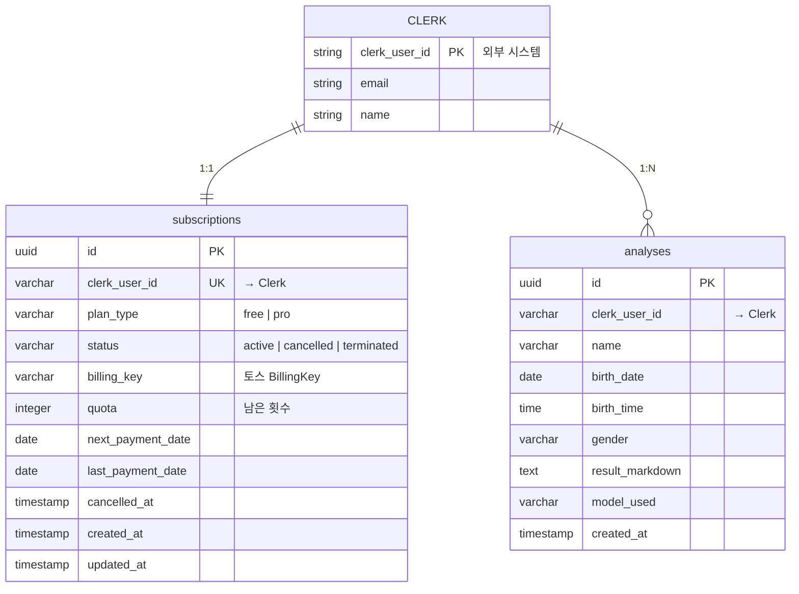

# 📊 데이터베이스 설계 문서 (v2.0)

## 설계 철학

**간결성 > 복잡성 | 필수 기능만 | 확장 가능한 최소 설계**

- ✅ 요구사항에 명시된 데이터만 포함
- ✅ Clerk를 신뢰하고 중복 저장 최소화
- ✅ 성능 크리티컬 경로만 최적화
- ✅ 쿼터 차감의 원자성 보장

---

## 1. 데이터 플로우

### 1.1 핵심 데이터 흐름

```
[Clerk 인증] → [subscriptions 초기화]
                     ↓
          [사주 분석 요청] → [쿼터 확인]
                     ↓
          [Gemini API] → [analyses 저장]
                     ↓
          [쿼터 차감 (원자적)]
```

### 1.2 구독 생명주기

```
FREE (가입) → PRO (결제) → CANCELLED (예약) → TERMINATED (해지)
   ↓             ↓              ↓
quota=3      quota=10    quota 유지 → quota=0
```

---

## 2. 테이블 스키마

### 2.1 `subscriptions` 테이블

**목적**: 사용자 구독 상태 및 쿼터 관리

| 컬럼명 | 타입 | 제약조건 | 설명 |
|--------|------|----------|------|
| `id` | UUID | PRIMARY KEY, DEFAULT uuid_generate_v4() | 구독 고유 ID |
| `clerk_user_id` | VARCHAR(255) | UNIQUE NOT NULL | Clerk User ID (외래키 역할) |
| `plan_type` | VARCHAR(20) | NOT NULL, DEFAULT 'free', CHECK IN ('free', 'pro') | 플랜 타입 |
| `status` | VARCHAR(20) | NOT NULL, DEFAULT 'active', CHECK IN ('active', 'cancelled', 'terminated') | 구독 상태 |
| `billing_key` | VARCHAR(255) | NULL | 토스페이먼츠 BillingKey |
| `quota` | INTEGER | NOT NULL, DEFAULT 3, CHECK (quota >= 0) | 남은 분석 횟수 |
| `next_payment_date` | DATE | NULL, CHECK (plan_type = 'pro' OR next_payment_date IS NULL) | 다음 결제일 (Pro만) |
| `last_payment_date` | DATE | NULL | 마지막 결제일 |
| `cancelled_at` | TIMESTAMP | NULL, CHECK (status != 'cancelled' OR cancelled_at IS NOT NULL) | 취소 요청 시간 |
| `created_at` | TIMESTAMP | DEFAULT NOW() | 생성 시간 |
| `updated_at` | TIMESTAMP | DEFAULT NOW() | 수정 시간 |

**비즈니스 규칙**:
- `plan_type = 'free'`: `quota = 3` (초기값), `billing_key = NULL`, `next_payment_date = NULL`
- `plan_type = 'pro'`: `quota = 10` (리셋 시), `billing_key` 필수, `next_payment_date` 필수
- `status = 'cancelled'`: `cancelled_at` 필수, 결제일까지 Pro 유지
- `status = 'terminated'`: `billing_key = NULL`, `quota = 0`

**인덱스**:
```sql
CREATE INDEX idx_subscriptions_clerk_user ON subscriptions(clerk_user_id);
CREATE INDEX idx_subscriptions_status_payment ON subscriptions(status, next_payment_date)
  WHERE status = 'active' AND next_payment_date IS NOT NULL; -- Cron 최적화
```

---

### 2.2 `analyses` 테이블

**목적**: 사주 분석 이력 저장

| 컬럼명 | 타입 | 제약조건 | 설명 |
|--------|------|----------|------|
| `id` | UUID | PRIMARY KEY, DEFAULT uuid_generate_v4() | 분석 고유 ID |
| `clerk_user_id` | VARCHAR(255) | NOT NULL | Clerk User ID |
| `name` | VARCHAR(100) | NOT NULL | 분석 대상자 이름 |
| `birth_date` | DATE | NOT NULL, CHECK (birth_date >= '1900-01-01' AND birth_date <= CURRENT_DATE) | 생년월일 |
| `birth_time` | TIME | NULL | 출생 시간 (선택) |
| `gender` | VARCHAR(10) | NOT NULL, CHECK (gender IN ('male', 'female')) | 성별 |
| `result_markdown` | TEXT | NOT NULL | Gemini 분석 결과 (마크다운) |
| `model_used` | VARCHAR(50) | NOT NULL, CHECK (model_used IN ('gemini-2.5-flash', 'gemini-2.5-pro')) | 사용된 AI 모델 |
| `created_at` | TIMESTAMP | DEFAULT NOW() | 분석 생성 시간 |

**인덱스**:
```sql
-- 사용자별 최근 분석 조회 (대시보드)
CREATE INDEX idx_analyses_user_created ON analyses(clerk_user_id, created_at DESC);
```

**저장 정책**:
- Clerk 사용자 삭제 시 연관 데이터는 애플리케이션 레벨에서 처리 (Webhook)
- `result_markdown` 최대 크기: 100KB (Gemini 응답 크기 고려)

---

## 3. ERD



---

## 4. 개선 사항

### 4.1 제거된 불필요한 요소

❌ **`users` 테이블 제거**
- **이유**: Clerk이 이미 사용자 정보를 관리하므로 중복 저장 불필요
- **영향**: Clerk Webhook으로 `subscriptions`와 `analyses` 직접 연결
- **장점**: 테이블 1개 감소, 동기화 오류 위험 제거, 조인 쿼리 간소화

❌ **불필요한 인덱스 제거**
- `idx_users_email`: Clerk에서 이메일 검색 담당
- `idx_analyses_created_at`: 복합 인덱스 `idx_analyses_user_created`로 커버

### 4.2 추가된 강화 요소

✅ **CHECK 제약조건 강화**
- `quota >= 0`: 음수 쿼터 방지
- `birth_date` 범위 검증: 1900년 이후 ~ 현재까지만 허용
- `status`와 `cancelled_at` 일관성: 취소 상태면 `cancelled_at` 필수
- `plan_type`과 `next_payment_date` 일관성: Free 플랜은 결제일 불가

✅ **복합 인덱스 최적화**
- `idx_subscriptions_status_payment`: Cron Job 쿼리 최적화 (WHERE status='active' AND next_payment_date=CURRENT_DATE)
- `idx_analyses_user_created`: 대시보드 쿼리 최적화 (사용자별 최근 분석)

✅ **쿼터 차감 원자성 보장**
- RPC 함수 `decrement_quota_and_insert_analysis` 제공 (트랜잭션)
- 동시성 제어: `SELECT FOR UPDATE` 사용

---

## 5. 마이그레이션 스크립트

### 5.1 초기 스키마

**파일**: `supabase/migrations/0001_create_initial_schema.sql`

```sql
-- Enable UUID extension
CREATE EXTENSION IF NOT EXISTS "uuid-ossp";

-- ==============================
-- 1. subscriptions 테이블
-- ==============================
CREATE TABLE IF NOT EXISTS subscriptions (
  id UUID PRIMARY KEY DEFAULT uuid_generate_v4(),
  clerk_user_id VARCHAR(255) UNIQUE NOT NULL,
  plan_type VARCHAR(20) NOT NULL DEFAULT 'free',
  status VARCHAR(20) NOT NULL DEFAULT 'active',
  billing_key VARCHAR(255),
  quota INTEGER NOT NULL DEFAULT 3,
  next_payment_date DATE,
  last_payment_date DATE,
  cancelled_at TIMESTAMP,
  created_at TIMESTAMP DEFAULT NOW(),
  updated_at TIMESTAMP DEFAULT NOW(),

  -- CHECK 제약조건
  CONSTRAINT check_plan_type CHECK (plan_type IN ('free', 'pro')),
  CONSTRAINT check_status CHECK (status IN ('active', 'cancelled', 'terminated')),
  CONSTRAINT check_quota CHECK (quota >= 0),
  CONSTRAINT check_cancelled_at CHECK (status != 'cancelled' OR cancelled_at IS NOT NULL),
  CONSTRAINT check_next_payment_date CHECK (plan_type = 'pro' OR next_payment_date IS NULL)
);

-- subscriptions 인덱스
CREATE INDEX idx_subscriptions_clerk_user ON subscriptions(clerk_user_id);
CREATE INDEX idx_subscriptions_status_payment ON subscriptions(status, next_payment_date)
  WHERE status = 'active' AND next_payment_date IS NOT NULL;

-- subscriptions updated_at 트리거
CREATE OR REPLACE FUNCTION update_updated_at_column()
RETURNS TRIGGER AS $$
BEGIN
  NEW.updated_at = NOW();
  RETURN NEW;
END;
$$ LANGUAGE plpgsql;

CREATE TRIGGER trigger_subscriptions_updated_at
  BEFORE UPDATE ON subscriptions
  FOR EACH ROW
  EXECUTE FUNCTION update_updated_at_column();

-- ==============================
-- 2. analyses 테이블
-- ==============================
CREATE TABLE IF NOT EXISTS analyses (
  id UUID PRIMARY KEY DEFAULT uuid_generate_v4(),
  clerk_user_id VARCHAR(255) NOT NULL,
  name VARCHAR(100) NOT NULL,
  birth_date DATE NOT NULL,
  birth_time TIME,
  gender VARCHAR(10) NOT NULL,
  result_markdown TEXT NOT NULL,
  model_used VARCHAR(50) NOT NULL,
  created_at TIMESTAMP DEFAULT NOW(),

  -- CHECK 제약조건
  CONSTRAINT check_birth_date CHECK (birth_date >= '1900-01-01' AND birth_date <= CURRENT_DATE),
  CONSTRAINT check_gender CHECK (gender IN ('male', 'female')),
  CONSTRAINT check_model_used CHECK (model_used IN ('gemini-2.5-flash', 'gemini-2.5-pro'))
);

-- analyses 인덱스
CREATE INDEX idx_analyses_user_created ON analyses(clerk_user_id, created_at DESC);

-- ==============================
-- 3. RLS 비활성화
-- ==============================
ALTER TABLE subscriptions DISABLE ROW LEVEL SECURITY;
ALTER TABLE analyses DISABLE ROW LEVEL SECURITY;

-- ==============================
-- 4. 쿼터 차감 RPC (원자성 보장)
-- ==============================
CREATE OR REPLACE FUNCTION decrement_quota_and_insert_analysis(
  p_clerk_user_id VARCHAR(255),
  p_name VARCHAR(100),
  p_birth_date DATE,
  p_birth_time TIME,
  p_gender VARCHAR(10),
  p_result_markdown TEXT,
  p_model_used VARCHAR(50)
)
RETURNS UUID AS $$
DECLARE
  v_analysis_id UUID;
  v_current_quota INTEGER;
BEGIN
  -- 1. 쿼터 확인 및 차감 (FOR UPDATE로 락)
  SELECT quota INTO v_current_quota
  FROM subscriptions
  WHERE clerk_user_id = p_clerk_user_id
  FOR UPDATE;

  IF v_current_quota IS NULL OR v_current_quota <= 0 THEN
    RAISE EXCEPTION 'Insufficient quota';
  END IF;

  UPDATE subscriptions
  SET quota = quota - 1,
      updated_at = NOW()
  WHERE clerk_user_id = p_clerk_user_id;

  -- 2. 분석 결과 저장
  INSERT INTO analyses (clerk_user_id, name, birth_date, birth_time, gender, result_markdown, model_used)
  VALUES (p_clerk_user_id, p_name, p_birth_date, p_birth_time, p_gender, p_result_markdown, p_model_used)
  RETURNING id INTO v_analysis_id;

  RETURN v_analysis_id;
END;
$$ LANGUAGE plpgsql;

-- ==============================
-- 5. 테이블 코멘트
-- ==============================
COMMENT ON TABLE subscriptions IS '사용자 구독 상태 및 쿼터 관리 (Clerk User ID 기준)';
COMMENT ON TABLE analyses IS '사주 분석 이력 저장 (Clerk User ID 연동)';
COMMENT ON FUNCTION decrement_quota_and_insert_analysis IS '쿼터 차감과 분석 저장을 원자적으로 처리';
```

---

## 6. 성능 최적화

### 6.1 쿼리 최적화 사례

**대시보드 최근 분석 조회**:
```sql
-- ✅ 최적화됨 (idx_analyses_user_created 사용)
SELECT id, name, birth_date, model_used, created_at
FROM analyses
WHERE clerk_user_id = 'user_xxxxx'
ORDER BY created_at DESC
LIMIT 10;

-- 예상 실행 계획: Index Scan (cost=0.29..15.41 rows=10)
```

**Cron Job 오늘 결제 예정 조회**:
```sql
-- ✅ 최적화됨 (idx_subscriptions_status_payment 사용)
SELECT clerk_user_id, billing_key
FROM subscriptions
WHERE status = 'active'
  AND next_payment_date = CURRENT_DATE;

-- 예상 실행 계획: Index Scan (cost=0.14..8.16 rows=1)
```

### 6.2 예상 성능 지표

| 쿼리 | 데이터 규모 | 응답 시간 (p95) | 인덱스 |
|------|-----------|---------------|--------|
| 구독 정보 조회 | 10K users | < 5ms | `idx_subscriptions_clerk_user` |
| 분석 이력 조회 (10개) | 100K analyses | < 10ms | `idx_analyses_user_created` |
| Cron 결제 대상 조회 | 10K subs, 100 daily | < 15ms | `idx_subscriptions_status_payment` |
| 쿼터 차감 RPC | - | < 20ms | `SELECT FOR UPDATE` |

---

## 7. 보안 및 데이터 무결성

### 7.1 접근 제어

**RLS 비활성화 이유**:
- Supabase 가이드라인 준수 (`.ruler/supabase.md`)
- 대신 Next.js API 레이어에서 Clerk JWT 검증

**애플리케이션 레벨 검증**:
```typescript
// app/api/analysis/create/route.ts
export async function POST(req: Request) {
  const { userId } = auth(); // Clerk JWT 검증
  if (!userId) return NextResponse.json({ error: 'Unauthorized' }, { status: 401 });

  // userId와 clerk_user_id 일치 여부 확인
  const result = await supabase.rpc('decrement_quota_and_insert_analysis', {
    p_clerk_user_id: userId,
    // ... 나머지 파라미터
  });

  if (result.error) {
    if (result.error.message.includes('Insufficient quota')) {
      return NextResponse.json({ error: 'No quota left' }, { status: 403 });
    }
    return NextResponse.json({ error: 'Internal error' }, { status: 500 });
  }

  return NextResponse.json({ analysisId: result.data });
}
```

### 7.2 민감 정보 보호

| 정보 | 보호 수준 | 처리 방법 |
|------|----------|----------|
| `clerk_user_id` | 중간 | 서버 사이드에서만 사용, 클라이언트 노출 금지 |
| `billing_key` | 높음 | 절대 클라이언트 전송 금지, 환경 변수로 API 키 관리 |
| `result_markdown` | 낮음 | 본인만 조회 가능 (Clerk JWT 검증) |
| `birth_date` | 낮음 | 평문 저장 (분석 재조회용, 민감도 낮음) |

### 7.3 동시성 제어

**쿼터 차감 경쟁 조건 방지**:
- `SELECT FOR UPDATE`: 행 단위 락으로 동시 요청 차단
- 트랜잭션 실패 시 전체 롤백 (쿼터 복구)

**시나리오**:
```
사용자 A: 쿼터 1회 남음
요청 1: 분석 시작 (10:00:00.100) → SELECT FOR UPDATE 획득
요청 2: 분석 시작 (10:00:00.150) → 락 대기 중...

요청 1: 쿼터 차감 (1 → 0) + 분석 저장 → COMMIT (10:00:00.500)
요청 2: 락 해제 → SELECT quota = 0 → RAISE EXCEPTION
```

---

## 8. 확장성 고려사항

### 8.1 데이터 증가 예측

| 테이블 | 1년 후 예상 규모 | 저장 용량 | 병목 지점 |
|--------|--------------|----------|----------|
| `subscriptions` | 12,000건 | ~4 MB | 없음 |
| `analyses` | 120,000건 | ~6 GB | `result_markdown` (TEXT) |

### 8.2 확장 전략

**10만 건 초과 시**:
```sql
-- 연도별 파티셔닝 (선택사항)
CREATE TABLE analyses_2025 PARTITION OF analyses
  FOR VALUES FROM ('2025-01-01') TO ('2026-01-01');

CREATE TABLE analyses_2026 PARTITION OF analyses
  FOR VALUES FROM ('2026-01-01') TO ('2027-01-01');
```

**100만 건 초과 시**:
- 3년 이상 분석 결과 → S3 아카이빙
- `analyses_archive` 테이블로 이관 후 원본 삭제

### 8.3 읽기 성능 개선

**Read Replica 활용** (Supabase Pro 플랜):
```typescript
// 읽기 전용 쿼리는 Replica로 분산
const supabaseRead = createClient(SUPABASE_URL, SUPABASE_ANON_KEY, {
  db: { schema: 'public', pooler: { mode: 'transaction' } }
});

// 쓰기 작업은 Primary로
const supabaseWrite = createClient(SUPABASE_URL, SUPABASE_SERVICE_ROLE_KEY);
```

---

## 9. 백업 및 복구

### 9.1 자동 백업

**Supabase Pro 플랜**:
- 일일 자동 백업 (최대 7일 보관)
- Point-in-Time Recovery (PITR) 지원

### 9.2 수동 백업 스크립트

```bash
# 전체 백업
pg_dump -h db.xxxxx.supabase.co \
  -U postgres \
  -d postgres \
  -F c \
  -f backup_$(date +%Y%m%d).dump

# 특정 테이블 백업 (analyses만)
pg_dump -h db.xxxxx.supabase.co \
  -U postgres \
  -d postgres \
  -t analyses \
  -F c \
  -f analyses_backup_$(date +%Y%m%d).dump
```

### 9.3 재해 복구 절차

1. Supabase 대시보드 → Database → Restore
2. 복구 시점 선택 (최대 7일 전)
3. 복구 실행 (5~15분 소요)
4. Clerk Webhook 재검증 (URL 변경 시)
5. 애플리케이션 상태 확인 (헬스 체크)

---

## 10. 모니터링

### 10.1 핵심 지표

| 항목 | 임계값 | 알림 채널 | 조치 |
|------|--------|---------|------|
| DB 용량 | 80% 초과 | Email | 오래된 분석 아카이빙 |
| 쿼리 응답 시간 | 500ms 초과 | Slack | 인덱스 재검토, VACUUM |
| Cron Job 실패 | 1회 실패 | Email + Slack | 수동 재실행 |
| 동시 접속 수 | 100 초과 | Dashboard | Connection Pool 증설 |

### 10.2 슬로우 쿼리 모니터링

```sql
-- Supabase에서 제공하는 슬로우 쿼리 조회
SELECT query, calls, total_time, mean_time
FROM pg_stat_statements
WHERE mean_time > 100 -- 100ms 이상
ORDER BY mean_time DESC
LIMIT 10;
```

---

## 11. FAQ

### Q1. users 테이블을 왜 제거했나요?
**A**: Clerk이 이미 사용자 정보를 관리하므로 중복 저장은 오버엔지니어링입니다. `clerk_user_id`만으로 충분하며, 필요 시 Clerk API로 조회합니다.

### Q2. Clerk 사용자 삭제 시 연관 데이터는?
**A**: Clerk `user.deleted` Webhook에서 `clerk_user_id` 기준으로 `subscriptions`와 `analyses`를 명시적으로 삭제합니다. (CASCADE 불가, 외부 시스템이므로)

### Q3. 쿼터 차감 실패 시 복구는?
**A**: RPC 함수는 트랜잭션으로 구현되어 있어 분석 저장 실패 시 쿼터도 자동 롤백됩니다.

### Q4. 분석 결과 크기 제한은?
**A**: Gemini API 응답은 일반적으로 5~50KB입니다. 100KB 초과 시 API에서 차단하고 재시도를 유도합니다.

### Q5. 파티셔닝은 언제 적용하나요?
**A**: `analyses` 테이블이 100만 건을 초과하면 연도별 파티셔닝을 고려합니다. 그 전까지는 인덱스만으로 충분합니다.

---

## 12. 변경 이력

| 버전 | 날짜 | 주요 변경 사항 | 작성자 |
|------|------|--------------|--------|
| 1.0 | 2025-10-25 | 초기 작성 | Claude |
| 2.0 | 2025-10-25 | `users` 테이블 제거, CHECK 제약조건 강화, RPC 추가, 인덱스 최적화 | Claude (YC CTO 관점) |

---

**문서 작성 기준**: PRD v1.0, UserFlow v1.0
**참고 문서**: `.ruler/supabase.md`, `requirement.md`
**설계 원칙**: "간결성 > 복잡성 | 필수 기능만 | 확장 가능한 최소 설계"
