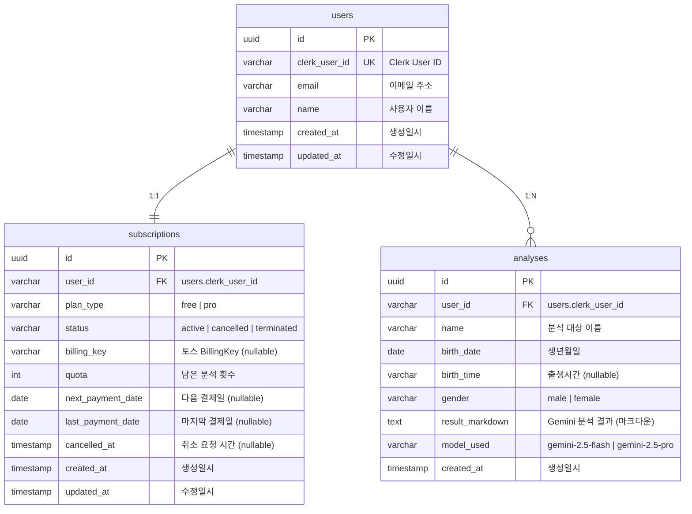

# 데이터베이스 설계 문서

**버전**: 1.0
**작성일**: 2025-10-26
**프로젝트**: 구독제 사주분석 서비스
**데이터베이스**: PostgreSQL (Supabase)

---

## 1. 개요

본 문서는 구독제 사주분석 서비스의 데이터베이스 스키마 및 데이터 플로우를 정의합니다.

### 1.1 설계 원칙

- **인증 분리**: Clerk SDK가 인증을 담당하고, Supabase는 데이터 저장소로만 활용
- **외래키 기반 동기화**: Clerk의 `user_id`를 외래키로 사용하여 사용자 데이터 연계
- **CASCADE 정책**: 사용자 삭제 시 관련 데이터 자동 삭제
- **트랜잭션 무결성**: 결제, 쿼터 차감 등 중요 작업은 트랜잭션으로 보호
- **RLS 비활성화**: 요구사항에 따라 Row Level Security는 사용하지 않음

### 1.2 핵심 테이블

1. **users** - Clerk 사용자 정보 동기화
2. **subscriptions** - 구독 정보 및 쿼터 관리
3. **analyses** - 사주 분석 결과 저장

---

## 2. 데이터 플로우 (간략)

### 2.1 회원가입 플로우

```
Google OAuth (Clerk)
  → Webhook: user.created
  → INSERT users (clerk_user_id, email, name)
  → INSERT subscriptions (user_id, plan_type: 'free', quota: 3)
```

### 2.2 사주 분석 플로우

```
사용자 입력 (이름, 생년월일, 출생시간, 성별)
  → SELECT subscriptions WHERE user_id = ? (쿼터 확인)
  → Gemini API 호출 (Flash/Pro 모델 선택)
  → INSERT analyses (user_id, result_markdown, ...)
  → UPDATE subscriptions SET quota = quota - 1
```

### 2.3 Pro 구독 플로우

```
토스 결제 위젯
  → BillingKey 발급 + 첫 결제
  → UPDATE subscriptions
     SET plan_type = 'pro',
         quota = 10,
         billing_key = ?,
         next_payment_date = NOW() + INTERVAL '1 month'
```

### 2.4 정기 결제 플로우 (Cron)

```
Supabase Cron (매일 02:00 KST)
  → SELECT subscriptions WHERE next_payment_date = CURRENT_DATE AND status = 'active'
  → FOR EACH: 토스 API 결제 요청
    → 성공: UPDATE quota = 10, next_payment_date = +1 month
    → 실패: UPDATE status = 'terminated', quota = 0, billing_key = NULL
```

### 2.5 구독 취소/재활성화 플로우

```
[취소]
UPDATE subscriptions
SET status = 'cancelled', cancelled_at = NOW()
(결제일까지 Pro 유지)

[재활성화]
UPDATE subscriptions
SET status = 'active', cancelled_at = NULL
(기존 BillingKey로 다음 결제일에 자동 결제)

[즉시 해지]
토스 API: BillingKey 삭제
→ UPDATE status = 'terminated', quota = 0, billing_key = NULL
```

### 2.6 회원 탈퇴 플로우

```
Clerk 계정 삭제
  → Webhook: user.deleted
  → DELETE FROM users WHERE clerk_user_id = ?
    → CASCADE DELETE subscriptions
    → CASCADE DELETE analyses
```

---

## 3. ERD (Entity-Relationship Diagram)



---

## 4. 테이블 상세 스키마

### 4.1 users (사용자 정보)

**설명**: Clerk 사용자 정보를 Supabase에 동기화하는 테이블

| 컬럼명 | 타입 | 제약조건 | 기본값 | 설명 |
|--------|------|---------|-------|------|
| `id` | UUID | PRIMARY KEY | `uuid_generate_v4()` | 내부 고유 ID |
| `clerk_user_id` | VARCHAR(255) | UNIQUE NOT NULL | - | Clerk User ID (외래키 역할) |
| `email` | VARCHAR(255) | NOT NULL | - | 이메일 주소 |
| `name` | VARCHAR(100) | NULL | - | 사용자 이름 |
| `created_at` | TIMESTAMP | NOT NULL | `NOW()` | 생성일시 |
| `updated_at` | TIMESTAMP | NOT NULL | `NOW()` | 수정일시 |

**인덱스**:
- `idx_users_clerk_id` on `clerk_user_id` (UNIQUE)
- `idx_users_email` on `email`

**트리거**:
- `updated_at` 자동 업데이트 트리거

---

### 4.2 subscriptions (구독 정보)

**설명**: 사용자의 구독 상태 및 쿼터를 관리하는 테이블

| 컬럼명 | 타입 | 제약조건 | 기본값 | 설명 |
|--------|------|---------|-------|------|
| `id` | UUID | PRIMARY KEY | `uuid_generate_v4()` | 내부 고유 ID |
| `user_id` | VARCHAR(255) | FOREIGN KEY, UNIQUE NOT NULL | - | users.clerk_user_id |
| `plan_type` | VARCHAR(20) | NOT NULL | `'free'` | 'free' \| 'pro' |
| `status` | VARCHAR(20) | NOT NULL | `'active'` | 'active' \| 'cancelled' \| 'terminated' |
| `billing_key` | VARCHAR(255) | NULL | - | 토스페이먼츠 BillingKey |
| `quota` | INT | NOT NULL | `3` | 남은 분석 횟수 (Free: 3, Pro: 10) |
| `next_payment_date` | DATE | NULL | - | 다음 결제일 (Pro만 해당) |
| `last_payment_date` | DATE | NULL | - | 마지막 결제일 |
| `cancelled_at` | TIMESTAMP | NULL | - | 구독 취소 요청 시간 |
| `created_at` | TIMESTAMP | NOT NULL | `NOW()` | 생성일시 |
| `updated_at` | TIMESTAMP | NOT NULL | `NOW()` | 수정일시 |

**외래키**:
- `user_id` REFERENCES `users(clerk_user_id)` ON DELETE CASCADE

**인덱스**:
- `idx_subscriptions_user_id` on `user_id` (UNIQUE)
- `idx_subscriptions_status` on `status`
- `idx_subscriptions_next_payment_date` on `next_payment_date` (Cron 조회 최적화)

**제약조건**:
- `plan_type` CHECK (plan_type IN ('free', 'pro'))
- `status` CHECK (status IN ('active', 'cancelled', 'terminated'))
- `quota` CHECK (quota >= 0)

**트리거**:
- `updated_at` 자동 업데이트 트리거

---

### 4.3 analyses (분석 결과)

**설명**: 사주 분석 결과를 저장하는 테이블

| 컬럼명 | 타입 | 제약조건 | 기본값 | 설명 |
|--------|------|---------|-------|------|
| `id` | UUID | PRIMARY KEY | `uuid_generate_v4()` | 내부 고유 ID |
| `user_id` | VARCHAR(255) | FOREIGN KEY NOT NULL | - | users.clerk_user_id |
| `name` | VARCHAR(100) | NOT NULL | - | 분석 대상 이름 |
| `birth_date` | DATE | NOT NULL | - | 생년월일 |
| `birth_time` | VARCHAR(10) | NULL | - | 출생시간 (HH:MM 형식) |
| `gender` | VARCHAR(10) | NOT NULL | - | 'male' \| 'female' |
| `result_markdown` | TEXT | NOT NULL | - | Gemini 분석 결과 (마크다운) |
| `model_used` | VARCHAR(50) | NOT NULL | - | 'gemini-2.5-flash' \| 'gemini-2.5-pro' |
| `created_at` | TIMESTAMP | NOT NULL | `NOW()` | 생성일시 |

**외래키**:
- `user_id` REFERENCES `users(clerk_user_id)` ON DELETE CASCADE

**인덱스**:
- `idx_analyses_user_id` on `user_id`
- `idx_analyses_created_at` on `created_at DESC` (최신순 조회 최적화)
- `idx_analyses_user_created` on `(user_id, created_at DESC)` (복합 인덱스)

**제약조건**:
- `gender` CHECK (gender IN ('male', 'female'))
- `birth_date` CHECK (birth_date BETWEEN '1900-01-01' AND CURRENT_DATE)
- `model_used` CHECK (model_used IN ('gemini-2.5-flash', 'gemini-2.5-pro'))

---

## 5. 마이그레이션 SQL 스크립트

### 5.1 초기 마이그레이션 (0001_initial_schema.sql)

```sql
-- =====================================================
-- 구독제 사주분석 서비스 - 초기 스키마
-- 작성일: 2025-10-26
-- =====================================================

-- UUID 확장 활성화
CREATE EXTENSION IF NOT EXISTS "uuid-ossp";

-- =====================================================
-- 1. users 테이블
-- =====================================================
CREATE TABLE IF NOT EXISTS users (
  id UUID PRIMARY KEY DEFAULT uuid_generate_v4(),
  clerk_user_id VARCHAR(255) UNIQUE NOT NULL,
  email VARCHAR(255) NOT NULL,
  name VARCHAR(100),
  created_at TIMESTAMP NOT NULL DEFAULT NOW(),
  updated_at TIMESTAMP NOT NULL DEFAULT NOW()
);

-- 인덱스
CREATE INDEX IF NOT EXISTS idx_users_clerk_id ON users(clerk_user_id);
CREATE INDEX IF NOT EXISTS idx_users_email ON users(email);

-- updated_at 자동 업데이트 트리거
CREATE OR REPLACE FUNCTION update_updated_at_column()
RETURNS TRIGGER AS $$
BEGIN
  NEW.updated_at = NOW();
  RETURN NEW;
END;
$$ LANGUAGE plpgsql;

CREATE TRIGGER update_users_updated_at
  BEFORE UPDATE ON users
  FOR EACH ROW
  EXECUTE FUNCTION update_updated_at_column();

COMMENT ON TABLE users IS 'Clerk 사용자 정보 동기화 테이블';
COMMENT ON COLUMN users.clerk_user_id IS 'Clerk User ID (외래키 역할)';

-- =====================================================
-- 2. subscriptions 테이블
-- =====================================================
CREATE TABLE IF NOT EXISTS subscriptions (
  id UUID PRIMARY KEY DEFAULT uuid_generate_v4(),
  user_id VARCHAR(255) REFERENCES users(clerk_user_id) ON DELETE CASCADE,
  plan_type VARCHAR(20) NOT NULL DEFAULT 'free',
  status VARCHAR(20) NOT NULL DEFAULT 'active',
  billing_key VARCHAR(255),
  quota INT NOT NULL DEFAULT 3,
  next_payment_date DATE,
  last_payment_date DATE,
  cancelled_at TIMESTAMP,
  created_at TIMESTAMP NOT NULL DEFAULT NOW(),
  updated_at TIMESTAMP NOT NULL DEFAULT NOW(),
  UNIQUE(user_id),
  CHECK (plan_type IN ('free', 'pro')),
  CHECK (status IN ('active', 'cancelled', 'terminated')),
  CHECK (quota >= 0)
);

-- 인덱스
CREATE INDEX IF NOT EXISTS idx_subscriptions_user_id ON subscriptions(user_id);
CREATE INDEX IF NOT EXISTS idx_subscriptions_status ON subscriptions(status);
CREATE INDEX IF NOT EXISTS idx_subscriptions_next_payment_date ON subscriptions(next_payment_date);

-- updated_at 자동 업데이트 트리거
CREATE TRIGGER update_subscriptions_updated_at
  BEFORE UPDATE ON subscriptions
  FOR EACH ROW
  EXECUTE FUNCTION update_updated_at_column();

COMMENT ON TABLE subscriptions IS '구독 정보 및 쿼터 관리 테이블';
COMMENT ON COLUMN subscriptions.plan_type IS 'free (무료 3회) | pro (월 10회)';
COMMENT ON COLUMN subscriptions.status IS 'active (활성) | cancelled (취소 예약) | terminated (해지)';
COMMENT ON COLUMN subscriptions.billing_key IS '토스페이먼츠 BillingKey (정기결제용)';
COMMENT ON COLUMN subscriptions.quota IS '남은 분석 횟수 (Free: 3, Pro: 10)';
COMMENT ON COLUMN subscriptions.next_payment_date IS '다음 결제일 (Pro 구독자만 해당)';
COMMENT ON COLUMN subscriptions.cancelled_at IS '구독 취소 요청 시간 (재활성화 가능 기간 판단용)';

-- =====================================================
-- 3. analyses 테이블
-- =====================================================
CREATE TABLE IF NOT EXISTS analyses (
  id UUID PRIMARY KEY DEFAULT uuid_generate_v4(),
  user_id VARCHAR(255) REFERENCES users(clerk_user_id) ON DELETE CASCADE,
  name VARCHAR(100) NOT NULL,
  birth_date DATE NOT NULL,
  birth_time VARCHAR(10),
  gender VARCHAR(10) NOT NULL,
  result_markdown TEXT NOT NULL,
  model_used VARCHAR(50) NOT NULL,
  created_at TIMESTAMP NOT NULL DEFAULT NOW(),
  CHECK (gender IN ('male', 'female')),
  CHECK (birth_date BETWEEN '1900-01-01' AND CURRENT_DATE),
  CHECK (model_used IN ('gemini-2.5-flash', 'gemini-2.5-pro'))
);

-- 인덱스
CREATE INDEX IF NOT EXISTS idx_analyses_user_id ON analyses(user_id);
CREATE INDEX IF NOT EXISTS idx_analyses_created_at ON analyses(created_at DESC);
CREATE INDEX IF NOT EXISTS idx_analyses_user_created ON analyses(user_id, created_at DESC);

COMMENT ON TABLE analyses IS '사주 분석 결과 저장 테이블';
COMMENT ON COLUMN analyses.birth_time IS '출생시간 (HH:MM 형식, nullable - 시간 미상 가능)';
COMMENT ON COLUMN analyses.result_markdown IS 'Gemini AI가 생성한 분석 결과 (마크다운)';
COMMENT ON COLUMN analyses.model_used IS '사용된 Gemini 모델 (flash: 무료, pro: 유료)';

-- =====================================================
-- 4. RLS 비활성화 (요구사항)
-- =====================================================
ALTER TABLE users DISABLE ROW LEVEL SECURITY;
ALTER TABLE subscriptions DISABLE ROW LEVEL SECURITY;
ALTER TABLE analyses DISABLE ROW LEVEL SECURITY;

-- =====================================================
-- 완료 메시지
-- =====================================================
DO $$
BEGIN
  RAISE NOTICE '✅ 초기 스키마 마이그레이션 완료';
  RAISE NOTICE '   - users 테이블 생성';
  RAISE NOTICE '   - subscriptions 테이블 생성';
  RAISE NOTICE '   - analyses 테이블 생성';
  RAISE NOTICE '   - 인덱스 및 트리거 설정 완료';
  RAISE NOTICE '   - RLS 비활성화 완료';
END $$;
```

### 5.2 샘플 데이터 (선택사항 - 테스트용)

```sql
-- =====================================================
-- 샘플 데이터 (테스트 환경 전용)
-- =====================================================

-- 테스트 사용자
INSERT INTO users (clerk_user_id, email, name) VALUES
  ('user_test_001', 'test1@example.com', '홍길동'),
  ('user_test_002', 'test2@example.com', '김철수')
ON CONFLICT (clerk_user_id) DO NOTHING;

-- 테스트 구독
INSERT INTO subscriptions (user_id, plan_type, quota, status) VALUES
  ('user_test_001', 'free', 3, 'active'),
  ('user_test_002', 'pro', 10, 'active')
ON CONFLICT (user_id) DO NOTHING;

-- 테스트 분석 결과
INSERT INTO analyses (user_id, name, birth_date, birth_time, gender, result_markdown, model_used) VALUES
  ('user_test_001', '홍길동', '1990-01-01', '10:30', 'male', '# 사주 분석 결과\n\n테스트 데이터입니다.', 'gemini-2.5-flash'),
  ('user_test_002', '김철수', '1985-05-15', NULL, 'male', '# 사주 분석 결과\n\nPro 모델 테스트 데이터입니다.', 'gemini-2.5-pro');

RAISE NOTICE '✅ 샘플 데이터 삽입 완료';
```

---

## 6. 주요 쿼리 예시

### 6.1 사용자 생성 (Clerk Webhook)

```sql
-- Webhook: user.created
BEGIN;

INSERT INTO users (clerk_user_id, email, name)
VALUES ('user_xxxxx', 'user@example.com', '홍길동');

INSERT INTO subscriptions (user_id, plan_type, quota, status)
VALUES ('user_xxxxx', 'free', 3, 'active');

COMMIT;
```

### 6.2 쿼터 확인 및 차감 (분석 요청)

```sql
-- 쿼터 확인
SELECT quota, plan_type
FROM subscriptions
WHERE user_id = 'user_xxxxx'
  AND status = 'active';

-- 분석 결과 저장 + 쿼터 차감 (트랜잭션)
BEGIN;

INSERT INTO analyses (user_id, name, birth_date, birth_time, gender, result_markdown, model_used)
VALUES ('user_xxxxx', '홍길동', '1990-01-01', '10:30', 'male', '# 분석 결과...', 'gemini-2.5-flash');

UPDATE subscriptions
SET quota = quota - 1, updated_at = NOW()
WHERE user_id = 'user_xxxxx';

COMMIT;
```

### 6.3 Pro 구독 전환

```sql
UPDATE subscriptions
SET
  plan_type = 'pro',
  quota = 10,
  billing_key = 'billing_key_xxxxx',
  status = 'active',
  next_payment_date = CURRENT_DATE + INTERVAL '1 month',
  last_payment_date = CURRENT_DATE,
  updated_at = NOW()
WHERE user_id = 'user_xxxxx';
```

### 6.4 구독 취소

```sql
UPDATE subscriptions
SET
  status = 'cancelled',
  cancelled_at = NOW(),
  updated_at = NOW()
WHERE user_id = 'user_xxxxx';
```

### 6.5 구독 재활성화

```sql
UPDATE subscriptions
SET
  status = 'active',
  cancelled_at = NULL,
  updated_at = NOW()
WHERE user_id = 'user_xxxxx'
  AND status = 'cancelled'
  AND next_payment_date > CURRENT_DATE; -- 결제일 전까지만 가능
```

### 6.6 구독 해지 (즉시)

```sql
UPDATE subscriptions
SET
  status = 'terminated',
  quota = 0,
  billing_key = NULL,
  updated_at = NOW()
WHERE user_id = 'user_xxxxx';
```

### 6.7 정기 결제 대상 조회 (Cron)

```sql
-- 오늘 결제일인 활성 구독 조회
SELECT
  id,
  user_id,
  billing_key,
  next_payment_date
FROM subscriptions
WHERE status = 'active'
  AND next_payment_date = CURRENT_DATE
  AND billing_key IS NOT NULL;
```

### 6.8 결제 성공 처리

```sql
UPDATE subscriptions
SET
  quota = 10,
  next_payment_date = next_payment_date + INTERVAL '1 month',
  last_payment_date = CURRENT_DATE,
  updated_at = NOW()
WHERE id = 'subscription_id';
```

### 6.9 결제 실패 처리

```sql
UPDATE subscriptions
SET
  status = 'terminated',
  quota = 0,
  billing_key = NULL,
  updated_at = NOW()
WHERE id = 'subscription_id';
```

### 6.10 분석 이력 조회 (최신순)

```sql
SELECT
  id,
  name,
  birth_date,
  birth_time,
  gender,
  model_used,
  created_at
FROM analyses
WHERE user_id = 'user_xxxxx'
ORDER BY created_at DESC
LIMIT 10;
```

### 6.11 사용자 삭제 (Webhook + CASCADE)

```sql
-- Webhook: user.deleted
DELETE FROM users
WHERE clerk_user_id = 'user_xxxxx';
-- CASCADE로 subscriptions, analyses 자동 삭제
```

---

## 7. 인덱스 설계 정리

### 7.1 인덱스 전략

| 테이블 | 인덱스명 | 컬럼 | 목적 |
|--------|---------|------|------|
| users | `idx_users_clerk_id` | `clerk_user_id` | Clerk ID로 빠른 조회 (UNIQUE) |
| users | `idx_users_email` | `email` | 이메일 검색 |
| subscriptions | `idx_subscriptions_user_id` | `user_id` | 사용자별 구독 조회 (UNIQUE) |
| subscriptions | `idx_subscriptions_status` | `status` | 상태별 필터링 |
| subscriptions | `idx_subscriptions_next_payment_date` | `next_payment_date` | Cron 결제 대상 조회 최적화 |
| analyses | `idx_analyses_user_id` | `user_id` | 사용자별 분석 이력 조회 |
| analyses | `idx_analyses_created_at` | `created_at DESC` | 최신순 정렬 |
| analyses | `idx_analyses_user_created` | `(user_id, created_at DESC)` | 복합 인덱스 (커버링 인덱스) |

### 7.2 인덱스 성능 예상

| 쿼리 | Without Index | With Index | 개선율 |
|------|--------------|------------|-------|
| 사용자별 구독 조회 | O(n) | O(log n) | 90%+ |
| 분석 이력 최신순 조회 | O(n log n) | O(log n) | 80%+ |
| Cron 결제 대상 조회 | O(n) | O(log n) | 95%+ |

---

## 8. 외래키 관계 및 CASCADE 정책

### 8.1 외래키 정의

```sql
-- subscriptions → users
ALTER TABLE subscriptions
ADD CONSTRAINT fk_subscriptions_user
FOREIGN KEY (user_id)
REFERENCES users(clerk_user_id)
ON DELETE CASCADE;

-- analyses → users
ALTER TABLE analyses
ADD CONSTRAINT fk_analyses_user
FOREIGN KEY (user_id)
REFERENCES users(clerk_user_id)
ON DELETE CASCADE;
```

### 8.2 CASCADE 동작 시나리오

#### 사용자 삭제 시

```sql
-- users 테이블에서 사용자 삭제
DELETE FROM users WHERE clerk_user_id = 'user_xxxxx';

-- 자동 실행 (CASCADE)
-- 1. subscriptions 테이블에서 해당 사용자 구독 삭제
-- 2. analyses 테이블에서 해당 사용자 분석 이력 모두 삭제
```

#### 데이터 무결성 보장

- **고아 레코드 방지**: 사용자 삭제 시 관련 데이터 자동 정리
- **트랜잭션 보장**: CASCADE 작업은 단일 트랜잭션 내에서 원자적으로 실행
- **성능 최적화**: 인덱스를 통해 CASCADE 작업 속도 향상

---

## 9. 트랜잭션 설계

### 9.1 중요 트랜잭션 시나리오

#### 시나리오 1: 분석 요청 + 쿼터 차감

```sql
BEGIN;

-- 1. 쿼터 확인 (FOR UPDATE로 락 획득)
SELECT quota FROM subscriptions
WHERE user_id = 'user_xxxxx' AND status = 'active'
FOR UPDATE;

-- 2. 쿼터 검증 (애플리케이션 레벨)
-- IF quota <= 0 THEN ROLLBACK;

-- 3. 분석 결과 저장
INSERT INTO analyses (...) VALUES (...);

-- 4. 쿼터 차감
UPDATE subscriptions
SET quota = quota - 1
WHERE user_id = 'user_xxxxx';

COMMIT;
```

#### 시나리오 2: 정기 결제 처리

```sql
BEGIN;

-- 1. 구독 정보 조회 (FOR UPDATE)
SELECT billing_key, next_payment_date
FROM subscriptions
WHERE id = 'sub_xxxxx'
FOR UPDATE;

-- 2. 토스 API 결제 시도 (애플리케이션 레벨)
-- IF payment_success THEN

-- 3-A. 결제 성공
UPDATE subscriptions
SET quota = 10,
    next_payment_date = next_payment_date + INTERVAL '1 month',
    last_payment_date = CURRENT_DATE
WHERE id = 'sub_xxxxx';

-- ELSE

-- 3-B. 결제 실패
UPDATE subscriptions
SET status = 'terminated',
    quota = 0,
    billing_key = NULL
WHERE id = 'sub_xxxxx';

-- END IF

COMMIT;
```

### 9.2 동시성 제어

#### Isolation Level

- **기본 설정**: READ COMMITTED (PostgreSQL 기본값)
- **특수 케이스**: SERIALIZABLE (중복 결제 방지 시)

#### 락 전략

| 작업 | 락 유형 | 이유 |
|------|--------|------|
| 쿼터 확인 + 차감 | SELECT ... FOR UPDATE | 동시 차감 방지 |
| 정기 결제 처리 | SELECT ... FOR UPDATE | 중복 결제 방지 |
| 분석 이력 조회 | SELECT (공유 락) | 읽기 성능 우선 |

---

## 10. 데이터 보관 및 정리 정책

### 10.1 데이터 보관 정책

| 테이블 | 보관 정책 | 비고 |
|--------|---------|------|
| users | 영구 보관 | 탈퇴 시 CASCADE 삭제 |
| subscriptions | 영구 보관 | 탈퇴 시 CASCADE 삭제 |
| analyses | 영구 보관 | 탈퇴 시 CASCADE 삭제 |

### 10.2 데이터 정리 (선택사항)

#### 오래된 분석 결과 아카이빙 (예시)

```sql
-- 1년 이상 된 분석 결과를 별도 테이블로 이동 (선택적)
CREATE TABLE IF NOT EXISTS analyses_archive AS
SELECT * FROM analyses WHERE 1=0;

-- 아카이빙 작업 (Cron)
INSERT INTO analyses_archive
SELECT * FROM analyses
WHERE created_at < CURRENT_DATE - INTERVAL '1 year';

-- 원본 삭제 (선택적)
DELETE FROM analyses
WHERE created_at < CURRENT_DATE - INTERVAL '1 year';
```

---

## 11. 성능 최적화 권장사항

### 11.1 쿼리 최적화

1. **복합 인덱스 활용**
   - `(user_id, created_at DESC)` 인덱스로 커버링 인덱스 효과

2. **LIMIT 절 사용**
   - 분석 이력 조회 시 페이지네이션 적용

3. **불필요한 JOIN 제거**
   - 대부분 단일 테이블 조회로 해결 가능

### 11.2 인덱스 유지보수

```sql
-- 인덱스 통계 업데이트 (주기적 실행 권장)
ANALYZE users;
ANALYZE subscriptions;
ANALYZE analyses;

-- 인덱스 재구성 (필요시)
REINDEX TABLE subscriptions;
```

### 11.3 쿼리 성능 모니터링

```sql
-- 느린 쿼리 확인
EXPLAIN ANALYZE
SELECT * FROM analyses
WHERE user_id = 'user_xxxxx'
ORDER BY created_at DESC
LIMIT 10;
```

---

## 12. 백업 및 복구 전략

### 12.1 백업 주기

- **Supabase 자동 백업**: 기본 제공 (매일)
- **수동 백업**: 주요 배포 전 실행 권장

### 12.2 백업 명령어

```bash
# Supabase CLI를 통한 데이터베이스 백업
supabase db dump > backup_$(date +%Y%m%d).sql

# 특정 테이블만 백업
pg_dump --table=subscriptions --table=analyses > partial_backup.sql
```

### 12.3 복구 시나리오

```sql
-- 전체 복구
psql < backup_20251026.sql

-- 특정 테이블 복구
psql -c "TRUNCATE analyses;"
psql < analyses_backup.sql
```

---

## 13. 보안 고려사항

### 13.1 민감 정보 보호

| 컬럼 | 민감도 | 보호 방법 |
|------|-------|----------|
| `billing_key` | 높음 | 서버 사이드에서만 접근, 클라이언트 노출 금지 |
| `email` | 중간 | 마스킹 처리 권장 (예: `hong***@example.com`) |
| `result_markdown` | 낮음 | 본인만 조회 가능 (API 레벨 검증) |

### 13.2 SQL Injection 방지

- **Parameterized Query 사용**: 모든 쿼리는 준비된 명령문(Prepared Statement) 사용
- **입력 검증**: 애플리케이션 레벨에서 Zod 스키마 검증

### 13.3 접근 제어

- **RLS 비활성화**: 요구사항에 따라 비활성화
- **애플리케이션 레벨 검증**: Clerk JWT를 통한 사용자 인증 후 쿼리 실행

---

## 14. 모니터링 쿼리

### 14.1 구독 통계

```sql
-- 플랜별 사용자 수
SELECT
  plan_type,
  status,
  COUNT(*) as user_count
FROM subscriptions
GROUP BY plan_type, status;
```

### 14.2 쿼터 사용 현황

```sql
-- 쿼터 소진 사용자 수
SELECT
  plan_type,
  COUNT(*) as depleted_users
FROM subscriptions
WHERE quota = 0 AND status = 'active'
GROUP BY plan_type;
```

### 14.3 분석 통계

```sql
-- 일별 분석 수
SELECT
  DATE(created_at) as analysis_date,
  COUNT(*) as total_analyses,
  COUNT(DISTINCT user_id) as unique_users
FROM analyses
WHERE created_at >= CURRENT_DATE - INTERVAL '30 days'
GROUP BY DATE(created_at)
ORDER BY analysis_date DESC;
```

### 14.4 결제 실패 모니터링

```sql
-- 최근 결제 실패 (terminated) 건수
SELECT
  DATE(updated_at) as termination_date,
  COUNT(*) as failed_payments
FROM subscriptions
WHERE status = 'terminated'
  AND updated_at >= CURRENT_DATE - INTERVAL '7 days'
GROUP BY DATE(updated_at);
```

---

## 15. 마이그레이션 적용 방법

### 15.1 Supabase 대시보드를 통한 적용

1. Supabase Dashboard → SQL Editor 접속
2. `/supabase/migrations/0001_initial_schema.sql` 파일 내용 복사
3. SQL Editor에 붙여넣기
4. "Run" 버튼 클릭
5. 실행 결과 확인 (✅ 성공 메시지 확인)

### 15.2 Supabase CLI를 통한 적용 (선택사항)

```bash
# Supabase CLI 설치 (이미 설치된 경우 생략)
npm install -g supabase

# Supabase 프로젝트 연결
supabase link --project-ref your-project-ref

# 마이그레이션 파일 생성
supabase migration new initial_schema

# 마이그레이션 적용
supabase db push

# 마이그레이션 상태 확인
supabase migration list
```

### 15.3 로컬 개발 환경 (선택사항)

```bash
# Supabase 로컬 실행
supabase start

# 마이그레이션 적용
supabase db reset

# 로컬 Studio 접속
# http://localhost:54323
```

---

## 16. 트러블슈팅

### 16.1 자주 발생하는 문제

#### 문제 1: 외래키 제약 위반

**에러 메시지**:
```
ERROR: insert or update on table "subscriptions" violates foreign key constraint "fk_subscriptions_user"
```

**원인**: `users` 테이블에 해당 `clerk_user_id`가 없음

**해결 방법**:
1. Clerk Webhook이 정상 작동하는지 확인
2. `users` 테이블에 사용자 데이터가 먼저 INSERT 되었는지 확인

#### 문제 2: 쿼터 동시 차감 문제

**증상**: 여러 요청이 동시에 발생하여 쿼터가 과다 차감됨

**해결 방법**:
```sql
-- FOR UPDATE 사용
SELECT quota FROM subscriptions
WHERE user_id = ?
FOR UPDATE;
```

#### 문제 3: 마이그레이션 중복 실행

**에러 메시지**:
```
ERROR: relation "users" already exists
```

**해결 방법**:
- `CREATE TABLE IF NOT EXISTS` 사용 (이미 적용됨)
- 또는 마이그레이션 상태 테이블 확인

---

## 17. 향후 확장 계획

### 17.1 추가 예정 테이블 (선택사항)

#### payment_logs (결제 이력)

```sql
CREATE TABLE IF NOT EXISTS payment_logs (
  id UUID PRIMARY KEY DEFAULT uuid_generate_v4(),
  subscription_id UUID REFERENCES subscriptions(id) ON DELETE CASCADE,
  amount INT NOT NULL,
  status VARCHAR(20) NOT NULL, -- 'success' | 'failed'
  payment_date TIMESTAMP NOT NULL DEFAULT NOW(),
  error_message TEXT,
  toss_payment_key VARCHAR(255)
);
```

#### notifications (알림 이력)

```sql
CREATE TABLE IF NOT EXISTS notifications (
  id UUID PRIMARY KEY DEFAULT uuid_generate_v4(),
  user_id VARCHAR(255) REFERENCES users(clerk_user_id) ON DELETE CASCADE,
  type VARCHAR(50) NOT NULL, -- 'payment_success' | 'payment_failed' | 'quota_depleted'
  message TEXT NOT NULL,
  is_read BOOLEAN DEFAULT FALSE,
  created_at TIMESTAMP NOT NULL DEFAULT NOW()
);
```

### 17.2 성능 개선 계획

- **파티셔닝**: `analyses` 테이블을 월별로 파티션 분할 (데이터 증가 시)
- **읽기 복제본**: Supabase Pro 플랜으로 업그레이드 시 읽기 전용 복제본 활용
- **캐싱 레이어**: Redis 추가로 쿼터 조회 성능 향상

---

## 18. 체크리스트

### 18.1 배포 전 확인사항

- [ ] 마이그레이션 SQL 파일이 `/supabase/migrations/`에 저장됨
- [ ] Supabase 대시보드에서 마이그레이션 실행 완료
- [ ] 인덱스 생성 확인 (`\d+ users`, `\d+ subscriptions`, `\d+ analyses`)
- [ ] 외래키 제약조건 확인
- [ ] RLS 비활성화 확인
- [ ] 샘플 데이터 삽입 테스트 (선택)
- [ ] Clerk Webhook 엔드포인트 등록 및 테스트
- [ ] 환경 변수 설정 완료 (`.env.local`)

### 18.2 운영 중 모니터링

- [ ] 매일 Cron 작업 실행 로그 확인
- [ ] 주간 구독 통계 리포트 확인
- [ ] 월간 결제 성공률 확인 (목표: 98% 이상)
- [ ] 쿼리 성능 모니터링 (느린 쿼리 확인)
- [ ] 디스크 사용량 확인 (Supabase 대시보드)

---

## 19. 참고 자료

- [Supabase 공식 문서](https://supabase.com/docs)
- [PostgreSQL 공식 문서](https://www.postgresql.org/docs/)
- [Clerk Webhook 가이드](https://clerk.com/docs/integrations/webhooks)
- [토스페이먼츠 정기결제 API](https://docs.tosspayments.com/guides/billing)

---

**문서 버전**: 1.0
**최종 수정일**: 2025-10-26
**작성자**: 개발팀
**승인 상태**: 검토 대기
