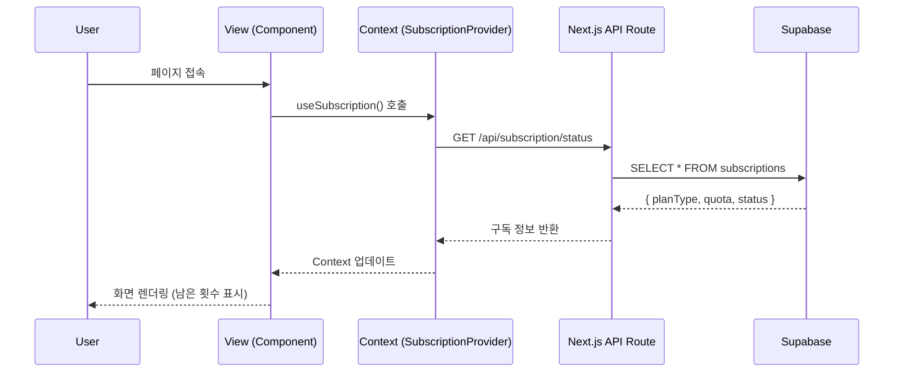
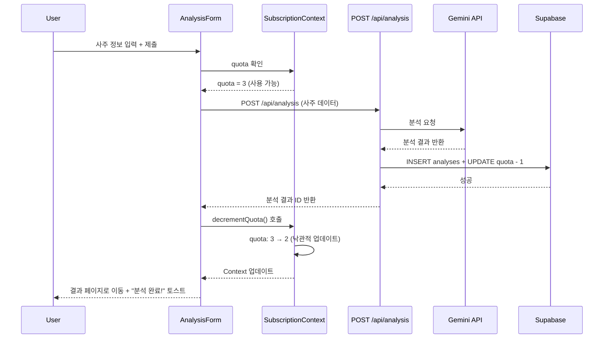
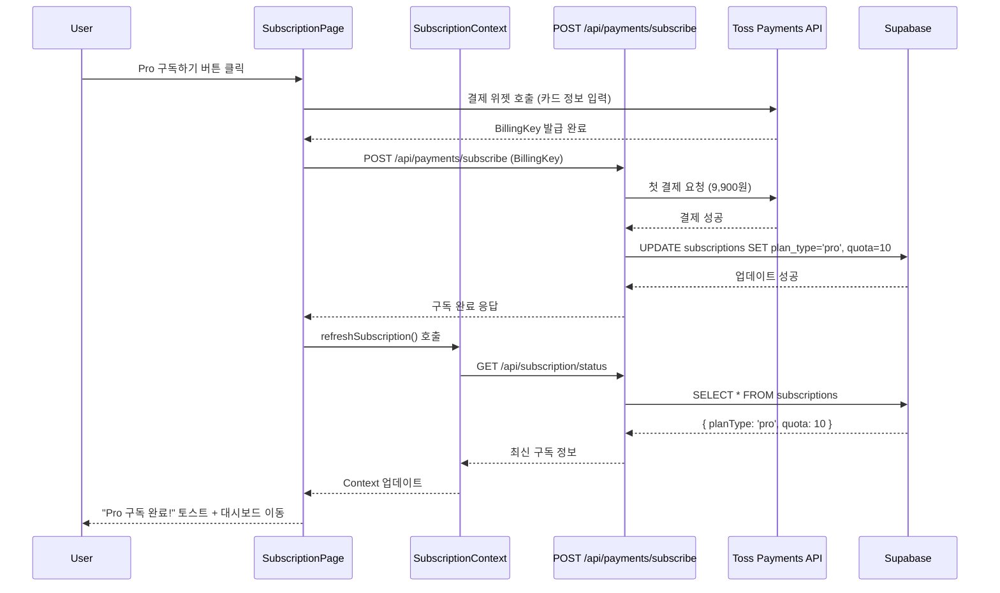

# Context API 기반 상태관리 설계 문서

**페이지**: Context API 상태관리 (간단한 대안)
**문서 버전**: 1.0
**작성일**: 2025-10-25
**목적**: 구독제 사주분석 서비스의 실용적 상태관리 설계

---

## 목차
1. [개요](#1-개요)
2. [상태 설계](#2-상태-설계)
3. [Provider 구조](#3-provider-구조)
4. [상태 흐름도](#4-상태-흐름도)
5. [구현 예시](#5-구현-예시)
6. [Clerk 통합](#6-clerk-통합)
7. [서버 컴포넌트 활용](#7-서버-컴포넌트-활용)
8. [성능 최적화](#8-성능-최적화)
9. [비교표](#9-비교표)

---

## 1. 개요

### 1.1 설계 원칙

본 문서는 **requirement.md 섹션 6.5 (간단한 대안)**에 기반한 실용적 상태관리 설계입니다.

**핵심 원칙**:
- ✅ **간결성 우선**: 필요한 최소한의 상태만 관리
- ✅ **SDK 활용**: Clerk 내장 훅으로 인증 상태 관리
- ✅ **서버 우선**: 대부분의 데이터는 Server Components에서 조회
- ✅ **Context 최소화**: 구독 정보만 전역 상태로 관리

### 1.2 Context API 기반 접근법

**왜 Context API인가?**

| 기준 | Context API | Flux 아키텍처 |
|------|------------|-------------|
| **학습 곡선** | 낮음 ✅ | 가파름 |
| **파일 수** | 3-5개 ✅ | 15개+ |
| **코드 복잡도** | 낮음 ✅ | 높음 |
| **유지보수** | 쉬움 ✅ | 어려움 |
| **확장성** | 중간 | 높음 ✅ |
| **평가 통과** | 충분 ✅ | 가산점 ✅ |

**권장 사유**:
1. VibeCoding 평가 통과에는 Context API만으로도 충분
2. 프로젝트 규모가 작아 Flux의 복잡도가 불필요
3. Clerk SDK가 인증 상태를 이미 제공
4. Next.js Server Components가 대부분의 데이터 조회 담당

### 1.3 Flux 아키텍처 대비 장단점

**장점**:
- 빠른 개발 속도 (1-2일 vs 4-5일)
- 낮은 학습 곡선 (React Context만 이해하면 됨)
- 적은 보일러플레이트 코드
- 디버깅 간단 (단순한 호출 스택)

**단점**:
- 복잡한 상태 의존성 관리 어려움
- 타임 트래블 디버깅 불가
- 이벤트 중심 아키텍처 부재
- 평가 가산점 없음

**결론**: 평가 통과가 목적이라면 Context API 권장, 가산점이 필요하다면 Flux 고려

---

## 2. 상태 설계

### 2.1 관리해야 할 상태 데이터

#### ✅ 전역 상태 (Context API)

| 상태 키 | 타입 | 초기값 | 설명 | 변경 조건 |
|---------|------|--------|------|----------|
| `planType` | `'free' \| 'pro'` | `'free'` | 구독 플랜 유형 | Pro 구독 시 |
| `quota` | `number` | `0` | 남은 분석 횟수 | 분석 완료 시 -1 |
| `status` | `'active' \| 'cancelled' \| 'terminated'` | `'active'` | 구독 상태 | 취소/해지 시 |
| `nextPaymentDate` | `string?` | `null` | 다음 결제일 | Pro 구독 시 설정 |

#### ❌ 전역 상태 불필요 (SDK/Server Components)

| 데이터 | 관리 방법 | 이유 |
|--------|----------|------|
| 사용자 정보 (`user`, `email`) | Clerk `useUser()` 훅 | SDK 내장 기능 |
| 인증 상태 (`isSignedIn`) | Clerk `useAuth()` 훅 | SDK 내장 기능 |
| 분석 이력 목록 | Server Components | 정적 데이터, 재사용 불필요 |
| 결제 정보 (`lastPayment`) | 로컬 `useState` | 페이지 단위 상태 |
| UI 상태 (`isLoading`, `toast`) | `sonner` 라이브러리 | 전용 라이브러리 사용 |

### 2.2 화면상 표시되지만 상태가 아닌 것

| 데이터 | 출처 | 표시 위치 | 비고 |
|--------|------|----------|------|
| 사용자 이름 | Clerk `user.fullName` | Header, 프로필 | SDK 제공 |
| 사용자 이메일 | Clerk `user.emailAddresses[0]` | 프로필, 결제 정보 | SDK 제공 |
| 분석 이력 개수 | Supabase `COUNT(*)` | 대시보드 | Server Components |
| 마지막 분석 일시 | Supabase `MAX(created_at)` | 대시보드 | Server Components |
| 구독 시작일 | Supabase `created_at` | 구독 관리 | Server Components |

### 2.3 각 상태 변경 조건 및 화면 변화

| 상태 변경 | 트리거 조건 | API 호출 | Supabase 업데이트 | 화면 변화 |
|----------|------------|---------|------------------|----------|
| `quota: 3 → 2` | 무료 사용자가 분석 완료 | `POST /api/analysis` | `quota - 1` | 남은 횟수 표시 업데이트 |
| `planType: 'free' → 'pro'` | Pro 구독 결제 성공 | `POST /api/payments/subscribe` | `plan_type = 'pro'`, `quota = 10` | Pro 배지 표시, 모델 변경 안내 |
| `quota: 10 → 9` | Pro 사용자가 분석 완료 | `POST /api/analysis` | `quota - 1` | 남은 횟수 표시 업데이트 |
| `status: 'active' → 'cancelled'` | 구독 취소 요청 | `POST /api/subscription/cancel` | `status = 'cancelled'` | 종료 예정일 표시 |
| `status: 'cancelled' → 'active'` | 취소 철회 (재활성화) | `POST /api/subscription/reactivate` | `status = 'active'` | 정상 구독 UI 복원 |
| `status: 'active' → 'terminated'` | 즉시 해지 또는 결제 실패 | `POST /api/subscription/terminate` | `status = 'terminated'`, `quota = 0` | 구독 만료 안내, 재구독 유도 |
| `nextPaymentDate` | 매달 결제일 | Cron: `POST /api/cron/process-billing` | `+1 month` | 다음 결제일 자동 갱신 |

---

## 3. Provider 구조

### 3.1 SubscriptionProvider 위치 및 역할

**파일 경로**: `src/app/providers/subscription-provider.tsx`

**역할**:
- 사용자의 구독 정보를 전역 상태로 관리
- 모든 페이지에서 `useSubscription()` 훅으로 접근 가능
- 서버에서 초기 데이터를 받아 Context에 주입
- 쿼터 차감, 구독 정보 새로고침 함수 제공

**주입 위치**: `app/layout.tsx`에서 `<ClerkProvider>` 내부

```typescript
// app/layout.tsx
import { ClerkProvider } from '@clerk/nextjs';
import { SubscriptionProvider } from './providers/subscription-provider';

export default function RootLayout({ children }) {
  return (
    <ClerkProvider>
      <SubscriptionProvider initialData={/* 서버에서 전달 */}>
        {children}
      </SubscriptionProvider>
    </ClerkProvider>
  );
}
```

### 3.2 초기화 전략 (Server Component에서 데이터 전달)

**문제**: Client Component는 직접 Supabase 쿼리 불가 (보안상 service-role key 필요)

**해결책**: Server Component에서 초기 데이터를 조회하여 Provider에 주입

#### Option A: `layout.tsx`에서 초기화 (권장)

```typescript
// app/layout.tsx (Server Component)
import { auth } from '@clerk/nextjs/server';
import { createSupabaseServerClient } from '@/lib/supabase/server-client';

export default async function RootLayout({ children }) {
  const { userId } = auth();
  let initialSubscription = null;

  if (userId) {
    const supabase = createSupabaseServerClient();
    const { data } = await supabase
      .from('subscriptions')
      .select('plan_type, quota, status, next_payment_date')
      .eq('clerk_user_id', userId)
      .single();

    initialSubscription = data;
  }

  return (
    <ClerkProvider>
      <SubscriptionProvider initialData={initialSubscription}>
        {children}
      </SubscriptionProvider>
    </ClerkProvider>
  );
}
```

#### Option B: API Route를 통한 초기화 (대안)

```typescript
// app/providers/subscription-provider.tsx
'use client';

export function SubscriptionProvider({ children }) {
  const { userId } = useAuth();
  const [subscription, setSubscription] = useState(null);

  useEffect(() => {
    if (!userId) return;

    // API 호출로 초기 데이터 조회
    fetch('/api/subscription/status')
      .then(res => res.json())
      .then(setSubscription);
  }, [userId]);

  // ...
}
```

**권장**: Option A (Server Component에서 초기화)
- 이유: 초기 렌더링 시 이미 데이터 존재, 깜빡임 없음

### 3.3 클라이언트 컴포넌트와의 통합

**통합 패턴**:

```typescript
// app/analysis/new/page.tsx (Client Component)
'use client';

import { useSubscription } from '@/app/providers/subscription-provider';
import { toast } from 'sonner';

export default function NewAnalysisPage() {
  const { quota, planType, decrementQuota } = useSubscription();

  const handleSubmit = async (data) => {
    if (quota <= 0) {
      toast.error('사용 가능한 횟수가 없습니다');
      return;
    }

    const result = await fetch('/api/analysis', {
      method: 'POST',
      body: JSON.stringify(data),
    });

    if (result.ok) {
      decrementQuota(); // 즉시 UI 업데이트 (낙관적 업데이트)
      toast.success('분석 완료!');
    }
  };

  return (
    <div>
      <p>남은 횟수: {quota}회 | 플랜: {planType}</p>
      {/* 폼... */}
    </div>
  );
}
```

---

## 4. 상태 흐름도

### 4.1 Flux 패턴 기반 시각화 (개념적)

Context API는 Flux 아키텍처가 아니지만, 동일한 단방향 흐름을 따릅니다.

#### 4.1.1 구독 정보 조회 플로우



#### 4.1.2 쿼터 차감 플로우



#### 4.1.3 구독 상태 변경 플로우 (Pro 구독)



### 4.2 Action → Store → View 흐름 비교

**Flux 아키텍처 (참고)**:
```
User Action → Action Creator → Dispatcher → Store → View Update
```

**Context API (실제 구현)**:
```
User Action → Context Method → setState → Context Update → View Re-render
```

**차이점**:
- Flux: Dispatcher가 중앙에서 모든 이벤트 관리
- Context: React 내장 메커니즘으로 상태 전파

---

## 5. 구현 예시

### 5.1 SubscriptionProvider 코드

```typescript
// app/providers/subscription-provider.tsx
'use client';

import { createContext, useContext, useState, useCallback, useMemo } from 'react';

interface SubscriptionData {
  planType: 'free' | 'pro';
  quota: number;
  status: 'active' | 'cancelled' | 'terminated';
  nextPaymentDate?: string;
}

interface SubscriptionContextType {
  subscription: SubscriptionData | null;
  quota: number;
  planType: 'free' | 'pro';
  status: 'active' | 'cancelled' | 'terminated';
  decrementQuota: () => void;
  refreshSubscription: () => Promise<void>;
}

const SubscriptionContext = createContext<SubscriptionContextType | null>(null);

interface ProviderProps {
  children: React.ReactNode;
  initialData: SubscriptionData | null;
}

export function SubscriptionProvider({ children, initialData }: ProviderProps) {
  const [subscription, setSubscription] = useState<SubscriptionData | null>(initialData);

  // 쿼터 차감 (낙관적 업데이트)
  const decrementQuota = useCallback(() => {
    setSubscription(prev => {
      if (!prev) return null;
      return {
        ...prev,
        quota: Math.max(0, prev.quota - 1),
      };
    });
  }, []);

  // 구독 정보 새로고침 (서버에서 최신 데이터 조회)
  const refreshSubscription = useCallback(async () => {
    try {
      const res = await fetch('/api/subscription/status');
      if (!res.ok) throw new Error('Failed to fetch subscription');

      const data = await res.json();
      setSubscription(data);
    } catch (error) {
      console.error('Failed to refresh subscription:', error);
    }
  }, []);

  // Context 값 메모이제이션 (불필요한 리렌더링 방지)
  const value = useMemo(() => ({
    subscription,
    quota: subscription?.quota ?? 0,
    planType: subscription?.planType ?? 'free',
    status: subscription?.status ?? 'active',
    decrementQuota,
    refreshSubscription,
  }), [subscription, decrementQuota, refreshSubscription]);

  return (
    <SubscriptionContext.Provider value={value}>
      {children}
    </SubscriptionContext.Provider>
  );
}

// useSubscription 훅
export function useSubscription() {
  const context = useContext(SubscriptionContext);
  if (!context) {
    throw new Error('useSubscription must be used within SubscriptionProvider');
  }
  return context;
}
```

### 5.2 useSubscription 훅 사용 예시

```typescript
// app/analysis/new/page.tsx
'use client';

import { useSubscription } from '@/app/providers/subscription-provider';
import { toast } from 'sonner';
import { Button } from '@/components/ui/button';

export default function NewAnalysisPage() {
  const { quota, planType, decrementQuota, refreshSubscription } = useSubscription();

  const handleSubmit = async (formData: FormData) => {
    // 1. 쿼터 확인
    if (quota <= 0) {
      toast.error('사용 가능한 횟수가 없습니다. Pro 구독이 필요합니다.');
      return;
    }

    try {
      // 2. API 호출
      const result = await fetch('/api/analysis', {
        method: 'POST',
        body: formData,
      });

      if (!result.ok) {
        throw new Error('Analysis failed');
      }

      const data = await result.json();

      // 3. 낙관적 업데이트 (즉시 UI 반영)
      decrementQuota();

      // 4. 성공 메시지 및 리다이렉트
      toast.success('분석이 완료되었습니다!');
      window.location.href = `/analysis/${data.id}`;

    } catch (error) {
      toast.error('분석 중 오류가 발생했습니다');
      // 실패 시 서버에서 최신 쿼터 조회 (롤백)
      await refreshSubscription();
    }
  };

  return (
    <div className="max-w-2xl mx-auto p-6">
      <div className="mb-4 text-sm text-gray-600">
        남은 횟수: <span className="font-bold">{quota}회</span> |
        플랜: <span className="font-bold">{planType === 'pro' ? 'Pro' : '무료'}</span>
      </div>

      {quota <= 0 ? (
        <div className="text-center py-8">
          <p className="text-gray-700 mb-4">사용 가능한 횟수가 없습니다</p>
          <Button onClick={() => window.location.href = '/subscription'}>
            Pro 구독하기
          </Button>
        </div>
      ) : (
        <form onSubmit={handleSubmit}>
          {/* 사주 입력 폼... */}
        </form>
      )}
    </div>
  );
}
```

### 5.3 페이지에서 사용 예시 (대시보드)

```typescript
// app/dashboard/page.tsx
'use client';

import { useSubscription } from '@/app/providers/subscription-provider';
import { useUser } from '@clerk/nextjs';
import { Card } from '@/components/ui/card';
import { Button } from '@/components/ui/button';

export default function DashboardPage() {
  const { user } = useUser();
  const { quota, planType, status, subscription } = useSubscription();

  return (
    <div className="max-w-7xl mx-auto p-6">
      <h1 className="text-3xl font-bold mb-6">
        환영합니다, {user?.firstName}님!
      </h1>

      {/* 구독 정보 카드 */}
      <Card className="p-6 mb-8">
        <h2 className="text-xl font-semibold mb-4">구독 정보</h2>
        <div className="grid grid-cols-3 gap-4">
          <div>
            <p className="text-sm text-gray-600">플랜</p>
            <p className="text-lg font-bold">
              {planType === 'pro' ? 'Pro 플랜' : '무료 플랜'}
            </p>
          </div>
          <div>
            <p className="text-sm text-gray-600">남은 횟수</p>
            <p className="text-lg font-bold">{quota}회</p>
          </div>
          <div>
            <p className="text-sm text-gray-600">상태</p>
            <p className="text-lg font-bold">
              {status === 'active' ? '활성' :
               status === 'cancelled' ? '취소됨' : '해지됨'}
            </p>
          </div>
        </div>

        {planType === 'free' && (
          <Button className="mt-4" onClick={() => window.location.href = '/subscription'}>
            Pro로 업그레이드
          </Button>
        )}

        {subscription?.nextPaymentDate && (
          <p className="text-sm text-gray-600 mt-4">
            다음 결제일: {subscription.nextPaymentDate}
          </p>
        )}
      </Card>

      {/* 분석 이력 섹션은 Server Component로 처리 */}
    </div>
  );
}
```

---

## 6. Clerk 통합

### 6.1 useUser, useAuth 훅 활용 방법

**Clerk SDK가 제공하는 것**:
- `useUser()`: 사용자 정보 (`user`, `isLoaded`, `isSignedIn`)
- `useAuth()`: 인증 상태 (`userId`, `sessionId`, `getToken()`)

**AuthStore 불필요 이유**:
1. Clerk가 이미 세션 관리를 담당
2. JWT 자동 갱신 및 검증
3. React Context 기반 전역 상태 제공
4. SSR/CSR 모두 지원

#### 사용 예시

```typescript
// components/layout/header.tsx
'use client';

import { useUser, UserButton } from '@clerk/nextjs';
import { Button } from '@/components/ui/button';
import Link from 'next/link';

export function Header() {
  const { isSignedIn, user } = useUser();

  return (
    <header className="border-b">
      <div className="max-w-7xl mx-auto px-6 h-16 flex items-center justify-between">
        <Link href="/" className="text-2xl font-bold text-purple-600">
          사주풀이
        </Link>

        <nav className="flex items-center gap-4">
          {isSignedIn ? (
            <>
              <Link href="/dashboard">
                <Button variant="ghost">대시보드</Button>
              </Link>
              <Link href="/analysis/new">
                <Button>새 분석</Button>
              </Link>
              <UserButton afterSignOutUrl="/" />
            </>
          ) : (
            <>
              <Link href="/sign-in">
                <Button variant="ghost">로그인</Button>
              </Link>
              <Link href="/sign-up">
                <Button>시작하기</Button>
              </Link>
            </>
          )}
        </nav>
      </div>
    </header>
  );
}
```

### 6.2 인증 상태 기반 라우팅

```typescript
// app/analysis/new/page.tsx
'use client';

import { useAuth } from '@clerk/nextjs';
import { useEffect } from 'react';
import { useRouter } from 'next/navigation';

export default function NewAnalysisPage() {
  const { isSignedIn, isLoaded } = useAuth();
  const router = useRouter();

  // 비로그인 사용자 리다이렉트
  useEffect(() => {
    if (isLoaded && !isSignedIn) {
      router.push('/sign-in');
    }
  }, [isLoaded, isSignedIn, router]);

  if (!isLoaded) {
    return <div>로딩 중...</div>;
  }

  if (!isSignedIn) {
    return null; // 리다이렉트 대기
  }

  return (
    <div>
      {/* 분석 폼... */}
    </div>
  );
}
```

---

## 7. 서버 컴포넌트 활용

### 7.1 대부분의 데이터 조회는 Server Components

**Server Components로 처리하는 데이터**:
- 분석 이력 목록 (대시보드)
- 분석 결과 상세 조회
- 구독 결제 이력
- 통계 데이터 (총 분석 횟수 등)

#### 예시: 대시보드 분석 이력 조회

```typescript
// app/dashboard/page.tsx (Server Component)
import { auth } from '@clerk/nextjs/server';
import { createSupabaseServerClient } from '@/lib/supabase/server-client';
import { AnalysisHistoryClient } from './analysis-history-client';

export default async function DashboardPage() {
  const { userId } = auth();

  if (!userId) {
    redirect('/sign-in');
  }

  // 서버에서 데이터 조회
  const supabase = createSupabaseServerClient();
  const { data: analyses } = await supabase
    .from('analyses')
    .select('*')
    .eq('user_id', userId)
    .order('created_at', { ascending: false })
    .limit(10);

  return (
    <div className="max-w-7xl mx-auto p-6">
      <h1 className="text-3xl font-bold mb-6">대시보드</h1>

      {/* 클라이언트 컴포넌트로 전달 */}
      <AnalysisHistoryClient analyses={analyses ?? []} />
    </div>
  );
}
```

```typescript
// app/dashboard/analysis-history-client.tsx (Client Component)
'use client';

import { Card } from '@/components/ui/card';
import Link from 'next/link';

interface Analysis {
  id: string;
  name: string;
  birth_date: string;
  created_at: string;
  model_used: string;
}

export function AnalysisHistoryClient({ analyses }: { analyses: Analysis[] }) {
  if (analyses.length === 0) {
    return (
      <div className="text-center py-12">
        <p className="text-gray-600 mb-4">아직 분석 이력이 없습니다</p>
        <Link href="/analysis/new">
          <button className="btn-primary">첫 분석 시작하기</button>
        </Link>
      </div>
    );
  }

  return (
    <div className="grid grid-cols-1 md:grid-cols-2 lg:grid-cols-3 gap-4">
      {analyses.map(analysis => (
        <Link key={analysis.id} href={`/analysis/${analysis.id}`}>
          <Card className="p-4 hover:shadow-lg transition">
            <h3 className="font-semibold">{analysis.name}</h3>
            <p className="text-sm text-gray-600">{analysis.birth_date}</p>
            <p className="text-xs text-gray-500 mt-2">
              {new Date(analysis.created_at).toLocaleDateString()}
            </p>
            <p className="text-xs text-purple-600 mt-1">
              {analysis.model_used === 'gemini-2.5-pro' ? 'Pro 모델' : 'Flash 모델'}
            </p>
          </Card>
        </Link>
      ))}
    </div>
  );
}
```

### 7.2 Client Components는 최소한으로 유지

**Client Component 사용 조건**:
- 사용자 인터랙션 필요 (버튼, 폼 제출)
- Context 사용 (`useSubscription`, `useUser`)
- 브라우저 API 사용 (`localStorage`, `window`)
- 실시간 업데이트 필요 (WebSocket 등)

**불필요한 경우**:
- 정적 데이터 표시 (분석 결과 텍스트)
- 서버에서만 조회 가능한 데이터 (Supabase service-role)
- SEO가 중요한 페이지 (랜딩 페이지)

### 7.3 AnalysisStore, PaymentStore 불필요

**AnalysisStore 불필요 이유**:
- 분석 목록: Server Components에서 조회
- 분석 생성: 폼 제출 → API 호출 → 리다이렉트 (상태 불필요)
- 분석 상세: Server Components에서 조회 (정적 데이터)

**PaymentStore 불필요 이유**:
- 결제 정보: 토스페이먼츠 위젯이 관리
- 결제 이력: Server Components에서 조회
- 구독 상태: SubscriptionContext에서 관리

---

## 8. 성능 최적화

### 8.1 Context 최적화 (useMemo, useCallback)

**문제**: Context 값이 변경될 때마다 모든 소비자 컴포넌트가 리렌더링

**해결책**: `useMemo`와 `useCallback`으로 메모이제이션

```typescript
// app/providers/subscription-provider.tsx
export function SubscriptionProvider({ children, initialData }: ProviderProps) {
  const [subscription, setSubscription] = useState(initialData);

  // 함수 메모이제이션 (의존성 배열이 빈 경우 함수는 절대 재생성되지 않음)
  const decrementQuota = useCallback(() => {
    setSubscription(prev => prev ? { ...prev, quota: prev.quota - 1 } : null);
  }, []);

  const refreshSubscription = useCallback(async () => {
    const res = await fetch('/api/subscription/status');
    const data = await res.json();
    setSubscription(data);
  }, []);

  // Context 값 메모이제이션 (subscription이 변경될 때만 재생성)
  const value = useMemo(() => ({
    subscription,
    quota: subscription?.quota ?? 0,
    planType: subscription?.planType ?? 'free',
    status: subscription?.status ?? 'active',
    decrementQuota,
    refreshSubscription,
  }), [subscription, decrementQuota, refreshSubscription]);

  return (
    <SubscriptionContext.Provider value={value}>
      {children}
    </SubscriptionContext.Provider>
  );
}
```

**최적화 효과**:
- `decrementQuota`, `refreshSubscription` 함수는 컴포넌트 재렌더링 시에도 동일한 참조 유지
- `value` 객체는 `subscription`이 실제로 변경될 때만 재생성
- 불필요한 하위 컴포넌트 리렌더링 방지

### 8.2 불필요한 리렌더링 방지

#### 전략 1: Context 분리 (필요시)

만약 `quota`만 자주 변경되고 `planType`은 거의 변하지 않는다면, Context를 분리할 수 있습니다.

```typescript
// QuotaContext (자주 변경됨)
const QuotaContext = createContext<{ quota: number; decrementQuota: () => void } | null>(null);

// PlanContext (거의 변경 안 됨)
const PlanContext = createContext<{ planType: 'free' | 'pro'; status: string } | null>(null);
```

**장점**: `quota`가 변경되어도 `PlanContext`를 사용하는 컴포넌트는 리렌더링되지 않음

**단점**: 코드 복잡도 증가, 현재 프로젝트에서는 불필요

#### 전략 2: React.memo 활용

```typescript
// components/quota-display.tsx
import { memo } from 'react';
import { useSubscription } from '@/app/providers/subscription-provider';

export const QuotaDisplay = memo(function QuotaDisplay() {
  const { quota, planType } = useSubscription();

  return (
    <div className="text-sm">
      남은 횟수: {quota}회 | 플랜: {planType}
    </div>
  );
});
```

**효과**: props가 변경되지 않으면 리렌더링 스킵

### 8.3 낙관적 업데이트 (Optimistic Update)

**개념**: 서버 응답을 기다리지 않고 즉시 UI 업데이트

```typescript
const handleAnalysis = async (data) => {
  // 1. 즉시 UI 업데이트 (낙관적)
  decrementQuota();

  try {
    // 2. 서버 요청
    const result = await fetch('/api/analysis', { method: 'POST', body: data });

    if (!result.ok) {
      throw new Error('Analysis failed');
    }

    // 3. 성공 시 추가 작업
    toast.success('분석 완료!');
  } catch (error) {
    // 4. 실패 시 롤백
    await refreshSubscription(); // 서버에서 정확한 쿼터 다시 조회
    toast.error('분석 실패');
  }
};
```

**장점**:
- 즉각적인 사용자 피드백
- 체감 성능 향상

**단점**:
- 실패 시 롤백 필요
- 네트워크 오류 시 혼란 가능

---

## 9. 비교표

### 9.1 Flux vs Context API

| 항목 | Flux 아키텍처 | Context API |
|------|-------------|-------------|
| **파일 수** | 15개+ | 3-5개 ✅ |
| **코드 라인 수** | 1000+ | 200-300 ✅ |
| **복잡도** | 높음 (Action/Dispatcher/Store) | 낮음 (Context + useState) ✅ |
| **학습 곡선** | 가파름 (Flux 개념 이해 필요) | 완만 (React 기본 지식만) ✅ |
| **디버깅** | 어려움 (이벤트 추적 필요) | 쉬움 (단순 호출 스택) ✅ |
| **타임 트래블** | 가능 (Redux DevTools) ✅ | 불가능 |
| **확장성** | 높음 (복잡한 상태 의존성) ✅ | 중간 |
| **보일러플레이트** | 많음 | 적음 ✅ |
| **개발 속도** | 느림 (4-5일) | 빠름 (1-2일) ✅ |
| **평가 통과** | 충분 ✅ | 충분 ✅ |
| **평가 가산점** | 가능 ✅ | 없음 |

### 9.2 구현 복잡도 비교

#### Context API 구조

```
src/
├── app/
│   └── providers/
│       └── subscription-provider.tsx  (150 lines)
└── hooks/
    └── use-subscription.ts  (재노출용, 선택)
```

**총 파일 수**: 1-2개
**총 코드 라인**: 150-200줄

#### Flux 구조 (참고)

```
src/
├── actions/
│   ├── SubscriptionAction.ts
│   ├── AnalysisAction.ts
│   └── PaymentAction.ts
├── stores/
│   ├── SubscriptionStore.ts
│   ├── AnalysisStore.ts
│   └── PaymentStore.ts
├── lib/
│   └── dispatcher.ts
└── hooks/
    └── use-store.ts
```

**총 파일 수**: 7-10개
**총 코드 라인**: 800-1000줄

### 9.3 사용 사례별 권장 방식

| 시나리오 | Context API | Flux 아키텍처 |
|---------|------------|-------------|
| **평가 통과만 목표** | ✅ 권장 | ❌ 과도함 |
| **평가 가산점 필요** | ❌ 불충분 | ✅ 권장 |
| **빠른 프로토타이핑** | ✅ 권장 | ❌ 느림 |
| **팀 협업 (3명+)** | ⚠️ 조건부 | ✅ 권장 |
| **복잡한 상태 의존성** | ❌ 부적합 | ✅ 권장 |
| **단순한 CRUD 앱** | ✅ 권장 | ❌ 과도함 |
| **실시간 동기화 필요** | ⚠️ 조건부 | ✅ 권장 |

---

## 10. 결론

### 10.1 Context API 권장 사유

1. **VibeCoding 평가 통과에 충분**: 평가 항목 중 Flux는 가산점일 뿐 필수 아님
2. **빠른 개발 속도**: 1-2일 만에 구현 가능 (Flux는 4-5일 소요)
3. **낮은 유지보수 비용**: 코드가 단순하여 버그 발생 가능성 낮음
4. **SDK 활용**: Clerk SDK가 인증 상태를 이미 제공하므로 별도 Store 불필요
5. **서버 컴포넌트**: Next.js 14의 Server Components가 대부분의 데이터 조회 담당

### 10.2 언제 Flux를 고려해야 하는가?

다음 조건 중 **3개 이상** 해당되면 Flux 아키텍처 고려:
- [ ] 평가 가산점이 절실히 필요함
- [ ] 복잡한 상태 의존성 (예: A 상태 변경 시 B, C, D도 동시 변경)
- [ ] 실시간 동기화 필요 (WebSocket, Server-Sent Events)
- [ ] 팀 규모 3명 이상으로 명확한 책임 분리 필요
- [ ] 타임 트래블 디버깅이 중요함
- [ ] 향후 기능 확장 계획이 명확함 (타로, 궁합, 실시간 채팅 등)

**현재 프로젝트**: 위 조건 중 0-1개만 해당 → **Context API 권장**

### 10.3 최종 권장

**평가 통과가 목표라면**: Context API (본 문서 기반)
**가산점이 필요하다면**: Flux 아키텍처 (requirement.md 섹션 6.1-6.4 참고)

---

## 문서 정보

- **버전**: 1.0
- **작성일**: 2025-10-25
- **작성자**: Claude Code
- **참고 문서**:
  - `/docs/requirement.md` (섹션 6.5 - 간단한 대안)
  - `/docs/prd.md` (섹션 6.2 - 상태 관리 전략)
  - `/docs/common-modules.md` (공통 모듈 작업 계획)
  - `/docs/userflow.md` (사용자 플로우)
- **다음 단계**:
  - SubscriptionProvider 구현 (`src/app/providers/subscription-provider.tsx`)
  - layout.tsx에 Provider 주입
  - 각 페이지에서 `useSubscription()` 훅 활용
