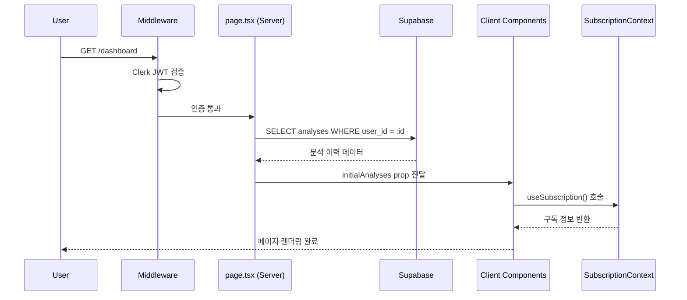
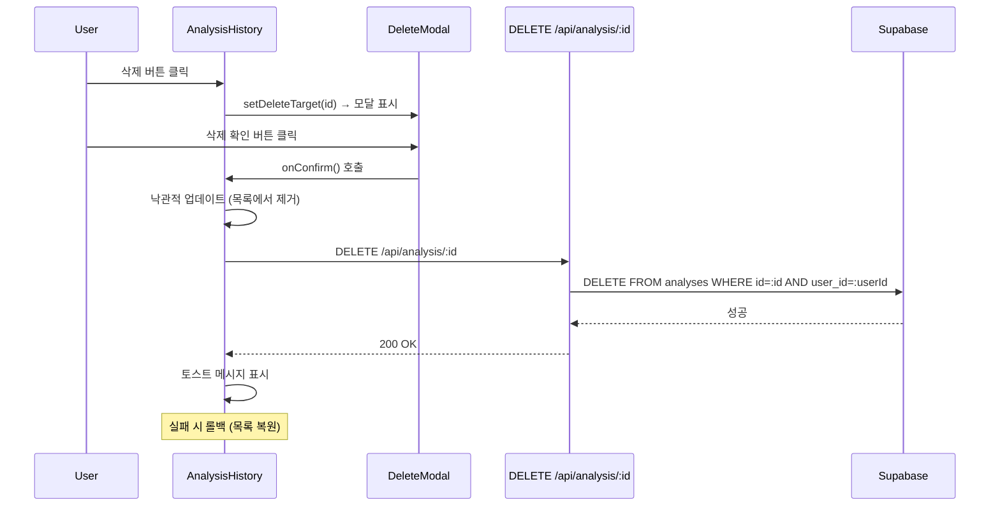

# 대시보드 페이지 구현 계획 (Dashboard Page Implementation Plan)

**페이지**: `/dashboard`
**문서 버전**: 1.0
**작성일**: 2025-10-25
**목적**: 사용자의 분석 이력 조회 및 구독 정보 표시

---

## 목차
1. [개요](#1-개요)
2. [요구사항 분석](#2-요구사항-분석)
3. [아키텍처 설계](#3-아키텍처-설계)
4. [구현 단계](#4-구현-단계)
5. [컴포넌트 명세](#5-컴포넌트-명세)
6. [데이터 흐름](#6-데이터-흐름)
7. [에러 처리](#7-에러-처리)
8. [테스트 계획](#8-테스트-계획)

---

## 1. 개요

### 1.1 페이지 정보

**기본 정보**:
- **경로**: `/dashboard`
- **접근 조건**: 로그인 필요 (Next.js Middleware 보호)
- **레이아웃**: `app/(protected)/layout.tsx` 사용
- **렌더링 방식**: Server Component (목록 조회) + Client Component (인터랙션)

**주요 기능**:
1. ✅ 사용자 구독 정보 표시 (플랜, 남은 횟수, 상태)
2. ✅ 사주 분석 이력 목록 표시 (최신순 10개)
3. ✅ 빈 상태 UI (분석 이력 0건)
4. ✅ 새 분석하기 CTA 버튼
5. ✅ 분석 상세보기 링크
6. ✅ 분석 삭제 기능

### 1.2 설계 원칙

**핵심 원칙**:
- ✅ **Server Components 우선**: 목록 데이터는 서버에서 조회
- ✅ **SubscriptionProvider 활용**: 구독 정보는 Context API에서 가져옴
- ✅ **낙관적 업데이트**: 삭제 시 즉시 UI 반영, 실패 시 롤백
- ✅ **반응형 디자인**: 모바일/태블릿/데스크톱 대응
- ✅ **Clerk 통합**: useUser 훅으로 사용자 정보 표시

### 1.3 참고 문서

- `/docs/prd.md` (섹션 5.2.5.2 - 대시보드 요구사항)
- `/docs/requirement.md` (섹션 3 - 페이지 구조)
- `/docs/userflow.md` (섹션 5 - 히스토리 조회 플로우)
- `/docs/usecases/4-history/spec.md` (히스토리 유스케이스)
- `/docs/pages/1-context-api-state/state.md` (SubscriptionProvider)

---

## 2. 요구사항 분석

### 2.1 기능 요구사항 (PRD 기반)

**필수 기능 (PRD 5.2.5.2)**:
- [ ] 구독 정보 카드 표시 (플랜, 남은 횟수, 다음 결제일)
- [ ] 최근 분석 이력 10개 표시 (최신순)
- [ ] 각 분석 카드: 이름, 생년월일, 분석일, 사용 모델
- [ ] 상세보기 버튼 (→ `/analysis/:id`)
- [ ] 새 분석하기 버튼 (→ `/analysis/new`)
- [ ] 삭제 버튼 (확인 모달 → 삭제 실행)
- [ ] 빈 상태 UI (분석 이력 0건일 때)

**선택 기능 (UC-004 기반)**:
- [ ] 페이지네이션 (10개/페이지)
- [ ] 정렬 옵션 (날짜순, 이름순)
- [ ] 검색 필터 (이름 검색)

**우선순위**:
- **P0 (필수)**: 구독 정보 카드, 분석 이력 목록, 빈 상태 UI, 새 분석 CTA
- **P1 (중요)**: 삭제 기능, 상세보기 링크
- **P2 (선택)**: 페이지네이션, 정렬, 검색 (향후 개선)

### 2.2 비기능 요구사항

**성능 (UC-004 섹션 8.1)**:
- 목록 조회 응답 시간: < 500ms
- 삭제 작업 완료 시간: < 1초
- 페이지 초기 로딩 시간: < 1초 (Server Components 활용)

**보안 (UC-004 섹션 8.2)**:
- Clerk JWT 토큰 검증 (Middleware)
- Supabase RLS 비활성화 대신 애플리케이션 레벨 검증
- 타인의 분석 접근 차단 (`clerk_user_id` 일치 검증)

**사용성 (UC-004 섹션 8.3)**:
- 빈 상태 UI: 명확한 안내 메시지 + CTA
- 삭제 확인 모달: 실수 방지
- 토스트 메시지: 성공/실패 상태 명확히 전달

### 2.3 사용자 플로우 (UserFlow 섹션 5)

```mermaid
flowchart TD
    A[사용자: 대시보드 접속] --> B{로그인 상태?}
    B -->|아니오| C[로그인 페이지 리다이렉트]
    B -->|예| D[구독 정보 조회]
    D --> E[분석 이력 조회]
    E --> F{이력 존재?}
    F -->|없음| G[빈 상태 UI 표시]
    G --> H[새 분석하기 버튼]
    F -->|있음| I[분석 목록 렌더링]
    I --> J{사용자 액션}
    J -->|상세보기| K[/analysis/:id 이동]
    J -->|삭제| L[삭제 확인 모달]
    L --> M{확인?}
    M -->|취소| I
    M -->|확인| N[삭제 실행]
    N --> O[목록 갱신]
```

---

## 3. 아키텍처 설계

### 3.1 파일 구조

```
app/
├── (protected)/
│   ├── layout.tsx                    # SubscriptionProvider 적용
│   └── dashboard/
│       ├── page.tsx                   # Server Component (목록 조회)
│       ├── _components/
│       │   ├── subscription-card.tsx  # Client: 구독 정보 카드
│       │   ├── analysis-history.tsx   # Client: 분석 이력 컨테이너
│       │   ├── analysis-card.tsx      # Client: 개별 분석 카드
│       │   ├── empty-state.tsx        # Client: 빈 상태 UI
│       │   └── delete-modal.tsx       # Client: 삭제 확인 모달
│       └── actions.ts                 # Server Actions (삭제)

features/
└── analysis/
    └── backend/
        └── route.ts                   # DELETE /api/analysis/:id
```

**파일 역할**:
- `page.tsx`: Server Component로 초기 데이터 조회
- `_components/`: Client Components (인터랙션 담당)
- `actions.ts`: Server Actions (삭제 등)
- `route.ts`: Hono API (백엔드 로직)

### 3.2 Server Component vs Client Component 분리

**Server Component (page.tsx)**:
```typescript
// app/(protected)/dashboard/page.tsx
import { auth } from '@clerk/nextjs/server';
import { createSupabaseServerClient } from '@/lib/supabase/server-client';
import { SubscriptionCard } from './_components/subscription-card';
import { AnalysisHistory } from './_components/analysis-history';

export default async function DashboardPage() {
  const { userId } = auth();
  const supabase = createSupabaseServerClient();

  // 서버에서 분석 이력 조회
  const { data: analyses } = await supabase
    .from('analyses')
    .select('id, name, birth_date, birth_time, gender, model_used, created_at')
    .eq('clerk_user_id', userId)
    .order('created_at', { ascending: false })
    .limit(10);

  return (
    <div className="max-w-7xl mx-auto px-6 py-8">
      <h1 className="text-3xl font-bold mb-8">대시보드</h1>

      <SubscriptionCard />
      <AnalysisHistory initialAnalyses={analyses ?? []} />
    </div>
  );
}
```

**Client Component (analysis-history.tsx)**:
```typescript
'use client';

import { useState } from 'react';
import { AnalysisCard } from './analysis-card';
import { EmptyState } from './empty-state';
import { DeleteModal } from './delete-modal';

export function AnalysisHistory({ initialAnalyses }) {
  const [analyses, setAnalyses] = useState(initialAnalyses);
  const [deleteTarget, setDeleteTarget] = useState(null);

  // 삭제 핸들러...
}
```

**분리 기준**:
| 컴포넌트 | 타입 | 이유 |
|---------|------|------|
| page.tsx | Server | 데이터 조회, SEO 최적화 |
| subscription-card.tsx | Client | SubscriptionProvider 사용 |
| analysis-history.tsx | Client | 삭제 등 인터랙션 |
| analysis-card.tsx | Client | 버튼 클릭 이벤트 |
| empty-state.tsx | Client | 링크 클릭 처리 (선택적) |
| delete-modal.tsx | Client | 모달 상태 관리 |

### 3.3 SubscriptionProvider 통합

**통합 위치**: `app/(protected)/layout.tsx`

```typescript
// app/(protected)/layout.tsx (Server Component)
import { auth } from '@clerk/nextjs/server';
import { createSupabaseServerClient } from '@/lib/supabase/server-client';
import { SubscriptionProvider } from '@/app/providers/subscription-provider';

export default async function ProtectedLayout({ children }) {
  const { userId } = auth();
  const supabase = createSupabaseServerClient();

  // 구독 정보 조회
  const { data: subscription } = await supabase
    .from('subscriptions')
    .select('plan_type, quota, status, next_payment_date')
    .eq('clerk_user_id', userId)
    .single();

  return (
    <SubscriptionProvider initialData={subscription}>
      <div className="min-h-screen bg-gray-50">
        {children}
      </div>
    </SubscriptionProvider>
  );
}
```

**사용 예시 (subscription-card.tsx)**:
```typescript
'use client';

import { useSubscription } from '@/app/providers/subscription-provider';
import { useUser } from '@clerk/nextjs';

export function SubscriptionCard() {
  const { user } = useUser();
  const { quota, planType, status, subscription } = useSubscription();

  return (
    <div className="bg-white rounded-xl shadow-md p-6 mb-8">
      <h2 className="text-xl font-semibold mb-4">
        환영합니다, {user?.firstName}님!
      </h2>
      <div className="grid grid-cols-3 gap-4">
        <div>
          <p className="text-sm text-gray-600">플랜</p>
          <p className="text-lg font-bold">
            {planType === 'pro' ? 'Pro 플랜' : '무료 플랜'}
          </p>
        </div>
        <div>
          <p className="text-sm text-gray-600">남은 횟수</p>
          <p className="text-lg font-bold">{quota}회</p>
        </div>
        <div>
          <p className="text-sm text-gray-600">상태</p>
          <p className="text-lg font-bold">
            {status === 'active' ? '활성' : status === 'cancelled' ? '취소됨' : '해지됨'}
          </p>
        </div>
      </div>
      {subscription?.nextPaymentDate && (
        <p className="text-sm text-gray-600 mt-4">
          다음 결제일: {subscription.nextPaymentDate}
        </p>
      )}
    </div>
  );
}
```

### 3.4 데이터 조회 전략

**Server Component 우선**:
- 분석 이력 목록: Server Component에서 조회 (초기 렌더링 시 데이터 존재)
- 구독 정보: SubscriptionProvider에서 제공 (layout.tsx에서 초기화)

**Client Component 보조**:
- 삭제 후 목록 갱신: Server Actions 또는 API 호출
- 낙관적 업데이트: 삭제 시 즉시 UI 반영

**쿼리 예시 (page.tsx)**:
```sql
SELECT id, name, birth_date, birth_time, gender, model_used, created_at
FROM analyses
WHERE clerk_user_id = 'user_xxxxx'
ORDER BY created_at DESC
LIMIT 10;
```

**예상 실행 계획**: Index Scan (idx_analyses_user_created, cost=0.29..15.41 rows=10)

---

## 4. 구현 단계

### 4.1 Phase 1: Server Component 기본 구조 (1-2시간)

**작업 내용**:
1. [ ] `app/(protected)/dashboard/page.tsx` 생성
2. [ ] Clerk `auth()` 로 userId 가져오기
3. [ ] Supabase 서버 클라이언트로 분석 이력 조회
4. [ ] 기본 레이아웃 구성 (제목, 컨테이너)
5. [ ] 에러 핸들링 (userId 없음, DB 조회 실패)

**검증**:
- [ ] `/dashboard` 접속 시 페이지 로딩 확인
- [ ] 로그인 없이 접속 시 리다이렉트 확인
- [ ] 콘솔에 분석 이력 데이터 로그 확인

**코드 예시**:
```typescript
// app/(protected)/dashboard/page.tsx
import { auth } from '@clerk/nextjs/server';
import { redirect } from 'next/navigation';
import { createSupabaseServerClient } from '@/lib/supabase/server-client';

export default async function DashboardPage() {
  const { userId } = auth();

  if (!userId) {
    redirect('/sign-in');
  }

  const supabase = createSupabaseServerClient();

  try {
    const { data: analyses, error } = await supabase
      .from('analyses')
      .select('id, name, birth_date, birth_time, gender, model_used, created_at')
      .eq('clerk_user_id', userId)
      .order('created_at', { ascending: false })
      .limit(10);

    if (error) throw error;

    return (
      <div className="max-w-7xl mx-auto px-6 py-8">
        <h1 className="text-3xl font-bold mb-8">대시보드</h1>
        <pre>{JSON.stringify(analyses, null, 2)}</pre>
      </div>
    );
  } catch (error) {
    console.error('Failed to fetch analyses:', error);
    return (
      <div className="max-w-7xl mx-auto px-6 py-8">
        <h1 className="text-3xl font-bold mb-8">대시보드</h1>
        <p className="text-red-600">데이터를 불러올 수 없습니다.</p>
      </div>
    );
  }
}
```

### 4.2 Phase 2: SubscriptionCard 컴포넌트 (1시간)

**작업 내용**:
1. [ ] `_components/subscription-card.tsx` 생성
2. [ ] `useSubscription` 훅으로 구독 정보 가져오기
3. [ ] `useUser` 훅으로 사용자 이름 표시
4. [ ] 플랜, 남은 횟수, 상태 표시
5. [ ] Pro 구독 CTA 버튼 (무료 플랜일 때)
6. [ ] 다음 결제일 표시 (Pro 플랜일 때)

**검증**:
- [ ] 무료 플랜: "무료 플랜", "남은 횟수 3회", "Pro 업그레이드" 버튼 표시
- [ ] Pro 플랜: "Pro 플랜", "남은 횟수 10회", "다음 결제일" 표시
- [ ] 사용자 이름 표시 확인

**코드 예시**:
```typescript
// app/(protected)/dashboard/_components/subscription-card.tsx
'use client';

import { useSubscription } from '@/app/providers/subscription-provider';
import { useUser } from '@clerk/nextjs';
import { Button } from '@/components/ui/button';
import { Card } from '@/components/ui/card';
import Link from 'next/link';

export function SubscriptionCard() {
  const { user } = useUser();
  const { quota, planType, status, subscription } = useSubscription();

  return (
    <Card className="p-6 mb-8">
      <h2 className="text-xl font-semibold mb-4">
        환영합니다, {user?.firstName}님!
      </h2>

      <div className="grid grid-cols-1 md:grid-cols-3 gap-4">
        <div>
          <p className="text-sm text-gray-600">플랜</p>
          <p className="text-lg font-bold">
            {planType === 'pro' ? 'Pro 플랜' : '무료 플랜'}
          </p>
        </div>

        <div>
          <p className="text-sm text-gray-600">남은 횟수</p>
          <p className="text-lg font-bold">{quota}회</p>
        </div>

        <div>
          <p className="text-sm text-gray-600">상태</p>
          <p className="text-lg font-bold">
            {status === 'active' ? '활성' :
             status === 'cancelled' ? '취소됨' : '해지됨'}
          </p>
        </div>
      </div>

      {planType === 'free' && (
        <Link href="/subscription">
          <Button className="mt-4 w-full md:w-auto">
            Pro로 업그레이드
          </Button>
        </Link>
      )}

      {subscription?.nextPaymentDate && (
        <p className="text-sm text-gray-600 mt-4">
          다음 결제일: {new Date(subscription.nextPaymentDate).toLocaleDateString('ko-KR')}
        </p>
      )}
    </Card>
  );
}
```

### 4.3 Phase 3: AnalysisCard 컴포넌트 (1시간)

**작업 내용**:
1. [ ] `_components/analysis-card.tsx` 생성
2. [ ] 카드 UI 구성: 이름, 생년월일, 분석일, 모델
3. [ ] 상세보기 버튼 (Link → `/analysis/:id`)
4. [ ] 삭제 버튼 (onDelete 콜백)
5. [ ] 모델 뱃지 스타일링 (Flash: 회색, Pro: 보라색)
6. [ ] 반응형 디자인 (모바일/데스크톱)

**검증**:
- [ ] 각 분석 정보가 올바르게 표시되는지 확인
- [ ] 상세보기 클릭 시 `/analysis/:id` 이동 확인
- [ ] 삭제 버튼 클릭 시 onDelete 콜백 호출 확인
- [ ] 모바일에서 카드 레이아웃 확인

**코드 예시**:
```typescript
// app/(protected)/dashboard/_components/analysis-card.tsx
'use client';

import { Card } from '@/components/ui/card';
import { Button } from '@/components/ui/button';
import { Trash2 } from 'lucide-react';
import Link from 'next/link';

interface Analysis {
  id: string;
  name: string;
  birth_date: string;
  birth_time: string | null;
  gender: 'male' | 'female';
  model_used: 'gemini-2.5-flash' | 'gemini-2.5-pro';
  created_at: string;
}

interface AnalysisCardProps {
  analysis: Analysis;
  onDelete: (id: string) => void;
}

export function AnalysisCard({ analysis, onDelete }: AnalysisCardProps) {
  const isPro = analysis.model_used === 'gemini-2.5-pro';

  return (
    <Card className="p-4 hover:shadow-lg transition-shadow">
      <div className="flex justify-between items-start mb-3">
        <h3 className="font-semibold text-lg">{analysis.name}</h3>
        <button
          onClick={() => onDelete(analysis.id)}
          className="text-gray-400 hover:text-red-600 transition-colors"
          aria-label="삭제"
        >
          <Trash2 className="w-5 h-5" />
        </button>
      </div>

      <div className="space-y-2 text-sm text-gray-600">
        <p>생년월일: {analysis.birth_date}</p>
        {analysis.birth_time && (
          <p>출생시간: {analysis.birth_time}</p>
        )}
        <p>분석일: {new Date(analysis.created_at).toLocaleDateString('ko-KR')}</p>
      </div>

      <div className="mt-3 flex justify-between items-center">
        <span className={`text-xs px-2 py-1 rounded ${
          isPro ? 'bg-purple-100 text-purple-700' : 'bg-gray-100 text-gray-700'
        }`}>
          {isPro ? 'Pro 모델' : 'Flash 모델'}
        </span>

        <Link href={`/analysis/${analysis.id}`}>
          <Button variant="ghost" size="sm">
            상세보기
          </Button>
        </Link>
      </div>
    </Card>
  );
}
```

### 4.4 Phase 4: AnalysisHistory 컨테이너 (1-2시간)

**작업 내용**:
1. [ ] `_components/analysis-history.tsx` 생성
2. [ ] useState로 분석 목록 상태 관리
3. [ ] 삭제 핸들러 구현 (낙관적 업데이트)
4. [ ] 빈 상태 조건 처리
5. [ ] 그리드 레이아웃 구성 (반응형)
6. [ ] 토스트 메시지 연동 (sonner)

**검증**:
- [ ] 분석 목록이 그리드로 표시되는지 확인
- [ ] 삭제 클릭 시 확인 모달 표시 확인
- [ ] 삭제 완료 시 목록에서 제거되는지 확인
- [ ] 빈 상태일 때 EmptyState 표시 확인

**코드 예시**:
```typescript
// app/(protected)/dashboard/_components/analysis-history.tsx
'use client';

import { useState } from 'react';
import { AnalysisCard } from './analysis-card';
import { EmptyState } from './empty-state';
import { DeleteModal } from './delete-modal';
import { toast } from 'sonner';

interface Analysis {
  id: string;
  name: string;
  birth_date: string;
  birth_time: string | null;
  gender: 'male' | 'female';
  model_used: 'gemini-2.5-flash' | 'gemini-2.5-pro';
  created_at: string;
}

interface AnalysisHistoryProps {
  initialAnalyses: Analysis[];
}

export function AnalysisHistory({ initialAnalyses }: AnalysisHistoryProps) {
  const [analyses, setAnalyses] = useState<Analysis[]>(initialAnalyses);
  const [deleteTarget, setDeleteTarget] = useState<string | null>(null);
  const [isDeleting, setIsDeleting] = useState(false);

  const handleDeleteClick = (id: string) => {
    setDeleteTarget(id);
  };

  const handleDeleteConfirm = async () => {
    if (!deleteTarget) return;

    setIsDeleting(true);

    // 낙관적 업데이트
    const previousAnalyses = analyses;
    setAnalyses(prev => prev.filter(a => a.id !== deleteTarget));

    try {
      const res = await fetch(`/api/analysis/${deleteTarget}`, {
        method: 'DELETE',
      });

      if (!res.ok) {
        throw new Error('Delete failed');
      }

      toast.success('분석이 삭제되었습니다');
      setDeleteTarget(null);
    } catch (error) {
      // 롤백
      setAnalyses(previousAnalyses);
      toast.error('삭제 중 오류가 발생했습니다');
    } finally {
      setIsDeleting(false);
    }
  };

  const handleDeleteCancel = () => {
    setDeleteTarget(null);
  };

  if (analyses.length === 0) {
    return <EmptyState />;
  }

  return (
    <>
      <div className="mb-4 flex justify-between items-center">
        <h2 className="text-xl font-semibold">분석 이력</h2>
        <p className="text-sm text-gray-600">
          총 {analyses.length}건
        </p>
      </div>

      <div className="grid grid-cols-1 md:grid-cols-2 lg:grid-cols-3 gap-4">
        {analyses.map(analysis => (
          <AnalysisCard
            key={analysis.id}
            analysis={analysis}
            onDelete={handleDeleteClick}
          />
        ))}
      </div>

      <DeleteModal
        isOpen={!!deleteTarget}
        isDeleting={isDeleting}
        onConfirm={handleDeleteConfirm}
        onCancel={handleDeleteCancel}
      />
    </>
  );
}
```

### 4.5 Phase 5: EmptyState 및 DeleteModal (30분)

**작업 내용**:
1. [ ] `_components/empty-state.tsx` 생성
2. [ ] 중앙 정렬 레이아웃
3. [ ] 아이콘, 메시지, CTA 버튼
4. [ ] `_components/delete-modal.tsx` 생성
5. [ ] shadcn Dialog 컴포넌트 활용
6. [ ] 취소/삭제 버튼, 로딩 상태

**검증**:
- [ ] 빈 상태 UI가 중앙 정렬되는지 확인
- [ ] "새 분석하기" 버튼 클릭 시 `/analysis/new` 이동 확인
- [ ] 삭제 모달이 올바르게 표시되는지 확인
- [ ] 삭제 중 로딩 상태 확인

**코드 예시**:
```typescript
// app/(protected)/dashboard/_components/empty-state.tsx
'use client';

import { Button } from '@/components/ui/button';
import { FileText } from 'lucide-react';
import Link from 'next/link';

export function EmptyState() {
  return (
    <div className="text-center py-12">
      <FileText className="w-16 h-16 text-gray-400 mx-auto mb-4" />
      <h3 className="text-lg font-semibold text-gray-900 mb-2">
        아직 분석 이력이 없습니다
      </h3>
      <p className="text-gray-600 mb-6">
        첫 분석을 시작해보세요!
      </p>
      <Link href="/analysis/new">
        <Button>새 분석하기</Button>
      </Link>
    </div>
  );
}
```

```typescript
// app/(protected)/dashboard/_components/delete-modal.tsx
'use client';

import {
  Dialog,
  DialogContent,
  DialogDescription,
  DialogFooter,
  DialogHeader,
  DialogTitle,
} from '@/components/ui/dialog';
import { Button } from '@/components/ui/button';

interface DeleteModalProps {
  isOpen: boolean;
  isDeleting: boolean;
  onConfirm: () => void;
  onCancel: () => void;
}

export function DeleteModal({
  isOpen,
  isDeleting,
  onConfirm,
  onCancel,
}: DeleteModalProps) {
  return (
    <Dialog open={isOpen} onOpenChange={onCancel}>
      <DialogContent>
        <DialogHeader>
          <DialogTitle>분석 삭제</DialogTitle>
          <DialogDescription>
            정말 삭제하시겠습니까? 삭제된 데이터는 복구할 수 없습니다.
          </DialogDescription>
        </DialogHeader>

        <DialogFooter>
          <Button
            variant="ghost"
            onClick={onCancel}
            disabled={isDeleting}
          >
            취소
          </Button>
          <Button
            variant="destructive"
            onClick={onConfirm}
            disabled={isDeleting}
          >
            {isDeleting ? '삭제 중...' : '삭제'}
          </Button>
        </DialogFooter>
      </DialogContent>
    </Dialog>
  );
}
```

### 4.6 Phase 6: 삭제 API 엔드포인트 (1시간)

**작업 내용**:
1. [ ] `features/analysis/backend/route.ts` 수정
2. [ ] DELETE `/api/analysis/:id` 엔드포인트 추가
3. [ ] Clerk JWT 검증 (withClerkAuth 미들웨어)
4. [ ] Supabase 삭제 쿼리 (`user_id` 검증 필수)
5. [ ] 에러 처리 (404, 403, 500)

**검증**:
- [ ] 본인의 분석 삭제 성공 (200 OK)
- [ ] 타인의 분석 삭제 시도 시 403 Forbidden
- [ ] 존재하지 않는 분석 삭제 시도 시 404 Not Found
- [ ] DB 오류 시 500 Internal Server Error

**코드 예시**:
```typescript
// features/analysis/backend/route.ts (Hono 라우터)
import { Hono } from 'hono';
import { zValidator } from '@hono/zod-validator';
import { z } from 'zod';
import type { AppEnv } from '@/backend/hono/context';

const analysisRouter = new Hono<AppEnv>();

// DELETE /api/analysis/:id
analysisRouter.delete(
  '/api/analysis/:id',
  zValidator('param', z.object({ id: z.string().uuid() })),
  async (c) => {
    const { id } = c.req.valid('param');
    const clerkUserId = c.get('clerkUserId'); // withClerkAuth 미들웨어에서 주입
    const supabase = c.get('supabase');

    try {
      // 권한 확인 및 삭제
      const { error, count } = await supabase
        .from('analyses')
        .delete()
        .eq('id', id)
        .eq('clerk_user_id', clerkUserId);

      if (error) {
        console.error('Delete error:', error);
        return c.json({ success: false, error: 'Failed to delete analysis' }, 500);
      }

      if (count === 0) {
        return c.json({ success: false, error: 'Analysis not found or access denied' }, 404);
      }

      return c.json({ success: true, message: 'Analysis deleted successfully' });
    } catch (error) {
      console.error('Unexpected error:', error);
      return c.json({ success: false, error: 'Internal server error' }, 500);
    }
  }
);

export default analysisRouter;
```

### 4.7 Phase 7: 통합 테스트 및 최적화 (1-2시간)

**작업 내용**:
1. [ ] E2E 테스트: 로그인 → 대시보드 → 삭제 → 확인
2. [ ] 성능 측정: 페이지 로딩 시간, 삭제 응답 시간
3. [ ] 에러 시나리오 테스트: 네트워크 오류, DB 오류
4. [ ] 반응형 테스트: 모바일/태블릿/데스크톱
5. [ ] 접근성 테스트: 키보드 네비게이션, 스크린 리더

**검증**:
- [ ] 페이지 로딩 < 1초
- [ ] 삭제 응답 < 1초
- [ ] 모든 에러 시나리오에서 적절한 메시지 표시
- [ ] 모바일에서 카드가 1열로 표시
- [ ] 키보드로 모든 버튼 접근 가능

---

## 5. 컴포넌트 명세

### 5.1 Server Components

#### 5.1.1 DashboardPage

**파일**: `app/(protected)/dashboard/page.tsx`

**역할**:
- 분석 이력 데이터 서버 조회
- SubscriptionCard와 AnalysisHistory에 데이터 전달
- 에러 처리

**Props**: 없음 (Server Component)

**반환값**: JSX.Element

**쿼리**:
```sql
SELECT id, name, birth_date, birth_time, gender, model_used, created_at
FROM analyses
WHERE clerk_user_id = :userId
ORDER BY created_at DESC
LIMIT 10;
```

**에러 처리**:
- `userId` 없음 → `/sign-in` 리다이렉트
- Supabase 조회 오류 → 에러 메시지 표시

### 5.2 Client Components

#### 5.2.1 SubscriptionCard

**파일**: `app/(protected)/dashboard/_components/subscription-card.tsx`

**역할**:
- 구독 정보 표시 (플랜, 남은 횟수, 상태)
- Pro 업그레이드 CTA 버튼 (무료 플랜일 때)
- 다음 결제일 표시 (Pro 플랜일 때)

**Props**: 없음 (Context에서 데이터 가져옴)

**훅 사용**:
- `useSubscription()`: 구독 정보
- `useUser()`: 사용자 이름

**조건부 렌더링**:
- `planType === 'free'`: "Pro 업그레이드" 버튼 표시
- `planType === 'pro' && nextPaymentDate`: 다음 결제일 표시

#### 5.2.2 AnalysisHistory

**파일**: `app/(protected)/dashboard/_components/analysis-history.tsx`

**역할**:
- 분석 이력 목록 관리
- 삭제 핸들러 구현 (낙관적 업데이트)
- 빈 상태 조건 처리

**Props**:
```typescript
interface AnalysisHistoryProps {
  initialAnalyses: Analysis[];
}
```

**상태**:
```typescript
const [analyses, setAnalyses] = useState<Analysis[]>(initialAnalyses);
const [deleteTarget, setDeleteTarget] = useState<string | null>(null);
const [isDeleting, setIsDeleting] = useState(false);
```

**메서드**:
- `handleDeleteClick(id: string)`: 삭제 타겟 설정 → 모달 표시
- `handleDeleteConfirm()`: API 호출 → 낙관적 업데이트 → 롤백 (실패 시)
- `handleDeleteCancel()`: 모달 닫기

#### 5.2.3 AnalysisCard

**파일**: `app/(protected)/dashboard/_components/analysis-card.tsx`

**역할**:
- 개별 분석 정보 표시
- 상세보기 링크
- 삭제 버튼

**Props**:
```typescript
interface AnalysisCardProps {
  analysis: {
    id: string;
    name: string;
    birth_date: string;
    birth_time: string | null;
    gender: 'male' | 'female';
    model_used: 'gemini-2.5-flash' | 'gemini-2.5-pro';
    created_at: string;
  };
  onDelete: (id: string) => void;
}
```

**스타일링**:
- 카드: `hover:shadow-lg transition-shadow`
- 모델 뱃지: Pro → `bg-purple-100 text-purple-700`, Flash → `bg-gray-100 text-gray-700`

#### 5.2.4 EmptyState

**파일**: `app/(protected)/dashboard/_components/empty-state.tsx`

**역할**:
- 분석 이력 0건일 때 표시
- 새 분석하기 CTA 버튼

**Props**: 없음

**스타일링**:
- 중앙 정렬, 아이콘 + 메시지 + 버튼

#### 5.2.5 DeleteModal

**파일**: `app/(protected)/dashboard/_components/delete-modal.tsx`

**역할**:
- 삭제 확인 모달
- 취소/삭제 버튼

**Props**:
```typescript
interface DeleteModalProps {
  isOpen: boolean;
  isDeleting: boolean;
  onConfirm: () => void;
  onCancel: () => void;
}
```

**스타일링**:
- shadcn Dialog 컴포넌트 활용
- 삭제 버튼: `variant="destructive"`

---

## 6. 데이터 흐름

### 6.1 초기 로딩 플로우



### 6.2 삭제 플로우



### 6.3 상태 관리 전략

**Server State (조회 전용)**:
- 분석 이력 목록: `initialAnalyses` prop으로 전달
- 페이지 새로고침 시 서버에서 최신 데이터 조회

**Client State (UI 상태)**:
- `analyses`: 현재 표시 중인 분석 목록 (낙관적 업데이트 반영)
- `deleteTarget`: 삭제할 분석 ID (모달 제어)
- `isDeleting`: 삭제 진행 중 여부 (버튼 비활성화)

**Global State (Context API)**:
- 구독 정보 (`quota`, `planType`, `status`): SubscriptionProvider

**동기화 전략**:
- 삭제 성공: 낙관적 업데이트 유지 (서버와 일치)
- 삭제 실패: 롤백 (`previousAnalyses` 복원)
- 페이지 재진입: 서버에서 최신 데이터 조회

---

## 7. 에러 처리

### 7.1 서버 사이드 에러

**인증 오류**:
```typescript
const { userId } = auth();
if (!userId) {
  redirect('/sign-in');
}
```

**Supabase 조회 오류**:
```typescript
const { data, error } = await supabase.from('analyses').select('*');
if (error) {
  return (
    <div className="max-w-7xl mx-auto px-6 py-8">
      <h1>대시보드</h1>
      <p className="text-red-600">데이터를 불러올 수 없습니다.</p>
      <button onClick={() => window.location.reload()}>재시도</button>
    </div>
  );
}
```

### 7.2 클라이언트 사이드 에러

**네트워크 오류 (삭제 실패)**:
```typescript
try {
  const res = await fetch(`/api/analysis/${id}`, { method: 'DELETE' });
  if (!res.ok) throw new Error('Delete failed');
  toast.success('삭제 완료');
} catch (error) {
  setAnalyses(previousAnalyses); // 롤백
  toast.error('삭제 중 오류가 발생했습니다');
}
```

**타임아웃 처리**:
```typescript
const controller = new AbortController();
const timeoutId = setTimeout(() => controller.abort(), 5000);

try {
  const res = await fetch('/api/analysis/:id', {
    method: 'DELETE',
    signal: controller.signal,
  });
  clearTimeout(timeoutId);
  // ...
} catch (error) {
  if (error.name === 'AbortError') {
    toast.error('요청 시간이 초과되었습니다');
  }
}
```

### 7.3 에러 메시지 정의

**공통 메시지** (`src/constants/messages.ts`):
```typescript
export const ERROR_MESSAGES = {
  ANALYSIS: {
    NOT_FOUND: '존재하지 않는 분석입니다',
    DELETE_FAILED: '삭제 중 오류가 발생했습니다',
    ACCESS_DENIED: '접근 권한이 없습니다',
  },
  NETWORK: {
    TIMEOUT: '요청 시간이 초과되었습니다',
    SERVER_ERROR: '서버 오류가 발생했습니다',
  },
};

export const SUCCESS_MESSAGES = {
  ANALYSIS: {
    DELETED: '분석이 삭제되었습니다',
  },
};
```

---

## 8. 테스트 계획

### 8.1 단위 테스트

**컴포넌트 테스트**:
- [ ] SubscriptionCard: 플랜별 UI 렌더링 확인
- [ ] AnalysisCard: 모델별 뱃지 색상 확인
- [ ] EmptyState: 버튼 클릭 시 `/analysis/new` 이동 확인
- [ ] DeleteModal: 취소/삭제 버튼 동작 확인

**API 테스트**:
- [ ] DELETE `/api/analysis/:id`: 본인 분석 삭제 성공 (200)
- [ ] DELETE `/api/analysis/:id`: 타인 분석 삭제 실패 (403)
- [ ] DELETE `/api/analysis/:id`: 존재하지 않는 분석 삭제 (404)

### 8.2 통합 테스트

**E2E 시나리오**:
1. [ ] 로그인 → 대시보드 접속 → 구독 정보 표시 확인
2. [ ] 대시보드 → 분석 이력 목록 표시 확인
3. [ ] 분석 카드 → 상세보기 클릭 → `/analysis/:id` 이동 확인
4. [ ] 분석 카드 → 삭제 클릭 → 모달 표시 → 취소 클릭 → 모달 닫힘
5. [ ] 분석 카드 → 삭제 클릭 → 모달 표시 → 삭제 클릭 → 목록에서 제거 확인
6. [ ] 모든 분석 삭제 → 빈 상태 UI 표시 확인

### 8.3 성능 테스트

**측정 항목**:
- [ ] 페이지 초기 로딩 시간 (LCP) < 1초
- [ ] 삭제 API 응답 시간 < 500ms
- [ ] 낙관적 업데이트 반응 시간 < 100ms

**측정 방법**:
- Chrome DevTools Lighthouse
- Network 탭에서 API 응답 시간 측정
- React DevTools Profiler

### 8.4 접근성 테스트

**체크리스트**:
- [ ] 키보드 네비게이션: Tab 키로 모든 버튼 접근 가능
- [ ] 스크린 리더: 삭제 버튼에 aria-label 속성 추가
- [ ] 포커스 표시: 버튼 포커스 시 시각적 피드백
- [ ] 컬러 대비: WCAG AA 기준 충족 (4.5:1)

**도구**:
- axe DevTools
- WAVE (Web Accessibility Evaluation Tool)
- VoiceOver (macOS) / NVDA (Windows)

### 8.5 반응형 테스트

**테스트 기기**:
- [ ] 모바일 (375px): 카드 1열
- [ ] 태블릿 (768px): 카드 2열
- [ ] 데스크톱 (1024px+): 카드 3열

**체크리스트**:
- [ ] 모든 텍스트가 잘림 없이 표시됨
- [ ] 버튼이 터치하기 적절한 크기 (최소 44x44px)
- [ ] 가로 스크롤 없음

---

## 9. 의존성 및 참고사항

### 9.1 사전 완료 필요 작업

**공통 모듈** (`/docs/common-modules.md`):
- [ ] SubscriptionProvider 구현 완료
- [ ] Clerk 클라이언트/서버 통합 완료
- [ ] Supabase 서버 클라이언트 설정 완료
- [ ] 공통 레이아웃 (Header) 구현 완료

**데이터베이스**:
- [ ] `analyses` 테이블 생성 완료
- [ ] `subscriptions` 테이블 생성 완료
- [ ] 인덱스 생성 완료 (`idx_analyses_user_created`)

### 9.2 패키지 의존성

**필수 패키지**:
```json
{
  "@clerk/nextjs": "^5.0.0",
  "@supabase/supabase-js": "^2.45.0",
  "next": "^14.2.0",
  "react": "^18.3.0",
  "sonner": "^1.0.0",
  "lucide-react": "^0.400.0"
}
```

**Shadcn UI 컴포넌트**:
```bash
npx shadcn@latest add card
npx shadcn@latest add button
npx shadcn@latest add dialog
```

### 9.3 환경 변수

**필수 환경 변수**:
```env
NEXT_PUBLIC_CLERK_PUBLISHABLE_KEY=pk_test_xxxxx
CLERK_SECRET_KEY=sk_test_xxxxx

NEXT_PUBLIC_SUPABASE_URL=https://xxxxx.supabase.co
NEXT_PUBLIC_SUPABASE_ANON_KEY=eyJhbGciOiJIUzI1NiIsInR5cCI6IkpXVCJ9...
SUPABASE_SERVICE_ROLE_KEY=eyJhbGciOiJIUzI1NiIsInR5cCI6IkpXVCJ9...
```

### 9.4 참고 파일 경로

**기존 구현 참고**:
- `app/(protected)/layout.tsx`: 인증 레이아웃 구조
- `app/providers/subscription-provider.tsx`: Context API 구현
- `features/auth/types.ts`: 타입 정의 패턴
- `components/ui/`: Shadcn UI 컴포넌트

---

## 10. 마무리

### 10.1 완료 조건

**기능 완료**:
- [ ] 구독 정보 카드 정상 표시
- [ ] 분석 이력 목록 정상 표시
- [ ] 상세보기 링크 작동
- [ ] 삭제 기능 작동 (낙관적 업데이트 포함)
- [ ] 빈 상태 UI 표시
- [ ] 에러 처리 완료

**성능 목표**:
- [ ] 페이지 로딩 < 1초
- [ ] 삭제 응답 < 1초
- [ ] 반응형 디자인 완료

**접근성 목표**:
- [ ] 키보드 네비게이션 가능
- [ ] 스크린 리더 호환
- [ ] 컬러 대비 WCAG AA 충족

### 10.2 다음 단계

**후속 작업**:
1. 페이지네이션 구현 (10개 이상일 때)
2. 정렬 옵션 추가 (날짜순, 이름순)
3. 검색 필터 추가 (이름 검색)
4. 분석 통계 위젯 추가 (총 분석 횟수, 최근 분석일 등)

**관련 페이지**:
- `/analysis/new`: 새 분석하기 페이지
- `/analysis/:id`: 분석 상세보기 페이지
- `/subscription`: 구독 관리 페이지

### 10.3 예상 소요 시간

**총 예상 시간**: 7-9시간

| Phase | 작업 내용 | 예상 시간 |
|-------|----------|----------|
| Phase 1 | Server Component 기본 구조 | 1-2시간 |
| Phase 2 | SubscriptionCard | 1시간 |
| Phase 3 | AnalysisCard | 1시간 |
| Phase 4 | AnalysisHistory 컨테이너 | 1-2시간 |
| Phase 5 | EmptyState 및 DeleteModal | 30분 |
| Phase 6 | 삭제 API 엔드포인트 | 1시간 |
| Phase 7 | 통합 테스트 및 최적화 | 1-2시간 |

---

## 문서 정보

- **버전**: 1.0
- **작성일**: 2025-10-25
- **작성자**: Claude Code
- **참고 문서**:
  - `/docs/prd.md` (섹션 5.2.5.2)
  - `/docs/requirement.md` (섹션 3)
  - `/docs/userflow.md` (섹션 5)
  - `/docs/usecases/4-history/spec.md`
  - `/docs/pages/1-context-api-state/state.md`
  - `/docs/common-modules.md`
  - `/docs/database.md`
- **다음 단계**: 구현 시작 (Phase 1부터 순차 진행)

---

**문서 종료**
