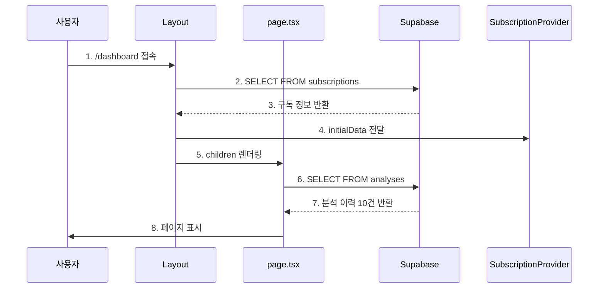
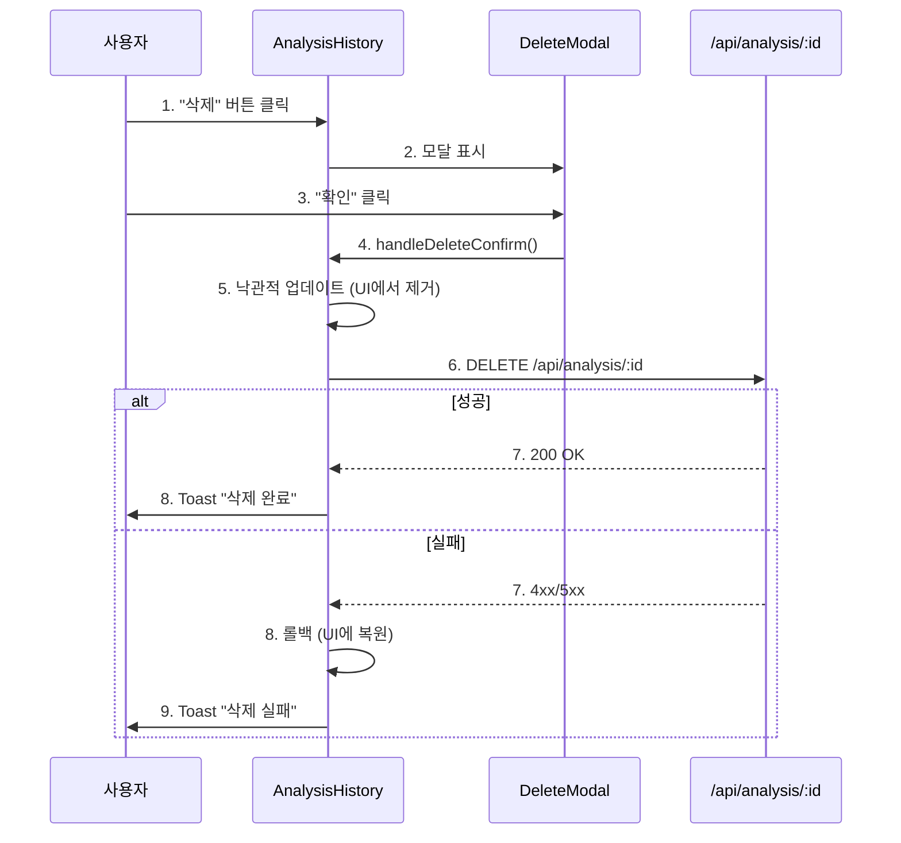

# 대시보드 페이지 구현 계획 (Dashboard Implementation Plan)

**페이지**: `/dashboard`
**문서 버전**: 1.0
**작성일**: 2025-10-26
**우선순위**: P0 (MVP 필수)

---

## 목차

1. [페이지 개요](#1-페이지-개요)
2. [현재 구현 상태 분석](#2-현재-구현-상태-분석)
3. [기능 요구사항](#3-기능-요구사항)
4. [데이터 흐름](#4-데이터-흐름)
5. [컴포넌트 구조](#5-컴포넌트-구조)
6. [API 설계](#6-api-설계)
7. [상태 관리](#7-상태-관리)
8. [구현 단계](#8-구현-단계)
9. [검증 체크리스트](#9-검증-체크리스트)

---

## 1. 페이지 개요

### 1.1 목적
사용자가 로그인 후 가장 먼저 보게 되는 메인 페이지로, 구독 상태 및 분석 이력을 한눈에 파악할 수 있는 대시보드 제공.

### 1.2 주요 기능
1. **구독 정보 요약**: 현재 플랜, 남은 쿼터, 구독 상태, 다음 결제일 표시
2. **분석 이력 조회**: 최근 10건의 사주 분석 이력 카드 형태로 표시
3. **빠른 액션**: "새 분석하기", "Pro 업그레이드" 등 주요 CTA 버튼
4. **분석 삭제**: 불필요한 분석 이력 삭제 기능

### 1.3 관련 문서
- **PRD**: `/docs/prd.md` - Section 3.2.2
- **User Flow**: `/docs/userflow.md` - UF-06
- **Use Case**: `/docs/usecases/6-analysis-history/spec.md`
- **Common Modules**: `/docs/common-modules.md`

---

## 2. 현재 구현 상태 분석

### 2.1 기존 파일 구조

```
src/app/(protected)/dashboard/
├── page.tsx                          # ✅ Server Component (메인 페이지)
└── _components/
    ├── subscription-card.tsx         # ✅ 구독 정보 카드
    ├── analysis-history.tsx          # ✅ 분석 이력 목록
    ├── analysis-card.tsx             # ✅ 개별 분석 카드
    ├── empty-state.tsx               # ✅ 빈 상태 UI
    └── delete-modal.tsx              # ✅ 삭제 확인 모달

src/features/analysis/backend/
└── route.ts                          # ✅ DELETE /api/analysis/:id

src/app/providers/
└── subscription-provider.tsx         # ✅ 구독 정보 Context
```

### 2.2 이미 구현된 기능

#### ✅ 완료된 기능
1. **Server Component 기반 데이터 조회**
   - Clerk 인증 확인 (`auth()`)
   - Supabase에서 최근 10건 분석 이력 조회
   - 에러 핸들링 (try-catch)

2. **구독 정보 표시 (SubscriptionCard)**
   - 플랜 타입 (Free/Pro)
   - 남은 쿼터
   - 구독 상태 (활성/취소/해지)
   - 다음 결제일 (Pro만)
   - Pro 업그레이드 버튼 (Free만)

3. **분석 이력 표시 (AnalysisHistory)**
   - 카드 형태로 10건 표시
   - Empty State (0건일 때)
   - 분석 삭제 기능 (낙관적 업데이트)
   - 삭제 확인 모달

4. **SubscriptionProvider (Context)**
   - 구독 정보 전역 상태 관리
   - `decrementQuota()`: 쿼터 차감 (낙관적 업데이트)
   - `refreshSubscription()`: 서버에서 최신 정보 조회

5. **분석 삭제 API**
   - `DELETE /api/analysis/:id`
   - Clerk 인증 확인
   - 권한 검증 (본인 분석만 삭제)
   - 에러 응답 (401, 404, 500)

#### ⚠️ 누락되거나 개선 필요한 부분

1. **구독 정보 조회 API 누락**
   - SubscriptionProvider가 `/api/subscription/status` 호출하지만 **API 미구현**
   - 대시보드 페이지가 Server Component라 Provider에 초기 데이터 전달 필요

2. **분석 이력 전체 보기 기능 없음**
   - PRD에서 "전체 보기" 링크 명시되었으나 미구현
   - 현재 10건 제한, 페이지네이션 없음

3. **재분석 기능 없음**
   - 분석 상세 페이지에서 "다시 분석하기" 버튼 없음 (P1 우선순위)

4. **로딩 상태 UI 없음**
   - 분석 삭제 중 로딩 인디케이터만 모달에 있음
   - 페이지 초기 로딩 상태 표시 없음 (Suspense 사용 권장)

5. **에러 페이지 부족**
   - 현재 에러 시 간단한 텍스트만 표시
   - 404/500 에러 페이지 필요

---

## 3. 기능 요구사항

### 3.1 Must Have (P0 - 이번 작업에서 완료)

#### 3.1.1 구독 정보 조회 API 구현
**엔드포인트**: `GET /api/subscription/status`

**요청**:
```typescript
// Header
Authorization: Bearer {clerk_jwt_token}
```

**응답 (성공)**:
```json
{
  "planType": "pro",
  "quota": 8,
  "status": "active",
  "nextPaymentDate": "2025-11-26"
}
```

**응답 (실패)**:
```json
{
  "error": "Unauthorized"
}
```

**구현 위치**: `src/features/subscription/backend/route.ts` (신규 생성)

---

#### 3.1.2 대시보드 페이지에서 SubscriptionProvider 연동
**현재 문제**:
- `page.tsx`가 Server Component라 Provider에 초기 데이터 전달 불가
- SubscriptionCard가 Provider 의존하지만 초기 데이터 없음

**해결 방안**:
1. **Layout에서 구독 정보 조회 후 Provider에 전달**
   - `src/app/(protected)/layout.tsx`에서 Supabase 쿼리
   - SubscriptionProvider에 `initialData` props 전달

2. **구현 예시**:
```typescript
// src/app/(protected)/layout.tsx
export default async function ProtectedLayout({ children }) {
  const { userId } = await auth();
  if (!userId) redirect('/sign-in');

  const supabase = await createSupabaseServerClient();
  const { data } = await supabase
    .from('subscriptions')
    .select('plan_type, quota, status, next_payment_date')
    .eq('clerk_user_id', userId)
    .single();

  return (
    <SubscriptionProvider initialData={data}>
      <Header />
      {children}
    </SubscriptionProvider>
  );
}
```

---

#### 3.1.3 Suspense 및 로딩 UI 추가
**현재 문제**:
- 데이터 로딩 중 사용자에게 피드백 없음

**해결 방안**:
```typescript
// src/app/(protected)/dashboard/loading.tsx
export default function DashboardLoading() {
  return (
    <div className="max-w-7xl mx-auto px-6 py-8">
      <Skeleton className="h-10 w-48 mb-8" />
      <Skeleton className="h-32 w-full mb-8" />
      <div className="grid grid-cols-1 md:grid-cols-2 lg:grid-cols-3 gap-4">
        <Skeleton className="h-64 w-full" />
        <Skeleton className="h-64 w-full" />
        <Skeleton className="h-64 w-full" />
      </div>
    </div>
  );
}
```

---

### 3.2 Should Have (P1 - 다음 스프린트)

1. **분석 이력 전체 보기 페이지**
   - 경로: `/dashboard/history`
   - 페이지네이션 (20건/페이지)
   - 필터링 (날짜 범위, 모델 타입)

2. **재분석 기능**
   - 분석 상세 페이지에서 "다시 분석하기" 버튼
   - 기존 입력값 유지하고 새 분석 페이지로 이동

3. **구독 상태별 안내 문구**
   - 취소 예정: "2025-11-26까지 Pro 혜택 유지"
   - 해지됨: "구독이 해지되었습니다. 재구독하시겠습니까?"

---

### 3.3 Could Have (P2 - 향후 개선)

1. **분석 통계 차트**
   - 월별 분석 횟수 그래프
   - 모델별 사용 비율

2. **북마크 기능**
   - 중요한 분석 즐겨찾기

3. **분석 검색**
   - 이름, 생년월일로 검색

---

## 4. 데이터 흐름

### 4.1 Server-Side Data Flow (초기 로딩)



### 4.2 Client-Side Data Flow (삭제)



---

## 5. 컴포넌트 구조

### 5.1 컴포넌트 계층

```
DashboardPage (Server Component)
├── SubscriptionCard (Client Component)
│   └── useSubscription() → SubscriptionProvider
├── AnalysisHistory (Client Component)
│   ├── EmptyState
│   ├── AnalysisCard[] (반복)
│   │   └── Button (삭제)
│   └── DeleteModal
│       ├── Button (취소)
│       └── Button (확인)
```

### 5.2 컴포넌트 책임 (단일 책임 원칙)

#### DashboardPage (`page.tsx`)
**책임**:
- Clerk 인증 확인
- Supabase에서 분석 이력 조회
- 하위 컴포넌트에 데이터 전달

**입력**: 없음 (Server Component)
**출력**: JSX (SubscriptionCard + AnalysisHistory)

---

#### SubscriptionCard
**책임**:
- 구독 정보 표시
- Pro 업그레이드 버튼 (Free 사용자만)

**Props**: 없음 (Provider에서 구독 정보 가져옴)

**의존성**:
- `useSubscription()` → SubscriptionProvider
- `useUser()` → Clerk

---

#### AnalysisHistory
**책임**:
- 분석 이력 목록 표시
- 삭제 기능 제공
- Empty State 처리

**Props**:
```typescript
interface AnalysisHistoryProps {
  initialAnalyses: Analysis[];
}
```

**State**:
```typescript
const [analyses, setAnalyses] = useState<Analysis[]>(initialAnalyses);
const [deleteTarget, setDeleteTarget] = useState<string | null>(null);
const [isDeleting, setIsDeleting] = useState(false);
```

---

#### AnalysisCard
**책임**:
- 개별 분석 정보 표시
- 상세 페이지 링크
- 삭제 버튼

**Props**:
```typescript
interface AnalysisCardProps {
  analysis: Analysis;
  onDelete: (id: string) => void;
}
```

---

#### DeleteModal
**책임**:
- 삭제 확인 UI
- 로딩 상태 표시

**Props**:
```typescript
interface DeleteModalProps {
  isOpen: boolean;
  isDeleting: boolean;
  onConfirm: () => void;
  onCancel: () => void;
}
```

---

#### EmptyState
**책임**:
- 분석 이력 0건일 때 안내 UI
- "첫 분석하기" CTA

**Props**: 없음

---

## 6. API 설계

### 6.1 구독 정보 조회 API (신규 구현 필요)

**엔드포인트**: `GET /api/subscription/status`

**파일 경로**: `src/features/subscription/backend/route.ts`

**구현 예시**:
```typescript
// src/features/subscription/backend/route.ts
import { Hono } from 'hono';
import type { AppEnv } from '@/backend/hono/context';

const subscriptionRouter = new Hono<AppEnv>();

// GET /api/subscription/status
subscriptionRouter.get('/api/subscription/status', async (c) => {
  const clerkUserId = c.get('clerkUserId');

  if (!clerkUserId) {
    return c.json({ error: 'Unauthorized' }, 401);
  }

  const supabase = c.get('supabase');

  try {
    const { data, error } = await supabase
      .from('subscriptions')
      .select('plan_type, quota, status, next_payment_date')
      .eq('clerk_user_id', clerkUserId)
      .single();

    if (error) {
      return c.json({ error: 'Subscription not found' }, 404);
    }

    return c.json({
      planType: data.plan_type,
      quota: data.quota,
      status: data.status,
      nextPaymentDate: data.next_payment_date,
    });
  } catch (error) {
    return c.json({ error: 'Internal server error' }, 500);
  }
});

export function registerSubscriptionRoutes(app: Hono<AppEnv>) {
  app.route('/', subscriptionRouter);
}

export default subscriptionRouter;
```

**등록 위치**: `src/backend/hono/app.ts`
```typescript
import { registerSubscriptionRoutes } from '@/features/subscription/backend/route';

export function createHonoApp() {
  const app = new Hono<AppEnv>();

  // ... 기존 미들웨어 ...

  registerSubscriptionRoutes(app);  // 추가

  return app;
}
```

---

### 6.2 분석 삭제 API (이미 구현됨)

**엔드포인트**: `DELETE /api/analysis/:id`

**파일 경로**: `src/features/analysis/backend/route.ts` ✅

**현재 구현 상태**: 완료
- Clerk 인증 확인
- 권한 검증 (본인 분석만)
- 에러 응답 (401, 404, 500)

---

## 7. 상태 관리

### 7.1 Server State (Supabase)

**데이터 소스**: `subscriptions`, `analyses` 테이블

**조회 시점**:
1. **초기 로딩**: Layout에서 구독 정보 조회
2. **페이지 로딩**: page.tsx에서 분석 이력 조회
3. **수동 새로고침**: `refreshSubscription()` 호출 시

---

### 7.2 Client State (React State)

#### SubscriptionProvider (전역 상태)
**관리 항목**:
- `subscription`: 구독 정보 객체
- `quota`: 남은 쿼터
- `planType`: 플랜 타입
- `status`: 구독 상태

**메서드**:
- `decrementQuota()`: 쿼터 차감 (새 분석 생성 시 호출)
- `refreshSubscription()`: 서버에서 최신 정보 조회

---

#### AnalysisHistory (로컬 상태)
**관리 항목**:
- `analyses`: 분석 이력 배열
- `deleteTarget`: 삭제 대상 ID
- `isDeleting`: 삭제 진행 중 여부

**상태 업데이트**:
1. **낙관적 업데이트**: 삭제 요청 전 UI에서 먼저 제거
2. **롤백**: API 실패 시 원래 상태로 복원
3. **Toast 알림**: 성공/실패 피드백

---

## 8. 구현 단계

### Phase 1: 구독 정보 API 구현 (1-2시간)

#### Step 1.1: 디렉토리 및 파일 생성
```bash
mkdir -p src/features/subscription/backend
touch src/features/subscription/backend/route.ts
touch src/features/subscription/backend/schema.ts
touch src/features/subscription/backend/error.ts
```

#### Step 1.2: API 라우터 구현
- `GET /api/subscription/status` 엔드포인트
- Clerk 인증 확인
- Supabase 쿼리
- 에러 핸들링

#### Step 1.3: Hono 앱에 등록
- `src/backend/hono/app.ts`에서 `registerSubscriptionRoutes()` 호출

#### Step 1.4: 테스트
```bash
# Postman 또는 curl로 테스트
curl -X GET http://localhost:3000/api/subscription/status \
  -H "Authorization: Bearer {clerk_token}"
```

---

### Phase 2: Layout에서 구독 정보 조회 및 Provider 연동 (1-2시간)

#### Step 2.1: Layout 수정
```typescript
// src/app/(protected)/layout.tsx
export default async function ProtectedLayout({ children }) {
  const { userId } = await auth();
  if (!userId) redirect('/sign-in');

  const supabase = await createSupabaseServerClient();
  const { data: subscription } = await supabase
    .from('subscriptions')
    .select('plan_type, quota, status, next_payment_date')
    .eq('clerk_user_id', userId)
    .single();

  const initialData = subscription ? {
    planType: subscription.plan_type,
    quota: subscription.quota,
    status: subscription.status,
    nextPaymentDate: subscription.next_payment_date,
  } : null;

  return (
    <SubscriptionProvider initialData={initialData}>
      <Header />
      <main className="min-h-screen bg-gray-50">
        {children}
      </main>
    </SubscriptionProvider>
  );
}
```

#### Step 2.2: Provider 타입 확인
- `SubscriptionProvider`의 `initialData` props 타입 확인
- 타입 불일치 시 수정

---

### Phase 3: 로딩 UI 추가 (30분)

#### Step 3.1: loading.tsx 생성
```bash
touch src/app/(protected)/dashboard/loading.tsx
```

#### Step 3.2: Skeleton UI 구현
```typescript
// src/app/(protected)/dashboard/loading.tsx
import { Skeleton } from '@/components/ui/skeleton';

export default function DashboardLoading() {
  return (
    <div className="max-w-7xl mx-auto px-6 py-8">
      <Skeleton className="h-10 w-48 mb-8" />

      {/* 구독 카드 Skeleton */}
      <Skeleton className="h-32 w-full mb-8" />

      {/* 분석 이력 Skeleton */}
      <Skeleton className="h-6 w-32 mb-4" />
      <div className="grid grid-cols-1 md:grid-cols-2 lg:grid-cols-3 gap-4">
        {[1, 2, 3].map(i => (
          <Skeleton key={i} className="h-64 w-full" />
        ))}
      </div>
    </div>
  );
}
```

---

### Phase 4: 에러 처리 개선 (30분)

#### Step 4.1: 에러 페이지 생성
```bash
touch src/app/(protected)/dashboard/error.tsx
```

#### Step 4.2: Error Boundary 구현
```typescript
'use client';

import { Button } from '@/components/ui/button';

export default function DashboardError({
  error,
  reset,
}: {
  error: Error;
  reset: () => void;
}) {
  return (
    <div className="max-w-7xl mx-auto px-6 py-8">
      <div className="text-center">
        <h1 className="text-2xl font-bold text-red-600 mb-4">
          오류가 발생했습니다
        </h1>
        <p className="text-gray-600 mb-6">
          {error.message || '데이터를 불러올 수 없습니다.'}
        </p>
        <Button onClick={reset}>다시 시도</Button>
      </div>
    </div>
  );
}
```

---

### Phase 5: 통합 테스트 및 QA (1시간)

#### Step 5.1: 수동 테스트
1. **Free 사용자 시나리오**
   - 로그인
   - 대시보드 접속
   - 구독 카드에서 "Pro 업그레이드" 버튼 확인
   - 분석 0건일 때 Empty State 확인

2. **Pro 사용자 시나리오**
   - 로그인
   - 대시보드 접속
   - 구독 카드에서 다음 결제일 확인
   - 분석 이력 10건 확인
   - 분석 삭제 테스트

3. **에러 시나리오**
   - Supabase 연결 끊기 → 에러 페이지 확인
   - 잘못된 UUID로 삭제 시도 → 404 응답 확인

#### Step 5.2: 성능 테스트
- Lighthouse 점수 확인 (TTI < 2초)
- 데이터 조회 시간 측정 (< 100ms)

---

## 9. 검증 체크리스트

### 9.1 기능 검증

- [ ] **구독 정보 API**
  - [ ] `GET /api/subscription/status` 정상 응답 (200)
  - [ ] 인증 없이 요청 시 401 반환
  - [ ] 존재하지 않는 사용자 시 404 반환

- [ ] **대시보드 페이지**
  - [ ] 로그인 사용자만 접근 가능 (비로그인 시 리다이렉트)
  - [ ] 구독 정보 정확히 표시
  - [ ] 분석 이력 최신순 10건 표시
  - [ ] 분석 0건 시 Empty State 표시

- [ ] **분석 삭제**
  - [ ] 삭제 확인 모달 표시
  - [ ] 낙관적 업데이트 (UI 즉시 반영)
  - [ ] API 성공 시 Toast "삭제 완료"
  - [ ] API 실패 시 롤백 + Toast "삭제 실패"

- [ ] **로딩 UI**
  - [ ] `loading.tsx` Skeleton 표시
  - [ ] 1초 이내 데이터 로딩 완료

- [ ] **에러 처리**
  - [ ] Supabase 에러 시 에러 페이지 표시
  - [ ] "다시 시도" 버튼 동작 확인

---

### 9.2 UI/UX 검증

- [ ] **반응형 디자인**
  - [ ] 모바일 (< 768px): 1열 그리드
  - [ ] 태블릿 (768-1024px): 2열 그리드
  - [ ] 데스크톱 (> 1024px): 3열 그리드

- [ ] **접근성**
  - [ ] 키보드 네비게이션 가능
  - [ ] 스크린 리더 친화적 (aria-label)

- [ ] **색상 대비**
  - [ ] WCAG AA 준수 (4.5:1)

---

### 9.3 성능 검증

- [ ] **Lighthouse 점수**
  - [ ] Performance: 90+ (TTI < 2초)
  - [ ] Accessibility: 95+
  - [ ] Best Practices: 90+

- [ ] **데이터 조회**
  - [ ] 구독 정보 조회 < 50ms
  - [ ] 분석 이력 조회 < 100ms

---

### 9.4 보안 검증

- [ ] **인증**
  - [ ] 비로그인 사용자 접근 차단
  - [ ] 다른 사용자 분석 삭제 불가 (403)

- [ ] **SQL Injection**
  - [ ] Parameterized Query 사용 확인

---

## 10. 주의사항

### 10.1 기존 코드 수정 최소화
- SubscriptionProvider, AnalysisHistory 등 **기존 컴포넌트는 수정하지 않음**
- Layout에서 initialData 전달만 추가

### 10.2 타입 안전성
- 모든 API 응답은 Zod 스키마 검증
- `any` 타입 사용 금지

### 10.3 에러 핸들링
- 모든 Supabase 쿼리는 try-catch
- 사용자 친화적 에러 메시지

### 10.4 성능
- Server Component 최대 활용 (데이터 조회)
- Client Component 최소화 (인터랙티브 UI만)

---

## 11. 완료 기준 (Definition of Done)

1. ✅ 구독 정보 API 구현 완료 (`GET /api/subscription/status`)
2. ✅ Layout에서 구독 정보 조회 및 Provider 연동
3. ✅ 로딩 UI (`loading.tsx`) 구현
4. ✅ 에러 페이지 (`error.tsx`) 구현
5. ✅ 수동 테스트 통과 (Free/Pro 사용자 시나리오)
6. ✅ Lighthouse 성능 점수 90+
7. ✅ ESLint 에러 없음
8. ✅ TypeScript 빌드 성공 (`npm run build`)

---

## 12. 다음 단계 (Next Steps)

1. **분석 이력 전체 보기 페이지** (`/dashboard/history`)
   - 페이지네이션 (20건/페이지)
   - 필터링 (날짜 범위, 모델 타입)

2. **재분석 기능**
   - 분석 상세 페이지에서 "다시 분석하기" 버튼

3. **구독 상태별 안내 문구**
   - 취소 예정, 해지됨 상태 상세 안내

---

**문서 버전**: 1.0
**최종 수정일**: 2025-10-26
**검토자**: -
**참고 문서**:
- `/docs/prd.md`
- `/docs/userflow.md`
- `/docs/usecases/6-analysis-history/spec.md`
- `/docs/common-modules.md`
