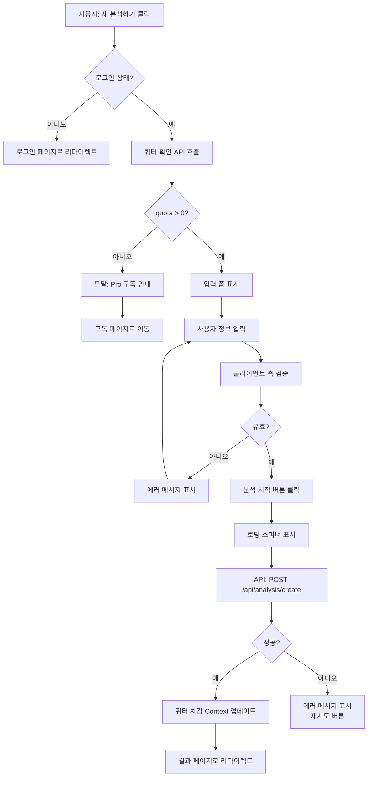

# 새 분석 페이지 구현 계획 (New Analysis Page Implementation Plan)

**페이지**: `/analysis/new`
**문서 버전**: 1.0
**작성일**: 2025-10-25
**목적**: 사주 정보 입력 및 Gemini AI 분석 실행

---

## 목차
1. [페이지 개요](#1-페이지-개요)
2. [접근 조건 및 권한](#2-접근-조건-및-권한)
3. [폼 필드 및 유효성 검증](#3-폼-필드-및-유효성-검증)
4. [쿼터 확인 및 차감](#4-쿼터-확인-및-차감)
5. [Gemini API 호출](#5-gemini-api-호출)
6. [로딩 상태 처리](#6-로딩-상태-처리)
7. [에러 처리](#7-에러-처리)
8. [파일 구조](#8-파일-구조)
9. [구현 단계](#9-구현-단계)
10. [테스트 계획](#10-테스트-계획)

---

## 1. 페이지 개요

### 1.1 페이지 정보

| 항목 | 내용 |
|------|------|
| **경로** | `/analysis/new` |
| **접근 조건** | 로그인 필수 + 쿼터 > 0 |
| **주요 기능** | 사주 정보 입력 → Gemini 분석 → 결과 저장 → 쿼터 차감 |
| **성공 시** | `/analysis/:id` 페이지로 리다이렉트 |

### 1.2 사용자 플로우



### 1.3 핵심 요구사항

**기능 요구사항**:
- ✅ 로그인하지 않은 사용자는 로그인 페이지로 리다이렉트
- ✅ 쿼터가 0인 경우 Pro 구독 안내 모달 표시
- ✅ 필수 필드: 이름, 생년월일, 성별
- ✅ 선택 필드: 출생시간
- ✅ React Hook Form + Zod 기반 유효성 검증
- ✅ Gemini API 호출 (Free: Flash / Pro: Pro 모델)
- ✅ 분석 성공 시 쿼터 차감 (낙관적 업데이트)
- ✅ 분석 결과를 `analyses` 테이블에 저장
- ✅ 실패 시 쿼터 롤백 (서버에서 재조회)

**비기능 요구사항**:
- ⚡ 분석 응답 시간: < 30초 (p95)
- ⚡ 페이지 로드 시간: < 1초
- 🔒 모든 입력값 서버 측 재검증
- 📱 모바일 반응형 디자인

---

## 2. 접근 조건 및 권한

### 2.1 인증 확인

**구현 방식**: Clerk `useAuth()` 훅

```typescript
// app/analysis/new/page.tsx
'use client';

import { useAuth } from '@clerk/nextjs';
import { useRouter } from 'next/navigation';
import { useEffect } from 'react';

export default function NewAnalysisPage() {
  const { isSignedIn, isLoaded } = useAuth();
  const router = useRouter();

  // 비로그인 사용자 리다이렉트
  useEffect(() => {
    if (isLoaded && !isSignedIn) {
      router.push('/sign-in?redirect_url=/analysis/new');
    }
  }, [isLoaded, isSignedIn, router]);

  // 로딩 중
  if (!isLoaded) {
    return <LoadingSpinner />;
  }

  // 비로그인 상태 (리다이렉트 대기)
  if (!isSignedIn) {
    return null;
  }

  // 정상 진입
  return <AnalysisForm />;
}
```

### 2.2 쿼터 확인

**구현 방식**: SubscriptionContext

```typescript
import { useSubscription } from '@/app/providers/subscription-provider';
import { QuotaExhaustedModal } from './quota-exhausted-modal';

function AnalysisForm() {
  const { quota, planType } = useSubscription();
  const [showQuotaModal, setShowQuotaModal] = useState(false);

  useEffect(() => {
    if (quota <= 0) {
      setShowQuotaModal(true);
    }
  }, [quota]);

  if (showQuotaModal) {
    return (
      <QuotaExhaustedModal
        onClose={() => router.push('/dashboard')}
        onSubscribe={() => router.push('/subscription')}
      />
    );
  }

  return (
    <div>
      {/* 쿼터 표시 */}
      <div className="mb-4 text-sm text-gray-600">
        남은 횟수: <span className="font-bold">{quota}회</span> |
        플랜: <span className="font-bold">{planType === 'pro' ? 'Pro' : '무료'}</span>
      </div>

      {/* 입력 폼 */}
      <form onSubmit={handleSubmit}>
        {/* ... */}
      </form>
    </div>
  );
}
```

### 2.3 QuotaExhaustedModal 컴포넌트

```typescript
// components/quota-exhausted-modal.tsx
'use client';

import {
  Dialog,
  DialogContent,
  DialogDescription,
  DialogFooter,
  DialogHeader,
  DialogTitle,
} from '@/components/ui/dialog';
import { Button } from '@/components/ui/button';

interface QuotaExhaustedModalProps {
  onClose: () => void;
  onSubscribe: () => void;
}

export function QuotaExhaustedModal({ onClose, onSubscribe }: QuotaExhaustedModalProps) {
  return (
    <Dialog open onOpenChange={onClose}>
      <DialogContent>
        <DialogHeader>
          <DialogTitle>사용 가능한 횟수가 없습니다</DialogTitle>
          <DialogDescription>
            무료 3회 체험이 모두 소진되었습니다.
            <br />
            Pro 구독 시 월 10회 분석과 고급 AI 모델을 이용하실 수 있습니다.
          </DialogDescription>
        </DialogHeader>
        <DialogFooter>
          <Button variant="outline" onClick={onClose}>
            대시보드로 돌아가기
          </Button>
          <Button onClick={onSubscribe}>Pro 구독하기</Button>
        </DialogFooter>
      </DialogContent>
    </Dialog>
  );
}
```

---

## 3. 폼 필드 및 유효성 검증

### 3.1 입력 필드 정의

| 필드명 | 타입 | 필수 여부 | 검증 규칙 | 에러 메시지 |
|--------|------|----------|----------|-----------|
| `name` | `string` | ✅ 필수 | 1-20자 한글/영문 | "이름을 입력해주세요" |
| `birthDate` | `string` | ✅ 필수 | YYYY-MM-DD, 1900-현재 | "올바른 생년월일을 입력해주세요" |
| `birthTime` | `string` | ⚪ 선택 | HH:MM (00:00-23:59) | "올바른 시간 형식을 입력해주세요" |
| `gender` | `'male' \| 'female'` | ✅ 필수 | 선택 필수 | "성별을 선택해주세요" |

### 3.2 Zod 스키마 정의

**파일**: `src/lib/validation/schemas.ts` (공통 모듈에서 제공)

```typescript
// /lib/validation/schemas.ts (이미 구현됨)
import { z } from 'zod';

export const nameSchema = z
  .string()
  .min(1, '이름을 입력해주세요')
  .max(20, '이름은 20자 이내여야 합니다');

export const birthDateSchema = z
  .string()
  .regex(/^\d{4}-\d{2}-\d{2}$/, '올바른 날짜 형식(YYYY-MM-DD)을 입력해주세요')
  .refine(
    (date) => {
      const d = new Date(date);
      const now = new Date();
      return d.getFullYear() >= 1900 && d <= now;
    },
    '1900년 이후부터 오늘까지의 날짜를 입력해주세요'
  );

export const birthTimeSchema = z
  .string()
  .regex(/^\d{2}:\d{2}$/, '올바른 시간 형식(HH:MM)을 입력해주세요')
  .optional();

export const genderSchema = z.enum(['male', 'female'], {
  errorMap: () => ({ message: '성별을 선택해주세요' }),
});

// 통합 스키마
export const sajuInputSchema = z.object({
  name: nameSchema,
  birthDate: birthDateSchema,
  birthTime: birthTimeSchema,
  gender: genderSchema,
});

export type SajuInput = z.infer<typeof sajuInputSchema>;
```

### 3.3 React Hook Form 통합

```typescript
// app/analysis/new/analysis-form.tsx
'use client';

import { useForm } from 'react-hook-form';
import { zodResolver } from '@hookform/resolvers/zod';
import { sajuInputSchema, type SajuInput } from '@/lib/validation/schemas';
import { Button } from '@/components/ui/button';
import { Input } from '@/components/ui/input';
import { Label } from '@/components/ui/label';
import { RadioGroup, RadioGroupItem } from '@/components/ui/radio-group';
import { toast } from 'sonner';

export function AnalysisForm() {
  const {
    register,
    handleSubmit,
    formState: { errors, isSubmitting },
  } = useForm<SajuInput>({
    resolver: zodResolver(sajuInputSchema),
  });

  const onSubmit = async (data: SajuInput) => {
    // API 호출 로직 (후술)
  };

  return (
    <form onSubmit={handleSubmit(onSubmit)} className="space-y-6">
      {/* 이름 */}
      <div>
        <Label htmlFor="name">이름 *</Label>
        <Input
          id="name"
          {...register('name')}
          placeholder="홍길동"
          disabled={isSubmitting}
        />
        {errors.name && (
          <p className="text-sm text-red-600 mt-1">{errors.name.message}</p>
        )}
      </div>

      {/* 생년월일 */}
      <div>
        <Label htmlFor="birthDate">생년월일 *</Label>
        <Input
          id="birthDate"
          type="date"
          {...register('birthDate')}
          disabled={isSubmitting}
        />
        {errors.birthDate && (
          <p className="text-sm text-red-600 mt-1">{errors.birthDate.message}</p>
        )}
      </div>

      {/* 출생시간 (선택) */}
      <div>
        <Label htmlFor="birthTime">출생시간 (선택)</Label>
        <Input
          id="birthTime"
          type="time"
          {...register('birthTime')}
          placeholder="14:30"
          disabled={isSubmitting}
        />
        {errors.birthTime && (
          <p className="text-sm text-red-600 mt-1">{errors.birthTime.message}</p>
        )}
        <p className="text-xs text-gray-500 mt-1">
          출생시간을 모르시면 비워두세요
        </p>
      </div>

      {/* 성별 */}
      <div>
        <Label>성별 *</Label>
        <RadioGroup {...register('gender')} disabled={isSubmitting}>
          <div className="flex items-center space-x-2">
            <RadioGroupItem value="male" id="male" />
            <Label htmlFor="male">남성</Label>
          </div>
          <div className="flex items-center space-x-2">
            <RadioGroupItem value="female" id="female" />
            <Label htmlFor="female">여성</Label>
          </div>
        </RadioGroup>
        {errors.gender && (
          <p className="text-sm text-red-600 mt-1">{errors.gender.message}</p>
        )}
      </div>

      {/* 제출 버튼 */}
      <Button type="submit" disabled={isSubmitting} className="w-full">
        {isSubmitting ? '분석 중...' : '분석 시작 (쿼터 1회 차감)'}
      </Button>

      {/* 안내 메시지 */}
      <p className="text-xs text-gray-500 text-center">
        💡 Pro 구독 시 월 10회 + 고급 AI 모델 이용 가능
      </p>
    </form>
  );
}
```

---

## 4. 쿼터 확인 및 차감

### 4.1 쿼터 확인 (클라이언트)

**시점**: 페이지 로드 시 + 폼 제출 전

```typescript
import { useSubscription } from '@/app/providers/subscription-provider';

function AnalysisForm() {
  const { quota, decrementQuota, refreshSubscription } = useSubscription();

  const onSubmit = async (data: SajuInput) => {
    // 1. 제출 전 쿼터 재확인 (동시 요청 방지)
    if (quota <= 0) {
      toast.error('사용 가능한 횟수가 없습니다');
      return;
    }

    try {
      // 2. API 호출
      const result = await fetch('/api/analysis/create', {
        method: 'POST',
        headers: { 'Content-Type': 'application/json' },
        body: JSON.stringify(data),
      });

      if (!result.ok) {
        const error = await result.json();
        throw new Error(error.error || '분석 중 오류가 발생했습니다');
      }

      const response = await result.json();

      // 3. 낙관적 업데이트 (즉시 UI 반영)
      decrementQuota();

      // 4. 성공 메시지 및 리다이렉트
      toast.success('분석이 완료되었습니다!');
      router.push(`/analysis/${response.analysisId}`);

    } catch (error) {
      // 5. 실패 시 쿼터 복구 (서버에서 재조회)
      await refreshSubscription();
      toast.error(error.message);
    }
  };
}
```

### 4.2 쿼터 차감 (서버)

**파일**: `src/app/api/analysis/create/route.ts`

```typescript
import { NextRequest, NextResponse } from 'next/server';
import { auth } from '@clerk/nextjs/server';
import { createSupabaseServerClient } from '@/lib/supabase/server-client';
import { sajuInputSchema } from '@/lib/validation/schemas';
import { analyzeWithGemini } from '@/lib/gemini/client';
import { generateSajuPrompt } from '@/lib/gemini/prompts';

export async function POST(req: NextRequest) {
  try {
    // 1. 인증 확인
    const { userId } = auth();
    if (!userId) {
      return NextResponse.json(
        { error: '로그인이 필요합니다' },
        { status: 401 }
      );
    }

    // 2. 요청 데이터 파싱 및 검증
    const body = await req.json();
    const validationResult = sajuInputSchema.safeParse(body);

    if (!validationResult.success) {
      return NextResponse.json(
        {
          error: '입력값이 올바르지 않습니다',
          details: validationResult.error.errors
        },
        { status: 400 }
      );
    }

    const input = validationResult.data;

    // 3. 쿼터 확인 및 차감 + 분석 저장 (원자적 트랜잭션)
    const supabase = createSupabaseServerClient();

    // Gemini 분석 실행
    const { data: subscription } = await supabase
      .from('subscriptions')
      .select('quota, plan_type, status')
      .eq('clerk_user_id', userId)
      .single();

    if (!subscription) {
      return NextResponse.json(
        { error: '구독 정보를 찾을 수 없습니다' },
        { status: 404 }
      );
    }

    if (subscription.quota <= 0) {
      return NextResponse.json(
        { error: '사용 가능한 횟수가 없습니다. Pro 구독이 필요합니다.' },
        { status: 403 }
      );
    }

    if (subscription.status === 'terminated') {
      return NextResponse.json(
        { error: '해지된 구독입니다. 재구독이 필요합니다.' },
        { status: 403 }
      );
    }

    // 4. Gemini API 호출
    const prompt = generateSajuPrompt(input);
    const isPro = subscription.plan_type === 'pro';

    const analysisResult = await analyzeWithGemini(prompt, isPro);

    // 5. Supabase RPC: 쿼터 차감 + 분석 저장 (트랜잭션)
    const { data: analysisId, error: rpcError } = await supabase.rpc(
      'decrement_quota_and_insert_analysis',
      {
        p_clerk_user_id: userId,
        p_name: input.name,
        p_birth_date: input.birthDate,
        p_birth_time: input.birthTime || null,
        p_gender: input.gender,
        p_result_markdown: analysisResult,
        p_model_used: isPro ? 'gemini-2.5-pro' : 'gemini-2.5-flash',
      }
    );

    if (rpcError) {
      console.error('RPC Error:', rpcError);

      if (rpcError.message?.includes('Insufficient quota')) {
        return NextResponse.json(
          { error: '사용 가능한 횟수가 없습니다' },
          { status: 403 }
        );
      }

      throw rpcError;
    }

    // 6. 성공 응답
    return NextResponse.json({
      success: true,
      analysisId: analysisId,
    });

  } catch (error) {
    console.error('Analysis creation error:', error);

    // Gemini API 오류
    if (error.message?.includes('Gemini')) {
      return NextResponse.json(
        { error: '분석 중 오류가 발생했습니다. 잠시 후 다시 시도해주세요.' },
        { status: 500 }
      );
    }

    // 기타 서버 오류
    return NextResponse.json(
      { error: '서버 오류가 발생했습니다' },
      { status: 500 }
    );
  }
}
```

---

## 5. Gemini API 호출

### 5.1 Gemini 클라이언트

**파일**: `src/lib/gemini/client.ts` (공통 모듈에서 제공)

```typescript
// /lib/gemini/client.ts
import { GoogleGenerativeAI } from '@google/generative-ai';

const genAI = new GoogleGenerativeAI(process.env.GEMINI_API_KEY!);

export async function analyzeWithGemini(
  prompt: string,
  isPro: boolean
): Promise<string> {
  const model = isPro ? 'gemini-2.5-pro' : 'gemini-2.5-flash';
  const geminiModel = genAI.getGenerativeModel({ model });

  try {
    const result = await geminiModel.generateContent(prompt);
    const response = await result.response;
    return response.text();
  } catch (error) {
    console.error('Gemini API Error:', error);
    throw new Error('Gemini API 호출 실패');
  }
}
```

### 5.2 프롬프트 생성기

**파일**: `src/lib/gemini/prompts.ts` (공통 모듈에서 제공)

```typescript
// /lib/gemini/prompts.ts
import type { SajuInput } from '@/lib/validation/schemas';

export function generateSajuPrompt(input: SajuInput): string {
  return `당신은 20년 경력의 전문 사주팔자 상담사입니다.

**입력 정보**:
- 성함: ${input.name}
- 생년월일: ${input.birthDate}
- 출생시간: ${input.birthTime || '미상'}
- 성별: ${input.gender === 'male' ? '남성' : '여성'}

**분석 요구사항**:
1️⃣ 천간(天干)과 지지(地支) 계산
2️⃣ 오행(五行) 분석 (목, 화, 토, 금, 수)
3️⃣ 대운(大運)과 세운(歲運) 해석
4️⃣ 전반적인 성격, 재운, 건강운, 연애운 분석

**출력 형식**: 마크다운 (제목, 소제목, 리스트 활용)

**금지 사항**:
- 의료·법률 조언 금지
- 확정적 미래 예측 금지 (가능성으로 표현)
- 부정적·공격적 표현 금지

이제 분석을 시작해주세요.`;
}
```

### 5.3 모델 선택 로직

```typescript
// 서버 측 (API Route)
const { data: subscription } = await supabase
  .from('subscriptions')
  .select('plan_type')
  .eq('clerk_user_id', userId)
  .single();

const isPro = subscription?.plan_type === 'pro';

// Free 플랜: gemini-2.5-flash (빠르지만 간단)
// Pro 플랜: gemini-2.5-pro (느리지만 정확)
const analysisResult = await analyzeWithGemini(prompt, isPro);
```

---

## 6. 로딩 상태 처리

### 6.1 로딩 UI

```typescript
// app/analysis/new/analysis-form.tsx
import { Loader2 } from 'lucide-react';

function AnalysisForm() {
  const { isSubmitting } = formState;

  return (
    <form onSubmit={handleSubmit(onSubmit)}>
      {/* 입력 필드들... */}

      {/* 로딩 중 오버레이 */}
      {isSubmitting && (
        <div className="fixed inset-0 bg-black/50 flex items-center justify-center z-50">
          <div className="bg-white rounded-xl p-8 text-center">
            <Loader2 className="w-16 h-16 animate-spin text-purple-600 mx-auto mb-4" />
            <h3 className="text-xl font-semibold mb-2">분석 중...</h3>
            <p className="text-gray-600">
              AI가 사주를 분석하고 있습니다
              <br />
              약 15-30초 소요됩니다
            </p>
          </div>
        </div>
      )}

      <Button type="submit" disabled={isSubmitting} className="w-full">
        {isSubmitting ? (
          <>
            <Loader2 className="w-4 h-4 animate-spin mr-2" />
            분석 중...
          </>
        ) : (
          '분석 시작 (쿼터 1회 차감)'
        )}
      </Button>
    </form>
  );
}
```

### 6.2 로딩 메시지 변형

```typescript
const [loadingMessage, setLoadingMessage] = useState('분석 중...');

useEffect(() => {
  if (!isSubmitting) return;

  const messages = [
    '분석 중...',
    'AI가 사주를 분석하고 있습니다...',
    '천간과 지지를 계산하고 있습니다...',
    '오행 균형을 분석하고 있습니다...',
    '거의 완료되었습니다...',
  ];

  let index = 0;
  const interval = setInterval(() => {
    index = (index + 1) % messages.length;
    setLoadingMessage(messages[index]);
  }, 5000);

  return () => clearInterval(interval);
}, [isSubmitting]);
```

---

## 7. 에러 처리

### 7.1 에러 타입 및 메시지

| 에러 유형 | 상황 | 사용자 메시지 | HTTP 상태 | 복구 방법 |
|----------|------|-------------|----------|----------|
| **인증 오류** | 미로그인 상태 | "로그인이 필요합니다" | 401 | 로그인 페이지로 리다이렉트 |
| **쿼터 부족** | quota = 0 | "사용 가능한 횟수가 없습니다" | 403 | Pro 구독 유도 모달 |
| **유효성 오류** | 잘못된 입력 | 필드별 에러 메시지 | 400 | 필드 하이라이트 + 재입력 |
| **Gemini API 오류** | API 실패 | "분석 중 오류가 발생했습니다" | 500 | 재시도 버튼 제공 |
| **네트워크 오류** | 타임아웃 | "네트워크 연결을 확인해주세요" | - | 재시도 버튼 제공 |
| **DB 오류** | Supabase 장애 | "일시적인 오류입니다" | 500 | 재시도 버튼 제공 |

### 7.2 에러 처리 로직

```typescript
const onSubmit = async (data: SajuInput) => {
  try {
    const result = await fetch('/api/analysis/create', {
      method: 'POST',
      headers: { 'Content-Type': 'application/json' },
      body: JSON.stringify(data),
    });

    // HTTP 에러 응답
    if (!result.ok) {
      const error = await result.json();

      switch (result.status) {
        case 401:
          toast.error('로그인이 필요합니다');
          router.push('/sign-in');
          return;

        case 403:
          toast.error('사용 가능한 횟수가 없습니다');
          setShowQuotaModal(true);
          return;

        case 400:
          toast.error(error.error || '입력값을 확인해주세요');
          return;

        case 500:
        default:
          toast.error('분석 중 오류가 발생했습니다. 잠시 후 다시 시도해주세요.');
          return;
      }
    }

    // 성공 처리
    const response = await result.json();
    decrementQuota();
    toast.success('분석이 완료되었습니다!');
    router.push(`/analysis/${response.analysisId}`);

  } catch (error) {
    // 네트워크 오류 또는 예상치 못한 오류
    console.error('Unexpected error:', error);

    // 쿼터 복구 (서버에서 재조회)
    await refreshSubscription();

    toast.error('네트워크 연결을 확인해주세요');
  }
};
```

### 7.3 재시도 로직

```typescript
import { Button } from '@/components/ui/button';

function ErrorRetry({ error, onRetry }: { error: string; onRetry: () => void }) {
  return (
    <div className="text-center py-8">
      <p className="text-red-600 mb-4">{error}</p>
      <Button onClick={onRetry} variant="outline">
        다시 시도
      </Button>
    </div>
  );
}
```

---

## 8. 파일 구조

```
src/
├── app/
│   ├── analysis/
│   │   └── new/
│   │       ├── page.tsx                  # 메인 페이지 (Client Component)
│   │       ├── analysis-form.tsx         # 입력 폼 컴포넌트
│   │       └── quota-exhausted-modal.tsx # 쿼터 소진 모달
│   ├── api/
│   │   └── analysis/
│   │       └── create/
│   │           └── route.ts              # POST /api/analysis/create
│   └── providers/
│       └── subscription-provider.tsx     # (공통 모듈에서 제공)
├── lib/
│   ├── gemini/
│   │   ├── client.ts                     # (공통 모듈에서 제공)
│   │   └── prompts.ts                    # (공통 모듈에서 제공)
│   ├── validation/
│   │   └── schemas.ts                    # (공통 모듈에서 제공)
│   └── supabase/
│       └── server-client.ts              # (공통 모듈에서 제공)
└── components/
    └── ui/
        ├── button.tsx                     # (shadcn/ui)
        ├── input.tsx                      # (shadcn/ui)
        ├── label.tsx                      # (shadcn/ui)
        ├── radio-group.tsx                # (shadcn/ui)
        └── dialog.tsx                     # (shadcn/ui)
```

**신규 생성 파일**:
- `app/analysis/new/page.tsx`
- `app/analysis/new/analysis-form.tsx`
- `app/analysis/new/quota-exhausted-modal.tsx`
- `app/api/analysis/create/route.ts`

**공통 모듈 의존성** (이미 구현됨):
- `lib/gemini/client.ts`
- `lib/gemini/prompts.ts`
- `lib/validation/schemas.ts`
- `lib/supabase/server-client.ts`
- `app/providers/subscription-provider.tsx`

---

## 9. 구현 단계

### Phase 1: 페이지 구조 및 접근 제어 (1일차)

**목표**: 인증 및 쿼터 확인 구현

**작업 내용**:
1. ✅ `app/analysis/new/page.tsx` 생성
   - Clerk `useAuth()` 훅으로 인증 확인
   - 미로그인 시 로그인 페이지로 리다이렉트
2. ✅ `useSubscription()` 훅으로 쿼터 확인
   - quota > 0: 폼 표시
   - quota = 0: QuotaExhaustedModal 표시
3. ✅ `quota-exhausted-modal.tsx` 컴포넌트 생성
   - shadcn/ui Dialog 사용
   - "Pro 구독하기" 버튼 → `/subscription` 이동

**검증 기준**:
- [ ] 비로그인 상태에서 `/analysis/new` 접근 시 로그인 페이지로 리다이렉트
- [ ] quota = 0인 사용자는 모달 표시
- [ ] quota > 0인 사용자는 폼 표시

---

### Phase 2: 입력 폼 구현 (1일차)

**목표**: React Hook Form + Zod 기반 폼 구현

**작업 내용**:
1. ✅ `app/analysis/new/analysis-form.tsx` 생성
2. ✅ React Hook Form 설정
   - `useForm()` 훅
   - `zodResolver(sajuInputSchema)`
3. ✅ 입력 필드 구현
   - 이름 (Input)
   - 생년월일 (Input type="date")
   - 출생시간 (Input type="time", 선택)
   - 성별 (RadioGroup)
4. ✅ 에러 메시지 표시
   - 필드별 에러 하이라이트
   - 한글 에러 메시지
5. ✅ 제출 버튼
   - 로딩 중 disabled
   - 스피너 표시

**검증 기준**:
- [ ] 모든 필수 필드 누락 시 에러 표시
- [ ] 잘못된 날짜 형식 입력 시 에러 표시
- [ ] 1900년 이전 날짜 입력 시 에러 표시
- [ ] 출생시간은 선택 사항 (비워도 제출 가능)

---

### Phase 3: API 연동 및 Gemini 호출 (2일차)

**목표**: 서버 측 분석 API 구현

**작업 내용**:
1. ✅ `app/api/analysis/create/route.ts` 생성
2. ✅ POST 핸들러 구현
   - Clerk JWT 검증
   - 요청 데이터 Zod 검증
   - 쿼터 확인 (Supabase)
3. ✅ Gemini API 호출
   - 프롬프트 생성 (`generateSajuPrompt`)
   - 모델 선택 (Free: Flash / Pro: Pro)
   - 분석 실행 (`analyzeWithGemini`)
4. ✅ Supabase RPC 호출
   - `decrement_quota_and_insert_analysis` 실행
   - 트랜잭션으로 쿼터 차감 + 분석 저장
5. ✅ 에러 핸들링
   - 쿼터 부족: 403
   - Gemini API 실패: 500
   - 기타 오류: 500

**검증 기준**:
- [ ] 미로그인 상태로 API 호출 시 401 반환
- [ ] quota = 0인 상태로 API 호출 시 403 반환
- [ ] 잘못된 입력값 전송 시 400 반환
- [ ] 정상 요청 시 Gemini 분석 실행 및 저장 성공
- [ ] 분석 성공 시 `analysisId` 반환

---

### Phase 4: 클라이언트 연동 및 상태 관리 (2일차)

**목표**: 폼 제출 → API 호출 → Context 업데이트

**작업 내용**:
1. ✅ `analysis-form.tsx`에서 API 호출
   - `onSubmit` 함수 구현
   - `fetch('/api/analysis/create', { method: 'POST', ... })`
2. ✅ 낙관적 업데이트
   - API 호출 후 즉시 `decrementQuota()` 실행
   - 실패 시 `refreshSubscription()` 복구
3. ✅ 성공 처리
   - toast.success('분석이 완료되었습니다!')
   - router.push(`/analysis/${analysisId}`)
4. ✅ 에러 처리
   - HTTP 상태별 분기
   - 네트워크 오류 처리
   - toast.error() 메시지 표시

**검증 기준**:
- [ ] 분석 성공 시 쿼터 1 감소 (UI 즉시 반영)
- [ ] 분석 성공 시 결과 페이지로 리다이렉트
- [ ] 분석 실패 시 쿼터 복구 (서버에서 재조회)
- [ ] 네트워크 오류 시 에러 메시지 표시

---

### Phase 5: 로딩 상태 및 UI 개선 (3일차)

**목표**: 사용자 경험 개선

**작업 내용**:
1. ✅ 로딩 오버레이 구현
   - 분석 중 전체 화면 오버레이
   - 로딩 스피너 + 메시지
2. ✅ 로딩 메시지 변형
   - 5초마다 메시지 변경
3. ✅ 쿼터 표시 UI
   - 남은 횟수 명확히 표시
   - 현재 플랜 표시 (Free/Pro)
4. ✅ 반응형 디자인
   - 모바일 최적화
   - 테블릿 레이아웃
5. ✅ 접근성 개선
   - ARIA 라벨 추가
   - 키보드 네비게이션

**검증 기준**:
- [ ] 모바일에서 입력 편의성 확인
- [ ] 로딩 중 사용자가 다른 페이지로 이동할 수 없음
- [ ] 스크린 리더로 폼 읽기 가능
- [ ] 키보드만으로 폼 제출 가능

---

### Phase 6: 에러 시나리오 테스트 (3일차)

**목표**: 모든 에러 케이스 검증

**작업 내용**:
1. ✅ 쿼터 소진 시나리오
   - quota = 0인 사용자 테스트
   - Pro 구독 모달 표시 확인
2. ✅ Gemini API 오류 시뮬레이션
   - 잘못된 API 키로 테스트
   - 에러 메시지 및 재시도 버튼 확인
3. ✅ 네트워크 오류 시뮬레이션
   - 개발자 도구에서 Offline 모드
   - 네트워크 오류 메시지 확인
4. ✅ 동시 요청 경합 테스트
   - quota = 1인 상태에서 2개 탭 동시 제출
   - 한 요청만 성공, 다른 요청은 403 확인

**검증 기준**:
- [ ] 모든 에러 케이스에서 적절한 메시지 표시
- [ ] 에러 발생 시 쿼터 차감 안 됨
- [ ] 재시도 버튼 정상 작동
- [ ] 동시 요청 시 하나만 성공

---

## 10. 테스트 계획

### 10.1 단위 테스트

**테스트 대상**: Zod 스키마, 프롬프트 생성 함수

```typescript
// /lib/validation/schemas.test.ts
import { sajuInputSchema } from './schemas';

describe('sajuInputSchema', () => {
  it('should accept valid input', () => {
    const input = {
      name: '홍길동',
      birthDate: '1990-05-15',
      birthTime: '14:30',
      gender: 'male',
    };

    const result = sajuInputSchema.safeParse(input);
    expect(result.success).toBe(true);
  });

  it('should reject missing name', () => {
    const input = {
      birthDate: '1990-05-15',
      gender: 'male',
    };

    const result = sajuInputSchema.safeParse(input);
    expect(result.success).toBe(false);
  });

  it('should reject future birth date', () => {
    const input = {
      name: '홍길동',
      birthDate: '2030-01-01',
      gender: 'male',
    };

    const result = sajuInputSchema.safeParse(input);
    expect(result.success).toBe(false);
  });

  it('should accept missing birthTime', () => {
    const input = {
      name: '홍길동',
      birthDate: '1990-05-15',
      gender: 'male',
    };

    const result = sajuInputSchema.safeParse(input);
    expect(result.success).toBe(true);
  });
});
```

### 10.2 통합 테스트

**테스트 대상**: API Route

```typescript
// /app/api/analysis/create/route.test.ts
import { POST } from './route';
import { mockAuth, mockSupabase, mockGemini } from '@/test/mocks';

describe('POST /api/analysis/create', () => {
  beforeEach(() => {
    jest.clearAllMocks();
  });

  it('should return 401 if not authenticated', async () => {
    mockAuth({ userId: null });

    const req = new Request('http://localhost/api/analysis/create', {
      method: 'POST',
      body: JSON.stringify({
        name: '홍길동',
        birthDate: '1990-05-15',
        gender: 'male',
      }),
    });

    const response = await POST(req);

    expect(response.status).toBe(401);
    expect(await response.json()).toMatchObject({ error: '로그인이 필요합니다' });
  });

  it('should return 403 if quota is 0', async () => {
    mockAuth({ userId: 'user_123' });
    mockSupabase({
      subscriptions: [
        { clerk_user_id: 'user_123', quota: 0, plan_type: 'free', status: 'active' },
      ],
    });

    const req = new Request('http://localhost/api/analysis/create', {
      method: 'POST',
      body: JSON.stringify({
        name: '홍길동',
        birthDate: '1990-05-15',
        gender: 'male',
      }),
    });

    const response = await POST(req);

    expect(response.status).toBe(403);
    expect(await response.json()).toMatchObject({ error: expect.stringContaining('횟수가 없습니다') });
  });

  it('should create analysis and decrement quota', async () => {
    mockAuth({ userId: 'user_123' });
    mockSupabase({
      subscriptions: [
        { clerk_user_id: 'user_123', quota: 3, plan_type: 'free', status: 'active' },
      ],
    });
    mockGemini({ response: '# 분석 결과...' });

    const req = new Request('http://localhost/api/analysis/create', {
      method: 'POST',
      body: JSON.stringify({
        name: '홍길동',
        birthDate: '1990-05-15',
        gender: 'male',
      }),
    });

    const response = await POST(req);

    expect(response.status).toBe(200);
    const data = await response.json();
    expect(data).toMatchObject({
      success: true,
      analysisId: expect.any(String),
    });

    // 쿼터 차감 확인
    const updatedSub = await getSubscription('user_123');
    expect(updatedSub.quota).toBe(2);
  });
});
```

### 10.3 E2E 테스트 (Playwright)

```typescript
// e2e/analysis-new.spec.ts
import { test, expect } from '@playwright/test';

test.describe('New Analysis Page', () => {
  test.beforeEach(async ({ page }) => {
    // 로그인
    await page.goto('/sign-in');
    await page.click('button:has-text("Google로 로그인")');
    // ... Clerk OAuth 플로우
  });

  test('should show quota exhausted modal when quota is 0', async ({ page }) => {
    // quota = 0인 상태로 설정 (테스트 DB)
    await setQuota('user_123', 0);

    await page.goto('/analysis/new');

    // 모달 확인
    await expect(page.locator('text=사용 가능한 횟수가 없습니다')).toBeVisible();
    await expect(page.locator('button:has-text("Pro 구독하기")')).toBeVisible();
  });

  test('should submit analysis form successfully', async ({ page }) => {
    // quota = 3인 상태로 설정
    await setQuota('user_123', 3);

    await page.goto('/analysis/new');

    // 폼 입력
    await page.fill('input[name="name"]', '홍길동');
    await page.fill('input[name="birthDate"]', '1990-05-15');
    await page.fill('input[name="birthTime"]', '14:30');
    await page.check('input[value="male"]');

    // 제출
    await page.click('button:has-text("분석 시작")');

    // 로딩 확인
    await expect(page.locator('text=분석 중')).toBeVisible();

    // 결과 페이지로 이동 확인 (최대 35초 대기)
    await expect(page).toHaveURL(/\/analysis\/[a-f0-9-]+/, { timeout: 35000 });

    // 쿼터 감소 확인
    await page.goto('/dashboard');
    await expect(page.locator('text=남은 횟수: 2회')).toBeVisible();
  });

  test('should show validation errors for invalid input', async ({ page }) => {
    await page.goto('/analysis/new');

    // 빈 폼 제출
    await page.click('button:has-text("분석 시작")');

    // 에러 메시지 확인
    await expect(page.locator('text=이름을 입력해주세요')).toBeVisible();
    await expect(page.locator('text=올바른 생년월일')).toBeVisible();
    await expect(page.locator('text=성별을 선택해주세요')).toBeVisible();
  });

  test('should handle Gemini API error gracefully', async ({ page }) => {
    // Gemini API 오류 시뮬레이션 (Mock)
    await page.route('**/api/analysis/create', route => {
      route.fulfill({ status: 500, body: JSON.stringify({ error: '분석 중 오류' }) });
    });

    await page.goto('/analysis/new');

    // 폼 입력
    await page.fill('input[name="name"]', '홍길동');
    await page.fill('input[name="birthDate"]', '1990-05-15');
    await page.check('input[value="male"]');

    // 제출
    await page.click('button:has-text("분석 시작")');

    // 에러 메시지 확인
    await expect(page.locator('text=분석 중 오류가 발생했습니다')).toBeVisible();

    // 쿼터 차감 안 됨 확인
    await page.goto('/dashboard');
    await expect(page.locator('text=남은 횟수: 3회')).toBeVisible();
  });
});
```

---

## 11. 성능 최적화

### 11.1 목표 성능 지표

| 지표 | 목표치 | 측정 방법 |
|------|--------|----------|
| **페이지 로드 시간** | < 1초 | Lighthouse Performance Score |
| **Gemini 응답 시간** | < 30초 (p95) | API 응답 시간 측정 |
| **쿼터 조회 시간** | < 200ms | Supabase 쿼리 시간 |
| **클라이언트 번들 크기** | < 500KB | Next.js Build Analysis |

### 11.2 최적화 전략

**클라이언트 측**:
- ✅ React Hook Form (작은 번들 크기)
- ✅ Zod 스키마 재사용 (중복 제거)
- ✅ Lazy Loading (shadcn/ui Dialog)
- ✅ 낙관적 업데이트 (즉시 UI 반영)

**서버 측**:
- ✅ Supabase RPC (트랜잭션 최적화)
- ✅ Gemini API 타임아웃: 30초
- ✅ 인덱스 활용 (idx_subscriptions_clerk_user)

---

## 12. 보안 고려사항

### 12.1 보안 체크리스트

- ✅ **인증**: Clerk JWT 검증 (서버 측)
- ✅ **권한**: 본인 쿼터만 차감 (clerk_user_id 검증)
- ✅ **입력 검증**: Zod 스키마 (클라이언트 + 서버)
- ✅ **SQL 인젝션**: Supabase RPC (파라미터화된 쿼리)
- ✅ **XSS 방지**: React 자동 이스케이프
- ✅ **CSRF 방지**: Next.js 내장 보호
- ✅ **API 키 보호**: 환경 변수 (서버 측만)

### 12.2 민감 정보 처리

| 정보 | 보호 수준 | 처리 방법 |
|------|----------|----------|
| `GEMINI_API_KEY` | 높음 | 서버 환경 변수, 클라이언트 노출 금지 |
| `clerk_user_id` | 중간 | 서버에서만 사용, JWT 검증 필수 |
| 사주 입력 정보 | 낮음 | 평문 저장 (민감도 낮음) |
| 분석 결과 | 낮음 | 본인만 조회 가능 (JWT 검증) |

---

## 13. 의존성

### 13.1 공통 모듈 의존성

**이미 구현된 모듈**:
- ✅ `lib/gemini/client.ts` - Gemini API 클라이언트
- ✅ `lib/gemini/prompts.ts` - 프롬프트 생성 함수
- ✅ `lib/validation/schemas.ts` - Zod 스키마
- ✅ `lib/supabase/server-client.ts` - Supabase 서버 클라이언트
- ✅ `app/providers/subscription-provider.tsx` - Context API

**공통 모듈 작업 완료 필요**:
- ⚠️ 공통 모듈 작업이 완료되어야 본 페이지 구현 가능
- ⚠️ `docs/common-modules.md` 참고

### 13.2 외부 서비스 의존성

| 서비스 | 역할 | 장애 시 대응 |
|--------|------|------------|
| **Clerk** | 인증 검증 | 로그인 불가 → 에러 페이지 |
| **Gemini API** | 사주 분석 | 분석 실패 → 재시도 유도, 쿼터 복구 |
| **Supabase** | 데이터 저장 | DB 오류 → 재시도 유도 |

---

## 14. 배포 전 체크리스트

### 14.1 기능 검증

- [ ] 비로그인 상태에서 접근 차단 확인
- [ ] quota = 0인 사용자 Pro 구독 모달 표시 확인
- [ ] 모든 유효성 검증 에러 메시지 한글 확인
- [ ] Free 플랜은 Flash 모델 사용 확인
- [ ] Pro 플랜은 Pro 모델 사용 확인
- [ ] 분석 성공 시 쿼터 차감 확인
- [ ] 분석 실패 시 쿼터 복구 확인
- [ ] 결과 페이지로 리다이렉트 확인

### 14.2 성능 검증

- [ ] Lighthouse Performance Score > 90
- [ ] Gemini 응답 시간 < 30초 (10회 테스트 평균)
- [ ] 페이지 로드 시간 < 1초
- [ ] 모바일 환경에서 정상 작동 확인

### 14.3 보안 검증

- [ ] Clerk JWT 없이 API 호출 시 401 반환
- [ ] 타인의 쿼터 차감 시도 시 차단
- [ ] GEMINI_API_KEY 클라이언트 번들에 미포함 확인
- [ ] XSS 공격 시뮬레이션 (입력값에 `<script>` 삽입)

### 14.4 접근성 검증

- [ ] 키보드만으로 폼 제출 가능
- [ ] 스크린 리더로 폼 읽기 가능
- [ ] 색상 대비 WCAG AA 준수
- [ ] Focus Ring 명확히 표시

---

## 15. 문서 정보

**문서 버전**: 1.0
**작성일**: 2025-10-25
**작성자**: Claude Code
**참고 문서**:
- `/docs/prd.md` (섹션 5.2.5.3 - 새 분석 페이지)
- `/docs/requirement.md` (섹션 9 - Gemini API)
- `/docs/userflow.md` (섹션 2 - 사주 입력 플로우)
- `/docs/usecases/2-saju-analysis/spec.md` (사주 분석 유스케이스)
- `/docs/common-modules.md` (Gemini 클라이언트, Zod 스키마)
- `/docs/pages/1-context-api-state/state.md` (쿼터 관리)
- `/docs/database.md` (subscriptions, analyses 테이블)

**다음 단계**:
- 공통 모듈 작업 완료 후 Phase 1부터 순차 구현
- E2E 테스트 작성 및 검증
- 배포 전 체크리스트 확인
