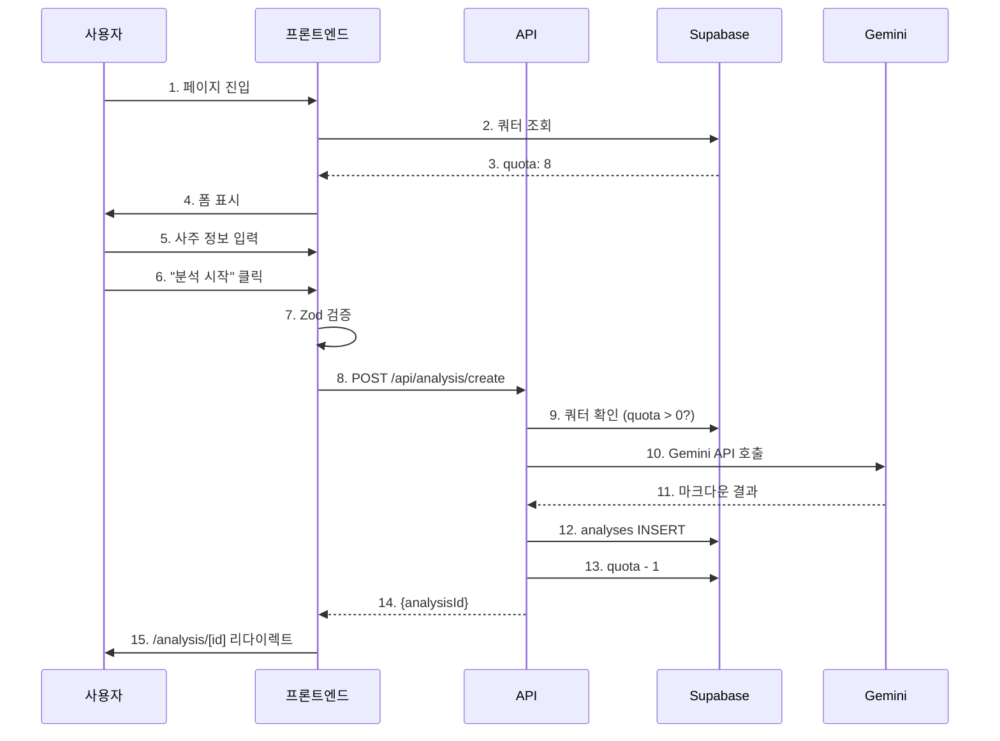
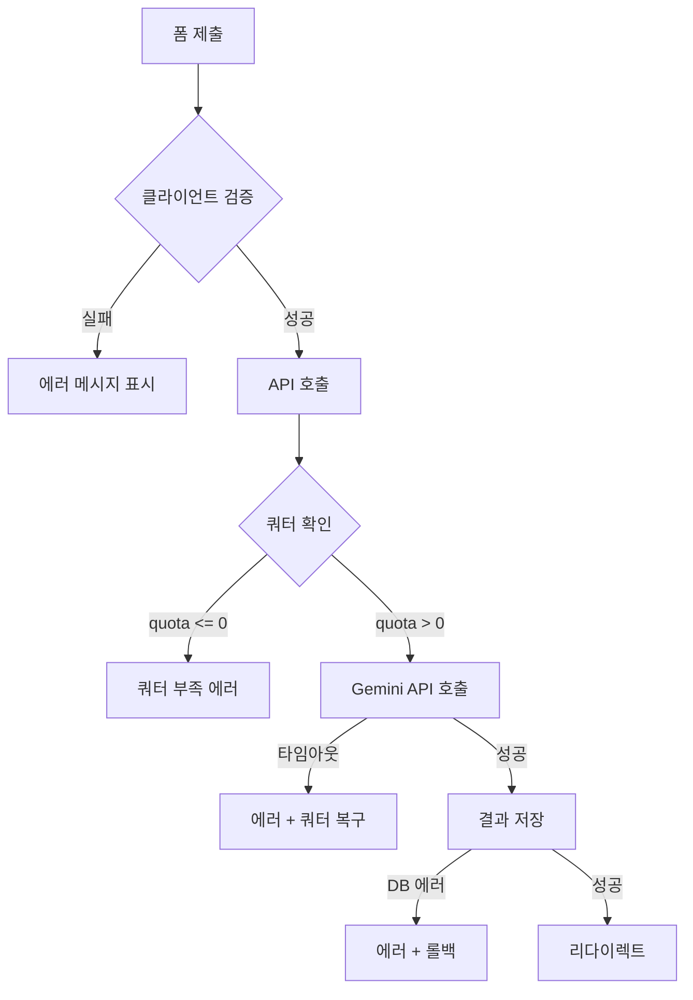

# `/analysis/new` 페이지 구현 계획

**페이지**: `/analysis/new` (새 사주 분석)
**작성일**: 2025-10-26
**버전**: 1.0
**우선순위**: P0 (MVP 필수)

---

## 목차

1. [페이지 개요](#1-페이지-개요)
2. [기능 요구사항](#2-기능-요구사항)
3. [UI/UX 설계](#3-uiux-설계)
4. [컴포넌트 구조](#4-컴포넌트-구조)
5. [상태 관리 전략](#5-상태-관리-전략)
6. [API 연동](#6-api-연동)
7. [데이터 흐름](#7-데이터-흐름)
8. [에러 처리](#8-에러-처리)
9. [구현 단계](#9-구현-단계)
10. [검증 체크리스트](#10-검증-체크리스트)

---

## 1. 페이지 개요

### 1.1 목적

사용자가 사주 정보를 입력하고 AI 분석을 요청하여 즉시 결과를 받을 수 있는 핵심 기능 페이지

### 1.2 주요 기능

- ✅ **사주 정보 입력 폼**: 이름, 생년월일, 출생시간(선택), 성별
- ✅ **쿼터 확인 및 표시**: 남은 분석 횟수 실시간 표시
- ✅ **AI 분석 요청**: Gemini API를 통한 사주 분석
- ✅ **분석 결과 표시**: 마크다운 렌더링 및 상세 페이지 이동

### 1.3 사용자 플로우

```
페이지 진입 → 쿼터 확인 → 폼 입력 → 검증 → API 호출 (30초) → 결과 저장 → 상세 페이지 이동
```

### 1.4 전제 조건

- 사용자가 로그인된 상태 (Clerk)
- 구독 상태가 `active`
- 남은 쿼터가 1회 이상 (`quota > 0`)

### 1.5 후속 조건

- 분석 결과가 `analyses` 테이블에 저장됨
- `subscriptions` 테이블의 `quota` 1 차감
- 사용자가 `/analysis/[id]` 페이지로 자동 이동

---

## 2. 기능 요구사항

### 2.1 필수 기능 (P0)

| 기능 | 설명 | 상태 |
|------|------|------|
| **쿼터 표시** | 남은 분석 횟수를 상단 배너에 표시 | ✅ 필수 |
| **폼 입력** | 이름, 생년월일, 출생시간, 성별 입력 | ✅ 필수 |
| **클라이언트 검증** | React Hook Form + Zod 기반 유효성 검증 | ✅ 필수 |
| **AI 분석 요청** | Gemini API 호출 및 결과 저장 | ✅ 필수 |
| **로딩 상태** | 분석 중 프로그레스 바 및 30초 타이머 표시 | ✅ 필수 |
| **결과 리다이렉트** | 분석 완료 후 `/analysis/[id]` 자동 이동 | ✅ 필수 |

### 2.2 선택 기능 (P1)

| 기능 | 설명 | 우선순위 |
|------|------|---------|
| **재시도 버튼** | 에러 발생 시 재시도 버튼 표시 | P1 |
| **출생시간 미상 안내** | "모르시면 비워두세요" 헬퍼 텍스트 | P1 |
| **쿼터 소진 유도** | quota === 0 시 Pro 구독 유도 CTA | P1 |

### 2.3 성능 요구사항

| 지표 | 목표 | 측정 방법 |
|------|------|----------|
| **분석 완료 시간** | < 30초 (95 percentile) | Gemini API 응답 시간 |
| **페이지 로딩 시간** | < 2초 (TTI) | Vercel Analytics |
| **폼 검증 시간** | < 100ms | React Hook Form |

---

## 3. UI/UX 설계

### 3.1 레이아웃 구조

```
┌─────────────────────────────────────────────────┐
│ Header (로고, 네비게이션, 사용자 정보)               │
├─────────────────────────────────────────────────┤
│ Quota Banner                                    │
│ ┌─────────────────────────────────────────────┐ │
│ │ 남은 분석 횟수: 8회 | Pro 구독 중            │ │
│ └─────────────────────────────────────────────┘ │
├─────────────────────────────────────────────────┤
│ Form Container                                  │
│ ┌─────────────────────────────────────────────┐ │
│ │ [이름 입력]                                  │ │
│ │ [생년월일 선택]                              │ │
│ │ [출생시간 선택 (선택)]                       │ │
│ │ [성별 선택: 남성 / 여성]                     │ │
│ │                                             │ │
│ │ [사주 분석 시작 버튼]                        │ │
│ └─────────────────────────────────────────────┘ │
├─────────────────────────────────────────────────┤
│ Footer                                          │
└─────────────────────────────────────────────────┘
```

### 3.2 Quota Banner 디자인

**상태별 UI**:

| 쿼터 상태 | 배경색 | 텍스트 | 아이콘 |
|----------|--------|--------|--------|
| `quota > 3` | `bg-purple-50 border-purple-200` | "남은 분석 횟수: {quota}회" | ✅ |
| `quota === 1-3` | `bg-yellow-50 border-yellow-300` | "⚠️ 남은 횟수: {quota}회" | ⚠️ |
| `quota === 0` | `bg-red-50 border-red-300` | "❌ 횟수 소진. Pro 구독 필요" | ❌ |

**예시 코드**:
```tsx
{quota > 0 ? (
  <div className="p-4 bg-purple-50 border border-purple-200 rounded-lg">
    <p className="text-purple-800 font-semibold">
      남은 분석 횟수: <span className="text-2xl">{quota}회</span>
      {planType === 'pro' && ' | Pro 구독 중'}
    </p>
  </div>
) : (
  <div className="p-4 bg-red-50 border border-red-300 rounded-lg">
    <p className="text-red-700 font-semibold">
      남은 분석 횟수가 없습니다. Pro 구독을 시작해주세요.
    </p>
    <Link href="/subscription">
      <Button variant="default" className="mt-3">Pro 구독하기</Button>
    </Link>
  </div>
)}
```

### 3.3 폼 필드 디자인

#### 3.3.1 이름 입력

```tsx
<div>
  <label htmlFor="name" className="block text-sm font-semibold text-gray-700 mb-2">
    이름 *
  </label>
  <input
    {...register('name')}
    type="text"
    id="name"
    placeholder="예: 홍길동"
    className="w-full px-4 py-3 border-2 border-gray-200 rounded-lg focus:border-primary focus:ring-2 focus:ring-primary/20"
  />
  {errors.name && (
    <p className="mt-1 text-sm text-red-600">{errors.name.message}</p>
  )}
</div>
```

#### 3.3.2 생년월일 선택

```tsx
<div>
  <label htmlFor="birthDate" className="block text-sm font-semibold text-gray-700 mb-2">
    생년월일 *
  </label>
  <input
    {...register('birthDate')}
    type="date"
    id="birthDate"
    max={new Date().toISOString().split('T')[0]}
    className="w-full px-4 py-3 border-2 border-gray-200 rounded-lg focus:border-primary"
  />
  {errors.birthDate && (
    <p className="mt-1 text-sm text-red-600">{errors.birthDate.message}</p>
  )}
</div>
```

#### 3.3.3 출생시간 선택 (선택사항)

```tsx
<div>
  <label htmlFor="birthTime" className="block text-sm font-semibold text-gray-700 mb-2">
    출생시간 (선택)
  </label>
  <input
    {...register('birthTime')}
    type="time"
    id="birthTime"
    className="w-full px-4 py-3 border-2 border-gray-200 rounded-lg focus:border-primary"
  />
  <p className="mt-1 text-xs text-gray-500">
    모르시면 비워두세요. "시간 미상"으로 분석됩니다.
  </p>
</div>
```

#### 3.3.4 성별 선택

```tsx
<div>
  <label className="block text-sm font-semibold text-gray-700 mb-2">
    성별 *
  </label>
  <div className="flex gap-4">
    <label className="flex items-center cursor-pointer">
      <input
        {...register('gender')}
        type="radio"
        value="male"
        className="mr-2 w-4 h-4 text-primary"
      />
      <span className="text-gray-700">남성</span>
    </label>
    <label className="flex items-center cursor-pointer">
      <input
        {...register('gender')}
        type="radio"
        value="female"
        className="mr-2 w-4 h-4 text-primary"
      />
      <span className="text-gray-700">여성</span>
    </label>
  </div>
  {errors.gender && (
    <p className="mt-1 text-sm text-red-600">{errors.gender.message}</p>
  )}
</div>
```

### 3.4 로딩 상태 UI (분석 중)

**AnalyzingLoader 컴포넌트**:

```tsx
<div className="fixed inset-0 bg-black/50 flex items-center justify-center z-50">
  <div className="bg-white rounded-2xl p-8 max-w-md w-full shadow-2xl">
    <div className="text-center">
      {/* 회전 스피너 */}
      <div className="w-16 h-16 mx-auto mb-4 relative">
        <div className="absolute inset-0 border-4 border-purple-200 rounded-full" />
        <div className="absolute inset-0 border-4 border-purple-600 rounded-full border-t-transparent animate-spin" />
      </div>

      <h3 className="text-xl font-bold text-gray-900 mb-2">
        AI가 사주를 분석하고 있습니다
      </h3>
      <p className="text-gray-600 mb-6">
        약 30초 소요됩니다. 잠시만 기다려주세요.
      </p>

      {/* 프로그레스 바 */}
      <div className="w-full bg-gray-200 rounded-full h-3 mb-3 overflow-hidden">
        <div
          className="bg-gradient-to-r from-purple-500 to-pink-500 h-full rounded-full transition-all duration-300"
          style={{ width: `${progress}%` }}
        />
      </div>

      <p className="text-sm text-gray-500">
        경과 시간: {elapsedTime}초 / 예상 30초
      </p>
    </div>
  </div>
</div>
```

---

## 4. 컴포넌트 구조

### 4.1 컴포넌트 트리

```
NewAnalysisPage (Container)
├── QuotaBanner (Presentation)
│   └── QuotaSkeleton (Loading)
├── NewAnalysisForm (Container)
│   ├── FormField (name) (Presentation)
│   ├── FormField (birthDate) (Presentation)
│   ├── FormField (birthTime) (Presentation)
│   └── FormField (gender) (Presentation)
├── SubmitButton (Presentation)
├── AnalyzingLoader (Modal) (Presentation)
└── ErrorAlert (Presentation)
```

### 4.2 파일 구조

```
src/features/analysis/
├── components/
│   ├── NewAnalysisPage.tsx         # 메인 컨테이너 페이지
│   ├── QuotaBanner.tsx              # 쿼터 표시 배너
│   ├── NewAnalysisForm.tsx          # 폼 컨테이너
│   ├── FormField.tsx                # 재사용 폼 필드
│   ├── SubmitButton.tsx             # 제출 버튼
│   ├── AnalyzingLoader.tsx          # 분석 중 로딩 모달
│   └── ErrorAlert.tsx               # 에러 표시 컴포넌트
├── hooks/
│   ├── useCreateAnalysis.ts         # 분석 생성 Mutation
│   └── useQuota.ts                  # 쿼터 조회 Query
├── types.ts                         # 타입 정의
├── utils/
│   └── parseApiError.ts             # 에러 파싱
└── constants.ts                     # 상수
```

### 4.3 라우트 파일

```
src/app/(protected)/analysis/new/page.tsx
```

---

## 5. 상태 관리 전략

### 5.1 상태 계층

| 상태 타입 | 관리 방법 | 예시 |
|----------|----------|------|
| **Local State** | `useState` | `analysisState`, `errorMessage` |
| **Form State** | React Hook Form | 입력 값, 검증 에러 |
| **Server State** | React Query | 쿼터 정보, 분석 결과 |
| **Global State** | Context API | 구독 정보 (`planType`, `quota`) |

### 5.2 상태 정의

```typescript
// Local State
const [analysisState, setAnalysisState] = useState<AnalysisState>('idle');
const [analysisId, setAnalysisId] = useState<string | null>(null);
const [errorMessage, setErrorMessage] = useState<string | null>(null);

// Form State (React Hook Form)
const {
  register,
  handleSubmit,
  formState: { errors, isSubmitting },
  reset,
} = useForm<SajuFormData>({
  resolver: zodResolver(sajuInputSchema),
  defaultValues: {
    name: '',
    birthDate: '',
    birthTime: undefined,
    gender: 'male',
  },
});

// Server State (React Query)
const { data: quotaInfo, isLoading } = useQuery({
  queryKey: ['quota', userId],
  queryFn: async () => {
    const res = await apiClient.get(`/api/subscription/status`);
    return res.data as QuotaInfo;
  },
  staleTime: 1000 * 60, // 1분 캐시
});

// Global State (Context)
const { quota, planType, refetchQuota } = useSubscription();
```

### 5.3 상태 전환 다이어그램

```
[idle] → [validating] → [checkQuota] → [analyzing] → [success] → 페이지 이동
                ↓              ↓            ↓
            [idle]         [quotaError]  [error]
```

---

## 6. API 연동

### 6.1 백엔드 API 엔드포인트

**경로**: `POST /api/analysis/create`

**요청 본문** (Zod 검증):
```typescript
{
  name: string;           // 2-50자
  birthDate: string;      // YYYY-MM-DD
  birthTime?: string;     // HH:MM 또는 undefined
  gender: 'male' | 'female';
}
```

**응답** (성공):
```typescript
{
  success: true;
  data: {
    analysisId: string;   // UUID
    createdAt: string;    // ISO 8601
  }
}
```

**응답** (실패):
```typescript
{
  success: false;
  error: {
    code: 'QUOTA_EXCEEDED' | 'VALIDATION_ERROR' | 'API_ERROR';
    message: string;
  }
}
```

### 6.2 기존 백엔드 코드 활용

**기존 파일**: `src/features/analysis/backend/route.ts`

현재 `DELETE /api/analysis/:id`만 구현되어 있으므로, **새로 추가 필요**:

```typescript
// src/features/analysis/backend/route.ts 에 추가

import { analyzeWithGemini } from '@/lib/gemini';
import { generateSajuPrompt } from '@/lib/gemini/prompts';

analysisRouter.post(
  '/api/analysis/create',
  zValidator('json', sajuInputSchema),
  async (c) => {
    const clerkUserId = c.get('clerkUserId');
    if (!clerkUserId) {
      return c.json({ success: false, error: 'Unauthorized' }, 401);
    }

    const supabase = c.get('supabase');
    const logger = c.get('logger');
    const input = c.req.valid('json');

    try {
      // 1. 쿼터 확인 및 차감 (트랜잭션)
      const { data: sub } = await supabase
        .from('subscriptions')
        .select('quota, plan_type')
        .eq('clerk_user_id', clerkUserId)
        .eq('status', 'active')
        .single();

      if (!sub || sub.quota <= 0) {
        return c.json({
          success: false,
          error: { code: 'QUOTA_EXCEEDED', message: '쿼터 부족' }
        }, 400);
      }

      // 2. Gemini API 호출
      const prompt = generateSajuPrompt(input);
      const isPro = sub.plan_type === 'pro';
      const markdown = await analyzeWithGemini(prompt, isPro);

      // 3. 분석 결과 저장
      const { data: analysis, error: insertError } = await supabase
        .from('analyses')
        .insert({
          clerk_user_id: clerkUserId,
          name: input.name,
          birth_date: input.birthDate,
          birth_time: input.birthTime || null,
          gender: input.gender,
          result_markdown: markdown,
          model_used: isPro ? 'gemini-2.5-pro' : 'gemini-2.5-flash',
        })
        .select('id, created_at')
        .single();

      if (insertError) throw insertError;

      // 4. 쿼터 차감
      await supabase
        .from('subscriptions')
        .update({ quota: sub.quota - 1 })
        .eq('clerk_user_id', clerkUserId);

      return c.json({
        success: true,
        data: {
          analysisId: analysis.id,
          createdAt: analysis.created_at,
        }
      });

    } catch (error) {
      logger.error('Analysis creation failed:', error);
      return c.json({
        success: false,
        error: { code: 'API_ERROR', message: 'AI 분석 중 오류 발생' }
      }, 500);
    }
  }
);
```

### 6.3 Gemini 프롬프트 활용

**기존 파일**: `src/lib/gemini/prompts.ts`

프롬프트 생성 함수가 이미 존재하므로 그대로 활용:

```typescript
import { generateSajuPrompt } from '@/lib/gemini/prompts';

const prompt = generateSajuPrompt({
  name: '홍길동',
  birthDate: '1990-01-01',
  birthTime: '14:30',
  gender: 'male',
});
```

---

## 7. 데이터 흐름

### 7.1 전체 플로우



### 7.2 에러 플로우



---

## 8. 에러 처리

### 8.1 에러 타입 분류

```typescript
export enum ErrorType {
  QUOTA_EXCEEDED = 'quota_exceeded',
  VALIDATION_ERROR = 'validation_error',
  API_ERROR = 'api_error',
  NETWORK_ERROR = 'network_error',
  TIMEOUT = 'timeout',
}
```

### 8.2 에러 메시지 매핑

```typescript
const ERROR_MESSAGES = {
  QUOTA_EXCEEDED: '남은 분석 횟수가 없습니다. Pro 구독을 이용해주세요.',
  VALIDATION_ERROR: '입력 정보를 확인해주세요.',
  API_ERROR: 'AI 분석 중 오류가 발생했습니다. 잠시 후 다시 시도해주세요.',
  NETWORK_ERROR: '인터넷 연결을 확인해주세요.',
  TIMEOUT: '분석 시간이 초과되었습니다. 다시 시도해주세요.',
};
```

### 8.3 에러 UI

```tsx
{errorMessage && (
  <div className="p-4 bg-red-50 border border-red-200 rounded-lg">
    <div className="flex items-center gap-2">
      <AlertCircle className="w-5 h-5 text-red-600" />
      <p className="text-red-700 font-medium">{errorMessage}</p>
    </div>
    <Button
      onClick={() => setAnalysisState('idle')}
      variant="outline"
      className="mt-3"
    >
      다시 시도
    </Button>
  </div>
)}
```

---

## 9. 구현 단계

### Phase 1: 기본 UI 구현 (2-3시간)

- [ ] `NewAnalysisPage.tsx` 컨테이너 생성
- [ ] `QuotaBanner.tsx` 컴포넌트 구현
- [ ] `NewAnalysisForm.tsx` 폼 컨테이너 구현
- [ ] 4개 폼 필드 구현 (이름, 생년월일, 출생시간, 성별)
- [ ] `SubmitButton.tsx` 구현

### Phase 2: 폼 검증 (1-2시간)

- [ ] `sajuInputSchema` Zod 스키마 정의
- [ ] React Hook Form 연동
- [ ] 검증 에러 메시지 표시
- [ ] 필드별 에러 스타일링

### Phase 3: 백엔드 API 구현 (3-4시간)

- [ ] `POST /api/analysis/create` 라우트 추가
- [ ] 쿼터 확인 로직 구현
- [ ] Gemini API 호출 및 응답 처리
- [ ] `analyses` 테이블 INSERT
- [ ] 쿼터 차감 로직 구현

### Phase 4: React Query 연동 (2-3시간)

- [ ] `useQuota` 훅 구현
- [ ] `useCreateAnalysis` Mutation 구현
- [ ] 쿼터 캐시 무효화 로직
- [ ] 에러 처리 및 재시도 로직

### Phase 5: 로딩 상태 (2시간)

- [ ] `AnalyzingLoader.tsx` 모달 구현
- [ ] 프로그레스 바 애니메이션
- [ ] 경과 시간 타이머 구현
- [ ] 로딩 중 폼 비활성화

### Phase 6: 에러 처리 (1-2시간)

- [ ] `parseApiError` 유틸 함수 구현
- [ ] `ErrorAlert` 컴포넌트 구현
- [ ] 에러별 복구 액션 정의
- [ ] 쿼터 부족 시 Pro 구독 유도

### Phase 7: 통합 테스트 (2-3시간)

- [ ] 정상 플로우 E2E 테스트
- [ ] 쿼터 부족 시나리오 테스트
- [ ] 검증 에러 시나리오 테스트
- [ ] API 에러 시나리오 테스트
- [ ] 네트워크 오류 시나리오 테스트

**총 예상 시간**: 13-19시간 (약 2-3일)

---

## 10. 검증 체크리스트

### 10.1 기능 검증

- [ ] 쿼터 정보가 정상적으로 표시됨 (로딩 → 데이터)
- [ ] 폼 입력 시 실시간 검증 동작 (Zod)
- [ ] "분석 시작" 버튼 클릭 시 API 호출됨
- [ ] 분석 중 로딩 모달이 표시됨 (30초 타이머)
- [ ] 분석 완료 후 `/analysis/[id]` 로 이동함
- [ ] 쿼터가 1 차감됨 (UI 갱신 확인)

### 10.2 에러 검증

- [ ] 쿼터 부족 시 에러 메시지 표시 및 Pro 유도 버튼
- [ ] 폼 검증 실패 시 필드별 에러 메시지 표시
- [ ] Gemini API 타임아웃 시 재시도 버튼 표시
- [ ] 네트워크 오류 시 연결 확인 메시지 표시

### 10.3 UI/UX 검증

- [ ] 모바일 반응형 디자인 (< 768px)
- [ ] 폼 필드 포커스 상태 시각적 표시
- [ ] 버튼 로딩 상태 (스피너 + 비활성화)
- [ ] 에러 메시지 빨간색 강조
- [ ] 쿼터 배너 색상 변화 (초록 → 노랑 → 빨강)

### 10.4 성능 검증

- [ ] 페이지 로딩 < 2초
- [ ] 폼 검증 < 100ms
- [ ] Gemini API 응답 < 30초 (평균 20초)
- [ ] 쿼터 조회 캐싱 동작 확인 (1분)

### 10.5 보안 검증

- [ ] 인증 없는 접근 시 로그인 페이지 리다이렉트
- [ ] Gemini API 키 클라이언트 노출 안 됨
- [ ] SQL Injection 방지 (Zod 검증)
- [ ] XSS 방지 (마크다운 파싱 시 sanitize)

---

## 11. 의존성 및 제약사항

### 11.1 의존 컴포넌트

| 컴포넌트 | 상태 | 비고 |
|---------|------|------|
| **Clerk 인증** | ✅ 구현 완료 | 로그인 필수 |
| **Gemini API 클라이언트** | ✅ 구현 완료 | `src/lib/gemini/client.ts` |
| **Gemini 프롬프트** | ✅ 구현 완료 | `src/lib/gemini/prompts.ts` |
| **Subscription Context** | ❌ 구현 필요 | 쿼터 정보 공유 |
| **마크다운 파서** | ❌ 구현 필요 | 분석 결과 렌더링용 |

### 11.2 데이터베이스 테이블

| 테이블 | 상태 | 비고 |
|--------|------|------|
| **subscriptions** | ✅ 존재 | quota, plan_type 컬럼 필요 |
| **analyses** | ✅ 존재 | 분석 결과 저장 |

### 11.3 환경 변수

```env
# Clerk
NEXT_PUBLIC_CLERK_PUBLISHABLE_KEY=
CLERK_SECRET_KEY=

# Gemini
GEMINI_API_KEY=

# Supabase
NEXT_PUBLIC_SUPABASE_URL=
SUPABASE_SERVICE_ROLE_KEY=
```

---

## 12. 추가 개선 사항 (P1+)

### 12.1 향후 기능

- **분석 이력 바로가기**: 최근 분석 3개 미리보기
- **출생시간 추천**: "모르시면 12:00로 설정" 옵션
- **폼 자동 저장**: 새로고침 시 입력 값 유지 (localStorage)
- **재분석 기능**: 같은 정보로 새 쿼터 소진하여 재분석

### 12.2 성능 최적화

- **React.memo**: `QuotaBanner`, `FormField` 컴포넌트 메모이제이션
- **useCallback**: `onSubmit` 핸들러 메모이제이션
- **useMemo**: 쿼터 메시지 계산 메모이제이션
- **디바운싱**: 이름 입력 실시간 검증 (선택)

---

## 13. 참고 문서

- [PRD: 섹션 3.2.3](/docs/prd.md#3-2-3-새-분석-analysis-new)
- [Userflow: UF-03](/docs/userflow.md#4-uf-03-pro-사용자의-사주-분석-이용)
- [UseCase: UC-03](/docs/usecases/3-saju-analysis/spec.md)
- [상태관리 설계](/docs/pages/3-new-analysis/state.md)
- [공통 모듈](/docs/common-modules.md)

---

**작성일**: 2025-10-26
**버전**: 1.0
**작성자**: Claude Code
**승인 상태**: Draft (검토 필요)
**다음 단계**: Phase 1 UI 구현 시작
