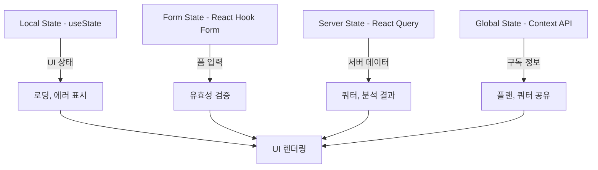
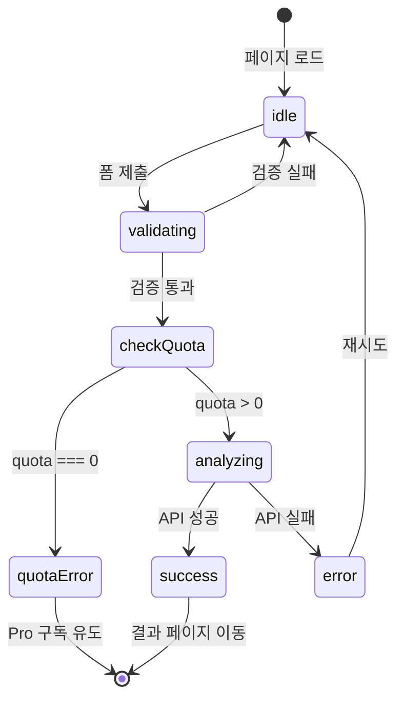

# 3-new-analysis 페이지 상태관리 설계

**페이지**: `/analysis/new` (새 분석)
**작성일**: 2025-10-26
**버전**: 1.0
**상태관리 전략**: Local State + React Hook Form + React Query + Context API

---

## 목차

1. [상태관리 개요](#1-상태관리-개요)
2. [관리해야 할 상태 목록](#2-관리해야-할-상태-목록)
3. [상태 구조 및 타입 정의](#3-상태-구조-및-타입-정의)
4. [상태별 관리 계층](#4-상태별-관리-계층)
5. [상태 전환 다이어그램](#5-상태-전환-다이어그램)
6. [폼 상태 관리](#6-폼-상태-관리)
7. [서버 상태 관리](#7-서버-상태-관리)
8. [전역 상태 관리](#8-전역-상태-관리)
9. [에러 처리 전략](#9-에러-처리-전략)
10. [로딩 상태 관리](#10-로딩-상태-관리)
11. [최적화 전략](#11-최적화-전략)
12. [컴포넌트 계층 구조](#12-컴포넌트-계층-구조)

---

## 1. 상태관리 개요

### 1.1 페이지 핵심 기능

- **사주 정보 입력 폼**: 이름, 생년월일, 출생시간, 성별
- **쿼터 확인 및 표시**: 남은 분석 횟수 실시간 표시
- **AI 분석 요청**: Gemini API 호출 및 결과 저장
- **분석 결과 표시**: 마크다운 렌더링 및 상세 페이지 이동

### 1.2 상태관리 전략



### 1.3 설계 원칙

- **관심사 분리**: UI 상태, 폼 상태, 서버 상태, 전역 상태를 명확히 구분
- **단방향 데이터 플로우**: 상태 변경 → UI 렌더링 방향 일관성 유지
- **낙관적 업데이트 금지**: 서버 응답 확인 후 상태 업데이트 (쿼터 차감 중요성)
- **에러 복구 가능성**: 모든 비동기 작업은 실패 시 복구 경로 제공

---

## 2. 관리해야 할 상태 목록

### 2.1 상태 데이터

| 상태명 | 타입 | 관리 계층 | 목적 |
|--------|------|----------|------|
| **폼 입력 값** | `SajuFormData` | React Hook Form | 사용자 입력 데이터 |
| **폼 검증 에러** | `FieldErrors` | React Hook Form | 입력 유효성 에러 |
| **남은 쿼터** | `number` | React Query | 분석 가능 횟수 |
| **구독 플랜** | `'free' \| 'pro'` | Context API | 플랜 타입 |
| **분석 진행 상태** | `AnalysisState` | Local State | idle, validating, analyzing, success, error |
| **분석 결과 ID** | `string \| null` | Local State | 완료 후 리다이렉트용 |
| **에러 메시지** | `string \| null` | Local State | 사용자 친화적 에러 메시지 |

### 2.2 화면상 데이터 (비상태)

| 항목 | 출처 | 설명 |
|------|------|------|
| **현재 사용자 이름** | Clerk useUser | Header 표시용 |
| **쿼터 안내 메시지** | 계산 로직 | 쿼터 기반 동적 메시지 |
| **버튼 비활성화 여부** | 계산 로직 | quota === 0 \|\| isSubmitting |
| **분석 시간 카운터** | 로컬 변수 | 30초 예상 시간 표시 |

---

## 3. 상태 구조 및 타입 정의

### 3.1 폼 데이터 타입

```typescript
// src/features/analysis/types.ts

export interface SajuFormData {
  name: string;           // 이름 (2-50자)
  birthDate: string;      // 생년월일 (YYYY-MM-DD)
  birthTime?: string;     // 출생시간 (HH:MM 또는 미상)
  gender: 'male' | 'female';  // 성별
}

export const defaultFormValues: SajuFormData = {
  name: '',
  birthDate: '',
  birthTime: undefined,
  gender: 'male',
};
```

### 3.2 분석 상태 타입

```typescript
export type AnalysisState =
  | 'idle'        // 초기 상태
  | 'validating'  // 클라이언트 검증 중
  | 'analyzing'   // Gemini API 호출 중
  | 'success'     // 분석 완료
  | 'error';      // 에러 발생

export interface AnalysisError {
  type: 'quota' | 'validation' | 'api' | 'network';
  message: string;
  recoverable: boolean;  // 재시도 가능 여부
}
```

### 3.3 쿼터 정보 타입

```typescript
export interface QuotaInfo {
  quota: number;          // 남은 횟수
  planType: 'free' | 'pro';
  maxQuota: number;       // 최대 횟수 (free: 3, pro: 10)
}

export interface SubscriptionStatus {
  userId: string;
  planType: 'free' | 'pro';
  quota: number;
  status: 'active' | 'cancelled' | 'terminated';
  nextPaymentDate?: string;
}
```

### 3.4 API 응답 타입

```typescript
// 분석 생성 API 응답
export interface CreateAnalysisResponse {
  success: true;
  data: {
    analysisId: string;
    createdAt: string;
  };
}

// 에러 응답
export interface ApiErrorResponse {
  success: false;
  error: {
    code: string;
    message: string;
  };
}
```

---

## 4. 상태별 관리 계층

### 4.1 Local State (useState)

**목적**: 컴포넌트 내부 UI 상태 관리

```typescript
const [analysisState, setAnalysisState] = useState<AnalysisState>('idle');
const [analysisId, setAnalysisId] = useState<string | null>(null);
const [errorMessage, setErrorMessage] = useState<string | null>(null);
const [showSuccessModal, setShowSuccessModal] = useState(false);
```

**업데이트 시점**:
- `analysisState`: 폼 제출 → 'validating' → 'analyzing' → 'success'/'error'
- `analysisId`: API 성공 응답 후
- `errorMessage`: API 에러 발생 시

### 4.2 Form State (React Hook Form)

**목적**: 폼 입력 및 유효성 검증

```typescript
import { useForm } from 'react-hook-form';
import { zodResolver } from '@hookform/resolvers/zod';
import { sajuInputSchema } from '@/lib/validation/schemas';

const {
  register,
  handleSubmit,
  formState: { errors, isSubmitting },
  reset,
} = useForm<SajuFormData>({
  resolver: zodResolver(sajuInputSchema),
  defaultValues: defaultFormValues,
});
```

**관리 항목**:
- 입력 값: `name`, `birthDate`, `birthTime`, `gender`
- 검증 에러: `errors.name`, `errors.birthDate` 등
- 제출 상태: `isSubmitting`

### 4.3 Server State (React Query)

**목적**: 서버 데이터 캐싱 및 동기화

```typescript
import { useQuery, useMutation } from '@tanstack/react-query';

// 쿼터 정보 조회
const { data: quotaInfo, isLoading, refetch } = useQuery({
  queryKey: ['quota', userId],
  queryFn: async () => {
    const res = await apiClient.get(`/api/subscription/status`);
    return res.data as QuotaInfo;
  },
  staleTime: 1000 * 60, // 1분간 캐시 유지
  refetchOnWindowFocus: true, // 탭 포커스 시 갱신
});

// 분석 생성 Mutation
const createAnalysisMutation = useMutation({
  mutationFn: async (data: SajuFormData) => {
    const res = await apiClient.post('/api/analysis/create', data);
    return res.data as CreateAnalysisResponse;
  },
  onSuccess: (response) => {
    setAnalysisId(response.data.analysisId);
    setAnalysisState('success');
    // 쿼터 갱신
    refetch();
  },
  onError: (error) => {
    setAnalysisState('error');
    setErrorMessage(parseApiError(error));
  },
});
```

**캐싱 전략**:
- `queryKey`: `['quota', userId]` - 사용자별 쿼터 캐싱
- `staleTime`: 1분 - 쿼터 변경 빈도 고려
- `refetchOnWindowFocus`: true - 탭 전환 후 복귀 시 최신 쿼터 확인

### 4.4 Global State (Context API)

**목적**: 구독 정보 공유 (Header, Dashboard 등)

```typescript
// src/features/subscription/context/SubscriptionContext.tsx
interface SubscriptionContextValue {
  planType: 'free' | 'pro';
  quota: number;
  status: 'active' | 'cancelled' | 'terminated';
  isLoading: boolean;
  refetchQuota: () => Promise<void>;
}

const SubscriptionContext = createContext<SubscriptionContextValue | null>(null);

export function SubscriptionProvider({ children }: { children: ReactNode }) {
  const { userId } = useAuth();

  const { data, isLoading, refetch } = useQuery({
    queryKey: ['subscription', userId],
    queryFn: async () => {
      const res = await apiClient.get('/api/subscription/status');
      return res.data as SubscriptionStatus;
    },
    enabled: !!userId,
  });

  const value = {
    planType: data?.planType ?? 'free',
    quota: data?.quota ?? 0,
    status: data?.status ?? 'active',
    isLoading,
    refetchQuota: refetch,
  };

  return (
    <SubscriptionContext.Provider value={value}>
      {children}
    </SubscriptionContext.Provider>
  );
}

export const useSubscription = () => {
  const context = useContext(SubscriptionContext);
  if (!context) {
    throw new Error('useSubscription must be used within SubscriptionProvider');
  }
  return context;
};
```

**사용 예시**:
```typescript
// NewAnalysisPage.tsx
const { quota, planType, refetchQuota } = useSubscription();
```

---

## 5. 상태 전환 다이어그램

### 5.1 전체 플로우



### 5.2 상태별 UI 변화

| 상태 | 버튼 텍스트 | 버튼 비활성화 | 로딩 표시 | 에러 메시지 | 쿼터 표시 |
|------|------------|-------------|----------|-----------|----------|
| **idle** | "분석 시작" | quota === 0 | ❌ | ❌ | ✅ "남은 횟수: 5회" |
| **validating** | "검증 중..." | ✅ | ✅ | ❌ | ✅ |
| **checkQuota** | "확인 중..." | ✅ | ✅ | ❌ | ✅ |
| **analyzing** | "AI 분석 중..." | ✅ | ✅ (30초 타이머) | ❌ | ✅ |
| **success** | "완료" | ✅ | ❌ | ❌ | ✅ (quota - 1) |
| **error** | "다시 시도" | ❌ | ❌ | ✅ "에러 메시지" | ✅ |
| **quotaError** | "Pro 구독하기" | ❌ | ❌ | ✅ "쿼터 부족" | ✅ "0회 남음" |

### 5.3 상태 변경 트리거

```typescript
// 폼 제출 핸들러
const onSubmit = async (data: SajuFormData) => {
  try {
    // 1. 검증 시작
    setAnalysisState('validating');
    setErrorMessage(null);

    // 2. 쿼터 확인
    if (quota <= 0) {
      setAnalysisState('idle');
      setErrorMessage(ERROR_MESSAGES.ANALYSIS.QUOTA_EXCEEDED);
      return;
    }

    // 3. 분석 시작
    setAnalysisState('analyzing');

    // 4. API 호출 (Mutation)
    await createAnalysisMutation.mutateAsync(data);

    // 5. 성공 (onSuccess 콜백에서 처리)
    // setAnalysisState('success');
    // setAnalysisId(response.data.analysisId);

  } catch (error) {
    // 6. 에러 (onError 콜백에서 처리)
    // setAnalysisState('error');
    // setErrorMessage(...);
  }
};
```

---

## 6. 폼 상태 관리

### 6.1 React Hook Form 설정

```typescript
// src/features/analysis/components/NewAnalysisForm.tsx
import { useForm } from 'react-hook-form';
import { zodResolver } from '@hookform/resolvers/zod';
import { sajuInputSchema } from '@/lib/validation/schemas';

const NewAnalysisForm = () => {
  const {
    register,
    handleSubmit,
    formState: { errors, isSubmitting, isDirty },
    reset,
    watch,
  } = useForm<SajuFormData>({
    resolver: zodResolver(sajuInputSchema),
    defaultValues: defaultFormValues,
    mode: 'onBlur', // 블러 시 검증
  });

  // 출생시간 실시간 감시 (선택사항)
  const birthTime = watch('birthTime');

  return (
    <form onSubmit={handleSubmit(onSubmit)}>
      {/* 폼 필드 */}
    </form>
  );
};
```

### 6.2 폼 필드 구성

```typescript
<div className="space-y-6">
  {/* 이름 */}
  <div>
    <label htmlFor="name" className="block text-sm font-semibold text-gray-700">
      이름 *
    </label>
    <input
      {...register('name')}
      type="text"
      id="name"
      className="mt-2 w-full px-4 py-3 border-2 border-gray-200 rounded-lg focus:border-primary"
      placeholder="예: 홍길동"
    />
    {errors.name && (
      <p className="mt-1 text-sm text-red-600">{errors.name.message}</p>
    )}
  </div>

  {/* 생년월일 */}
  <div>
    <label htmlFor="birthDate" className="block text-sm font-semibold text-gray-700">
      생년월일 *
    </label>
    <input
      {...register('birthDate')}
      type="date"
      id="birthDate"
      className="mt-2 w-full px-4 py-3 border-2 border-gray-200 rounded-lg"
      max={new Date().toISOString().split('T')[0]}
    />
    {errors.birthDate && (
      <p className="mt-1 text-sm text-red-600">{errors.birthDate.message}</p>
    )}
  </div>

  {/* 출생시간 (선택) */}
  <div>
    <label htmlFor="birthTime" className="block text-sm font-semibold text-gray-700">
      출생시간 (선택)
    </label>
    <input
      {...register('birthTime')}
      type="time"
      id="birthTime"
      className="mt-2 w-full px-4 py-3 border-2 border-gray-200 rounded-lg"
    />
    <p className="mt-1 text-xs text-gray-500">
      모르시면 비워두세요. "시간 미상"으로 분석됩니다.
    </p>
  </div>

  {/* 성별 */}
  <div>
    <label className="block text-sm font-semibold text-gray-700 mb-2">
      성별 *
    </label>
    <div className="flex gap-4">
      <label className="flex items-center">
        <input
          {...register('gender')}
          type="radio"
          value="male"
          className="mr-2"
        />
        남성
      </label>
      <label className="flex items-center">
        <input
          {...register('gender')}
          type="radio"
          value="female"
          className="mr-2"
        />
        여성
      </label>
    </div>
    {errors.gender && (
      <p className="mt-1 text-sm text-red-600">{errors.gender.message}</p>
    )}
  </div>
</div>
```

### 6.3 폼 초기화

```typescript
// 분석 완료 후 폼 초기화
useEffect(() => {
  if (analysisState === 'success') {
    // 3초 후 자동 리다이렉트
    const timer = setTimeout(() => {
      router.push(`/analysis/${analysisId}`);
    }, 3000);

    return () => clearTimeout(timer);
  }
}, [analysisState, analysisId, router]);

// 다른 사람 분석하기 버튼
const handleNewAnalysis = () => {
  reset(defaultFormValues);
  setAnalysisState('idle');
  setAnalysisId(null);
  setErrorMessage(null);
};
```

---

## 7. 서버 상태 관리

### 7.1 React Query 설정

```typescript
// src/features/analysis/hooks/useCreateAnalysis.ts
import { useMutation, useQueryClient } from '@tanstack/react-query';
import { apiClient } from '@/lib/remote/api-client';

export const useCreateAnalysis = () => {
  const queryClient = useQueryClient();

  return useMutation({
    mutationFn: async (data: SajuFormData) => {
      const response = await apiClient.post<CreateAnalysisResponse>(
        '/api/analysis/create',
        data,
        {
          timeout: 60000, // 60초 타임아웃
        }
      );
      return response.data;
    },

    onSuccess: (response) => {
      // 쿼터 캐시 무효화 (재조회 트리거)
      queryClient.invalidateQueries({ queryKey: ['subscription'] });
      queryClient.invalidateQueries({ queryKey: ['quota'] });

      // 최근 분석 목록 캐시 무효화
      queryClient.invalidateQueries({ queryKey: ['analyses'] });

      return response;
    },

    onError: (error: any) => {
      console.error('Analysis creation failed:', error);
    },

    retry: false, // 재시도 비활성화 (쿼터 중복 차감 방지)
  });
};
```

### 7.2 쿼터 조회 훅

```typescript
// src/features/subscription/hooks/useQuota.ts
import { useQuery } from '@tanstack/react-query';
import { apiClient } from '@/lib/remote/api-client';

export const useQuota = (userId: string | undefined) => {
  return useQuery({
    queryKey: ['quota', userId],
    queryFn: async () => {
      const response = await apiClient.get<QuotaInfo>('/api/subscription/status');
      return response.data;
    },
    enabled: !!userId, // 로그인 시에만 활성화
    staleTime: 1000 * 60, // 1분
    refetchOnWindowFocus: true,
    refetchOnMount: true,
  });
};
```

### 7.3 사용 예시

```typescript
// NewAnalysisPage.tsx
const { user } = useUser();
const { data: quotaInfo, isLoading: isLoadingQuota } = useQuota(user?.id);
const createAnalysis = useCreateAnalysis();

const onSubmit = async (data: SajuFormData) => {
  try {
    const response = await createAnalysis.mutateAsync(data);
    setAnalysisId(response.data.analysisId);
    toast.success('분석이 완료되었습니다!');
  } catch (error) {
    toast.error(parseApiError(error));
  }
};
```

---

## 8. 전역 상태 관리

### 8.1 SubscriptionContext 구조

```typescript
// src/features/subscription/context/SubscriptionContext.tsx
import { createContext, useContext, ReactNode } from 'react';
import { useQuery } from '@tanstack/react-query';
import { useAuth } from '@clerk/nextjs';

interface SubscriptionContextValue {
  planType: 'free' | 'pro';
  quota: number;
  status: 'active' | 'cancelled' | 'terminated';
  maxQuota: number;
  isLoading: boolean;
  refetchQuota: () => Promise<void>;
}

const SubscriptionContext = createContext<SubscriptionContextValue | null>(null);

export function SubscriptionProvider({ children }: { children: ReactNode }) {
  const { userId } = useAuth();

  const {
    data,
    isLoading,
    refetch,
  } = useQuery({
    queryKey: ['subscription', userId],
    queryFn: async () => {
      const response = await apiClient.get('/api/subscription/status');
      return response.data as SubscriptionStatus;
    },
    enabled: !!userId,
    staleTime: 1000 * 60 * 5, // 5분
  });

  const value: SubscriptionContextValue = {
    planType: data?.planType ?? 'free',
    quota: data?.quota ?? 0,
    status: data?.status ?? 'active',
    maxQuota: data?.planType === 'pro' ? 10 : 3,
    isLoading,
    refetchQuota: async () => {
      await refetch();
    },
  };

  return (
    <SubscriptionContext.Provider value={value}>
      {children}
    </SubscriptionContext.Provider>
  );
}

export const useSubscription = () => {
  const context = useContext(SubscriptionContext);
  if (!context) {
    throw new Error('useSubscription must be used within SubscriptionProvider');
  }
  return context;
};
```

### 8.2 레이아웃에서 Provider 설정

```typescript
// src/app/layout.tsx
import { SubscriptionProvider } from '@/features/subscription/context/SubscriptionContext';

export default function RootLayout({ children }: { children: ReactNode }) {
  return (
    <html lang="ko">
      <body>
        <ClerkProvider>
          <QueryClientProvider client={queryClient}>
            <SubscriptionProvider>
              {children}
            </SubscriptionProvider>
          </QueryClientProvider>
        </ClerkProvider>
      </body>
    </html>
  );
}
```

### 8.3 Context 사용 예시

```typescript
// NewAnalysisPage.tsx
const { quota, planType, refetchQuota } = useSubscription();

// 쿼터 부족 체크
if (quota === 0) {
  return (
    <div className="text-center">
      <p className="text-red-600">남은 분석 횟수가 없습니다.</p>
      <Link href="/subscription">
        <Button>Pro 구독하기</Button>
      </Link>
    </div>
  );
}

// 분석 완료 후 쿼터 갱신
const handleAnalysisComplete = async () => {
  await refetchQuota();
};
```

---

## 9. 에러 처리 전략

### 9.1 에러 타입 분류

```typescript
export enum ErrorType {
  QUOTA_EXCEEDED = 'quota_exceeded',
  VALIDATION_ERROR = 'validation_error',
  API_ERROR = 'api_error',
  NETWORK_ERROR = 'network_error',
  TIMEOUT = 'timeout',
  UNKNOWN = 'unknown',
}

export interface AnalysisError {
  type: ErrorType;
  message: string;
  recoverable: boolean;
  actionLabel?: string;
  actionPath?: string;
}
```

### 9.2 에러 파싱 함수

```typescript
// src/features/analysis/utils/parseApiError.ts
import { AxiosError } from 'axios';
import { ERROR_MESSAGES } from '@/constants/messages';

export function parseApiError(error: unknown): AnalysisError {
  // Axios 에러
  if (error instanceof AxiosError) {
    const status = error.response?.status;
    const code = error.response?.data?.error?.code;

    // 쿼터 부족
    if (status === 400 && code === 'QUOTA_EXCEEDED') {
      return {
        type: ErrorType.QUOTA_EXCEEDED,
        message: ERROR_MESSAGES.ANALYSIS.QUOTA_EXCEEDED,
        recoverable: false,
        actionLabel: 'Pro 구독하기',
        actionPath: '/subscription',
      };
    }

    // 검증 에러
    if (status === 400) {
      return {
        type: ErrorType.VALIDATION_ERROR,
        message: error.response?.data?.error?.message ?? ERROR_MESSAGES.ANALYSIS.VALIDATION_ERROR,
        recoverable: true,
      };
    }

    // 타임아웃
    if (error.code === 'ECONNABORTED') {
      return {
        type: ErrorType.TIMEOUT,
        message: ERROR_MESSAGES.NETWORK.TIMEOUT,
        recoverable: true,
      };
    }

    // 네트워크 에러
    if (!error.response) {
      return {
        type: ErrorType.NETWORK_ERROR,
        message: ERROR_MESSAGES.NETWORK.TIMEOUT,
        recoverable: true,
      };
    }

    // 서버 에러
    if (status && status >= 500) {
      return {
        type: ErrorType.API_ERROR,
        message: ERROR_MESSAGES.NETWORK.SERVER_ERROR,
        recoverable: true,
      };
    }
  }

  // 알 수 없는 에러
  return {
    type: ErrorType.UNKNOWN,
    message: '알 수 없는 오류가 발생했습니다.',
    recoverable: true,
  };
}
```

### 9.3 에러 UI 표시

```typescript
// NewAnalysisPage.tsx
{errorMessage && (
  <div className="p-4 bg-red-50 border border-red-200 rounded-lg">
    <div className="flex items-center gap-2">
      <AlertCircle className="w-5 h-5 text-red-600" />
      <p className="text-red-700 font-medium">{errorMessage.message}</p>
    </div>

    {errorMessage.recoverable && (
      <Button
        onClick={() => setAnalysisState('idle')}
        variant="outline"
        className="mt-3"
      >
        다시 시도
      </Button>
    )}

    {errorMessage.actionPath && (
      <Link href={errorMessage.actionPath}>
        <Button variant="default" className="mt-3">
          {errorMessage.actionLabel}
        </Button>
      </Link>
    )}
  </div>
)}
```

---

## 10. 로딩 상태 관리

### 10.1 로딩 상태 종류

| 상태 | 표시 위치 | 시간 | UI |
|------|----------|------|-----|
| **쿼터 로딩** | 상단 배너 | 0.5초 | Skeleton |
| **폼 검증** | 버튼 | 0.1초 | 스피너 |
| **AI 분석** | 전체 화면 | 30초 | 프로그레스 바 + 타이머 |
| **결과 저장** | 버튼 | 1초 | 체크 아이콘 |

### 10.2 AI 분석 로딩 UI

```typescript
// AnalyzingLoader.tsx
const AnalyzingLoader = () => {
  const [progress, setProgress] = useState(0);
  const [elapsedTime, setElapsedTime] = useState(0);

  useEffect(() => {
    // 프로그레스 바 애니메이션 (30초 기준)
    const progressInterval = setInterval(() => {
      setProgress((prev) => {
        if (prev >= 100) return 100;
        return prev + 100 / 30; // 1초당 3.33% 증가
      });
    }, 1000);

    // 경과 시간 카운터
    const timeInterval = setInterval(() => {
      setElapsedTime((prev) => prev + 1);
    }, 1000);

    return () => {
      clearInterval(progressInterval);
      clearInterval(timeInterval);
    };
  }, []);

  return (
    <div className="fixed inset-0 bg-black/50 flex items-center justify-center z-50">
      <div className="bg-white rounded-2xl p-8 max-w-md w-full shadow-2xl">
        <div className="text-center">
          <div className="w-16 h-16 mx-auto mb-4 relative">
            <div className="absolute inset-0 border-4 border-purple-200 rounded-full" />
            <div className="absolute inset-0 border-4 border-purple-600 rounded-full border-t-transparent animate-spin" />
          </div>

          <h3 className="text-xl font-bold text-gray-900 mb-2">
            AI가 사주를 분석하고 있습니다
          </h3>
          <p className="text-gray-600 mb-6">
            약 30초 소요됩니다. 잠시만 기다려주세요.
          </p>

          {/* 프로그레스 바 */}
          <div className="w-full bg-gray-200 rounded-full h-3 mb-3 overflow-hidden">
            <div
              className="bg-gradient-to-r from-purple-500 to-pink-500 h-full rounded-full transition-all duration-300"
              style={{ width: `${progress}%` }}
            />
          </div>

          <p className="text-sm text-gray-500">
            경과 시간: {elapsedTime}초 / 예상 30초
          </p>
        </div>
      </div>
    </div>
  );
};
```

### 10.3 쿼터 로딩 Skeleton

```typescript
// QuotaSkeleton.tsx
const QuotaSkeleton = () => (
  <div className="p-4 bg-purple-50 border border-purple-200 rounded-lg animate-pulse">
    <div className="h-4 bg-purple-200 rounded w-32 mb-2" />
    <div className="h-6 bg-purple-300 rounded w-24" />
  </div>
);
```

---

## 11. 최적화 전략

### 11.1 메모이제이션

```typescript
import { useMemo, useCallback } from 'react';

// 쿼터 메시지 계산 (재계산 방지)
const quotaMessage = useMemo(() => {
  if (quota === 0) {
    return '남은 분석 횟수가 없습니다. Pro 구독을 이용해주세요.';
  }
  if (quota === 1) {
    return `⚠️ 마지막 무료 분석입니다. (${planType === 'free' ? '무료' : 'Pro'})`;
  }
  return `남은 분석 횟수: ${quota}회 (${planType === 'free' ? '무료' : 'Pro'})`;
}, [quota, planType]);

// 폼 제출 핸들러 (재생성 방지)
const onSubmit = useCallback(
  async (data: SajuFormData) => {
    // ... 로직
  },
  [quota, createAnalysisMutation]
);
```

### 11.2 디바운싱

```typescript
import { useDebounce } from 'react-use';

// 이름 입력 실시간 검증 (디바운싱)
const [nameInput, setNameInput] = useState('');
const [debouncedName, setDebouncedName] = useState('');

useDebounce(
  () => {
    setDebouncedName(nameInput);
  },
  500,
  [nameInput]
);

// 디바운싱된 값으로 검증
useEffect(() => {
  if (debouncedName.length > 0 && debouncedName.length < 2) {
    // 에러 메시지 표시
  }
}, [debouncedName]);
```

### 11.3 컴포넌트 분리

```typescript
// 작은 컴포넌트로 분리하여 불필요한 재렌더링 방지

// QuotaBanner.tsx (독립 컴포넌트)
const QuotaBanner = React.memo(({ quota, planType }: { quota: number; planType: string }) => {
  return (
    <div className="p-4 bg-purple-50 border border-purple-200 rounded-lg">
      {/* ... */}
    </div>
  );
});

// FormField.tsx (재사용 가능)
const FormField = React.memo(({ label, error, children }: FormFieldProps) => {
  return (
    <div>
      <label>{label}</label>
      {children}
      {error && <p className="text-red-600">{error}</p>}
    </div>
  );
});
```

---

## 12. 컴포넌트 계층 구조

### 12.1 컴포넌트 트리

```
NewAnalysisPage (Container)
├── QuotaBanner (Presentation)
│   └── QuotaSkeleton (Loading)
├── NewAnalysisForm (Container)
│   ├── FormField (name) (Presentation)
│   ├── FormField (birthDate) (Presentation)
│   ├── FormField (birthTime) (Presentation)
│   └── FormField (gender) (Presentation)
├── SubmitButton (Presentation)
├── AnalyzingLoader (Modal) (Presentation)
├── SuccessModal (Modal) (Presentation)
└── ErrorAlert (Presentation)
```

### 12.2 파일 구조

```
src/features/analysis/
├── components/
│   ├── NewAnalysisPage.tsx         # 메인 컨테이너
│   ├── QuotaBanner.tsx              # 쿼터 표시
│   ├── NewAnalysisForm.tsx          # 폼 컨테이너
│   ├── FormField.tsx                # 재사용 폼 필드
│   ├── SubmitButton.tsx             # 제출 버튼
│   ├── AnalyzingLoader.tsx          # 분석 중 로딩
│   ├── SuccessModal.tsx             # 성공 모달
│   └── ErrorAlert.tsx               # 에러 표시
├── hooks/
│   ├── useCreateAnalysis.ts         # 분석 생성 Mutation
│   └── useQuota.ts                  # 쿼터 조회 Query
├── types.ts                         # 타입 정의
├── utils/
│   └── parseApiError.ts             # 에러 파싱
└── constants.ts                     # 상수
```

---

## 13. 구현 체크리스트

### 13.1 상태관리

- [ ] Local State: `analysisState`, `analysisId`, `errorMessage` useState 구현
- [ ] Form State: React Hook Form + Zod 연동
- [ ] Server State: useQuery (쿼터), useMutation (분석 생성)
- [ ] Global State: SubscriptionContext 구현 및 Provider 설정

### 13.2 UI 구현

- [ ] QuotaBanner: 쿼터 표시 및 경고 메시지
- [ ] NewAnalysisForm: 4개 필드 (이름, 생년월일, 출생시간, 성별)
- [ ] SubmitButton: 상태별 버튼 텍스트 및 비활성화
- [ ] AnalyzingLoader: 프로그레스 바 + 타이머
- [ ] SuccessModal: 분석 완료 안내 + 리다이렉트
- [ ] ErrorAlert: 에러 메시지 + 복구 액션

### 13.3 로직 구현

- [ ] 폼 검증: Zod 스키마 기반 클라이언트 검증
- [ ] 쿼터 확인: 제출 전 quota > 0 검증
- [ ] API 호출: createAnalysisMutation 실행
- [ ] 에러 처리: parseApiError로 에러 분류 및 메시지 표시
- [ ] 쿼터 갱신: 분석 완료 후 queryClient.invalidateQueries

### 13.4 최적화

- [ ] useMemo: quotaMessage 계산 메모이제이션
- [ ] useCallback: onSubmit 핸들러 메모이제이션
- [ ] React.memo: QuotaBanner, FormField 컴포넌트 메모이제이션
- [ ] 디바운싱: 이름 입력 실시간 검증 (선택)

### 13.5 테스트

- [ ] 정상 플로우: 폼 입력 → 분석 → 결과 페이지 이동
- [ ] 쿼터 부족: quota === 0 시 에러 표시
- [ ] 검증 에러: 잘못된 입력 시 필드별 에러 메시지
- [ ] API 에러: 네트워크 오류, 타임아웃, 서버 에러 처리
- [ ] 쿼터 갱신: 분석 완료 후 쿼터 -1 반영

---

**작성일**: 2025-10-26
**버전**: 1.0
**작성자**: Claude Code
**참고 문서**:
- `/docs/prd.md` - 페이지 요구사항
- `/docs/userflow.md` - UF-03 플로우
- `/docs/usecases/3-saju-analysis/spec.md` - UC-03 상세 명세
- `/docs/common-modules.md` - 공통 모듈 설계
