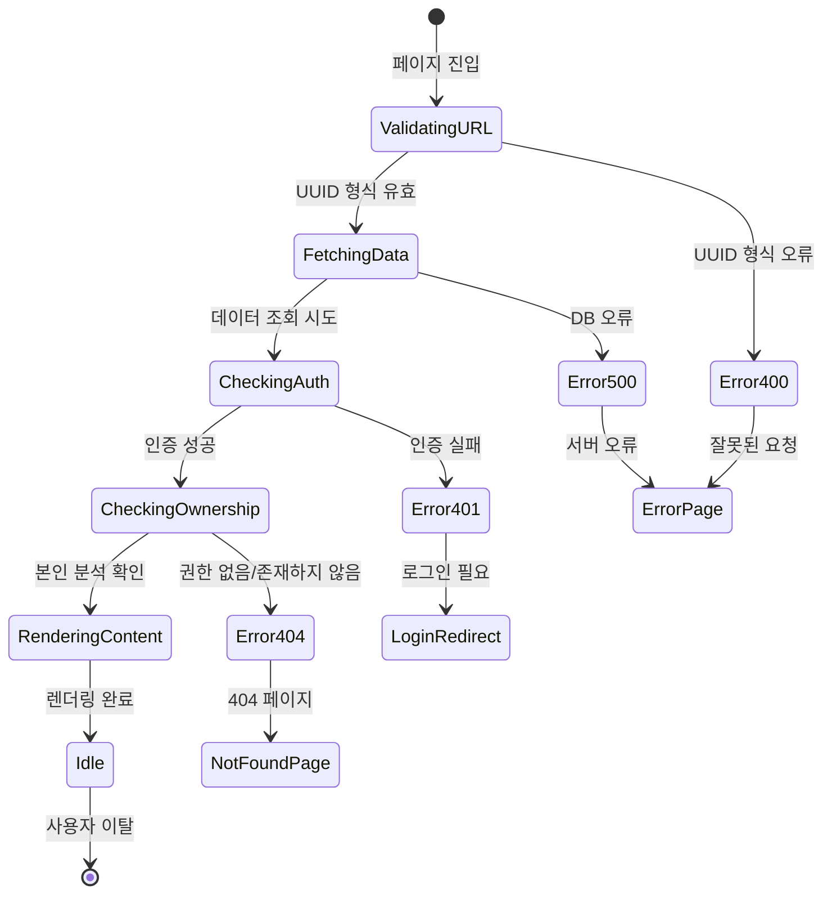
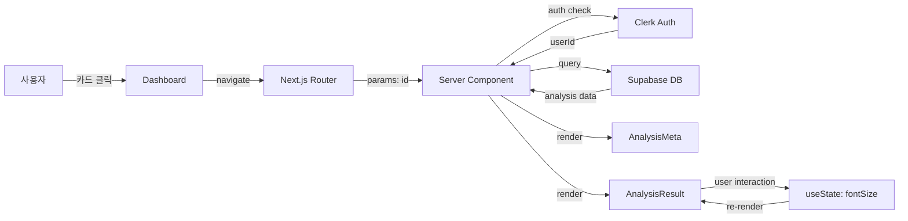

# 분석 상세보기 페이지 상태관리 설계 문서

**페이지**: `/analysis/[id]`
**목적**: 과거 분석 결과 조회 및 표시
**작성일**: 2025-10-26
**버전**: 1.0

---

## 목차

1. [페이지 개요](#1-페이지-개요)
2. [상태 데이터 분류](#2-상태-데이터-분류)
3. [상태 전환 다이어그램](#3-상태-전환-다이어그램)
4. [Context + useReducer 설계](#4-context--usereducer-설계)
5. [에러 처리 전략](#5-에러-처리-전략)
6. [캐싱 및 최적화](#6-캐싱-및-최적화)
7. [구현 예시](#7-구현-예시)

---

## 1. 페이지 개요

### 1.1 기능 요약

| 항목 | 설명 |
|------|------|
| **주요 기능** | 특정 분석 결과의 메타정보 및 마크다운 렌더링 |
| **접근 권한** | 로그인 필수 + 본인 분석만 조회 가능 |
| **데이터 소스** | Supabase `analyses` 테이블 |
| **렌더링 방식** | Server Component (초기 로드) + Client Component (마크다운 옵션) |

### 1.2 사용자 시나리오

```
1. 사용자가 대시보드에서 분석 카드 클릭
   → /analysis/[id] 페이지 진입

2. 서버에서 분석 데이터 조회 및 권한 검증
   → 성공: 메타정보 + 마크다운 결과 표시
   → 실패: 404 (존재하지 않음) 또는 403 (권한 없음)

3. 사용자가 마크다운 렌더링 옵션 조정 (선택사항)
   → 폰트 크기, 다크모드 등

4. "대시보드로 돌아가기" 클릭
   → /dashboard 이동
```

---

## 2. 상태 데이터 분류

### 2.1 서버 상태 (Server Components + React Query)

> **전략**: 초기 로드는 Server Component, 실시간 업데이트가 필요한 경우에만 React Query 사용

| 상태명 | 타입 | 관리 방식 | 캐싱 전략 | 설명 |
|--------|------|----------|---------|------|
| **analysisData** | `AnalysisDetail \| null` | Server Component (권장) | Next.js 캐시 (force-cache) | 분석 결과 전체 데이터 |
| **analysisData (대안)** | `AnalysisDetail \| null` | React Query | staleTime: 5분 | 클라이언트 리페치 필요 시 |

**타입 정의**:
```typescript
interface AnalysisDetail {
  id: string;
  clerk_user_id: string;
  name: string;
  birth_date: string;
  birth_time: string | null;
  gender: 'male' | 'female';
  result_markdown: string;
  model_used: 'gemini-2.5-flash' | 'gemini-2.5-pro';
  created_at: string;
}
```

---

### 2.2 URL 파라미터 상태 (Next.js 내장)

| 상태명 | 타입 | 관리 방식 | 설명 |
|--------|------|----------|------|
| **id** | `string` | `useParams()` | URL에서 분석 ID 추출 |

**사용 예시**:
```typescript
// Server Component (권장)
export default async function AnalysisDetailPage({
  params,
}: {
  params: Promise<{ id: string }>;
}) {
  const { id } = await params;
  // ...
}

// Client Component (필요 시)
import { useParams } from 'next/navigation';

const { id } = useParams();
```

---

### 2.3 로컬 UI 상태 (useState)

> **전략**: 마크다운 렌더링 옵션 등 로컬에서만 사용하는 상태

| 상태명 | 타입 | 기본값 | 설명 |
|--------|------|-------|------|
| **fontSize** | `'small' \| 'medium' \| 'large'` | `'medium'` | 마크다운 폰트 크기 |
| **isDarkMode** | `boolean` | `false` | 다크모드 여부 (선택사항) |
| **isExpanded** | `boolean` | `false` | 메타정보 섹션 접기/펼치기 |

---

### 2.4 에러 상태

| 상태명 | 타입 | 관리 방식 | 설명 |
|--------|------|----------|------|
| **errorType** | `'404' \| '403' \| '500' \| null` | Server Component → notFound() | 에러 타입 |
| **errorMessage** | `string \| null` | Server Component → error.tsx | 에러 메시지 |

---

### 2.5 화면에 보이는 데이터지만 상태가 아닌 것

| 데이터 | 타입 | 출처 | 설명 |
|--------|------|-----|------|
| **formattedDate** | `string` | 계산된 값 (`formatDateTime(created_at)`) | "2025-10-26 15:30" |
| **modelDisplayName** | `string` | 계산된 값 | "Gemini 2.5 Pro" 또는 "Gemini 2.5 Flash" |
| **birthTimeDisplay** | `string` | 계산된 값 | "10:30" 또는 "시간 미상" |
| **genderDisplay** | `string` | 계산된 값 | "남성" 또는 "여성" |

---

## 3. 상태 전환 다이어그램

### 3.1 페이지 로딩 플로우



### 3.2 상태 변경 조건 및 화면 변화

| 상태 | 변경 조건 | 화면 변화 | 사이드 이펙트 |
|------|----------|----------|--------------|
| **ValidatingURL** | URL 파라미터 파싱 | 로딩 스피너 | - |
| **FetchingData** | Supabase 쿼리 실행 | 로딩 스피너 유지 | DB 조회 |
| **CheckingAuth** | Clerk 세션 확인 | - | 인증 검증 |
| **CheckingOwnership** | `clerk_user_id` 비교 | - | 권한 검증 |
| **RenderingContent** | 데이터 로드 성공 | 메타정보 + 마크다운 표시 | - |
| **Error404** | 데이터 없음 또는 권한 없음 | 404 페이지 표시 | - |
| **Error500** | DB 오류 | 500 에러 페이지 표시 | 에러 로깅 |
| **Idle** | 렌더링 완료 | 인터랙션 가능 상태 | - |

---

## 4. Context + useReducer 설계

> **전략 선택**: 이 페이지는 서버 상태만 있고 복잡한 상태 전환이 없으므로,
> **Server Component + 간단한 useState**로 충분합니다.
> **Context + useReducer는 필요 없음** (오버엔지니어링 방지).

### 4.1 권장 구현 (Server Component)

```typescript
// app/analysis/[id]/page.tsx (Server Component)
import { auth } from '@clerk/nextjs';
import { notFound } from 'next/navigation';
import { createSupabaseServerClient } from '@/lib/supabase/server-client';
import { AnalysisMeta } from './components/analysis-meta';
import { AnalysisResult } from './components/analysis-result';

export default async function AnalysisDetailPage({
  params,
}: {
  params: Promise<{ id: string }>;
}) {
  const { id } = await params;
  const { userId } = auth();

  if (!userId) {
    redirect('/login');
  }

  // UUID 형식 검증
  if (!isValidUUID(id)) {
    notFound();
  }

  // 분석 데이터 조회 (권한 검증 포함)
  const supabase = createSupabaseServerClient();
  const { data: analysis, error } = await supabase
    .from('analyses')
    .select('*')
    .eq('id', id)
    .eq('clerk_user_id', userId)
    .single();

  if (error || !analysis) {
    notFound(); // 404 페이지로 이동
  }

  return (
    <div className="container mx-auto px-6 py-8">
      {/* 메타정보 섹션 */}
      <AnalysisMeta data={analysis} />

      {/* 분석 결과 (마크다운 렌더링) */}
      <AnalysisResult markdown={analysis.result_markdown} />

      {/* 액션 버튼 */}
      <div className="mt-8 flex gap-4">
        <Link href="/dashboard">
          <Button variant="outline">대시보드로 돌아가기</Button>
        </Link>
      </div>
    </div>
  );
}

function isValidUUID(uuid: string): boolean {
  const uuidRegex = /^[0-9a-f]{8}-[0-9a-f]{4}-4[0-9a-f]{3}-[89ab][0-9a-f]{3}-[0-9a-f]{12}$/i;
  return uuidRegex.test(uuid);
}
```

---

### 4.2 대안: React Query (클라이언트 리페치 필요 시)

> **사용 사례**: 분석 결과를 클라이언트에서 실시간으로 업데이트해야 하는 경우

```typescript
// app/analysis/[id]/page.tsx (Client Component)
'use client';

import { useParams } from 'next/navigation';
import { useQuery } from '@tanstack/react-query';
import { useAuth } from '@clerk/nextjs';
import { getAnalysisById } from '@/lib/api/analysis';

export default function AnalysisDetailPage() {
  const { id } = useParams<{ id: string }>();
  const { userId } = useAuth();

  const {
    data: analysis,
    isLoading,
    error,
  } = useQuery({
    queryKey: ['analysis', id],
    queryFn: () => getAnalysisById(id),
    enabled: !!userId, // 인증된 경우에만 실행
    staleTime: 5 * 60 * 1000, // 5분 캐싱
    retry: 1,
  });

  if (isLoading) {
    return <LoadingSpinner />;
  }

  if (error) {
    return <ErrorPage message="분석 결과를 불러올 수 없습니다" />;
  }

  if (!analysis) {
    return <NotFoundPage />;
  }

  return (
    <div>
      <AnalysisMeta data={analysis} />
      <AnalysisResult markdown={analysis.result_markdown} />
    </div>
  );
}
```

---

### 4.3 마크다운 옵션 Context (선택사항)

> **사용 사례**: 여러 컴포넌트에서 마크다운 렌더링 옵션을 공유해야 하는 경우

```typescript
// app/analysis/[id]/providers/markdown-options-provider.tsx
'use client';

import { createContext, useContext, useState } from 'react';

interface MarkdownOptions {
  fontSize: 'small' | 'medium' | 'large';
  isDarkMode: boolean;
}

interface MarkdownOptionsContextType {
  options: MarkdownOptions;
  setFontSize: (size: 'small' | 'medium' | 'large') => void;
  toggleDarkMode: () => void;
}

const MarkdownOptionsContext = createContext<MarkdownOptionsContextType | null>(null);

export function MarkdownOptionsProvider({ children }: { children: React.ReactNode }) {
  const [options, setOptions] = useState<MarkdownOptions>({
    fontSize: 'medium',
    isDarkMode: false,
  });

  const setFontSize = (size: 'small' | 'medium' | 'large') => {
    setOptions(prev => ({ ...prev, fontSize: size }));
  };

  const toggleDarkMode = () => {
    setOptions(prev => ({ ...prev, isDarkMode: !prev.isDarkMode }));
  };

  return (
    <MarkdownOptionsContext.Provider value={{ options, setFontSize, toggleDarkMode }}>
      {children}
    </MarkdownOptionsContext.Provider>
  );
}

export const useMarkdownOptions = () => {
  const context = useContext(MarkdownOptionsContext);
  if (!context) {
    throw new Error('useMarkdownOptions must be within MarkdownOptionsProvider');
  }
  return context;
};
```

---

## 5. 에러 처리 전략

### 5.1 에러 타입별 처리

| 에러 타입 | HTTP 코드 | 화면 | 사용자 액션 |
|----------|-----------|------|-----------|
| **UUID 형식 오류** | 400 | `notFound()` → 404 페이지 | "대시보드로 돌아가기" |
| **인증 실패** | 401 | `redirect('/login')` | 로그인 페이지로 리다이렉트 |
| **권한 없음** | 403 | `notFound()` → 404 페이지 | "대시보드로 돌아가기" |
| **존재하지 않음** | 404 | `notFound()` → 404 페이지 | "대시보드로 돌아가기" |
| **DB 오류** | 500 | `error.tsx` → 500 페이지 | "새로고침" 버튼 |
| **마크다운 렌더링 실패** | - | Fallback UI (원본 텍스트) | 경고 메시지 표시 |

### 5.2 에러 처리 플로우

```mermaid
flowchart TD
    A[분석 조회 시도] --> B{인증 확인}
    B -->|실패| C[/login 리다이렉트]
    B -->|성공| D{UUID 검증}
    D -->|실패| E[notFound 호출]
    D -->|성공| F[Supabase 조회]
    F --> G{데이터 존재?}
    G -->|없음| E
    G -->|있음| H{권한 확인}
    H -->|본인 아님| E
    H -->|본인 맞음| I[정상 렌더링]

    F --> J{DB 오류?}
    J -->|예| K[error.tsx 트리거]

    I --> L{마크다운 렌더링}
    L -->|실패| M[Fallback UI]
    L -->|성공| N[완료]
```

### 5.3 404 페이지 커스터마이징

```typescript
// app/analysis/[id]/not-found.tsx
import Link from 'next/link';
import { Button } from '@/components/ui/button';

export default function AnalysisNotFound() {
  return (
    <div className="flex flex-col items-center justify-center min-h-screen">
      <h1 className="text-4xl font-bold text-gray-900 mb-4">404</h1>
      <p className="text-xl text-gray-700 mb-6">존재하지 않는 분석입니다</p>
      <Link href="/dashboard">
        <Button>대시보드로 돌아가기</Button>
      </Link>
    </div>
  );
}
```

---

## 6. 캐싱 및 최적화

### 6.1 Next.js 캐싱 전략

| 캐싱 레벨 | 설정 | 설명 |
|----------|------|------|
| **Page Cache** | `export const revalidate = 3600` | 1시간 캐싱 (분석 결과는 변경되지 않음) |
| **Component Cache** | `force-cache` (기본값) | Server Component 결과 캐싱 |
| **Supabase Query** | - | DB 레벨 캐싱 없음 (필요 시 Redis 추가) |

**구현 예시**:
```typescript
// app/analysis/[id]/page.tsx
export const revalidate = 3600; // 1시간 캐싱
export const dynamic = 'force-static'; // 정적 생성 강제 (선택사항)
```

### 6.2 React Query 캐싱 전략 (클라이언트)

```typescript
const {
  data: analysis,
  isLoading,
} = useQuery({
  queryKey: ['analysis', id],
  queryFn: () => getAnalysisById(id),
  staleTime: 5 * 60 * 1000, // 5분 캐싱
  cacheTime: 10 * 60 * 1000, // 10분 가비지 컬렉션
  retry: 1,
  refetchOnWindowFocus: false, // 창 포커스 시 리페치 비활성화
});
```

### 6.3 이미지 최적화 (선택사항)

> **사용 사례**: 분석 결과에 이미지가 포함된 경우

```typescript
import Image from 'next/image';

<Image
  src={imageUrl}
  alt="분석 결과 이미지"
  width={600}
  height={400}
  loading="lazy"
  quality={75}
/>
```

---

## 7. 구현 예시

### 7.1 Server Component 전체 구조

```typescript
// app/analysis/[id]/page.tsx
import { auth } from '@clerk/nextjs';
import { notFound, redirect } from 'next/navigation';
import { createSupabaseServerClient } from '@/lib/supabase/server-client';
import { AnalysisMeta } from './components/analysis-meta';
import { AnalysisResult } from './components/analysis-result';

export const revalidate = 3600; // 1시간 캐싱

export default async function AnalysisDetailPage({
  params,
}: {
  params: Promise<{ id: string }>;
}) {
  const { id } = await params;
  const { userId } = auth();

  // 1. 인증 확인
  if (!userId) {
    redirect('/login');
  }

  // 2. UUID 검증
  if (!isValidUUID(id)) {
    notFound();
  }

  // 3. 분석 데이터 조회 (권한 검증 포함)
  const supabase = createSupabaseServerClient();
  const { data: analysis, error } = await supabase
    .from('analyses')
    .select('*')
    .eq('id', id)
    .eq('clerk_user_id', userId)
    .single();

  if (error || !analysis) {
    notFound();
  }

  return (
    <div className="container mx-auto px-6 py-8">
      <AnalysisMeta data={analysis} />
      <AnalysisResult markdown={analysis.result_markdown} />

      <div className="mt-8 flex gap-4">
        <Link href="/dashboard">
          <Button variant="outline">대시보드로 돌아가기</Button>
        </Link>
      </div>
    </div>
  );
}

function isValidUUID(uuid: string): boolean {
  const uuidRegex = /^[0-9a-f]{8}-[0-9a-f]{4}-4[0-9a-f]{3}-[89ab][0-9a-f]{3}-[0-9a-f]{12}$/i;
  return uuidRegex.test(uuid);
}
```

### 7.2 메타정보 컴포넌트

```typescript
// app/analysis/[id]/components/analysis-meta.tsx
import { formatDateTime } from '@/lib/utils/date';
import type { AnalysisDetail } from '@/types/analysis';

interface AnalysisMetaProps {
  data: AnalysisDetail;
}

export function AnalysisMeta({ data }: AnalysisMetaProps) {
  const modelDisplayName =
    data.model_used === 'gemini-2.5-pro'
      ? 'Gemini 2.5 Pro'
      : 'Gemini 2.5 Flash';

  const genderDisplay = data.gender === 'male' ? '남성' : '여성';
  const birthTimeDisplay = data.birth_time || '시간 미상';

  return (
    <div className="bg-white rounded-xl shadow-md p-6 mb-6">
      <h2 className="text-2xl font-bold text-gray-900 mb-4">📋 분석 정보</h2>

      <dl className="grid grid-cols-2 gap-4">
        <div>
          <dt className="text-sm font-medium text-gray-500">이름</dt>
          <dd className="mt-1 text-lg text-gray-900">{data.name}</dd>
        </div>

        <div>
          <dt className="text-sm font-medium text-gray-500">성별</dt>
          <dd className="mt-1 text-lg text-gray-900">{genderDisplay}</dd>
        </div>

        <div>
          <dt className="text-sm font-medium text-gray-500">생년월일</dt>
          <dd className="mt-1 text-lg text-gray-900">{data.birth_date}</dd>
        </div>

        <div>
          <dt className="text-sm font-medium text-gray-500">출생시간</dt>
          <dd className="mt-1 text-lg text-gray-900">{birthTimeDisplay}</dd>
        </div>

        <div>
          <dt className="text-sm font-medium text-gray-500">분석일시</dt>
          <dd className="mt-1 text-lg text-gray-900">{formatDateTime(data.created_at)}</dd>
        </div>

        <div>
          <dt className="text-sm font-medium text-gray-500">사용 모델</dt>
          <dd className="mt-1 text-lg text-gray-900">{modelDisplayName}</dd>
        </div>
      </dl>
    </div>
  );
}
```

### 7.3 마크다운 렌더링 컴포넌트

```typescript
// app/analysis/[id]/components/analysis-result.tsx
'use client';

import { useState } from 'react';
import { MarkdownRenderer } from '@/lib/markdown/parser';
import { Button } from '@/components/ui/button';

interface AnalysisResultProps {
  markdown: string;
}

export function AnalysisResult({ markdown }: AnalysisResultProps) {
  const [fontSize, setFontSize] = useState<'small' | 'medium' | 'large'>('medium');

  const fontSizeClasses = {
    small: 'text-sm',
    medium: 'text-base',
    large: 'text-lg',
  };

  return (
    <div className="bg-white rounded-xl shadow-md p-6">
      <div className="flex justify-between items-center mb-4">
        <h2 className="text-2xl font-bold text-gray-900">📄 분석 결과</h2>

        {/* 폰트 크기 조절 */}
        <div className="flex gap-2">
          <Button
            size="sm"
            variant={fontSize === 'small' ? 'default' : 'outline'}
            onClick={() => setFontSize('small')}
          >
            작게
          </Button>
          <Button
            size="sm"
            variant={fontSize === 'medium' ? 'default' : 'outline'}
            onClick={() => setFontSize('medium')}
          >
            보통
          </Button>
          <Button
            size="sm"
            variant={fontSize === 'large' ? 'default' : 'outline'}
            onClick={() => setFontSize('large')}
          >
            크게
          </Button>
        </div>
      </div>

      <div className={fontSizeClasses[fontSize]}>
        <MarkdownRenderer content={markdown} />
      </div>
    </div>
  );
}
```

---

## 8. 상태관리 흐름 요약

### 8.1 Flux 패턴 시각화 (참고용)

> **참고**: 이 페이지는 Flux 패턴을 사용하지 않습니다. Server Component로 충분합니다.



### 8.2 Context 노출 인터페이스 (선택사항)

> **사용 사례**: 마크다운 옵션을 여러 컴포넌트에서 공유해야 하는 경우

**노출 변수 및 함수**:
```typescript
interface MarkdownOptionsContextType {
  // 상태
  options: {
    fontSize: 'small' | 'medium' | 'large';
    isDarkMode: boolean;
  };

  // 액션
  setFontSize: (size: 'small' | 'medium' | 'large') => void;
  toggleDarkMode: () => void;
}
```

**하위 컴포넌트 사용 예시**:
```typescript
// app/analysis/[id]/components/toolbar.tsx
'use client';

import { useMarkdownOptions } from '../providers/markdown-options-provider';

export function Toolbar() {
  const { options, setFontSize, toggleDarkMode } = useMarkdownOptions();

  return (
    <div>
      <button onClick={() => setFontSize('large')}>크게</button>
      <button onClick={toggleDarkMode}>
        {options.isDarkMode ? '라이트' : '다크'}
      </button>
    </div>
  );
}
```

---

## 9. 캐시 무효화 전략

### 9.1 Next.js 캐시 무효화

**시나리오**: 분석 결과가 수정되는 경우 (현재는 없음)

```typescript
import { revalidatePath } from 'next/cache';

// API 라우트에서 캐시 무효화
export async function POST(req: Request) {
  // 분석 결과 수정 로직...

  revalidatePath(`/analysis/${analysisId}`);

  return new Response('OK', { status: 200 });
}
```

### 9.2 React Query 캐시 무효화

**시나리오**: 클라이언트에서 분석 결과 갱신 필요

```typescript
import { useQueryClient } from '@tanstack/react-query';

const queryClient = useQueryClient();

// 특정 분석 캐시 무효화
queryClient.invalidateQueries({ queryKey: ['analysis', id] });

// 모든 분석 캐시 무효화
queryClient.invalidateQueries({ queryKey: ['analysis'] });
```

---

## 10. 최적화 전략

### 10.1 Server Components vs Client Components

| 컴포넌트 | 타입 | 이유 |
|---------|------|------|
| **page.tsx** | Server | 초기 데이터 조회, SEO 최적화 |
| **AnalysisMeta** | Server | 정적 메타정보 표시 |
| **AnalysisResult** | Client | 폰트 크기 등 인터랙션 필요 |
| **MarkdownRenderer** | Client | react-markdown 라이브러리 사용 |

### 10.2 코드 스플리팅

```typescript
// 마크다운 렌더러 동적 임포트 (필요 시)
import dynamic from 'next/dynamic';

const MarkdownRenderer = dynamic(
  () => import('@/lib/markdown/parser').then(mod => mod.MarkdownRenderer),
  {
    loading: () => <LoadingSpinner />,
    ssr: false, // 클라이언트에서만 렌더링
  }
);
```

### 10.3 메타데이터 최적화 (SEO)

```typescript
// app/analysis/[id]/page.tsx
import type { Metadata } from 'next';

export async function generateMetadata({
  params,
}: {
  params: Promise<{ id: string }>;
}): Promise<Metadata> {
  const { id } = await params;
  const analysis = await getAnalysisById(id);

  if (!analysis) {
    return {
      title: '분석 결과를 찾을 수 없습니다',
    };
  }

  return {
    title: `${analysis.name}님의 사주 분석`,
    description: `${analysis.birth_date} 출생 사주 분석 결과`,
  };
}
```

---

## 11. 정리 및 체크리스트

### 11.1 상태관리 방식 요약

| 항목 | 채택 방식 | 이유 |
|------|----------|------|
| **서버 상태** | Server Component (권장) | 초기 로드 최적화, 캐싱 자동화 |
| **URL 파라미터** | `useParams()` | Next.js 내장 기능 |
| **로컬 UI 상태** | `useState()` | 간단한 인터랙션 관리 |
| **에러 처리** | `notFound()`, `error.tsx` | Next.js 내장 에러 핸들링 |
| **Context API** | 필요 없음 (선택사항) | 오버엔지니어링 방지 |
| **React Query** | 필요 없음 (선택사항) | Server Component로 충분 |

### 11.2 구현 체크리스트

- [ ] Server Component로 분석 데이터 조회
- [ ] Clerk 인증 검증 (`auth()`)
- [ ] UUID 형식 검증
- [ ] 권한 확인 (`clerk_user_id` 비교)
- [ ] `notFound()` 호출 (404 처리)
- [ ] `AnalysisMeta` 컴포넌트 구현
- [ ] `AnalysisResult` 컴포넌트 구현 (Client)
- [ ] 마크다운 렌더링 (`react-markdown`)
- [ ] 폰트 크기 조절 기능 (선택사항)
- [ ] "대시보드로 돌아가기" 버튼
- [ ] 404 페이지 커스터마이징
- [ ] 500 에러 페이지 커스터마이징
- [ ] Next.js 캐싱 설정 (`revalidate`)
- [ ] 메타데이터 최적화 (SEO)

---

**문서 버전**: 1.0
**작성일**: 2025-10-26
**설계 철학**: "간결성, 실용성, 성능 최적화"
**핵심 원칙**: Server Component 우선, 필요한 경우에만 클라이언트 상태 사용
