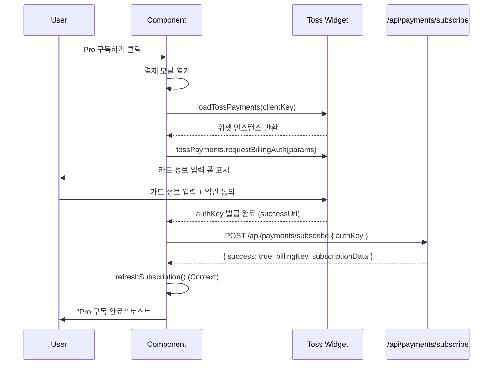

# 구독 관리 페이지 구현 계획 (Subscription Management Page)

**페이지**: `/subscription`
**문서 버전**: 1.0
**작성일**: 2025-10-25
**목적**: Pro 구독 신청, 취소, 재활성화, 해지 기능 구현

---

## 목차
1. [페이지 개요](#1-페이지-개요)
2. [구독 상태별 UI](#2-구독-상태별-ui)
3. [토스페이먼츠 위젯 통합](#3-토스페이먼츠-위젯-통합)
4. [BillingKey 관리](#4-billingkey-관리)
5. [구독 액션](#5-구독-액션)
6. [에러 처리](#6-에러-처리)
7. [구현 단계](#7-구현-단계)
8. [테스트 계획](#8-테스트-계획)

---

## 1. 페이지 개요

### 1.1 기본 정보

| 항목 | 내용 |
|------|------|
| 경로 | `/subscription` |
| 접근 조건 | Clerk 로그인 필요 |
| 레이아웃 | 공통 Header + Footer |
| 상태 관리 | SubscriptionContext 사용 |

### 1.2 핵심 기능

1. **구독 상태 조회**: 현재 플랜, 쿼터, 결제일 표시
2. **Pro 구독 신청**: 토스페이먼츠 위젯으로 카드 등록 및 첫 결제
3. **구독 취소**: 다음 결제일까지 Pro 유지 (예약 취소)
4. **재활성화**: 취소 철회 (결제일 전까지만 가능)
5. **즉시 해지**: BillingKey 삭제, 쿼터 0으로 초기화

### 1.3 참고 문서

- **PRD**: `docs/prd.md` 섹션 5.2.5.5 (구독 관리 페이지)
- **요구사항**: `docs/requirement.md` 섹션 4 (구독 정책), 섹션 8 (토스페이먼츠)
- **유스케이스**: `docs/usecases/6-subscription/spec.md`
- **유저플로우**: `docs/userflow.md` 섹션 7, 8
- **공통 모듈**: `docs/common-modules.md` (토스페이먼츠 클라이언트)
- **상태 관리**: `docs/pages/1-context-api-state/state.md`
- **데이터베이스**: `docs/database.md` (subscriptions 테이블)

---

## 2. 구독 상태별 UI

### 2.1 Free 플랜 (기본)

**상태 조건**: `planType = 'free'`

#### UI 구성

```typescript
interface FreeSubscriptionUI {
  header: "무료 플랜";
  quota: "3회"; // 또는 남은 횟수
  features: [
    "사주 분석 3회 제공",
    "Gemini Flash 모델 사용",
    "분석 이력 무제한 저장"
  ];
  cta: "Pro 플랜으로 업그레이드";
}
```

#### Pro 플랜 소개 섹션

```
━━━━━━━━━━━━━━━━━━━━━━━━━━━━━━━━━━━
            Pro 플랜 소개
━━━━━━━━━━━━━━━━━━━━━━━━━━━━━━━━━━━

✨ 월 10회 분석 가능
🚀 Gemini Pro 모델 (더욱 정교한 분석)
📊 상세한 대운/세운 해석
💰 월 9,900원 (부가세 포함)

[Pro 구독하기]
```

### 2.2 Pro 플랜 (활성)

**상태 조건**: `planType = 'pro'` && `status = 'active'`

#### UI 구성

```typescript
interface ProActiveUI {
  header: "Pro 플랜 활성";
  quota: "10회 / 월"; // 남은 횟수
  nextPaymentDate: "2025-11-25"; // 다음 결제일
  lastPaymentDate: "2025-10-25"; // 마지막 결제일
  billingAmount: "9,900원";
  actions: ["구독 취소"];
}
```

#### 레이아웃

```
━━━━━━━━━━━━━━━━━━━━━━━━━━━━━━━━━━━
           Pro 플랜 활성
━━━━━━━━━━━━━━━━━━━━━━━━━━━━━━━━━━━

[남은 횟수]     [다음 결제일]     [결제 금액]
   8회          2025-11-25      9,900원

[구독 정보]
- 플랜: Pro 플랜
- 상태: 활성
- 마지막 결제: 2025-10-25
- 결제 금액: 월 9,900원

[구독 취소]
```

### 2.3 Pro 플랜 (취소 예정)

**상태 조건**: `planType = 'pro'` && `status = 'cancelled'`

#### UI 구성

```typescript
interface ProCancelledUI {
  header: "구독 취소 예정";
  quota: "5회"; // 남은 횟수 (계속 사용 가능)
  endDate: "2025-11-25"; // 종료 예정일 (nextPaymentDate)
  cancelledAt: "2025-10-20"; // 취소 요청 시간
  actions: ["재활성화", "즉시 해지"];
}
```

#### 레이아웃

```
━━━━━━━━━━━━━━━━━━━━━━━━━━━━━━━━━━━
          구독 취소 예정
━━━━━━━━━━━━━━━━━━━━━━━━━━━━━━━━━━━

⚠️ 구독이 취소되었습니다

[남은 횟수]     [종료 예정일]
   5회          2025-11-25

[안내]
- 2025-11-25까지 Pro 기능을 계속 사용할 수 있습니다
- 종료일 이후 무료 플랜으로 전환됩니다
- 종료일 전까지 재활성화 가능합니다

[재활성화]  [즉시 해지]
```

### 2.4 구독 해지됨 (Terminated)

**상태 조건**: `status = 'terminated'`

#### UI 구성

```typescript
interface TerminatedUI {
  header: "구독 해지됨";
  quota: "0회";
  message: "구독이 해지되어 분석 서비스를 이용할 수 없습니다";
  cta: "다시 구독하기";
}
```

#### 레이아웃

```
━━━━━━━━━━━━━━━━━━━━━━━━━━━━━━━━━━━
           구독 해지됨
━━━━━━━━━━━━━━━━━━━━━━━━━━━━━━━━━━━

❌ 구독이 해지되었습니다

[안내]
- 분석 서비스를 이용하려면 다시 구독해주세요
- 재구독 시 결제 정보를 다시 입력해야 합니다

[다시 구독하기]
```

---

## 3. 토스페이먼츠 위젯 통합

### 3.1 위젯 로딩 플로우



### 3.2 토스페이먼츠 SDK 연동

#### 설치

```bash
npm install @tosspayments/payment-sdk
```

#### 클라이언트 컴포넌트 (결제 위젯)

**파일**: `src/features/subscription/components/toss-payment-widget.tsx`

```typescript
'use client';

import { loadTossPayments } from '@tosspayments/payment-sdk';
import { useAuth } from '@clerk/nextjs';
import { useState } from 'react';
import { toast } from 'sonner';
import { Button } from '@/components/ui/button';
import { Dialog, DialogContent } from '@/components/ui/dialog';

interface TossPaymentWidgetProps {
  onSuccess: () => void;
}

export function TossPaymentWidget({ onSuccess }: TossPaymentWidgetProps) {
  const { userId } = useAuth();
  const [isOpen, setIsOpen] = useState(false);
  const [isLoading, setIsLoading] = useState(false);

  const handlePayment = async () => {
    if (!userId) {
      toast.error('로그인이 필요합니다');
      return;
    }

    setIsLoading(true);

    try {
      // 1. 토스페이먼츠 SDK 로드
      const tossPayments = await loadTossPayments(
        process.env.NEXT_PUBLIC_TOSS_CLIENT_KEY!
      );

      // 2. BillingKey 발급 요청
      await tossPayments.requestBillingAuth({
        method: 'CARD',
        customerKey: userId,
        successUrl: `${window.location.origin}/subscription/callback?success=true`,
        failUrl: `${window.location.origin}/subscription/callback?success=false`,
      });
    } catch (error) {
      console.error('Payment error:', error);
      toast.error('결제 위젯을 불러올 수 없습니다');
      setIsLoading(false);
    }
  };

  return (
    <>
      <Button
        size="lg"
        onClick={() => setIsOpen(true)}
        className="w-full"
      >
        Pro 구독하기
      </Button>

      <Dialog open={isOpen} onOpenChange={setIsOpen}>
        <DialogContent>
          <div className="space-y-4">
            <h2 className="text-2xl font-bold">Pro 플랜 구독</h2>
            <div className="space-y-2">
              <p className="text-gray-700">✨ 월 10회 분석 가능</p>
              <p className="text-gray-700">🚀 Gemini Pro 모델 사용</p>
              <p className="text-gray-700">💰 월 9,900원 (부가세 포함)</p>
            </div>
            <Button
              onClick={handlePayment}
              disabled={isLoading}
              className="w-full"
            >
              {isLoading ? '로딩 중...' : '결제 진행'}
            </Button>
          </div>
        </DialogContent>
      </Dialog>
    </>
  );
}
```

### 3.3 결제 콜백 처리

**파일**: `src/app/subscription/callback/page.tsx`

```typescript
'use client';

import { useEffect } from 'react';
import { useRouter, useSearchParams } from 'next/navigation';
import { useSubscription } from '@/app/providers/subscription-provider';
import { toast } from 'sonner';

export default function PaymentCallbackPage() {
  const router = useRouter();
  const searchParams = useSearchParams();
  const { refreshSubscription } = useSubscription();

  useEffect(() => {
    const success = searchParams.get('success') === 'true';
    const authKey = searchParams.get('authKey');
    const customerKey = searchParams.get('customerKey');

    if (!success) {
      toast.error('결제가 취소되었습니다');
      router.push('/subscription');
      return;
    }

    if (!authKey || !customerKey) {
      toast.error('결제 정보가 올바르지 않습니다');
      router.push('/subscription');
      return;
    }

    // API 호출: BillingKey로 첫 결제 실행
    processPayment(authKey, customerKey);
  }, [searchParams, router, refreshSubscription]);

  const processPayment = async (authKey: string, customerKey: string) => {
    try {
      const response = await fetch('/api/payments/subscribe', {
        method: 'POST',
        headers: { 'Content-Type': 'application/json' },
        body: JSON.stringify({ authKey, customerKey }),
      });

      if (!response.ok) {
        const error = await response.json();
        throw new Error(error.message || '결제 처리 실패');
      }

      const data = await response.json();

      // Context 업데이트
      await refreshSubscription();

      toast.success('Pro 구독이 완료되었습니다!');
      router.push('/subscription');
    } catch (error) {
      console.error('Payment processing error:', error);
      toast.error(error instanceof Error ? error.message : '결제 처리 중 오류 발생');
      router.push('/subscription');
    }
  };

  return (
    <div className="flex items-center justify-center min-h-screen">
      <div className="text-center">
        <div className="animate-spin rounded-full h-12 w-12 border-b-2 border-purple-600 mx-auto mb-4" />
        <p className="text-gray-700">결제 처리 중...</p>
      </div>
    </div>
  );
}
```

---

## 4. BillingKey 관리

### 4.1 BillingKey 발급 API

**파일**: `src/app/api/payments/subscribe/route.ts`

```typescript
import { NextRequest, NextResponse } from 'next/server';
import { auth } from '@clerk/nextjs/server';
import { tossPayments } from '@/lib/toss-payments/client';
import { createSupabaseServerClient } from '@/lib/supabase/server-client';

export async function POST(req: NextRequest) {
  const { userId } = auth();
  if (!userId) {
    return NextResponse.json({ error: 'Unauthorized' }, { status: 401 });
  }

  const { authKey, customerKey } = await req.json();

  if (!authKey || !customerKey || customerKey !== userId) {
    return NextResponse.json({ error: 'Invalid request' }, { status: 400 });
  }

  try {
    // 1. BillingKey 발급
    const billingKey = await tossPayments.issueBillingKey(authKey, customerKey);

    // 2. 첫 결제 실행 (9,900원)
    const payment = await tossPayments.chargeBilling({
      billingKey,
      amount: 9900,
      orderName: '사주분석 Pro 구독',
      customerEmail: `${userId}@clerk.user`, // Clerk에서 이메일 조회 가능
      customerName: 'User', // 필요시 Clerk API로 조회
    });

    if (payment.status !== 'DONE') {
      throw new Error('Payment failed');
    }

    // 3. Supabase 구독 정보 업데이트
    const supabase = createSupabaseServerClient();
    const nextPaymentDate = new Date();
    nextPaymentDate.setMonth(nextPaymentDate.getMonth() + 1);

    const { error: updateError } = await supabase
      .from('subscriptions')
      .update({
        plan_type: 'pro',
        status: 'active',
        billing_key: billingKey,
        quota: 10,
        next_payment_date: nextPaymentDate.toISOString().split('T')[0],
        last_payment_date: new Date().toISOString().split('T')[0],
        updated_at: new Date().toISOString(),
      })
      .eq('clerk_user_id', userId);

    if (updateError) {
      console.error('Supabase update error:', updateError);
      // 결제는 성공했지만 DB 업데이트 실패 → 수동 처리 필요
      throw new Error('Failed to update subscription');
    }

    return NextResponse.json({ success: true, billingKey });
  } catch (error) {
    console.error('Payment error:', error);

    // 에러 발생 시 BillingKey 삭제 시도
    if (error instanceof Error && error.message.includes('billingKey')) {
      try {
        const billingKeyMatch = error.message.match(/billingKey: (\w+)/);
        if (billingKeyMatch) {
          await tossPayments.deleteBillingKey(billingKeyMatch[1]);
        }
      } catch (cleanupError) {
        console.error('Cleanup error:', cleanupError);
      }
    }

    return NextResponse.json(
      { error: error instanceof Error ? error.message : 'Payment failed' },
      { status: 500 }
    );
  }
}
```

### 4.2 BillingKey 삭제 (해지)

**파일**: `src/app/api/subscription/terminate/route.ts`

```typescript
import { NextRequest, NextResponse } from 'next/server';
import { auth } from '@clerk/nextjs/server';
import { tossPayments } from '@/lib/toss-payments/client';
import { createSupabaseServerClient } from '@/lib/supabase/server-client';

export async function POST(req: NextRequest) {
  const { userId } = auth();
  if (!userId) {
    return NextResponse.json({ error: 'Unauthorized' }, { status: 401 });
  }

  const supabase = createSupabaseServerClient();

  // 1. 현재 구독 정보 조회
  const { data: subscription, error: fetchError } = await supabase
    .from('subscriptions')
    .select('billing_key, status')
    .eq('clerk_user_id', userId)
    .single();

  if (fetchError || !subscription) {
    return NextResponse.json({ error: 'Subscription not found' }, { status: 404 });
  }

  if (subscription.status !== 'cancelled') {
    return NextResponse.json(
      { error: 'Only cancelled subscriptions can be terminated' },
      { status: 400 }
    );
  }

  if (!subscription.billing_key) {
    return NextResponse.json({ error: 'No billing key found' }, { status: 400 });
  }

  try {
    // 2. 토스페이먼츠 BillingKey 삭제
    await tossPayments.deleteBillingKey(subscription.billing_key);

    // 3. Supabase 업데이트
    const { error: updateError } = await supabase
      .from('subscriptions')
      .update({
        status: 'terminated',
        billing_key: null,
        quota: 0,
        next_payment_date: null,
        updated_at: new Date().toISOString(),
      })
      .eq('clerk_user_id', userId);

    if (updateError) {
      throw new Error('Failed to update subscription');
    }

    return NextResponse.json({ success: true });
  } catch (error) {
    console.error('Terminate error:', error);

    // BillingKey 삭제 실패 시에도 DB는 업데이트 (수동 처리 필요)
    await supabase
      .from('subscriptions')
      .update({
        status: 'terminated',
        billing_key: null,
        quota: 0,
        next_payment_date: null,
        updated_at: new Date().toISOString(),
      })
      .eq('clerk_user_id', userId);

    return NextResponse.json(
      { error: error instanceof Error ? error.message : 'Termination failed' },
      { status: 500 }
    );
  }
}
```

---

## 5. 구독 액션

### 5.1 구독 취소 (Cancel)

**API 엔드포인트**: `POST /api/subscription/cancel`

**파일**: `src/app/api/subscription/cancel/route.ts`

```typescript
import { NextRequest, NextResponse } from 'next/server';
import { auth } from '@clerk/nextjs/server';
import { createSupabaseServerClient } from '@/lib/supabase/server-client';

export async function POST(req: NextRequest) {
  const { userId } = auth();
  if (!userId) {
    return NextResponse.json({ error: 'Unauthorized' }, { status: 401 });
  }

  const supabase = createSupabaseServerClient();

  // 1. 현재 구독 상태 확인
  const { data: subscription, error: fetchError } = await supabase
    .from('subscriptions')
    .select('status, plan_type')
    .eq('clerk_user_id', userId)
    .single();

  if (fetchError || !subscription) {
    return NextResponse.json({ error: 'Subscription not found' }, { status: 404 });
  }

  if (subscription.plan_type !== 'pro' || subscription.status !== 'active') {
    return NextResponse.json(
      { error: 'Only active Pro subscriptions can be cancelled' },
      { status: 400 }
    );
  }

  // 2. 구독 상태 변경
  const { error: updateError } = await supabase
    .from('subscriptions')
    .update({
      status: 'cancelled',
      cancelled_at: new Date().toISOString(),
      updated_at: new Date().toISOString(),
    })
    .eq('clerk_user_id', userId);

  if (updateError) {
    return NextResponse.json({ error: 'Failed to cancel subscription' }, { status: 500 });
  }

  return NextResponse.json({ success: true });
}
```

### 5.2 재활성화 (Reactivate)

**API 엔드포인트**: `POST /api/subscription/reactivate`

**파일**: `src/app/api/subscription/reactivate/route.ts`

```typescript
import { NextRequest, NextResponse } from 'next/server';
import { auth } from '@clerk/nextjs/server';
import { createSupabaseServerClient } from '@/lib/supabase/server-client';

export async function POST(req: NextRequest) {
  const { userId } = auth();
  if (!userId) {
    return NextResponse.json({ error: 'Unauthorized' }, { status: 401 });
  }

  const supabase = createSupabaseServerClient();

  // 1. 현재 구독 상태 확인
  const { data: subscription, error: fetchError } = await supabase
    .from('subscriptions')
    .select('status, next_payment_date')
    .eq('clerk_user_id', userId)
    .single();

  if (fetchError || !subscription) {
    return NextResponse.json({ error: 'Subscription not found' }, { status: 404 });
  }

  if (subscription.status !== 'cancelled') {
    return NextResponse.json(
      { error: 'Only cancelled subscriptions can be reactivated' },
      { status: 400 }
    );
  }

  // 2. 결제일 전까지만 재활성화 가능
  const today = new Date().toISOString().split('T')[0];
  if (!subscription.next_payment_date || subscription.next_payment_date <= today) {
    return NextResponse.json(
      { error: 'Cannot reactivate after payment date' },
      { status: 400 }
    );
  }

  // 3. 구독 상태 복원
  const { error: updateError } = await supabase
    .from('subscriptions')
    .update({
      status: 'active',
      cancelled_at: null,
      updated_at: new Date().toISOString(),
    })
    .eq('clerk_user_id', userId);

  if (updateError) {
    return NextResponse.json({ error: 'Failed to reactivate subscription' }, { status: 500 });
  }

  return NextResponse.json({ success: true });
}
```

### 5.3 구독 상태 조회

**API 엔드포인트**: `GET /api/subscription/status`

**파일**: `src/app/api/subscription/status/route.ts`

```typescript
import { NextRequest, NextResponse } from 'next/server';
import { auth } from '@clerk/nextjs/server';
import { createSupabaseServerClient } from '@/lib/supabase/server-client';

export async function GET(req: NextRequest) {
  const { userId } = auth();
  if (!userId) {
    return NextResponse.json({ error: 'Unauthorized' }, { status: 401 });
  }

  const supabase = createSupabaseServerClient();

  const { data: subscription, error } = await supabase
    .from('subscriptions')
    .select('plan_type, quota, status, next_payment_date, last_payment_date, cancelled_at')
    .eq('clerk_user_id', userId)
    .single();

  if (error) {
    return NextResponse.json({ error: 'Subscription not found' }, { status: 404 });
  }

  return NextResponse.json({
    planType: subscription.plan_type,
    quota: subscription.quota,
    status: subscription.status,
    nextPaymentDate: subscription.next_payment_date,
    lastPaymentDate: subscription.last_payment_date,
    cancelledAt: subscription.cancelled_at,
  });
}
```

---

## 6. 에러 처리

### 6.1 에러 시나리오 및 처리

| 시나리오 | HTTP 상태 | 메시지 | 처리 방법 |
|---------|----------|--------|----------|
| 로그인하지 않음 | 401 | "로그인이 필요합니다" | 로그인 페이지로 리다이렉트 |
| 이미 Pro 구독 중 | 400 | "이미 Pro 구독 중입니다" | 현재 구독 정보 표시 |
| 결제 실패 (카드 오류) | 400 | "{토스 에러 메시지}" | 재시도 유도 |
| BillingKey 발급 실패 | 500 | "결제 수단 등록에 실패했습니다" | 고객센터 안내 |
| 취소 불가 상태 | 400 | "활성 구독만 취소할 수 있습니다" | 현재 상태 표시 |
| 재활성화 불가 (결제일 초과) | 400 | "결제일이 지나 재활성화할 수 없습니다" | 재구독 유도 |
| BillingKey 삭제 실패 | 500 | "해지 처리 중 오류 발생" | 로그 기록, 관리자 알림 |

### 6.2 토스페이먼츠 에러 코드 매핑

```typescript
// src/lib/toss-payments/errors.ts
export const TOSS_ERROR_MESSAGES: Record<string, string> = {
  CARD_LIMIT_EXCEEDED: '카드 한도를 초과했습니다',
  INVALID_CARD: '유효하지 않은 카드입니다',
  LOST_CARD: '분실/정지된 카드입니다',
  INSUFFICIENT_BALANCE: '잔액이 부족합니다',
  EXPIRED_CARD: '유효기간이 만료된 카드입니다',
  INVALID_CVC: 'CVC 번호가 올바르지 않습니다',
  NETWORK_ERROR: '네트워크 오류가 발생했습니다',
  UNKNOWN_ERROR: '알 수 없는 오류가 발생했습니다',
};

export function parseTossError(error: any): string {
  const errorCode = error?.code || 'UNKNOWN_ERROR';
  return TOSS_ERROR_MESSAGES[errorCode] || TOSS_ERROR_MESSAGES.UNKNOWN_ERROR;
}
```

### 6.3 클라이언트 에러 처리

**파일**: `src/features/subscription/components/subscription-actions.tsx`

```typescript
'use client';

import { useState } from 'react';
import { toast } from 'sonner';
import { useSubscription } from '@/app/providers/subscription-provider';
import { Button } from '@/components/ui/button';
import {
  AlertDialog,
  AlertDialogContent,
  AlertDialogHeader,
  AlertDialogFooter,
  AlertDialogTitle,
  AlertDialogDescription,
  AlertDialogAction,
  AlertDialogCancel,
} from '@/components/ui/alert-dialog';

interface SubscriptionActionsProps {
  status: 'active' | 'cancelled' | 'terminated';
  nextPaymentDate?: string;
}

export function SubscriptionActions({ status, nextPaymentDate }: SubscriptionActionsProps) {
  const { refreshSubscription } = useSubscription();
  const [isLoading, setIsLoading] = useState(false);
  const [showCancelDialog, setShowCancelDialog] = useState(false);
  const [showTerminateDialog, setShowTerminateDialog] = useState(false);

  const handleCancel = async () => {
    setIsLoading(true);
    try {
      const response = await fetch('/api/subscription/cancel', { method: 'POST' });

      if (!response.ok) {
        const error = await response.json();
        throw new Error(error.error || '취소 실패');
      }

      await refreshSubscription();
      toast.success(`구독이 취소되었습니다. ${nextPaymentDate}까지 Pro 기능을 사용할 수 있습니다.`);
    } catch (error) {
      toast.error(error instanceof Error ? error.message : '구독 취소 중 오류 발생');
    } finally {
      setIsLoading(false);
      setShowCancelDialog(false);
    }
  };

  const handleReactivate = async () => {
    setIsLoading(true);
    try {
      const response = await fetch('/api/subscription/reactivate', { method: 'POST' });

      if (!response.ok) {
        const error = await response.json();
        throw new Error(error.error || '재활성화 실패');
      }

      await refreshSubscription();
      toast.success('구독이 재활성화되었습니다');
    } catch (error) {
      toast.error(error instanceof Error ? error.message : '재활성화 중 오류 발생');
    } finally {
      setIsLoading(false);
    }
  };

  const handleTerminate = async () => {
    setIsLoading(true);
    try {
      const response = await fetch('/api/subscription/terminate', { method: 'POST' });

      if (!response.ok) {
        const error = await response.json();
        throw new Error(error.error || '해지 실패');
      }

      await refreshSubscription();
      toast.success('구독이 해지되었습니다');
    } catch (error) {
      toast.error(error instanceof Error ? error.message : '해지 처리 중 오류 발생');
    } finally {
      setIsLoading(false);
      setShowTerminateDialog(false);
    }
  };

  if (status === 'active') {
    return (
      <>
        <Button variant="destructive" onClick={() => setShowCancelDialog(true)}>
          구독 취소
        </Button>

        <AlertDialog open={showCancelDialog} onOpenChange={setShowCancelDialog}>
          <AlertDialogContent>
            <AlertDialogHeader>
              <AlertDialogTitle>구독을 취소하시겠습니까?</AlertDialogTitle>
              <AlertDialogDescription>
                - 다음 결제일({nextPaymentDate})까지 Pro 기능을 계속 사용할 수 있습니다
                <br />
                - 결제일 전까지 언제든지 재활성화할 수 있습니다
                <br />
                - 결제일 이후에는 무료 플랜으로 전환됩니다
              </AlertDialogDescription>
            </AlertDialogHeader>
            <AlertDialogFooter>
              <AlertDialogCancel>취소</AlertDialogCancel>
              <AlertDialogAction onClick={handleCancel} disabled={isLoading}>
                확인
              </AlertDialogAction>
            </AlertDialogFooter>
          </AlertDialogContent>
        </AlertDialog>
      </>
    );
  }

  if (status === 'cancelled') {
    return (
      <div className="flex gap-4">
        <Button onClick={handleReactivate} disabled={isLoading}>
          재활성화
        </Button>
        <Button
          variant="destructive"
          onClick={() => setShowTerminateDialog(true)}
          disabled={isLoading}
        >
          즉시 해지
        </Button>

        <AlertDialog open={showTerminateDialog} onOpenChange={setShowTerminateDialog}>
          <AlertDialogContent>
            <AlertDialogHeader>
              <AlertDialogTitle>구독을 즉시 해지하시겠습니까?</AlertDialogTitle>
              <AlertDialogDescription className="text-red-600">
                ⚠️ 경고:
                <br />
                - 남은 기간에 상관없이 즉시 무료 플랜으로 전환됩니다
                <br />
                - 남은 분석 횟수가 모두 삭제됩니다
                <br />
                - 저장된 결제 정보(BillingKey)가 삭제됩니다
                <br />
                - 재구독 시 결제 정보를 다시 입력해야 합니다
              </AlertDialogDescription>
            </AlertDialogHeader>
            <AlertDialogFooter>
              <AlertDialogCancel>취소</AlertDialogCancel>
              <AlertDialogAction onClick={handleTerminate} disabled={isLoading}>
                해지하기
              </AlertDialogAction>
            </AlertDialogFooter>
          </AlertDialogContent>
        </AlertDialog>
      </div>
    );
  }

  return null;
}
```

---

## 7. 구현 단계

### Phase 1: 페이지 구조 및 상태 조회 (2-3시간)

**작업 목록**:
1. 페이지 파일 생성: `src/app/subscription/page.tsx`
2. 구독 상태 조회 API 구현: `src/app/api/subscription/status/route.ts`
3. SubscriptionContext 사용하여 초기 데이터 로딩
4. 4가지 상태별 UI 컴포넌트 구현:
   - `FreeSubscriptionView`
   - `ProActiveView`
   - `ProCancelledView`
   - `TerminatedView`

**검증**:
- [ ] Free 사용자 접속 시 "Pro 플랜 소개" 표시
- [ ] Pro 사용자 접속 시 현재 구독 정보 표시
- [ ] 취소 예정 사용자 접속 시 종료일 표시
- [ ] 해지된 사용자 접속 시 재구독 유도 표시

### Phase 2: 토스페이먼츠 위젯 통합 (4-5시간)

**작업 목록**:
1. 토스페이먼츠 SDK 설치 및 클라이언트 설정
2. 결제 위젯 컴포넌트 구현: `TossPaymentWidget`
3. 결제 콜백 페이지 구현: `src/app/subscription/callback/page.tsx`
4. BillingKey 발급 API 구현: `src/app/api/payments/subscribe/route.ts`
5. 토스페이먼츠 클라이언트 라이브러리 구현: `src/lib/toss-payments/client.ts`

**검증**:
- [ ] "Pro 구독하기" 버튼 클릭 시 결제 위젯 로딩
- [ ] 카드 정보 입력 후 authKey 발급 성공
- [ ] 첫 결제 9,900원 정상 처리
- [ ] Supabase subscriptions 테이블 업데이트 확인
- [ ] Context 자동 새로고침 확인

### Phase 3: 구독 액션 구현 (3-4시간)

**작업 목록**:
1. 구독 취소 API: `src/app/api/subscription/cancel/route.ts`
2. 재활성화 API: `src/app/api/subscription/reactivate/route.ts`
3. 즉시 해지 API: `src/app/api/subscription/terminate/route.ts`
4. 액션 버튼 컴포넌트: `SubscriptionActions`
5. 확인 모달 (AlertDialog) 통합

**검증**:
- [ ] 활성 구독 취소 시 status='cancelled' 업데이트
- [ ] 취소 예정 구독 재활성화 시 status='active' 복원
- [ ] 즉시 해지 시 BillingKey 삭제 및 quota=0 확인
- [ ] 결제일 초과 후 재활성화 시도 시 에러 표시

### Phase 4: 에러 처리 및 UI 개선 (2-3시간)

**작업 목록**:
1. 토스페이먼츠 에러 메시지 매핑: `src/lib/toss-payments/errors.ts`
2. 클라이언트 에러 토스트 메시지 통합
3. 로딩 상태 표시 (Spinner, Skeleton)
4. 반응형 디자인 적용 (모바일/태블릿/데스크톱)
5. 접근성 개선 (ARIA 라벨, 키보드 네비게이션)

**검증**:
- [ ] 결제 실패 시 사용자 친화적 메시지 표시
- [ ] 모든 버튼에 로딩 상태 표시
- [ ] 모바일에서 정상 작동
- [ ] 키보드로 모든 액션 접근 가능

### Phase 5: 통합 테스트 및 최적화 (2-3시간)

**작업 목록**:
1. E2E 테스트 시나리오 실행
2. 성능 최적화 (불필요한 리렌더링 제거)
3. 에러 로깅 및 모니터링 설정
4. 문서화 (README, 주석)

**검증**:
- [ ] Free → Pro 구독 전체 플로우 성공
- [ ] Pro 구독 취소 → 재활성화 플로우 성공
- [ ] Pro 구독 즉시 해지 플로우 성공
- [ ] 동시 요청 처리 (쿼터 차감과 충돌 없음)
- [ ] Context 업데이트 지연 없음

**총 예상 시간**: 13-18시간 (약 2-3일)

---

## 8. 테스트 계획

### 8.1 단위 테스트

**파일**: `src/features/subscription/__tests__/subscription-actions.test.tsx`

```typescript
import { render, screen, fireEvent, waitFor } from '@testing-library/react';
import { SubscriptionActions } from '../components/subscription-actions';
import { toast } from 'sonner';

jest.mock('sonner');
jest.mock('@/app/providers/subscription-provider', () => ({
  useSubscription: () => ({
    refreshSubscription: jest.fn(),
  }),
}));

describe('SubscriptionActions', () => {
  beforeEach(() => {
    global.fetch = jest.fn();
  });

  it('should show cancel button for active subscription', () => {
    render(<SubscriptionActions status="active" nextPaymentDate="2025-11-25" />);
    expect(screen.getByText('구독 취소')).toBeInTheDocument();
  });

  it('should show reactivate and terminate buttons for cancelled subscription', () => {
    render(<SubscriptionActions status="cancelled" nextPaymentDate="2025-11-25" />);
    expect(screen.getByText('재활성화')).toBeInTheDocument();
    expect(screen.getByText('즉시 해지')).toBeInTheDocument();
  });

  it('should call cancel API when confirmed', async () => {
    (global.fetch as jest.Mock).mockResolvedValueOnce({
      ok: true,
      json: async () => ({ success: true }),
    });

    render(<SubscriptionActions status="active" nextPaymentDate="2025-11-25" />);

    fireEvent.click(screen.getByText('구독 취소'));
    fireEvent.click(screen.getByText('확인'));

    await waitFor(() => {
      expect(global.fetch).toHaveBeenCalledWith('/api/subscription/cancel', { method: 'POST' });
      expect(toast.success).toHaveBeenCalled();
    });
  });
});
```

### 8.2 통합 테스트

**시나리오 1: Free → Pro 구독**

```typescript
// cypress/e2e/subscription.cy.ts
describe('Subscription Flow', () => {
  beforeEach(() => {
    cy.login('testuser@example.com'); // Clerk 로그인
  });

  it('should complete Pro subscription', () => {
    cy.visit('/subscription');

    // 1. Free 플랜 확인
    cy.contains('무료 플랜').should('exist');
    cy.contains('3회').should('exist');

    // 2. Pro 구독하기 클릭
    cy.contains('Pro 구독하기').click();

    // 3. 토스 위젯에서 테스트 카드 입력
    cy.get('input[name="cardNumber"]').type('4111111111111111');
    cy.get('input[name="expiryMonth"]').type('12');
    cy.get('input[name="expiryYear"]').type('25');
    cy.get('input[name="cvc"]').type('123');

    // 4. 결제 진행
    cy.contains('결제 진행').click();

    // 5. 콜백 페이지에서 처리 대기
    cy.url().should('include', '/subscription/callback');
    cy.contains('결제 처리 중...').should('exist');

    // 6. 완료 후 구독 페이지로 이동
    cy.url().should('include', '/subscription');
    cy.contains('Pro 플랜 활성').should('exist');
    cy.contains('10회').should('exist');
  });
});
```

**시나리오 2: Pro 구독 취소 → 재활성화**

```typescript
it('should cancel and reactivate subscription', () => {
  cy.visit('/subscription');

  // 1. 활성 구독 확인
  cy.contains('Pro 플랜 활성').should('exist');

  // 2. 구독 취소
  cy.contains('구독 취소').click();
  cy.contains('확인').click();

  // 3. 취소 예정 상태 확인
  cy.contains('구독 취소 예정').should('exist');
  cy.contains('재활성화').should('exist');

  // 4. 재활성화
  cy.contains('재활성화').click();

  // 5. 활성 상태 복원 확인
  cy.contains('Pro 플랜 활성').should('exist');
  cy.contains('구독 취소').should('exist');
});
```

### 8.3 성능 테스트

**목표**:
- 페이지 로딩 시간: < 1초
- 구독 상태 조회 API: < 500ms
- 결제 처리: < 5초
- Context 업데이트: < 100ms

**측정 도구**:
- Lighthouse (성능 점수 90+ 목표)
- Next.js 내장 Performance 모니터링
- Vercel Analytics

### 8.4 엣지 케이스 테스트

| 시나리오 | 예상 동작 | 검증 방법 |
|---------|----------|----------|
| 동시 구독 취소 요청 | 첫 요청만 성공, 나머지 400 에러 | 동시 fetch 2회 실행 |
| 결제일 당일 재활성화 시도 | 400 에러 (불가능) | next_payment_date=TODAY 설정 후 시도 |
| BillingKey 삭제 실패 | DB는 업데이트, 로그 기록 | 토스 API 모킹으로 에러 발생 |
| 네트워크 타임아웃 | 재시도 유도 메시지 | fetch timeout 시뮬레이션 |
| 중복 결제 시도 | "이미 구독 중" 메시지 | plan_type='pro' 상태에서 결제 시도 |

---

## 9. 주의사항

### 9.1 보안

- **BillingKey**: 절대 클라이언트 응답에 포함하지 않음 (서버 측에서만 사용)
- **API 인증**: 모든 API 엔드포인트에서 Clerk `auth()` 검증 필수
- **CSRF 보호**: Next.js 내장 CSRF 보호 활용
- **SQL Injection**: Supabase 클라이언트 사용 (파라미터화된 쿼리)

### 9.2 UX

- **즉각적 피드백**: 모든 액션에 토스트 메시지 표시
- **명확한 안내**: 취소/해지 차이를 명확히 설명
- **복구 경로**: 실패 시 "다시 시도" 또는 "고객센터 문의" 버튼 제공
- **로딩 상태**: 비동기 작업 중 버튼 비활성화 및 스피너 표시

### 9.3 성능

- **Context 최적화**: useMemo, useCallback 사용
- **불필요한 리렌더링 방지**: React.memo 적용
- **낙관적 업데이트**: refreshSubscription 전에 UI 즉시 반영
- **이미지 최적화**: Next.js Image 컴포넌트 사용

### 9.4 접근성

- **키보드 네비게이션**: Tab, Enter로 모든 액션 접근 가능
- **ARIA 라벨**: 모든 버튼에 적절한 aria-label 제공
- **색상 대비**: WCAG AA 기준 준수 (4.5:1)
- **포커스 표시**: focus-visible 스타일 적용

---

## 10. 참고 자료

### 10.1 토스페이먼츠 공식 문서

- [BillingKey 발급](https://docs.tosspayments.com/reference/billing#billing-key-%EB%B0%9C%EA%B8%89)
- [정기 결제](https://docs.tosspayments.com/reference/billing#%EC%A0%95%EA%B8%B0-%EA%B2%B0%EC%A0%9C)
- [BillingKey 삭제](https://docs.tosspayments.com/reference/billing#billing-key-%EC%82%AD%EC%A0%9C)
- [에러 코드](https://docs.tosspayments.com/reference/error-codes)

### 10.2 관련 파일

- **공통 모듈**: `src/lib/toss-payments/client.ts`
- **상태 관리**: `src/app/providers/subscription-provider.tsx`
- **데이터베이스**: `supabase/migrations/0001_create_initial_schema.sql`
- **유스케이스**: `docs/usecases/6-subscription/spec.md`

### 10.3 디자인 참고

- Airbnb 구독 관리 페이지
- Netflix 멤버십 관리
- Spotify Premium 구독

---

## 문서 정보

- **버전**: 1.0
- **작성일**: 2025-10-25
- **작성자**: Claude Code
- **검토자**: -
- **참고 문서**:
  - `docs/prd.md` (PRD 문서)
  - `docs/requirement.md` (요구사항 명세)
  - `docs/userflow.md` (사용자 플로우)
  - `docs/usecases/6-subscription/spec.md` (구독 유스케이스)
  - `docs/common-modules.md` (공통 모듈)
  - `docs/pages/1-context-api-state/state.md` (상태 관리)
  - `docs/database.md` (데이터베이스 설계)
- **다음 단계**:
  - Phase 1부터 순차적으로 구현
  - 각 Phase 완료 시 검증 체크리스트 확인
  - 최종 통합 테스트 실행
