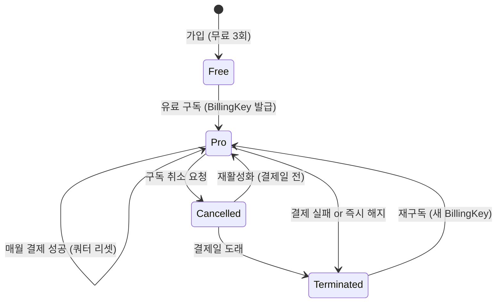
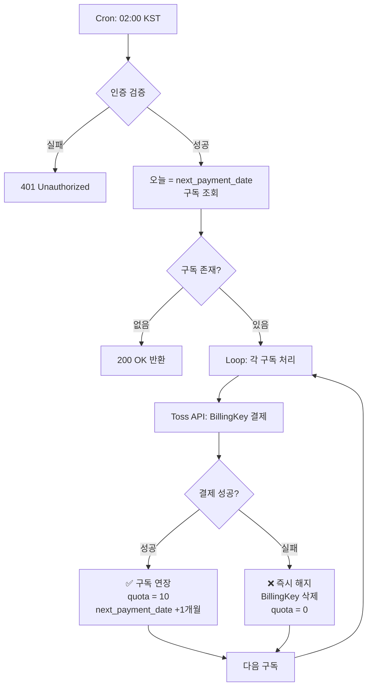
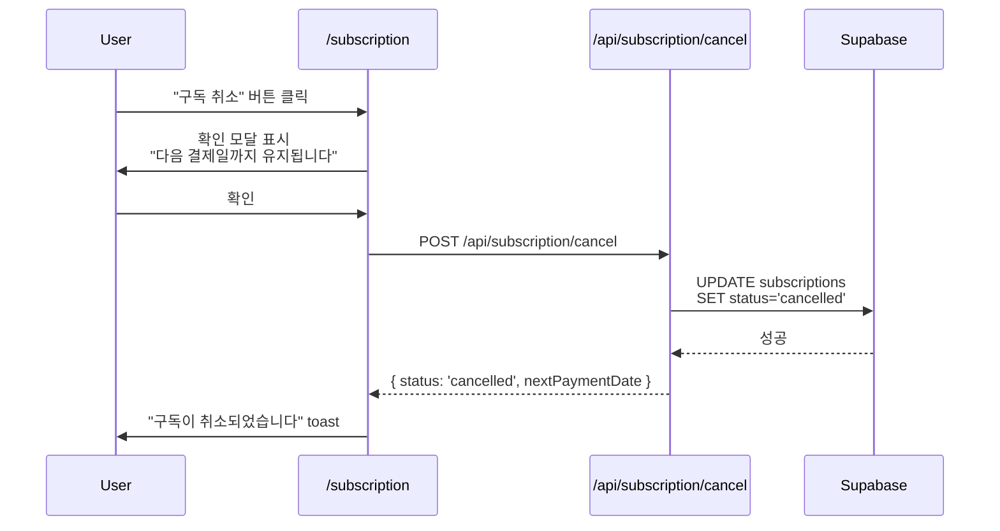
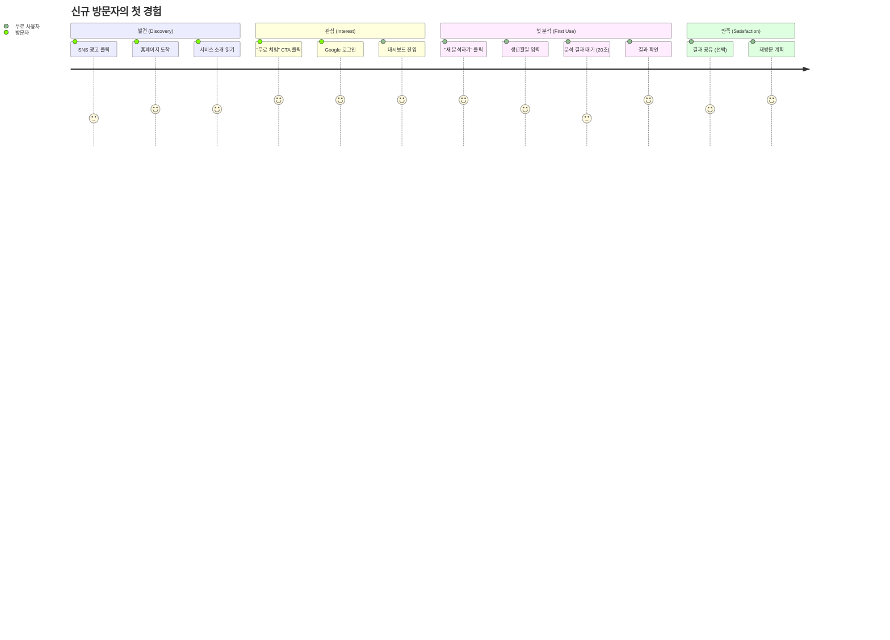
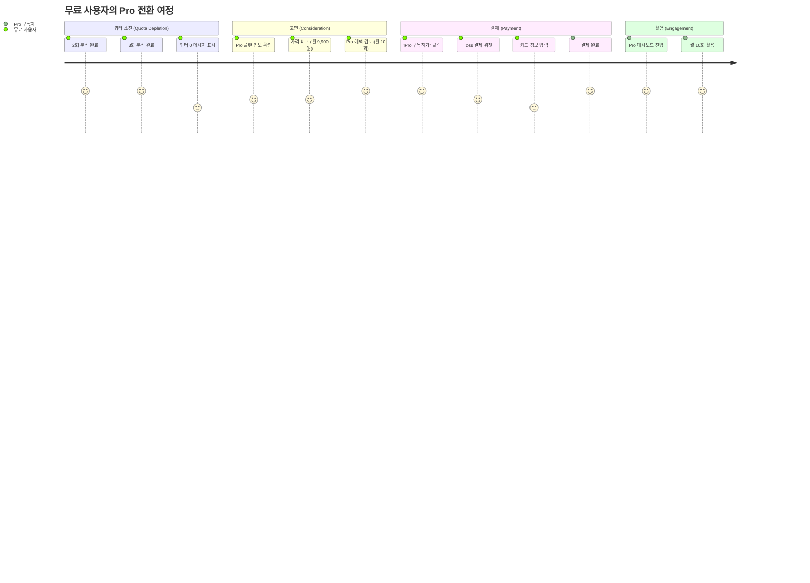
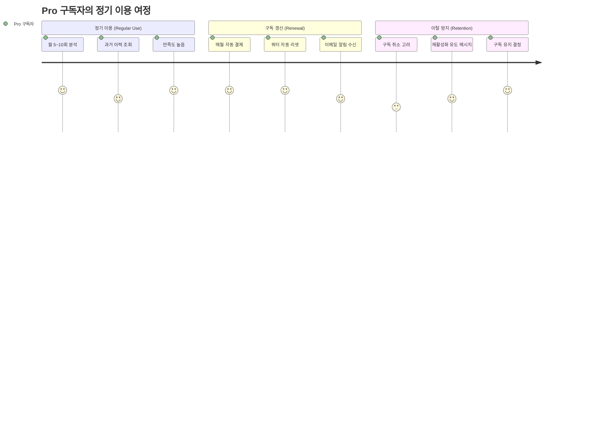

# 📋 Product Requirements Document (PRD)
## 구독제 사주분석 서비스

**문서 버전**: 1.0
**작성일**: 2025-10-25
**프로젝트명**: supernext-saju
**배포 환경**: Vercel

---

## 1. 제품 개요 (Product Overview)

### 1.1 서비스 개요

**구독제 사주분석 서비스**는 AI 기술(Gemini API)을 활용하여 사용자의 생년월일시 정보를 기반으로 전통적인 사주팔자 분석을 제공하는 SaaS 플랫폼입니다. 무료 체험과 프리미엄 구독 모델을 통해 사용자에게 차별화된 가치를 제공합니다.

### 1.2 핵심 가치 제안 (Value Proposition)

| 대상 | 문제점 | 해결책 | 가치 |
|------|-------|-------|------|
| 🔰 **처음 접하는 사용자** | 사주풀이 비용 부담, 접근성 낮음 | 무료 3회 체험 제공 | 부담 없는 첫 경험 |
| 💎 **관심 있는 사용자** | 정기적 상담 비용 과다 | 월 9,900원 정액제 (10회) | 비용 효율성 60% 향상 |
| 🤖 **현대적 사용자** | 시간/장소 제약, 프라이버시 우려 | 24시간 온라인 분석, 익명성 보장 | 편의성 + 프라이버시 |

### 1.3 기술 스택

**Base Template**: EasyNext (Upgraded)

| 레이어 | 기술 | 버전 | 역할 |
|-------|------|------|------|
| **프레임워크** | Next.js (App Router) | 15.x | 서버/클라이언트 렌더링 |
| **언어** | TypeScript | 5.x | 타입 안전성 |
| **인증** | Clerk SDK + Webhook | Latest | OAuth, 세션 관리 |
| **데이터베이스** | Supabase (PostgreSQL) | Latest | 데이터 저장, Cron |
| **결제** | Toss Payments API | v1 | 정기 구독 결제 |
| **AI 분석** | Gemini 2.5 Flash/Pro | Latest | 사주 분석 자동화 |
| **상태 관리** | Context API | - | 구독 정보 관리 |
| **스타일링** | Tailwind CSS + shadcn/ui | Latest | 디자인 시스템 |
| **배포** | Vercel | - | CI/CD, 호스팅 |

### 1.4 아키텍처 원칙

```
┌──────────────────────────────────────────────────────┐
│                    User Interface                     │
│              (Next.js 15 + React 19)                 │
└────────────────┬─────────────────────────────────────┘
                 │
     ┌───────────┴───────────┐
     │                       │
┌────▼────┐           ┌─────▼──────┐
│  Clerk  │           │  Context   │
│   SDK   │           │    API     │
└────┬────┘           └─────┬──────┘
     │                      │
     │         ┌────────────┴──────────┐
     │         │                       │
┌────▼─────────▼────┐         ┌───────▼────────┐
│  Next.js API      │         │   Supabase     │
│  (/api/*)         │◄────────┤   PostgreSQL   │
└────┬──────────────┘         └───────┬────────┘
     │                                │
     │                         ┌──────▼────────┐
     │                         │ Supabase Cron │
     │                         │  (02:00 KST)  │
     │                         └───────────────┘
     │
┌────┴─────────┬─────────────┐
│              │             │
▼              ▼             ▼
Toss         Gemini       Clerk
Payments     API          Webhook
```

**핵심 설계 결정**:
- ✅ **인증**: Clerk SDK (EasyNext의 Supabase Auth 대체)
- ✅ **DB**: Supabase (인증 제외, 데이터 저장 + Cron 전용)
- ✅ **상태 관리**: Context API (Flux는 선택사항)

---

## 2. 목표 및 성공 지표 (Goals & Success Metrics)

### 2.1 비즈니스 목표

| 목표 | 지표 (KPI) | 측정 방법 | 목표치 (3개월) |
|------|-----------|----------|---------------|
| **신규 사용자 획득** | 무료 가입자 수 | Clerk 가입 이벤트 | 1,000명 |
| **유료 전환율** | Free → Pro 전환 비율 | (Pro 구독자 / 전체 가입자) × 100 | 15% |
| **구독 유지율** | MRR (Monthly Recurring Revenue) | 월간 반복 매출 | 150만원 |
| **서비스 만족도** | 평균 분석 완료율 | 완료된 분석 수 / 시작한 분석 수 | 85% |
| **기술 안정성** | 시스템 가용성 | Uptime (%) | 99.5% |

### 2.2 사용자 목표

| 사용자 유형 | 주요 목표 | 성공 지표 |
|-----------|----------|----------|
| **무료 사용자** | 서비스 체험 후 가치 확인 | 3회 중 2회 이상 분석 완료 |
| **Pro 구독자** | 정기적 사주풀이 이용 | 월 평균 5회 이상 분석 이용 |
| **관리자** | 안정적 결제 자동화 | 정기결제 성공률 95% 이상 |

### 2.3 기술 목표

- ✅ **Clerk 인증 연동**: Google OAuth 로그인 오류율 < 1%
- ✅ **Gemini API 안정성**: 분석 완료율 > 95%
- ✅ **결제 자동화**: Cron 정기결제 성공률 > 95%
- ✅ **응답 속도**: 분석 결과 생성 < 30초 (p95)

---

## 3. 이해관계자 (Stakeholders)

### 3.1 내부 이해관계자

| 역할 | 책임 | 주요 관심사 |
|------|------|-----------|
| **Product Owner** | 제품 전략, 우선순위 결정 | 사용자 만족도, 매출 증대 |
| **개발팀** | 기능 구현, 기술 안정성 | 코드 품질, 시스템 확장성 |
| **디자이너** | UI/UX 설계, 브랜딩 | 사용자 경험, 접근성 |
| **운영팀** | 고객 지원, 모니터링 | 시스템 안정성, 응답 시간 |

### 3.2 외부 이해관계자

| 이해관계자 | 관계 | 영향 |
|----------|------|------|
| **사용자 (무료)** | 서비스 이용자 | 체험 품질 → 유료 전환 결정 |
| **사용자 (Pro)** | 구독 고객 | 만족도 → 구독 유지/해지 결정 |
| **결제 파트너** | Toss Payments | 결제 안정성, 수수료 |
| **AI 파트너** | Google (Gemini API) | API 품질, 비용 |
| **인증 파트너** | Clerk | 인증 안정성, 컴플라이언스 |

---

## 4. 사용자 페르소나 (User Personas)

### 4.1 페르소나 #1: 호기심 많은 체험자 (Curious Explorer)

**김민준 (27세, 직장인)**

**배경**:
- 최근 사주에 대한 관심 증가
- SNS에서 사주 콘텐츠 자주 접함
- 오프라인 상담은 비용/시간 부담으로 망설임

**목표**:
- 부담 없이 사주풀이 체험
- 빠르고 편리한 온라인 접근
- 정확도 확인 후 유료 전환 고려

**페인 포인트**:
- 오프라인 상담 비용 3~5만원 부담
- 예약 및 방문 시간 제약
- 개인정보 노출 우려

**사용 시나리오**:
1. Google 로그인으로 간편 가입
2. 무료 3회로 자신/가족 분석 시도
3. 만족 시 Pro 구독 전환

**기대 가치**:
- 무료 체험으로 위험 부담 제거
- 24시간 언제든 즉시 이용
- 익명성 보장

---

### 4.2 페르소나 #2: 충성 구독자 (Loyal Subscriber)

**이수진 (34세, 프리랜서)**

**배경**:
- 1년 이상 사주/타로에 관심
- 월 1~2회 정기적으로 운세 확인
- 오프라인 상담 누적 비용 50만원 이상 지출

**목표**:
- 정기 구독으로 비용 절감
- 언제든 즉시 분석 가능
- 과거 분석 이력 관리

**페인 포인트**:
- 오프라인 상담 누적 비용 부담 (월 6~10만원)
- 상담사마다 결과 편차 큼
- 과거 상담 내용 분실

**사용 시나리오**:
1. 무료 체험 후 가치 확인
2. Pro 구독 (월 9,900원) 결제
3. 월 10회 한도 내에서 주기적 분석
4. 대시보드에서 과거 분석 이력 조회

**기대 가치**:
- 비용 70% 절감 (월 10만원 → 9,900원)
- 일관된 분석 품질 (동일 AI 모델)
- 분석 이력 자동 보관

---

### 4.3 페르소나 #3: 회의적 관찰자 (Skeptical Observer)

**박지훈 (41세, IT 종사자)**

**배경**:
- 기술 기반 서비스에 익숙
- 사주에 대한 과학적 의구심
- 하지만 문화적 호기심은 존재

**목표**:
- AI 기술의 사주 해석 품질 검증
- 무료 체험으로 서비스 평가
- 가족 선물용 구독 고려

**페인 포인트**:
- 전통적 사주풀이의 주관성 불신
- 결제 정보 입력 부담
- 서비스 품질 불확실성

**사용 시나리오**:
1. Google 로그인만으로 시작 (결제 정보 불필요)
2. 무료 3회로 AI 분석 품질 평가
3. 만족 시 가족용 Pro 구독 선물

**기대 가치**:
- 결제 없이 완전한 기능 체험
- AI 기반 일관된 분석 로직
- 투명한 모델 정보 공개 (Flash/Pro)

---

### 4.4 페르소나 요약 비교

| 구분 | 호기심 체험자 | 충성 구독자 | 회의적 관찰자 |
|------|-------------|-----------|-------------|
| **연령대** | 20대 | 30대 | 40대 |
| **사주 관심도** | 낮음 → 중간 | 높음 | 낮음 |
| **기술 친숙도** | 높음 | 중간 | 매우 높음 |
| **주요 동기** | 호기심, 트렌드 | 정기적 운세 확인 | 기술 검증 |
| **가격 민감도** | 높음 | 중간 | 낮음 |
| **전환 가능성** | 30% | 80% | 50% |
| **목표 플랜** | Free → Pro | Pro (장기) | Free → 선물 구독 |

---

## 5. 핵심 기능 (Core Features)

### 5.1 기능 우선순위 (MoSCoW)

| 우선순위 | 기능 | 설명 | 평가 영향 |
|---------|------|------|----------|
| **Must Have** | Google OAuth 로그인 | Clerk SDK 기반 인증 | ✅ 필수 |
| **Must Have** | 무료 3회 체험 | 가입 시 자동 부여 | ✅ 필수 |
| **Must Have** | Pro 구독 결제 | Toss Payments BillingKey | ✅ 필수 |
| **Must Have** | 사주 분석 (AI) | Gemini Flash/Pro 모델 | ✅ 필수 |
| **Must Have** | 구독 관리 페이지 | 취소/재활성화/해지 | ✅ 필수 |
| **Must Have** | 정기결제 자동화 | Supabase Cron (02:00) | ✅ 필수 |
| **Should Have** | 분석 이력 조회 | 대시보드에서 과거 분석 보기 | ⚠️ 권장 |
| **Should Have** | 에러 핸들링 | 결제 실패, API 오류 처리 | ⚠️ 권장 |
| **Could Have** | 프로필 사진 업로드 | Clerk UserProfile 확장 | 🎁 가산점 |
| **Could Have** | 분석 결과 공유 | SNS 공유 기능 | 🎁 가산점 |
| **Won't Have** | 실시간 채팅 상담 | v1.0 범위 외 | - |
| **Won't Have** | 타로/궁합 분석 | v1.0 범위 외 | - |

---

### 5.2 기능별 상세 명세

#### 5.2.1 인증 (Authentication)

**담당 서비스**: Clerk SDK + Webhook

| 기능 | 구현 방식 | Clerk 이벤트 | Supabase 동기화 |
|------|----------|-------------|----------------|
| **Google 로그인** | `<SignIn />` 컴포넌트 | `user.created` | `users` 테이블 INSERT |
| **세션 관리** | `useUser()`, `useAuth()` 훅 | - | - |
| **프로필 수정** | `<UserProfile />` 컴포넌트 | `user.updated` | `users` 테이블 UPDATE |
| **회원 탈퇴** | Clerk Dashboard | `user.deleted` | CASCADE DELETE |

**Webhook 동기화 플로우**:
```
[사용자: Google 로그인]
         ↓
[Clerk: user.created 이벤트 발생]
         ↓
[Webhook: /api/webhooks/clerk]
         ↓
[Supabase: users 테이블 INSERT]
         ↓
[Supabase: subscriptions 테이블 INSERT]
  - plan_type: 'free'
  - quota: 3
  - status: 'active'
```

**기술 요구사항**:
- Clerk Webhook Secret 검증 (svix 라이브러리)
- Vercel 배포 후 Webhook URL 등록 필수
- 로컬 개발 시 ngrok 터널링

---

#### 5.2.2 구독 관리 (Subscription Management)

**담당 서비스**: Toss Payments + Supabase

##### 5.2.2.1 구독 플랜

| 플랜 | 가격 | 쿼터 | AI 모델 | 혜택 |
|------|------|------|--------|------|
| **Free** | 무료 | 총 3회 | Gemini 2.5 Flash | 가입 시 자동 부여 |
| **Pro** | 월 9,900원 | 월 10회 | Gemini 2.5 Pro | 더 정확한 분석 |

##### 5.2.2.2 구독 상태 (Status)

```typescript
type SubscriptionStatus =
  | 'active'      // 정상 구독 중
  | 'cancelled'   // 취소 예약됨 (결제일까지 유지)
  | 'terminated'; // 완전 해지됨
```

##### 5.2.2.3 구독 생명주기



##### 5.2.2.4 구독 API

| API | 메서드 | 역할 | 응답 |
|-----|--------|------|------|
| `/api/subscription/status` | GET | 현재 구독 정보 조회 | `{ planType, quota, status, nextPaymentDate }` |
| `/api/subscription/subscribe` | POST | Pro 구독 시작 | BillingKey 발급 + 첫 결제 |
| `/api/subscription/cancel` | POST | 구독 취소 예약 | `status: 'cancelled'`, BillingKey 유지 |
| `/api/subscription/reactivate` | POST | 취소 철회 | `status: 'active'` 복원 |
| `/api/subscription/terminate` | POST | 즉시 해지 | BillingKey 삭제, `status: 'terminated'` |

**구독 정책 상세**:
1. **Pro 구독 취소**: 다음 결제일까지 Pro 혜택 유지, BillingKey 보존
2. **취소 재활성화**: 결제일 전까지만 가능, `cancelled_at = NULL` 처리
3. **구독 해지**: BillingKey 즉시 삭제, 쿼터 0으로 초기화
4. **결제 실패**: Cron에서 자동 해지 + BillingKey 삭제

---

#### 5.2.3 결제 자동화 (Billing Automation)

**담당 서비스**: Supabase Cron + Toss Payments API

##### 5.2.3.1 정기결제 Cron

**스케줄**: 매일 새벽 02:00 (KST)
**트리거 방식**: Supabase Cron → Next.js API

```sql
-- Supabase Cron 설정
SELECT cron.schedule(
  'process-daily-billing',
  '0 17 * * *',  -- UTC 17:00 = KST 02:00
  $$
  SELECT net.http_post(
    url := 'https://yourdomain.vercel.app/api/cron/process-billing',
    headers := jsonb_build_object(
      'Content-Type', 'application/json',
      'Authorization', 'Bearer CRON_SECRET_TOKEN'
    ),
    body := jsonb_build_object('trigger', 'cron')
  );
  $$
);
```

##### 5.2.3.2 정기결제 플로우



**결제 실패 처리**:
- BillingKey 즉시 삭제 (Toss API 호출)
- `status: 'terminated'`, `quota: 0`
- 사용자 이메일 알림 (선택사항)

**보안**:
- Cron API는 `CRON_SECRET_TOKEN` 검증 필수
- 환경 변수 `.env.local` 저장
- Vercel에서 환경 변수 설정

---

#### 5.2.4 AI 사주 분석 (Saju Analysis)

**담당 서비스**: Gemini 2.5 Flash/Pro

##### 5.2.4.1 입력 데이터

```typescript
interface AnalysisInput {
  name: string;         // 이름
  birthDate: string;    // 생년월일 (YYYY-MM-DD)
  birthTime?: string;   // 출생시간 (HH:mm, 선택)
  gender: 'male' | 'female';
}
```

##### 5.2.4.2 프롬프트 구조

```typescript
// /lib/prompts/saju.ts
export const generateSajuPrompt = (input: AnalysisInput): string => {
  return `당신은 20년 경력의 전문 사주팔자 상담사입니다.

**입력 정보**:
- 성함: ${input.name}
- 생년월일: ${input.birthDate}
- 출생시간: ${input.birthTime || '미상'}
- 성별: ${input.gender === 'male' ? '남성' : '여성'}

**분석 요구사항**:
1️⃣ 천간(天干)과 지지(地支) 계산
2️⃣ 오행(五行) 분석 (목, 화, 토, 금, 수)
3️⃣ 대운(大運)과 세운(歲運) 해석
4️⃣ 전반적인 성격, 재운, 건강운, 연애운 분석

**출력 형식**: 마크다운 (제목, 소제목, 리스트 활용)

**금지 사항**:
- 의료·법률 조언 금지
- 확정적 미래 예측 금지 (가능성으로 표현)
- 부정적·공격적 표현 금지`;
};
```

##### 5.2.4.3 모델 선택 로직

```typescript
// /lib/gemini/client.ts
export class GeminiClient {
  async analyze(prompt: string, planType: 'free' | 'pro') {
    const modelName = planType === 'pro'
      ? 'gemini-2.5-pro'    // Pro 구독자용
      : 'gemini-2.5-flash'; // 무료 사용자용

    const model = this.genAI.getGenerativeModel({ model: modelName });
    const result = await model.generateContent(prompt);

    return {
      text: result.response.text(),
      modelUsed: modelName,
      tokensUsed: result.response.usageMetadata?.totalTokenCount || 0
    };
  }
}
```

##### 5.2.4.4 쿼터 차감 로직

```typescript
// /app/api/analysis/create/route.ts
export async function POST(req: Request) {
  const { userId } = auth();

  // 1. 현재 쿼터 확인
  const { data: sub } = await supabase
    .from('subscriptions')
    .select('quota, plan_type')
    .eq('user_id', userId)
    .single();

  if (!sub || sub.quota <= 0) {
    return NextResponse.json(
      { error: '사용 가능한 횟수가 없습니다' },
      { status: 403 }
    );
  }

  // 2. Gemini 분석 실행
  const result = await geminiClient.analyze(prompt, sub.plan_type);

  // 3. 결과 저장 + 쿼터 차감 (Transaction)
  await supabase.rpc('create_analysis_with_quota_decrement', {
    p_user_id: userId,
    p_result: result.text,
    p_model: result.modelUsed,
    // ... 기타 파라미터
  });

  return NextResponse.json({ analysisId: newId });
}
```

**쿼터 차감 보장**:
- Supabase RPC 함수로 원자성 보장
- 분석 실패 시 쿼터 복구 (rollback)

---

#### 5.2.5 페이지별 기능 명세

##### 5.2.5.1 홈 (`/`)

**접근 조건**: 전체 공개

**기능**:
- 서비스 소개 (히어로 섹션)
- 플랜 비교 (Free vs Pro)
- Google 로그인 CTA
- 특징 소개 (3단 그리드)

**디자인 요구사항**:
- 히어로: `py-24`, 중앙 정렬
- CTA 버튼: Primary 버튼 스타일 (`bg-primary`, `shadow-lg`)
- 플랜 카드: `rounded-xl`, `shadow-md`, 호버 시 `shadow-xl`

---

##### 5.2.5.2 대시보드 (`/dashboard`)

**접근 조건**: 로그인 필요 (`middleware.ts`로 보호)

**기능**:
- 현재 플랜 및 잔여 쿼터 표시
- 최근 분석 이력 (최대 5개)
- "새 분석하기" CTA
- Pro 구독 유도 (Free 사용자만)

**데이터 조회**:
```typescript
// Server Component (권장)
export default async function DashboardPage() {
  const { userId } = auth();

  const [subscription, recentAnalyses] = await Promise.all([
    supabase.from('subscriptions').select('*').eq('user_id', userId).single(),
    supabase.from('analyses').select('*').eq('user_id', userId).order('created_at', { ascending: false }).limit(5)
  ]);

  return <DashboardView subscription={subscription} analyses={recentAnalyses} />;
}
```

**UI 컴포넌트**:
- 플랜 정보 카드: `border-2 border-primary`, 아이콘 + 텍스트
- 분석 이력: `grid grid-cols-1 md:grid-cols-2 gap-4`

---

##### 5.2.5.3 새 분석 (`/analysis/new`)

**접근 조건**: 로그인 + 쿼터 > 0

**폼 필드**:
```typescript
interface AnalysisForm {
  name: string;           // 필수, 1~20자
  birthDate: string;      // 필수, YYYY-MM-DD
  birthTime?: string;     // 선택, HH:mm
  gender: 'male' | 'female'; // 필수, 라디오 버튼
}
```

**Validation (react-hook-form + zod)**:
```typescript
const schema = z.object({
  name: z.string().min(1, '이름을 입력하세요').max(20),
  birthDate: z.string().regex(/^\d{4}-\d{2}-\d{2}$/),
  birthTime: z.string().regex(/^\d{2}:\d{2}$/).optional(),
  gender: z.enum(['male', 'female'])
});
```

**제출 플로우**:
1. 폼 검증 (zod)
2. 쿼터 확인 (클라이언트 Context)
3. API 호출 (`POST /api/analysis/create`)
4. 로딩 스피너 표시 (15~30초 예상)
5. 성공 시 → `/analysis/[id]` 리다이렉트

**에러 처리**:
- 쿼터 부족: "사용 가능한 횟수가 없습니다" toast
- API 오류: "분석 중 오류가 발생했습니다" toast
- Timeout (60초): "시간이 초과되었습니다. 다시 시도해주세요"

---

##### 5.2.5.4 분석 상세 (`/analysis/[id]`)

**접근 조건**: 로그인 + 본인의 분석만 조회 가능

**기능**:
- Markdown 렌더링 (분석 결과)
- 분석 정보 표시 (이름, 생년월일, 모델)
- 공유 버튼 (선택사항)
- 목록으로 돌아가기 버튼

**데이터 조회**:
```typescript
export default async function AnalysisDetailPage({ params }: { params: { id: string } }) {
  const { userId } = auth();

  const { data: analysis } = await supabase
    .from('analyses')
    .select('*')
    .eq('id', params.id)
    .eq('user_id', userId) // 본인 분석만
    .single();

  if (!analysis) notFound();

  return <AnalysisView analysis={analysis} />;
}
```

**Markdown 렌더링**:
- 라이브러리: `react-markdown` + `remark-gfm`
- 스타일링: Tailwind Typography (`prose`)
- 코드 하이라이팅: `rehype-highlight` (선택)

---

##### 5.2.5.5 구독 관리 (`/subscription`)

**접근 조건**: 로그인 필요

**기능**:
- 현재 플랜 정보 표시
- 다음 결제일 표시 (Pro만)
- 구독 상태별 액션 버튼:

| 상태 | 표시 정보 | 가능한 액션 |
|------|----------|-----------|
| **Free** | 무료 플랜, 잔여 횟수 | "Pro 구독하기" |
| **Pro (active)** | 다음 결제일, 월 10회 | "구독 취소", "결제 정보 변경" |
| **Pro (cancelled)** | 취소 예정일 | "재활성화", "즉시 해지" |
| **Pro (terminated)** | 해지됨 | "재구독하기" |

**구독 취소 플로우**:


**재활성화 플로우**:
- 버튼: "구독 재개하기"
- API: `POST /api/subscription/reactivate`
- 조건: `cancelled_at` 이후 ~ `next_payment_date` 이전
- 성공 시: `status: 'active'`, `cancelled_at: NULL`

---

## 6. 기술 요구사항 (Technical Requirements)

### 6.1 시스템 아키텍처

#### 6.1.1 레이어 구조

```
┌─────────────────────────────────────┐
│   Presentation Layer (Client)       │
│   - Next.js 15 Server Components    │
│   - Client Components (use client)  │
│   - Tailwind CSS + shadcn/ui        │
└──────────────┬──────────────────────┘
               │
┌──────────────▼──────────────────────┐
│   Business Logic Layer (API)        │
│   - Next.js Route Handlers          │
│   - Server Actions (선택)            │
│   - Middleware (Auth, CORS)         │
└──────────────┬──────────────────────┘
               │
┌──────────────▼──────────────────────┐
│   Data Layer (Persistence)          │
│   - Supabase PostgreSQL             │
│   - Clerk User Store                │
└─────────────────────────────────────┘

┌─────────────────────────────────────┐
│   External Services                 │
│   - Clerk (Auth)                    │
│   - Toss Payments (Billing)         │
│   - Gemini API (AI)                 │
│   - Supabase Cron (Scheduler)       │
└─────────────────────────────────────┘
```

#### 6.1.2 데이터베이스 스키마

**`users` 테이블**:
```sql
CREATE TABLE users (
  id UUID PRIMARY KEY DEFAULT uuid_generate_v4(),
  clerk_user_id VARCHAR(255) UNIQUE NOT NULL,
  email VARCHAR(255) NOT NULL,
  name VARCHAR(100),
  created_at TIMESTAMP DEFAULT NOW(),
  updated_at TIMESTAMP DEFAULT NOW()
);

CREATE INDEX idx_users_clerk_id ON users(clerk_user_id);
```

**`subscriptions` 테이블**:
```sql
CREATE TABLE subscriptions (
  id UUID PRIMARY KEY DEFAULT uuid_generate_v4(),
  user_id VARCHAR(255) REFERENCES users(clerk_user_id) ON DELETE CASCADE,
  plan_type VARCHAR(20) NOT NULL DEFAULT 'free',
  status VARCHAR(20) NOT NULL DEFAULT 'active',
  billing_key VARCHAR(255),
  quota INT NOT NULL DEFAULT 3,
  next_payment_date DATE,
  last_payment_date DATE,
  cancelled_at TIMESTAMP,
  created_at TIMESTAMP DEFAULT NOW(),
  updated_at TIMESTAMP DEFAULT NOW(),
  UNIQUE(user_id)
);
```

**`analyses` 테이블**:
```sql
CREATE TABLE analyses (
  id UUID PRIMARY KEY DEFAULT uuid_generate_v4(),
  user_id VARCHAR(255) REFERENCES users(clerk_user_id) ON DELETE CASCADE,
  name VARCHAR(100) NOT NULL,
  birth_date DATE NOT NULL,
  birth_time VARCHAR(10),
  gender VARCHAR(10) NOT NULL,
  result_markdown TEXT NOT NULL,
  model_used VARCHAR(50) NOT NULL,
  created_at TIMESTAMP DEFAULT NOW()
);

CREATE INDEX idx_analyses_user_id ON analyses(user_id);
CREATE INDEX idx_analyses_created_at ON analyses(created_at DESC);
```

#### 6.1.3 API 엔드포인트 명세

| 엔드포인트 | 메서드 | 인증 | 설명 |
|----------|--------|------|------|
| `/api/webhooks/clerk` | POST | Webhook Secret | Clerk 이벤트 수신 |
| `/api/cron/process-billing` | POST | Cron Token | 정기결제 처리 |
| `/api/subscription/status` | GET | Clerk | 구독 정보 조회 |
| `/api/subscription/subscribe` | POST | Clerk | Pro 구독 시작 |
| `/api/subscription/cancel` | POST | Clerk | 구독 취소 |
| `/api/subscription/reactivate` | POST | Clerk | 취소 철회 |
| `/api/subscription/terminate` | POST | Clerk | 즉시 해지 |
| `/api/analysis/create` | POST | Clerk | 새 분석 생성 |
| `/api/analysis/[id]` | GET | Clerk | 분석 조회 |

---

### 6.2 상태 관리 전략

**Context API (권장)**:

```typescript
// app/providers/subscription-provider.tsx
'use client';

import { createContext, useContext, useState, useEffect } from 'react';
import { useAuth } from '@clerk/nextjs';

interface SubscriptionData {
  planType: 'free' | 'pro';
  quota: number;
  status: 'active' | 'cancelled' | 'terminated';
  nextPaymentDate?: string;
}

const SubscriptionContext = createContext<{
  subscription: SubscriptionData | null;
  refreshSubscription: () => Promise<void>;
  decrementQuota: () => void;
} | null>(null);

export function SubscriptionProvider({ children }: { children: React.ReactNode }) {
  const { userId } = useAuth();
  const [subscription, setSubscription] = useState<SubscriptionData | null>(null);

  const fetchSubscription = async () => {
    if (!userId) return;
    const res = await fetch('/api/subscription/status');
    const data = await res.json();
    setSubscription(data);
  };

  useEffect(() => {
    fetchSubscription();
  }, [userId]);

  const decrementQuota = () => {
    setSubscription(prev => prev ? { ...prev, quota: prev.quota - 1 } : null);
  };

  return (
    <SubscriptionContext.Provider value={{ subscription, refreshSubscription: fetchSubscription, decrementQuota }}>
      {children}
    </SubscriptionContext.Provider>
  );
}

export const useSubscription = () => {
  const context = useContext(SubscriptionContext);
  if (!context) throw new Error('useSubscription must be within SubscriptionProvider');
  return context;
};
```

**사용 예시**:
```typescript
'use client';

import { useSubscription } from '@/app/providers/subscription-provider';

export default function NewAnalysisPage() {
  const { subscription, decrementQuota } = useSubscription();

  if (!subscription || subscription.quota <= 0) {
    return <div>사용 가능한 횟수가 없습니다</div>;
  }

  const handleSubmit = async () => {
    // 분석 API 호출
    await fetch('/api/analysis/create', { method: 'POST', body: formData });
    decrementQuota(); // 낙관적 업데이트
  };

  return <div>남은 횟수: {subscription.quota}회</div>;
}
```

---

### 6.3 보안 요구사항

#### 6.3.1 인증 보안

- ✅ Clerk JWT 기반 인증
- ✅ Middleware로 보호된 라우트 (`/dashboard`, `/analysis/*`, `/subscription`)
- ✅ Supabase RLS 정책 (user_id 기반)

**Middleware 설정**:
```typescript
// middleware.ts
import { authMiddleware } from '@clerk/nextjs';

export default authMiddleware({
  publicRoutes: ['/', '/sign-in', '/sign-up'],
});

export const config = {
  matcher: ['/((?!.*\\..*|_next).*)', '/', '/(api|trpc)(.*)'],
};
```

#### 6.3.2 결제 보안

- ✅ BillingKey 암호화 저장 (Supabase 기본 암호화)
- ✅ Toss Payments Secret Key 환경 변수 관리
- ✅ Webhook Secret 검증 (Clerk, Toss)
- ✅ Cron API 인증 토큰 (Bearer Token)

**Webhook 검증 예시**:
```typescript
// app/api/webhooks/clerk/route.ts
import { Webhook } from 'svix';

export async function POST(req: Request) {
  const payload = await req.json();
  const headers = {
    'svix-id': req.headers.get('svix-id')!,
    'svix-timestamp': req.headers.get('svix-timestamp')!,
    'svix-signature': req.headers.get('svix-signature')!,
  };

  const wh = new Webhook(process.env.CLERK_WEBHOOK_SECRET!);

  try {
    const evt = wh.verify(JSON.stringify(payload), headers);
    // 처리 로직
  } catch (err) {
    return new Response('Webhook verification failed', { status: 400 });
  }
}
```

#### 6.3.3 API 보안

- ✅ Rate Limiting (Vercel Edge Middleware)
- ✅ CORS 설정 (동일 도메인만 허용)
- ✅ Input Validation (zod 스키마)
- ✅ SQL Injection 방지 (Supabase Parameterized Query)

**Rate Limiting 예시**:
```typescript
// middleware.ts
import { Ratelimit } from '@upstash/ratelimit';
import { Redis } from '@upstash/redis';

const ratelimit = new Ratelimit({
  redis: Redis.fromEnv(),
  limiter: Ratelimit.slidingWindow(10, '1 m'), // 분당 10회
});

export async function middleware(req: NextRequest) {
  const ip = req.ip ?? 'anonymous';
  const { success } = await ratelimit.limit(ip);

  if (!success) {
    return NextResponse.json({ error: 'Too many requests' }, { status: 429 });
  }

  return NextResponse.next();
}
```

---

### 6.4 성능 요구사항

| 지표 | 목표치 | 측정 방법 |
|------|--------|----------|
| **페이지 로드 (LCP)** | < 2.5초 | Vercel Analytics |
| **API 응답 시간** | < 500ms (p95) | Sentry Performance |
| **Gemini 분석 시간** | < 30초 (p95) | 로그 모니터링 |
| **정기결제 Cron** | < 5분 (전체 구독자) | Supabase Logs |
| **시스템 가용성** | > 99.5% | Vercel Uptime |

**최적화 전략**:
- ✅ Next.js 15 Server Components (SSR 기본)
- ✅ Tailwind CSS JIT 모드
- ✅ 이미지 최적화 (`next/image`)
- ✅ API 응답 캐싱 (Server Actions)
- ✅ Supabase Connection Pooling

---

### 6.5 모니터링 및 로깅

**모니터링 도구**:
- **Vercel Analytics**: 페이지 성능, Core Web Vitals
- **Sentry**: 에러 추적, Performance Monitoring
- **Supabase Dashboard**: DB 쿼리 성능, Cron 로그

**로그 수집**:
```typescript
// lib/logger.ts
export const logger = {
  info: (message: string, meta?: object) => {
    console.log(JSON.stringify({ level: 'info', message, ...meta, timestamp: new Date().toISOString() }));
  },
  error: (message: string, error?: Error, meta?: object) => {
    console.error(JSON.stringify({ level: 'error', message, error: error?.message, stack: error?.stack, ...meta, timestamp: new Date().toISOString() }));
  }
};
```

**주요 로깅 포인트**:
- 사용자 가입 (`user.created`)
- 구독 변경 (subscribe, cancel, terminate)
- 결제 성공/실패 (Cron)
- Gemini API 호출 (토큰 사용량)
- 에러 발생 (400, 500 응답)

---

## 7. UI/UX 요구사항 (UI/UX Requirements)

### 7.1 디자인 시스템

**Color Palette** (Purple-based):

```css
/* Primary Colors */
--primary: hsl(270 60% 50%);        /* #8B5CF6 */
--primary-light: hsl(270 70% 65%);  /* #A78BFA */
--primary-dark: hsl(270 70% 40%);   /* #7C3AED */

/* Accent Colors */
--accent-pink: hsl(300 60% 60%);    /* #E879F9 */
--accent-blue: hsl(240 60% 60%);    /* #818CF8 */

/* Neutral (Warm Gray) */
--neutral-50: hsl(270 20% 98%);     /* Background */
--neutral-200: hsl(270 12% 88%);    /* Border */
--neutral-500: hsl(270 8% 50%);     /* Muted text */
--neutral-700: hsl(270 10% 30%);    /* Body text */
--neutral-900: hsl(270 15% 15%);    /* Heading */

/* Semantic */
--success: hsl(150 60% 45%);        /* #2DD4BF */
--warning: hsl(40 95% 55%);         /* #FBBF24 */
--error: hsl(350 85% 60%);          /* #F87171 */
--info: hsl(200 85% 55%);           /* #38BDF8 */
```

**Typography Scale**:
```css
/* Headings */
.hero { @apply text-5xl font-bold tracking-tight; }
.h1 { @apply text-4xl font-bold; }
.h2 { @apply text-3xl font-semibold; }
.h3 { @apply text-xl font-semibold; }

/* Body */
.body-large { @apply text-lg leading-relaxed; }
.body { @apply text-base leading-relaxed; }
.body-small { @apply text-sm; }
.caption { @apply text-xs font-medium; }
```

**Spacing System**:
```css
/* Container */
.container { @apply max-w-7xl mx-auto px-6 md:px-8 lg:px-12; }

/* Section Spacing */
.section-sm { @apply py-8; }
.section-md { @apply py-12; }
.section-lg { @apply py-16; }
.section-xl { @apply py-24; }

/* Component Spacing */
.gap-tight { @apply gap-2; }
.gap-normal { @apply gap-4; }
.gap-relaxed { @apply gap-6; }
.gap-loose { @apply gap-8; }
```

**Border & Shadow**:
```css
/* Border Radius */
.rounded-sm { @apply rounded-lg; }    /* 8px - Buttons, Inputs */
.rounded-md { @apply rounded-xl; }    /* 12px - Cards */
.rounded-lg { @apply rounded-2xl; }   /* 16px - Image Cards */

/* Shadows (Purple-tinted) */
.shadow-sm { box-shadow: 0 1px 2px 0 rgba(139, 92, 246, 0.05); }
.shadow-md { box-shadow: 0 4px 6px -1px rgba(139, 92, 246, 0.1), 0 2px 4px -1px rgba(139, 92, 246, 0.06); }
.shadow-lg { box-shadow: 0 10px 15px -3px rgba(139, 92, 246, 0.1), 0 4px 6px -2px rgba(139, 92, 246, 0.05); }
```

---

### 7.2 컴포넌트 패턴

#### 7.2.1 버튼

**Primary Button**:
```tsx
<button className="bg-primary text-white hover:bg-primary-dark shadow-lg hover:shadow-xl rounded-lg px-6 py-3 font-semibold transition-all duration-200">
  Pro 구독하기
</button>
```

**Secondary Button**:
```tsx
<button className="border-2 border-primary text-primary hover:bg-primary hover:text-white rounded-lg px-6 py-3 font-semibold transition-all duration-200">
  더 알아보기
</button>
```

**Ghost Button**:
```tsx
<button className="text-primary hover:bg-primary/10 rounded-lg px-4 py-2 transition-colors duration-200">
  취소
</button>
```

#### 7.2.2 카드

**분석 이력 카드**:
```tsx
<div className="border border-neutral-200 rounded-xl shadow-md hover:shadow-xl hover:-translate-y-1 transition-all duration-300 p-6">
  <h3 className="text-xl font-semibold mb-2">{analysis.name}</h3>
  <p className="text-sm text-neutral-500 mb-4">
    {new Date(analysis.created_at).toLocaleDateString()}
  </p>
  <p className="text-neutral-700 line-clamp-3">{analysis.result_markdown}</p>
  <button className="mt-4 text-primary hover:underline">
    상세보기 →
  </button>
</div>
```

#### 7.2.3 폼 인풋

**텍스트 입력**:
```tsx
<div className="space-y-2">
  <label className="text-sm font-semibold text-neutral-700">
    이름
  </label>
  <input
    type="text"
    className="w-full border-2 border-neutral-200 focus:border-primary focus:ring-2 focus:ring-primary/20 rounded-lg px-4 py-3 placeholder:text-neutral-400 transition-all duration-200"
    placeholder="홍길동"
  />
  <p className="text-xs text-neutral-500">
    분석받을 분의 이름을 입력하세요
  </p>
</div>
```

**날짜 선택**:
```tsx
<input
  type="date"
  className="w-full border-2 border-neutral-200 focus:border-primary focus:ring-2 focus:ring-primary/20 rounded-lg px-4 py-3"
/>
```

**라디오 버튼**:
```tsx
<div className="flex gap-4">
  <label className="flex items-center gap-2 cursor-pointer">
    <input type="radio" name="gender" value="male" className="accent-primary" />
    <span>남성</span>
  </label>
  <label className="flex items-center gap-2 cursor-pointer">
    <input type="radio" name="gender" value="female" className="accent-primary" />
    <span>여성</span>
  </label>
</div>
```

---

### 7.3 반응형 디자인

**브레이크포인트**:
- Mobile: < 768px
- Tablet: 768px ~ 1024px
- Desktop: > 1024px

**모바일 우선 (Mobile-First)**:
```tsx
<div className="
  text-base px-4 py-8          /* Mobile */
  md:text-lg md:px-6 md:py-12 /* Tablet */
  lg:text-xl lg:px-8 lg:py-16 /* Desktop */
">
  {/* Content */}
</div>
```

**그리드 레이아웃**:
```tsx
<div className="grid grid-cols-1 md:grid-cols-2 lg:grid-cols-3 gap-6 md:gap-8">
  {/* Cards */}
</div>
```

---

### 7.4 접근성 (Accessibility)

**WCAG 2.1 AA 준수**:
- ✅ 색상 대비 4.5:1 이상 (텍스트)
- ✅ 키보드 네비게이션 지원
- ✅ Focus Indicator 표시 (`ring-2 ring-primary`)
- ✅ Semantic HTML (`<button>`, `<nav>`, `<main>`)
- ✅ ARIA Labels (필요 시)
- ✅ Alt Text (모든 이미지)

**Focus State**:
```tsx
<button className="focus-visible:ring-2 focus-visible:ring-primary focus-visible:ring-offset-2 outline-none">
  Click me
</button>
```

**Touch Target (모바일)**:
- 최소 크기: 44x44px
- 간격: 8px 이상

---

### 7.5 애니메이션 가이드

**타이밍 함수**:
- Fast (200ms): Buttons, Links
- Normal (300ms): Cards, Dropdowns
- Slow (500ms): Page Transitions

**예시**:
```tsx
<div className="hover:-translate-y-1 hover:shadow-xl transition-all duration-300">
  {/* Card content */}
</div>
```

**Reduced Motion 지원**:
```css
@media (prefers-reduced-motion: reduce) {
  * {
    animation-duration: 0.01ms !important;
    transition-duration: 0.01ms !important;
  }
}
```

---

## 8. 보안 및 개인정보 보호 (Security & Privacy)

### 8.1 데이터 보호

| 데이터 유형 | 보호 방법 | 규정 |
|-----------|----------|------|
| **사용자 인증 정보** | Clerk 암호화 저장 | GDPR, CCPA |
| **결제 정보 (BillingKey)** | Toss Payments 암호화 | PCI-DSS |
| **생년월일시** | Supabase 암호화 (AES-256) | 개인정보보호법 |
| **분석 결과** | 사용자별 격리 (RLS) | 개인정보보호법 |

### 8.2 개인정보 처리 방침

**수집 정보**:
- 필수: 이름, 이메일, 생년월일, 성별
- 선택: 출생시간

**이용 목적**:
- 사주 분석 서비스 제공
- 구독 관리 및 결제 처리
- 서비스 개선 및 통계 분석

**보유 기간**:
- 회원 탈퇴 시 즉시 삭제 (CASCADE DELETE)
- 결제 정보: 전자상거래법에 따라 5년 보관

**제3자 제공**:
- Clerk: 인증 서비스
- Toss Payments: 결제 처리
- Google (Gemini): AI 분석 (익명화된 데이터만 전송)

### 8.3 컴플라이언스

- ✅ **GDPR** (유럽 일반 데이터 보호 규정): 동의 관리, 삭제 권한
- ✅ **CCPA** (캘리포니아 소비자 프라이버시법): 데이터 접근 권한
- ✅ **개인정보보호법** (한국): 개인정보 수집 동의

---

## 9. 사용자 여정 (User Journey)

### 9.1 타겟 유저 세그먼트

| 세그먼트 | 특징 | 주요 동선 | 전환 목표 |
|---------|------|----------|----------|
| **신규 방문자** | 사주 관심 낮음 | 홈 → 로그인 → 무료 체험 | 가입 |
| **무료 사용자** | 3회 체험 중 | 대시보드 → 새 분석 → 상세보기 | Pro 전환 |
| **Pro 구독자** | 정기 이용 | 대시보드 → 새 분석 (반복) | 구독 유지 |
| **이탈 예정자** | 구독 취소 | 구독 관리 → 취소 → 재활성화 유도 | 재활성화 |

---

### 9.2 유저 여정 맵 (Journey Map)

#### 9.2.1 신규 방문자 → 무료 사용자



**페이지 흐름**:
1. `/` (홈) → "무료로 시작하기" CTA
2. Clerk 로그인 페이지 → Google OAuth
3. `/dashboard` → "잔여 3회" 표시
4. `/analysis/new` → 폼 작성 → 제출
5. `/analysis/[id]` → 분석 결과 확인

**핵심 전환 포인트**:
- "무료로 시작하기" 버튼 (홈)
- Google 로그인 완료
- 첫 분석 완료

---

#### 9.2.2 무료 사용자 → Pro 구독자



**페이지 흐름**:
1. `/dashboard` → "쿼터 0회" 표시 + "Pro 구독" CTA
2. `/subscription` → Pro 플랜 정보
3. Toss Payments 위젯 → 결제 완료
4. `/dashboard` → "Pro 플랜, 잔여 10회" 표시

**핵심 전환 포인트**:
- 쿼터 0 메시지 (대시보드)
- "Pro 구독하기" 버튼 (대시보드, 구독 관리)
- 결제 완료 (Toss)

---

#### 9.2.3 Pro 구독자 → 구독 유지



**페이지 흐름** (정기 이용):
1. `/dashboard` → "Pro 플랜, 잔여 X회"
2. `/analysis/new` → 주 1~2회 분석
3. `/analysis/[id]` → 과거 분석 이력 조회
4. (자동) Cron 결제 → 쿼터 리셋

**핵심 유지 포인트**:
- 분석 품질 만족도
- 정기 결제 성공률
- 쿼터 활용률 (월 5회 이상)

---

### 9.3 페이지별 여정 매핑

| 페이지 | 주요 유저 세그먼트 | 여정 단계 | 핵심 액션 |
|-------|-----------------|----------|----------|
| **`/`** | 신규 방문자 | Discovery, Interest | "무료로 시작하기" 클릭 |
| **`/dashboard`** | 무료/Pro 사용자 | First Use, Regular Use | "새 분석하기", 이력 조회 |
| **`/analysis/new`** | 무료/Pro 사용자 | First Use, Regular Use | 폼 작성 → 분석 요청 |
| **`/analysis/[id]`** | 무료/Pro 사용자 | Satisfaction, Engagement | 결과 확인, 공유 (선택) |
| **`/subscription`** | 무료/Pro 사용자 | Consideration, Payment, Retention | 구독 시작/취소/재활성화 |

---

## 10. 정보 구조 (Information Architecture)

### 10.1 사이트맵 (Sitemap)

```
📱 supernext-saju
│
├── 🏠 홈 (/)
│   ├── 히어로 섹션 (서비스 소개)
│   ├── 특징 소개 (3단 그리드)
│   ├── 플랜 비교 (Free vs Pro)
│   └── CTA (무료로 시작하기)
│
├── 🔐 인증
│   ├── 로그인 (/sign-in) - Clerk 제공
│   ├── 회원가입 (/sign-up) - Clerk 제공
│   └── 프로필 (/user-profile) - Clerk 제공
│
├── 📊 대시보드 (/dashboard) [로그인 필요]
│   ├── 플랜 정보 카드 (플랜, 쿼터, 다음 결제일)
│   ├── 최근 분석 이력 (5개)
│   └── CTA (새 분석하기, Pro 구독)
│
├── 🔮 분석
│   ├── 새 분석 (/analysis/new) [로그인 + 쿼터 필요]
│   │   ├── 입력 폼 (이름, 생년월일, 출생시간, 성별)
│   │   └── 제출 버튼
│   └── 분석 상세 (/analysis/[id]) [로그인 필요]
│       ├── 분석 결과 (Markdown)
│       ├── 분석 정보 (날짜, 모델)
│       └── 액션 (공유, 목록)
│
├── 💳 구독 관리 (/subscription) [로그인 필요]
│   ├── 현재 플랜 정보
│   ├── 다음 결제일 (Pro만)
│   ├── 상태별 액션
│   │   ├── Free: Pro 구독하기
│   │   ├── Pro (active): 구독 취소
│   │   ├── Pro (cancelled): 재활성화, 즉시 해지
│   │   └── Pro (terminated): 재구독하기
│   └── 결제 이력 (선택)
│
└── 📄 법적 문서
    ├── 이용약관 (/terms)
    ├── 개인정보 처리방침 (/privacy)
    └── 환불 정책 (/refund)
```

---

### 10.2 정보 계층 (Information Hierarchy)

#### 10.2.1 홈 페이지 (`/`)

```
┌─────────────────────────────────┐
│  Navigation (헤더)               │
│  - 로고                          │
│  - 플랜 비교 (링크)               │
│  - 로그인 (버튼)                 │
└─────────────────────────────────┘
         │
┌─────────▼───────────────────────┐
│  Hero Section (히어로 섹션)      │  ← 최우선
│  - 메인 카피: "AI가 풀어주는 사주"│
│  - 서브 카피: 무료 3회 체험      │
│  - CTA: "무료로 시작하기" (버튼) │
└─────────────────────────────────┘
         │
┌─────────▼───────────────────────┐
│  Features (특징 소개)            │  ← 2순위
│  - 3단 그리드                    │
│    ①24시간 이용 가능             │
│    ②AI 기반 정확한 분석          │
│    ③과거 이력 자동 보관          │
└─────────────────────────────────┘
         │
┌─────────▼───────────────────────┐
│  Pricing (플랜 비교)             │  ← 3순위
│  - 2단 카드 (Free vs Pro)        │
│  - 가격, 쿼터, 혜택 비교         │
│  - CTA: "무료 체험" / "구독하기" │
└─────────────────────────────────┘
         │
┌─────────▼───────────────────────┐
│  Footer (푸터)                   │
│  - 법적 문서 링크                │
│  - 소셜 미디어 (선택)            │
│  - 저작권 정보                   │
└─────────────────────────────────┘
```

---

#### 10.2.2 대시보드 (`/dashboard`)

```
┌─────────────────────────────────┐
│  Navigation (헤더)               │
│  - 로고                          │
│  - 대시보드, 구독 관리 (링크)    │
│  - 사용자 프로필 (드롭다운)       │
└─────────────────────────────────┘
         │
┌─────────▼───────────────────────┐
│  Subscription Card (플랜 정보)   │  ← 최우선
│  - 플랜 타입: Free / Pro         │
│  - 잔여 쿼터: X회                │
│  - 다음 결제일 (Pro만)           │
│  - CTA: "새 분석하기" (Primary)  │
│        "Pro 구독" (Free만)       │
└─────────────────────────────────┘
         │
┌─────────▼───────────────────────┐
│  Recent Analyses (최근 분석)     │  ← 2순위
│  - 카드 그리드 (최대 5개)         │
│    - 이름, 날짜, 결과 미리보기    │
│    - "상세보기" 링크              │
│  - "전체 이력 보기" (선택)        │
└─────────────────────────────────┘
```

---

#### 10.2.3 새 분석 (`/analysis/new`)

```
┌─────────────────────────────────┐
│  Navigation (헤더)               │
└─────────────────────────────────┘
         │
┌─────────▼───────────────────────┐
│  Page Title (제목)               │  ← 최우선
│  - "새 사주 분석"                 │
│  - 잔여 횟수: X회 (서브 텍스트)   │
└─────────────────────────────────┘
         │
┌─────────▼───────────────────────┐
│  Form (입력 폼)                  │  ← 2순위
│  ① 이름 (필수)                   │
│  ② 생년월일 (필수, Date Picker)  │
│  ③ 출생시간 (선택, Time Picker)  │
│  ④ 성별 (필수, Radio)            │
│  - 제출 버튼: "분석 시작하기"     │
│  - 로딩 스피너 (제출 후)          │
└─────────────────────────────────┘
         │
┌─────────▼───────────────────────┐
│  Info Box (안내 메시지)          │  ← 3순위
│  - 출생시간 미상 시 정확도 안내   │
│  - 분석 소요 시간 (~30초)         │
└─────────────────────────────────┘
```

---

#### 10.2.4 분석 상세 (`/analysis/[id]`)

```
┌─────────────────────────────────┐
│  Navigation (헤더)               │
└─────────────────────────────────┘
         │
┌─────────▼───────────────────────┐
│  Analysis Header (분석 정보)     │  ← 최우선
│  - 이름, 생년월일                │
│  - 분석 날짜                     │
│  - 사용 모델 (Flash/Pro)         │
│  - 액션: 공유, 인쇄 (선택)        │
└─────────────────────────────────┘
         │
┌─────────▼───────────────────────┐
│  Result Content (분석 결과)      │  ← 2순위
│  - Markdown 렌더링               │
│    ① 천간/지지                   │
│    ② 오행 분석                   │
│    ③ 대운/세운                   │
│    ④ 운세 (성격, 재운, 건강, 연애)│
└─────────────────────────────────┘
         │
┌─────────▼───────────────────────┐
│  Actions (액션 버튼)             │  ← 3순위
│  - "목록으로 돌아가기"            │
│  - "새 분석하기" (Secondary)     │
└─────────────────────────────────┘
```

---

#### 10.2.5 구독 관리 (`/subscription`)

```
┌─────────────────────────────────┐
│  Navigation (헤더)               │
└─────────────────────────────────┘
         │
┌─────────▼───────────────────────┐
│  Current Plan (현재 플랜)        │  ← 최우선
│  - 플랜 타입: Free / Pro         │
│  - 상태: Active / Cancelled      │
│  - 잔여 쿼터: X회                │
│  - 다음 결제일 (Pro만)           │
└─────────────────────────────────┘
         │
┌─────────▼───────────────────────┐
│  Plan Comparison (플랜 비교)     │  ← 2순위
│  - Free vs Pro 테이블            │
│  - 쿼터, 모델, 가격 비교          │
└─────────────────────────────────┘
         │
┌─────────▼───────────────────────┐
│  Actions (상태별 액션)           │  ← 3순위
│  [Free 사용자]                   │
│    - "Pro 구독하기" (Primary)    │
│  [Pro Active]                    │
│    - "구독 취소" (Ghost)         │
│  [Pro Cancelled]                 │
│    - "재활성화" (Primary)        │
│    - "즉시 해지" (Danger)        │
│  [Pro Terminated]                │
│    - "재구독하기" (Primary)      │
└─────────────────────────────────┘
         │
┌─────────▼───────────────────────┐
│  Payment History (결제 이력)     │  ← 4순위 (선택)
│  - 테이블 (날짜, 금액, 상태)      │
└─────────────────────────────────┘
```

---

### 10.3 IA 시각화 (Tree View)

```
📱 supernext-saju
│
├─ 🏠 /                          (홈)
│  ├─ Hero
│  ├─ Features
│  ├─ Pricing
│  └─ CTA
│
├─ 🔐 /sign-in                   (로그인 - Clerk)
├─ 🔐 /sign-up                   (회원가입 - Clerk)
├─ 🔐 /user-profile              (프로필 - Clerk)
│
├─ 📊 /dashboard                 (대시보드) [Protected]
│  ├─ Subscription Card
│  │  ├─ Plan Type
│  │  ├─ Quota
│  │  └─ Next Payment Date
│  ├─ Recent Analyses (Grid)
│  │  └─ Analysis Card × 5
│  └─ CTAs
│     ├─ "새 분석하기" (Primary)
│     └─ "Pro 구독" (Free만)
│
├─ 🔮 /analysis
│  │
│  ├─ /analysis/new              (새 분석) [Protected + Quota]
│  │  ├─ Form
│  │  │  ├─ 이름 (Input)
│  │  │  ├─ 생년월일 (Date)
│  │  │  ├─ 출생시간 (Time)
│  │  │  └─ 성별 (Radio)
│  │  ├─ Submit Button
│  │  └─ Info Box
│  │
│  └─ /analysis/[id]             (분석 상세) [Protected]
│     ├─ Analysis Header
│     │  ├─ Name, Birth Date
│     │  ├─ Created Date
│     │  └─ Model Used
│     ├─ Result (Markdown)
│     │  ├─ 천간/지지
│     │  ├─ 오행 분석
│     │  ├─ 대운/세운
│     │  └─ 운세 해석
│     └─ Actions
│        ├─ 공유 (선택)
│        └─ 목록으로
│
├─ 💳 /subscription              (구독 관리) [Protected]
│  ├─ Current Plan Card
│  │  ├─ Plan Type
│  │  ├─ Status
│  │  ├─ Quota
│  │  └─ Next Payment Date
│  ├─ Plan Comparison Table
│  ├─ State-based Actions
│  │  ├─ [Free] → "Pro 구독하기"
│  │  ├─ [Pro Active] → "구독 취소"
│  │  ├─ [Pro Cancelled] → "재활성화" | "즉시 해지"
│  │  └─ [Pro Terminated] → "재구독하기"
│  └─ Payment History (선택)
│
└─ 📄 Legal
   ├─ /terms                     (이용약관)
   ├─ /privacy                   (개인정보 처리방침)
   └─ /refund                    (환불 정책)
```

**범례**:
- 🏠: 공개 페이지
- 🔐: 인증 페이지 (Clerk 제공)
- 📊: 대시보드
- 🔮: 분석 기능
- 💳: 구독 관리
- 📄: 법적 문서
- [Protected]: 로그인 필요
- [Protected + Quota]: 로그인 + 쿼터 필요

---

### 10.4 네비게이션 패턴

#### 10.4.1 글로벌 네비게이션 (헤더)

**로그인 전** (`/`):
```
┌─────────────────────────────────────────────┐
│  [로고]              [플랜 비교]  [로그인]   │
└─────────────────────────────────────────────┘
```

**로그인 후** (`/dashboard`, `/analysis/*`, `/subscription`):
```
┌───────────────────────────────────────────────────────────┐
│  [로고]  [대시보드] [구독 관리]        [프로필 ▼]        │
│                                        ├─ 설정             │
│                                        └─ 로그아웃         │
└───────────────────────────────────────────────────────────┘
```

#### 10.4.2 브레드크럼 (Breadcrumb)

```
/dashboard
→ 대시보드

/analysis/new
→ 대시보드 > 새 분석

/analysis/[id]
→ 대시보드 > 분석 이력 > [이름]

/subscription
→ 대시보드 > 구독 관리
```

#### 10.4.3 모바일 네비게이션 (햄버거 메뉴)

```
☰ (햄버거 아이콘)
  ├─ 대시보드
  ├─ 새 분석하기
  ├─ 구독 관리
  ├─ 설정
  └─ 로그아웃
```

---

## 11. 출시 계획 (Launch Plan)

### 11.1 개발 일정 (Development Timeline)

**총 기간**: 4주 (Sprint 기반)

| Week | Sprint | 주요 목표 | 산출물 |
|------|--------|----------|--------|
| **1주차** | Sprint 1 | 프로젝트 초기 설정 + 인증 | ✅ Clerk 인증 완료 |
| **2주차** | Sprint 2 | 구독 결제 + Gemini 연동 | ✅ Pro 구독 가능 |
| **3주차** | Sprint 3 | 페이지 구현 + Cron 설정 | ✅ 5개 페이지 완성 |
| **4주차** | Sprint 4 | 테스트 + 배포 + 문서화 | ✅ Production 배포 |

---

### 11.2 Sprint별 상세 계획

#### Sprint 1 (1주차): 기초 인프라

**목표**: EasyNext 템플릿 설정 + Clerk 인증 완료

**Tasks**:
- [ ] EasyNext 템플릿 클론 및 의존성 설치
- [ ] Clerk 프로젝트 생성 + Google OAuth 설정
- [ ] Supabase 프로젝트 생성 + 테이블 스키마 마이그레이션
- [ ] Clerk Webhook 엔드포인트 구현 (`/api/webhooks/clerk`)
- [ ] Middleware 설정 (보호된 라우트)
- [ ] 홈페이지 (`/`) UI 구현
- [ ] 로그인/회원가입 플로우 테스트

**Deliverables**:
- ✅ Clerk 인증 작동 (Google 로그인)
- ✅ Webhook으로 Supabase 동기화
- ✅ 홈페이지 퍼블리싱

---

#### Sprint 2 (2주차): 결제 + AI 연동

**목표**: Toss Payments + Gemini API 통합

**Tasks**:
- [ ] Toss Payments 계정 생성 + Secret Key 발급
- [ ] `/api/subscription/subscribe` 구현 (BillingKey 발급)
- [ ] `/api/subscription/cancel`, `/reactivate`, `/terminate` 구현
- [ ] Gemini API 클라이언트 구현 (`/lib/gemini/client.ts`)
- [ ] 사주 프롬프트 함수 구현 (`/lib/prompts/saju.ts`)
- [ ] `/api/analysis/create` 구현 (쿼터 차감 + 분석)
- [ ] Context API 구현 (SubscriptionProvider)

**Deliverables**:
- ✅ Pro 구독 결제 가능
- ✅ Gemini 분석 API 작동
- ✅ 쿼터 차감 로직 정상 작동

---

#### Sprint 3 (3주차): 페이지 구현 + 자동화

**목표**: 5개 페이지 완성 + Cron 설정

**Tasks**:
- [ ] 대시보드 (`/dashboard`) 구현
  - [ ] 플랜 정보 카드
  - [ ] 최근 분석 이력 그리드
- [ ] 새 분석 (`/analysis/new`) 구현
  - [ ] react-hook-form + zod 폼
  - [ ] 로딩 스피너
- [ ] 분석 상세 (`/analysis/[id]`) 구현
  - [ ] Markdown 렌더링 (react-markdown)
- [ ] 구독 관리 (`/subscription`) 구현
  - [ ] 상태별 액션 버튼
- [ ] Supabase Cron 설정 (`/api/cron/process-billing`)
- [ ] Vercel Preview 배포

**Deliverables**:
- ✅ 5개 페이지 UI/UX 완성
- ✅ Cron 정기결제 자동화 작동
- ✅ Preview 배포 완료

---

#### Sprint 4 (4주차): 테스트 + 배포

**목표**: QA + Production 배포 + 문서화

**Tasks**:
- [ ] 통합 테스트 (End-to-End)
  - [ ] 회원가입 → 무료 분석 → Pro 구독 → 정기결제
- [ ] 에러 핸들링 테스트
  - [ ] 결제 실패, Gemini API 타임아웃
- [ ] 접근성 테스트 (WCAG AA)
- [ ] 반응형 테스트 (모바일, 태블릿, 데스크톱)
- [ ] Vercel Production 배포
- [ ] Clerk Webhook URL 업데이트 (Production)
- [ ] Supabase Cron URL 업데이트 (Production)
- [ ] README.md 작성
- [ ] 이용약관, 개인정보 처리방침 작성

**Deliverables**:
- ✅ Production 배포 완료
- ✅ 모든 기능 정상 작동 확인
- ✅ 문서화 완료

---

### 11.3 출시 전 체크리스트

#### 기능 체크리스트

- [ ] **인증**:
  - [ ] Google 로그인 정상 작동
  - [ ] Clerk Webhook 동기화 (`user.created`, `user.deleted`)
- [ ] **구독**:
  - [ ] Pro 구독 결제 성공
  - [ ] 구독 취소 → 재활성화 플로우
  - [ ] 즉시 해지 → BillingKey 삭제
- [ ] **분석**:
  - [ ] Free 사용자: Flash 모델 사용
  - [ ] Pro 사용자: Pro 모델 사용
  - [ ] 쿼터 차감 정상 작동
- [ ] **Cron**:
  - [ ] 정기결제 자동 실행 (02:00 KST)
  - [ ] 결제 성공 → 쿼터 리셋
  - [ ] 결제 실패 → 즉시 해지

#### 보안 체크리스트

- [ ] 환경 변수 Vercel 설정 완료
- [ ] Clerk Webhook Secret 검증
- [ ] Cron API 인증 토큰 검증
- [ ] Supabase RLS 정책 활성화
- [ ] Rate Limiting 적용 (선택)

#### UI/UX 체크리스트

- [ ] 모바일 반응형 확인 (< 768px)
- [ ] 접근성 (키보드 네비게이션, Focus State)
- [ ] 색상 대비 (WCAG AA)
- [ ] 로딩 스피너 (분석 요청 시)
- [ ] 에러 메시지 (Toast)

#### 성능 체크리스트

- [ ] Lighthouse 점수 > 90 (Performance)
- [ ] LCP < 2.5초
- [ ] API 응답 시간 < 500ms (p95)
- [ ] Gemini 분석 시간 < 30초 (p95)

---

### 11.4 출시 후 모니터링 (Post-Launch)

**첫 주 (Week 1)**:
- [ ] 실시간 에러 모니터링 (Sentry)
- [ ] 가입자 수 추적 (Clerk Dashboard)
- [ ] 결제 성공률 확인 (Toss Dashboard)
- [ ] Gemini API 사용량 확인 (Google Cloud Console)

**첫 달 (Month 1)**:
- [ ] 유료 전환율 계산 (Free → Pro)
- [ ] 구독 유지율 계산 (Churn Rate)
- [ ] 평균 분석 완료율 측정
- [ ] 사용자 피드백 수집 (설문조사)

**지속적 개선**:
- [ ] A/B 테스트 (CTA 버튼 문구, 플랜 가격)
- [ ] 프롬프트 최적화 (Gemini)
- [ ] 성능 최적화 (이미지, 번들 크기)

---

## 12. 위험 관리 및 완화 전략 (Risk Management)

### 12.1 기술 위험

| 위험 | 확률 | 영향 | 완화 전략 |
|------|------|------|----------|
| **Gemini API 장애** | 중간 | 높음 | Fallback: 사용자에게 재시도 유도, 쿼터 복구 |
| **Toss Payments 결제 실패** | 낮음 | 높음 | 재시도 로직, 사용자 알림 |
| **Clerk Webhook 누락** | 낮음 | 높음 | Webhook 로그 모니터링, 수동 동기화 스크립트 |
| **Supabase Cron 실패** | 낮음 | 중간 | 알림 설정, 수동 실행 스크립트 |

### 12.2 비즈니스 위험

| 위험 | 확률 | 영향 | 완화 전략 |
|------|------|------|----------|
| **낮은 유료 전환율** | 중간 | 높음 | 무료 쿼터 최적화 (3회 → 5회 테스트), Pro 혜택 강화 |
| **높은 Churn Rate** | 중간 | 중간 | 구독 취소 시 설문조사, 할인 쿠폰 제공 |
| **Gemini API 비용 급증** | 낮음 | 중간 | 월 예산 설정, 알림 설정 |

### 12.3 규제 위험

| 위험 | 확률 | 영향 | 완화 전략 |
|------|------|------|----------|
| **개인정보보호법 위반** | 낮음 | 높음 | 법률 자문, 개인정보 처리방침 명확화 |
| **결제 규제 변경** | 낮음 | 중간 | Toss Payments 공지 모니터링 |

---

## 13. 부록 (Appendix)

### 13.1 용어 정리 (Glossary)

| 용어 | 설명 |
|------|------|
| **BillingKey** | Toss Payments에서 발급하는 정기결제용 토큰 |
| **Clerk** | 인증 서비스 (Google OAuth, 세션 관리) |
| **Cron** | 주기적으로 실행되는 스케줄러 (Supabase Cron) |
| **Gemini** | Google의 생성형 AI 모델 (Flash, Pro) |
| **Quota** | 사용 가능한 분석 횟수 (Free: 3회, Pro: 10회/월) |
| **RLS** | Row Level Security (Supabase의 행 단위 접근 제어) |
| **Webhook** | 이벤트 발생 시 자동으로 호출되는 HTTP 엔드포인트 |

### 13.2 환경 변수 목록

```bash
# Clerk
NEXT_PUBLIC_CLERK_PUBLISHABLE_KEY=pk_test_xxxxxxxxxxxxxxxxxxxxx
CLERK_SECRET_KEY=sk_test_xxxxxxxxxxxxxxxxxxxxx
CLERK_WEBHOOK_SECRET=whsec_xxxxxxxxxxxxxxxxxxxxx

# Supabase
NEXT_PUBLIC_SUPABASE_URL=https://xxxxxxxxxxxxx.supabase.co
NEXT_PUBLIC_SUPABASE_ANON_KEY=eyJhbGciOiJIUzI1NiIsInR5cCI6IkpXVCJ9...
SUPABASE_SERVICE_ROLE_KEY=eyJhbGciOiJIUzI1NiIsInR5cCI6IkpXVCJ9...

# Toss Payments
TOSS_SECRET_KEY=test_sk_xxxxxxxxxxxxxxxxxxxxx
NEXT_PUBLIC_TOSS_CLIENT_KEY=test_ck_xxxxxxxxxxxxxxxxxxxxx

# Gemini
GEMINI_API_KEY=AIzaSyxxxxxxxxxxxxxxxxxxxxx

# Cron
CRON_SECRET_TOKEN=your-random-secure-token-here
```

### 13.3 참고 자료 (References)

**공식 문서**:
- [Next.js 15 Documentation](https://nextjs.org/docs)
- [Clerk Documentation](https://clerk.com/docs)
- [Supabase Documentation](https://supabase.com/docs)
- [Toss Payments API](https://docs.tosspayments.com/)
- [Gemini API Documentation](https://ai.google.dev/docs)

**디자인 시스템**:
- [Tailwind CSS](https://tailwindcss.com)
- [shadcn/ui](https://ui.shadcn.com)
- [Lucide Icons](https://lucide.dev)

**법적 문서 템플릿**:
- [Termly Privacy Policy Generator](https://termly.io)
- [국민권익위원회 개인정보 처리방침 가이드](https://www.privacy.go.kr)

---

## 14. 변경 이력 (Change Log)

| 버전 | 날짜 | 작성자 | 변경 내용 |
|------|------|--------|----------|
| 1.0 | 2025-10-25 | Product Team | 초안 작성 |

---

**문서 승인**:
- [ ] Product Owner
- [ ] Tech Lead
- [ ] Design Lead

**다음 검토일**: 2025-11-01
