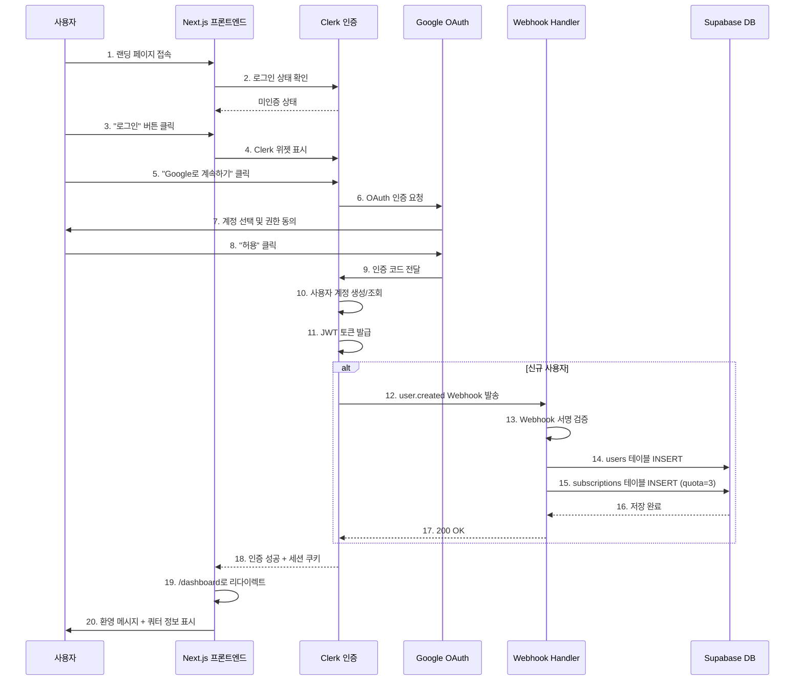

# 유스케이스 명세서: 회원가입 및 로그인

**문서 번호**: UC-001
**버전**: 1.0
**작성일**: 2025-10-25
**최종 수정일**: 2025-10-25
**작성자**: 사주풀이 서비스 개발팀

---

## 1. 유스케이스 개요

### 1.1 유스케이스 식별자
- **ID**: UC-001
- **이름**: 회원가입 및 로그인
- **우선순위**: 높음 (Critical)
- **복잡도**: 중간

### 1.2 설명
사용자가 Google OAuth 인증을 통해 서비스에 가입하고 로그인하는 기능입니다. 인증 성공 시 자동으로 무료 쿼터(3회)가 할당되며, Clerk Webhook을 통해 Supabase에 사용자 데이터가 동기화됩니다.

### 1.3 목표
- Google OAuth를 통한 간편한 회원가입/로그인 제공
- 신규 사용자에게 무료 체험 기회(3회) 자동 부여
- 사용자 인증 정보와 구독 정보의 일관성 유지
- 안전하고 신뢰할 수 있는 인증 프로세스 구현

### 1.4 범위
- **포함 사항**:
  - Google OAuth 로그인
  - Clerk를 통한 인증 처리
  - Clerk Webhook을 통한 Supabase 데이터 동기화
  - 무료 쿼터 자동 할당
  - 세션 관리

- **제외 사항**:
  - 이메일/비밀번호 기반 로그인
  - 소셜 로그인 (Google 외)
  - 2단계 인증 (향후 구현 가능)
  - 계정 복구 기능 (Clerk에서 자동 처리)

---

## 2. 액터 (Actors)

### 2.1 주요 액터

#### 일반 사용자 (Primary Actor)
- **역할**: 서비스를 이용하고자 하는 신규/기존 사용자
- **목표**: 간편하게 로그인하여 사주분석 서비스 이용
- **특성**:
  - Google 계정 보유
  - 웹 브라우저 접근 가능
  - 사주풀이 서비스에 관심

#### 페르소나 매핑
- **호기심 많은 체험자** (김민준, 27세): 부담 없이 체험하고 싶어하는 신규 사용자
- **충성 구독자** (이수진, 34세): 정기적으로 이용하려는 기존 사용자
- **회의적 관찰자**: 서비스 품질을 먼저 확인하고 싶어하는 사용자

### 2.2 보조 액터 (Secondary Actors)

#### Clerk 인증 서비스
- **역할**: OAuth 인증 처리 및 세션 관리
- **책임**:
  - Google OAuth 연동
  - JWT 토큰 발급
  - 사용자 프로필 관리
  - Webhook 이벤트 발송

#### Supabase 데이터베이스
- **역할**: 사용자 및 구독 정보 저장
- **책임**:
  - users 테이블 관리
  - subscriptions 테이블 관리
  - 데이터 무결성 보장

#### Clerk Webhook 핸들러
- **역할**: Clerk 이벤트를 수신하여 Supabase 동기화
- **책임**:
  - user.created 이벤트 처리
  - user.updated 이벤트 처리
  - user.deleted 이벤트 처리
  - 데이터 동기화 보장

---

## 3. 사전 조건 (Preconditions)

### 3.1 시스템 요구사항
- [ ] Clerk 프로젝트가 생성되고 설정이 완료됨
- [ ] Google OAuth Provider가 Clerk에 활성화됨
- [ ] Supabase 데이터베이스가 프로비저닝됨
- [ ] users, subscriptions 테이블이 생성됨
- [ ] Clerk Webhook 엔드포인트가 배포됨
- [ ] Clerk Webhook Secret이 환경 변수로 설정됨

### 3.2 사용자 요구사항
- [ ] 사용자가 유효한 Google 계정을 보유
- [ ] 웹 브라우저에서 JavaScript가 활성화됨
- [ ] 쿠키 사용이 허용됨
- [ ] 인터넷 연결이 안정적임

### 3.3 데이터 요구사항
- [ ] 환경 변수가 올바르게 설정됨:
  - `NEXT_PUBLIC_CLERK_PUBLISHABLE_KEY`
  - `CLERK_SECRET_KEY`
  - `CLERK_WEBHOOK_SECRET`
  - `NEXT_PUBLIC_SUPABASE_URL`
  - `SUPABASE_SERVICE_ROLE_KEY`

---

## 4. 기본 플로우 (Main Flow)

### 4.1 신규 사용자 가입 플로우

#### 단계 1: 랜딩 페이지 접속
**액터**: 사용자
**시스템**: Next.js 애플리케이션

1. 사용자가 브라우저에서 서비스 URL(`/`)에 접속합니다.
2. 시스템이 Clerk SDK를 통해 로그인 상태를 확인합니다.
3. 로그인되지 않은 상태이므로 랜딩 페이지를 표시합니다.

**UI 요소**:
- 서비스 소개 섹션
- "시작하기" 또는 "로그인" 버튼
- 서비스 가치 제안 설명

**예상 시간**: 즉시 (~100ms)

---

#### 단계 2: 로그인 프로세스 시작
**액터**: 사용자
**시스템**: Clerk 인증 위젯

1. 사용자가 "로그인" 버튼을 클릭합니다.
2. 시스템이 Clerk 로그인 위젯을 표시합니다.
3. 사용자가 "Google로 계속하기" 옵션을 선택합니다.

**UI 요소**:
- Clerk 제공 로그인 모달
- Google OAuth 버튼
- 이용약관 및 개인정보처리방침 동의 체크박스

**예상 시간**: ~2초

---

#### 단계 3: Google OAuth 인증
**액터**: 사용자
**시스템**: Google OAuth, Clerk

1. 시스템이 Google OAuth 페이지로 리다이렉트합니다.
2. 사용자가 Google 계정을 선택합니다.
3. 사용자가 권한 동의 화면에서 "허용"을 클릭합니다.
4. Google이 인증 코드를 Clerk로 전달합니다.

**권한 요청**:
- 이메일 주소 조회
- 기본 프로필 정보 조회 (이름, 프로필 사진)

**예상 시간**: 사용자 입력에 따라 5~30초

---

#### 단계 4: Clerk 세션 생성
**액터**: Clerk
**시스템**: Clerk 인증 서버

1. Clerk가 Google OAuth 응답을 검증합니다.
2. Clerk가 신규 사용자 계정을 생성합니다.
3. Clerk가 JWT 토큰을 발급합니다.
4. Clerk가 `user.created` Webhook 이벤트를 발송합니다.

**생성 데이터**:
```json
{
  "id": "user_2abc123def456",
  "email_addresses": [
    {
      "email_address": "user@example.com",
      "verification": {
        "status": "verified"
      }
    }
  ],
  "first_name": "홍",
  "last_name": "길동",
  "created_at": 1698765432000
}
```

**예상 시간**: ~500ms

---

#### 단계 5: Webhook 데이터 동기화
**액터**: Clerk Webhook
**시스템**: Next.js API Route (`/api/webhooks/clerk`)

1. Clerk Webhook이 `POST /api/webhooks/clerk` 요청을 전송합니다.
2. 시스템이 Svix를 사용하여 Webhook 서명을 검증합니다.
3. 시스템이 `user.created` 이벤트를 처리합니다.

**Webhook 페이로드 예시**:
```json
{
  "type": "user.created",
  "data": {
    "id": "user_2abc123def456",
    "email_addresses": [
      {
        "email_address": "user@example.com"
      }
    ],
    "first_name": "홍",
    "last_name": "길동"
  }
}
```

**처리 로직**:
```typescript
// 1. users 테이블에 INSERT
await supabase.from('users').insert({
  clerk_user_id: 'user_2abc123def456',
  email: 'user@example.com',
  name: '홍길동'
});

// 2. subscriptions 테이블에 INSERT (무료 쿼터 초기화)
await supabase.from('subscriptions').insert({
  user_id: 'user_2abc123def456',
  plan_type: 'free',
  quota: 3,
  status: 'active'
});
```

**예상 시간**: ~300ms

---

#### 단계 6: 대시보드 리다이렉트
**액터**: 사용자
**시스템**: Next.js 애플리케이션

1. Clerk 인증이 완료되면 자동으로 대시보드(`/dashboard`)로 리다이렉트합니다.
2. 시스템이 환영 메시지를 토스트로 표시합니다.
3. 대시보드에 무료 쿼터 정보가 표시됩니다.

**UI 요소**:
- 환영 토스트: "회원가입이 완료되었습니다! 무료 분석 3회를 드립니다."
- 쿼터 표시: "남은 횟수: 3회 | 플랜: 무료"
- "새 분석하기" 버튼

**예상 시간**: ~200ms

---

### 4.2 기존 사용자 로그인 플로우

#### 단계 1~3: 신규 가입과 동일
- 랜딩 페이지 접속
- 로그인 프로세스 시작
- Google OAuth 인증

#### 단계 4: Clerk 세션 생성 (기존 사용자)
**액터**: Clerk
**시스템**: Clerk 인증 서버

1. Clerk가 기존 사용자 계정을 확인합니다.
2. Clerk가 JWT 토큰을 발급합니다.
3. Webhook 이벤트는 발송되지 않습니다 (기존 사용자이므로).

**예상 시간**: ~300ms

#### 단계 5: 대시보드 리다이렉트
**액터**: 사용자
**시스템**: Next.js 애플리케이션

1. 인증 완료 후 대시보드로 리다이렉트합니다.
2. 시스템이 환영 메시지를 표시합니다.
3. 현재 구독 정보가 표시됩니다.

**UI 요소**:
- 환영 토스트: "다시 오신 것을 환영합니다, [이름]님!"
- 쿼터 표시: "남은 횟수: [N]회 | 플랜: [free/pro]"
- 최근 분석 이력 목록

**예상 시간**: ~200ms

---

### 4.3 플로우 다이어그램



---

## 5. 대안 플로우 (Alternative Flows)

### 5.1 AF-001: 로그인이 필요한 페이지 직접 접근

**트리거**: 사용자가 미인증 상태에서 `/dashboard` 또는 `/analysis/new` 등에 직접 접근

**플로우**:
1. 시스템이 Clerk Middleware를 통해 인증 상태를 확인합니다.
2. 미인증 상태로 판단합니다.
3. 시스템이 자동으로 로그인 페이지로 리다이렉트합니다.
4. 리다이렉트 URL에 원래 접근하려던 경로를 쿼리 파라미터로 포함합니다.
   ```
   예: /sign-in?redirect_url=/dashboard
   ```
5. 로그인 완료 후 원래 접근하려던 페이지로 리다이렉트합니다.

**비즈니스 규칙**:
- 인증이 필요한 페이지: `/dashboard`, `/analysis/*`, `/subscription`
- 공개 페이지: `/`, `/sign-in`, `/sign-up`

---

### 5.2 AF-002: 이미 로그인된 상태에서 로그인 페이지 접근

**트리거**: 인증된 사용자가 `/sign-in` 또는 `/sign-up` 접근

**플로우**:
1. 시스템이 Clerk SDK로 로그인 상태를 확인합니다.
2. 이미 로그인된 상태로 판단합니다.
3. 시스템이 자동으로 대시보드(`/dashboard`)로 리다이렉트합니다.

**UI 동작**:
- 로딩 화면 없이 즉시 리다이렉트
- 토스트 메시지 없음 (자연스러운 UX)

---

### 5.3 AF-003: 중복 가입 시도

**트리거**: 이미 가입된 Google 계정으로 다시 로그인 시도

**플로우**:
1. 사용자가 Google OAuth를 통해 인증합니다.
2. Clerk가 기존 계정을 확인합니다.
3. 시스템이 신규 가입이 아닌 로그인으로 처리합니다.
4. `user.created` Webhook이 발송되지 않습니다.
5. 대시보드로 리다이렉트하고 기존 구독 정보를 표시합니다.

**UI 메시지**:
- "다시 오신 것을 환영합니다!" (환영 토스트)

---

### 5.4 AF-004: Webhook 처리 실패 후 재시도

**트리거**: Clerk Webhook이 일시적 오류로 실패

**플로우**:
1. Clerk가 `user.created` Webhook을 전송합니다.
2. Webhook 핸들러가 일시적 오류를 반환합니다 (예: DB 연결 타임아웃).
3. Clerk가 자동으로 재시도를 수행합니다 (최대 3회).
4. 재시도 간격: 5초, 30초, 2분 (지수 백오프).
5. 성공 시 Supabase에 데이터가 동기화됩니다.

**비즈니스 규칙**:
- 멱등성 보장: 동일한 `clerk_user_id`로 중복 INSERT 방지
  ```sql
  ON CONFLICT (clerk_user_id) DO NOTHING
  ```

---

### 5.5 AF-005: 세션 만료 후 페이지 접근

**트리거**: 사용자의 Clerk 세션이 만료된 상태에서 보호된 페이지 접근

**플로우**:
1. 사용자가 보호된 페이지에 접근합니다.
2. Clerk Middleware가 JWT 토큰을 검증합니다.
3. 토큰이 만료되었거나 유효하지 않음을 감지합니다.
4. 자동으로 로그인 페이지로 리다이렉트합니다.
5. 리다이렉트 URL을 쿼리 파라미터로 저장합니다.
6. 사용자가 재로그인 후 원래 페이지로 돌아갑니다.

**세션 정책**:
- 기본 세션 유효기간: 7일
- Refresh 토큰 유효기간: 60일
- "로그인 상태 유지" 옵션 제공

---

## 6. 예외 플로우 (Exception Flows)

### 6.1 EF-001: Google OAuth 권한 거부

**트리거**: 사용자가 Google 권한 동의 화면에서 "거부" 클릭

**플로우**:
1. Google이 권한 거부 응답을 Clerk로 전송합니다.
2. Clerk가 에러 상태를 프론트엔드로 전달합니다.
3. 시스템이 로그인 화면을 유지합니다.
4. 에러 메시지를 표시합니다.

**UI 동작**:
```
[오류 메시지]
"로그인이 취소되었습니다. 서비스를 이용하시려면 Google 계정 권한을 허용해주세요."

[액션 버튼]
- "다시 시도" (로그인 위젯 재표시)
- "취소" (랜딩 페이지로 이동)
```

**로깅**:
```json
{
  "level": "warn",
  "event": "oauth_cancelled",
  "provider": "google",
  "timestamp": "2025-10-25T10:30:00Z"
}
```

---

### 6.2 EF-002: Clerk API 응답 지연

**트리거**: Clerk API가 10초 이상 응답하지 않음

**플로우**:
1. 사용자가 로그인을 시도합니다.
2. Clerk API 요청이 전송됩니다.
3. 10초 동안 응답이 없습니다.
4. 시스템이 타임아웃 에러를 표시합니다.
5. 사용자에게 재시도 옵션을 제공합니다.

**UI 동작**:
- 로딩 스피너: 0~5초 (정상 대기)
- 로딩 메시지 업데이트: 5~10초 ("조금만 기다려주세요...")
- 타임아웃 에러: 10초 이상

```
[오류 메시지]
"인증 서버 응답이 지연되고 있습니다. 잠시 후 다시 시도해주세요."

[액션 버튼]
- "재시도"
- "고객센터 문의"
```

**복구 전략**:
- 자동 재시도 없음 (사용자 명시적 선택)
- 재시도 시 새로운 OAuth 플로우 시작

---

### 6.3 EF-003: Webhook 검증 실패

**트리거**: Webhook 요청의 서명이 유효하지 않음

**플로우**:
1. Clerk Webhook이 요청을 전송합니다.
2. Webhook 핸들러가 Svix로 서명을 검증합니다.
3. 서명이 일치하지 않아 검증 실패합니다.
4. 시스템이 `401 Unauthorized`를 반환합니다.
5. 요청을 거부하고 보안 로그를 기록합니다.

**보안 조치**:
```typescript
// Webhook 검증 코드
const wh = new Webhook(WEBHOOK_SECRET);

try {
  const evt = wh.verify(payload, headers);
  // 처리 진행
} catch (err) {
  console.error('[SECURITY] Invalid webhook signature', {
    timestamp: new Date().toISOString(),
    headers: headers,
    error: err.message
  });

  return new Response('Unauthorized', { status: 401 });
}
```

**알림**:
- 관리자에게 Slack 알림 전송
- 보안 모니터링 시스템에 이벤트 기록

---

### 6.4 EF-004: Supabase 데이터베이스 연결 실패

**트리거**: Webhook 처리 중 Supabase DB 연결 실패

**플로우**:
1. Clerk Webhook이 `user.created` 이벤트를 전송합니다.
2. Webhook 핸들러가 Supabase에 INSERT를 시도합니다.
3. 데이터베이스 연결이 실패합니다.
4. 시스템이 `500 Internal Server Error`를 반환합니다.
5. Clerk가 자동으로 재시도를 수행합니다 (최대 3회).

**에러 처리**:
```typescript
try {
  await supabase.from('users').insert({ ... });
} catch (error) {
  console.error('[ERROR] Supabase insert failed', {
    event: 'user.created',
    clerk_user_id: userId,
    error: error.message
  });

  // 재시도 가능하도록 5xx 반환
  return new Response('Database error', { status: 500 });
}
```

**사용자 영향**:
- 사용자는 정상적으로 로그인됨 (Clerk 세션은 유효)
- 백그라운드에서 데이터 동기화 재시도
- 실패 시 관리자가 수동으로 데이터 동기화

---

### 6.5 EF-005: 네트워크 연결 끊김

**트리ger**: OAuth 인증 중 사용자의 네트워크 연결 끊김

**플로우**:
1. 사용자가 Google OAuth 인증을 진행합니다.
2. 네트워크 연결이 끊깁니다.
3. Google/Clerk 서버 응답을 받지 못합니다.
4. 시스템이 네트워크 오류를 감지합니다.
5. 에러 메시지를 표시합니다.

**UI 동작**:
```
[오류 메시지]
"네트워크 연결이 불안정합니다. 인터넷 연결을 확인하고 다시 시도해주세요."

[액션 버튼]
- "재시도"
```

**복구 전략**:
- 로컬 상태 초기화
- 재시도 시 OAuth 플로우 처음부터 시작

---

### 6.6 EF-006: Webhook 최대 재시도 실패

**트리거**: Clerk Webhook이 3회 재시도 후에도 실패

**플로우**:
1. Clerk가 `user.created` Webhook을 3회 재시도합니다.
2. 모두 실패합니다 (예: 지속적인 DB 장애).
3. Clerk가 재시도를 중단합니다.
4. 사용자 계정은 Clerk에만 존재하고 Supabase에는 없는 상태가 됩니다.

**복구 절차**:
1. **자동 복구 (권장)**:
   - 사용자가 대시보드 접근 시도
   - Middleware에서 Supabase에 사용자 데이터 없음을 감지
   - 자동으로 사용자 및 구독 데이터 생성

2. **수동 복구**:
   - 관리자 대시보드에서 동기화 실패 목록 확인
   - "수동 동기화" 버튼 클릭
   - Clerk API로 사용자 정보 조회 후 Supabase에 INSERT

**코드 예시 (자동 복구)**:
```typescript
// middleware.ts
export async function middleware(req: NextRequest) {
  const { userId } = auth();

  if (userId) {
    // Supabase에 사용자 존재 여부 확인
    const { data } = await supabase
      .from('users')
      .select('id')
      .eq('clerk_user_id', userId)
      .single();

    if (!data) {
      // 사용자 데이터 자동 생성
      await syncUserFromClerk(userId);
    }
  }
}
```

**알림**:
- 관리자에게 동기화 실패 알림 (이메일 + Slack)
- 자동 복구 성공 시 관리자에게 복구 완료 알림

---

## 7. 사후 조건 (Postconditions)

### 7.1 성공 시 사후 조건

#### 신규 사용자 가입 성공
- [ ] Clerk에 사용자 계정이 생성됨
- [ ] Clerk JWT 토큰이 발급됨
- [ ] Supabase `users` 테이블에 사용자 레코드가 존재함
- [ ] Supabase `subscriptions` 테이블에 구독 레코드가 존재함
- [ ] 구독 레코드의 `plan_type`이 'free'로 설정됨
- [ ] 구독 레코드의 `quota`가 3으로 설정됨
- [ ] 구독 레코드의 `status`가 'active'로 설정됨
- [ ] 사용자 세션이 브라우저에 저장됨 (쿠키)
- [ ] 사용자가 대시보드 페이지에 위치함
- [ ] 환영 메시지가 표시됨

#### 기존 사용자 로그인 성공
- [ ] Clerk JWT 토큰이 발급됨
- [ ] 사용자 세션이 브라우저에 저장됨
- [ ] 사용자가 대시보드 페이지에 위치함
- [ ] 현재 쿼터 정보가 정확하게 표시됨
- [ ] 환영 메시지가 표시됨

### 7.2 실패 시 사후 조건

#### 인증 실패
- [ ] 사용자가 로그인 페이지에 유지됨
- [ ] 에러 메시지가 명확하게 표시됨
- [ ] 재시도 옵션이 제공됨
- [ ] Clerk에 사용자 계정이 생성되지 않음
- [ ] Supabase에 데이터가 생성되지 않음

#### Webhook 동기화 실패
- [ ] 사용자가 정상적으로 로그인됨 (Clerk 세션 유효)
- [ ] 백그라운드에서 재시도가 진행됨
- [ ] 관리자에게 알림이 전송됨
- [ ] 자동 복구 메커니즘이 작동함

---

## 8. 비기능 요구사항 (NFRs)

### 8.1 성능 요구사항

| 지표 | 목표 | 측정 방법 | 우선순위 |
|------|------|----------|---------|
| **로그인 완료 시간** | < 5초 (p95) | Google OAuth 시작 → 대시보드 표시 | 높음 |
| **Webhook 처리 시간** | < 500ms (p95) | Webhook 수신 → DB INSERT 완료 | 높음 |
| **페이지 로딩 시간** | < 2초 (p95) | 랜딩 페이지 초기 로드 | 중간 |
| **API 응답 시간** | < 200ms (p95) | 인증 상태 확인 API | 높음 |

**측정 도구**:
- Vercel Analytics
- Sentry Performance Monitoring
- Custom 로그 분석

---

### 8.2 보안 요구사항

| 요구사항 | 설명 | 구현 방법 | 검증 |
|---------|------|----------|------|
| **OAuth 2.0 준수** | Google OAuth 2.0 표준 준수 | Clerk SDK 사용 | 수동 검토 |
| **Webhook 서명 검증** | 모든 Webhook 요청 서명 검증 필수 | Svix 라이브러리 사용 | 단위 테스트 |
| **JWT 토큰 검증** | 모든 보호된 엔드포인트에서 JWT 검증 | Clerk Middleware | E2E 테스트 |
| **HTTPS 강제** | 모든 통신은 HTTPS로만 수행 | Vercel 자동 적용 | 수동 확인 |
| **민감 정보 보호** | API 키, Secret은 환경 변수로 관리 | .env.local, Vercel Env Vars | 코드 리뷰 |
| **CORS 정책** | 허용된 도메인만 API 접근 가능 | Next.js 설정 | 보안 테스트 |

**보안 체크리스트**:
- [ ] `CLERK_WEBHOOK_SECRET`이 환경 변수로 설정됨
- [ ] Webhook 엔드포인트가 서명 검증을 수행함
- [ ] JWT 토큰이 브라우저 쿠키에 HttpOnly로 저장됨
- [ ] 모든 민감한 API가 인증 미들웨어를 통과함
- [ ] 프로덕션 환경에서 개발자 도구가 비활성화됨

---

### 8.3 안정성 요구사항

| 지표 | 목표 | 측정 방법 | 복구 전략 |
|------|------|----------|----------|
| **가용성** | 99.5% (월간) | Uptime 모니터링 | Vercel 자동 스케일링 |
| **오류율** | < 1% (인증 성공률) | Sentry 에러 추적 | 자동 재시도 + 사용자 안내 |
| **Webhook 성공률** | > 95% | Supabase 로그 분석 | Clerk 자동 재시도 + 수동 복구 |

**장애 대응**:
1. **Clerk API 장애**:
   - 대체 인증 방법 없음 (단일 의존성)
   - 사용자에게 일시적 장애 안내
   - Clerk 상태 페이지 링크 제공

2. **Supabase 장애**:
   - Webhook 재시도로 데이터 동기화 보장
   - 자동 복구 메커니즘으로 사용자 영향 최소화

3. **Google OAuth 장애**:
   - 사용자에게 Google 상태 안내
   - 재시도 옵션 제공

---

### 8.4 사용성 요구사항

| 요구사항 | 목표 | 검증 방법 |
|---------|------|----------|
| **로그인 소요 시간** | < 10초 (사용자 입력 포함) | 사용자 테스트 |
| **에러 메시지 명확성** | 일반 사용자가 이해 가능한 언어 | 사용자 피드백 |
| **모바일 대응** | 모든 화면 크기에서 정상 작동 | 반응형 테스트 |
| **접근성** | WCAG 2.1 AA 준수 | Lighthouse 점수 90+ |

**UX 원칙**:
- 최소 클릭 수: 로그인 3클릭 이내 (로그인 버튼 → Google 선택 → 허용)
- 명확한 피드백: 모든 단계에서 진행 상황 표시
- 오류 복구 용이성: 에러 발생 시 명확한 해결 방법 제시

---

### 8.5 확장성 요구사항

| 항목 | 현재 목표 | 향후 확장 | 전략 |
|------|----------|----------|------|
| **동시 접속자** | 100명 | 1,000명 | Vercel 자동 스케일링 |
| **신규 가입자** | 월 1,000명 | 월 10,000명 | Webhook 비동기 처리 |
| **데이터베이스** | 10,000 users | 100,000 users | Supabase 인덱싱 최적화 |

**병목 지점**:
- Webhook 동기 처리 → 향후 Queue 시스템 도입 검토
- Supabase 무료 플랜 제한 → Pro 플랜 업그레이드 준비

---

## 9. 인수 기준 (Acceptance Criteria)

### 9.1 기능 인수 기준

#### AC-001: 신규 사용자 가입
**Given**: 신규 사용자가 유효한 Google 계정을 보유
**When**: 사용자가 Google OAuth로 로그인
**Then**:
- [ ] Clerk에 사용자 계정이 생성됨
- [ ] Supabase `users` 테이블에 레코드가 생성됨
- [ ] Supabase `subscriptions` 테이블에 레코드가 생성됨 (quota=3, plan_type='free')
- [ ] 대시보드로 리다이렉트됨
- [ ] "무료 분석 3회를 드립니다" 메시지가 표시됨

---

#### AC-002: 기존 사용자 로그인
**Given**: 이미 가입된 사용자
**When**: 사용자가 Google OAuth로 로그인
**Then**:
- [ ] Clerk 세션이 생성됨
- [ ] Webhook이 발송되지 않음 (기존 사용자이므로)
- [ ] 대시보드로 리다이렉트됨
- [ ] 현재 쿼터 정보가 정확하게 표시됨

---

#### AC-003: 로그인이 필요한 페이지 보호
**Given**: 미인증 사용자
**When**: 사용자가 `/dashboard`에 접근
**Then**:
- [ ] 자동으로 로그인 페이지로 리다이렉트됨
- [ ] 로그인 후 원래 접근하려던 페이지로 돌아감

---

#### AC-004: Google OAuth 권한 거부 처리
**Given**: 사용자가 로그인 시도
**When**: 사용자가 Google 권한 동의 화면에서 "거부" 클릭
**Then**:
- [ ] 로그인 화면을 유지함
- [ ] "로그인이 취소되었습니다" 에러 메시지 표시
- [ ] "다시 시도" 버튼이 제공됨

---

#### AC-005: Webhook 데이터 동기화
**Given**: 신규 사용자가 Google OAuth 인증 완료
**When**: Clerk가 `user.created` Webhook을 전송
**Then**:
- [ ] Webhook 서명이 검증됨
- [ ] `users` 테이블에 사용자 정보가 저장됨
- [ ] `subscriptions` 테이블에 구독 정보가 저장됨 (quota=3)
- [ ] Webhook 핸들러가 200 OK를 반환함

---

#### AC-006: Webhook 재시도 메커니즘
**Given**: Webhook 처리 중 일시적 오류 발생
**When**: Supabase DB 연결 실패
**Then**:
- [ ] Webhook 핸들러가 500 에러를 반환함
- [ ] Clerk가 자동으로 재시도함 (최대 3회)
- [ ] 재시도 간격: 5초, 30초, 2분
- [ ] 성공 시 데이터가 정상 동기화됨

---

#### AC-007: 세션 만료 처리
**Given**: 사용자의 Clerk 세션이 만료됨
**When**: 사용자가 보호된 페이지에 접근
**Then**:
- [ ] 자동으로 로그인 페이지로 리다이렉트됨
- [ ] 세션 만료 안내 메시지가 표시됨
- [ ] 재로그인 후 원래 페이지로 돌아감

---

### 9.2 비기능 인수 기준

#### AC-008: 성능 기준
**Given**: 정상적인 네트워크 환경
**When**: 사용자가 로그인
**Then**:
- [ ] 전체 로그인 프로세스가 5초 이내 완료됨 (p95)
- [ ] Webhook 처리가 500ms 이내 완료됨 (p95)
- [ ] 대시보드 초기 로드가 2초 이내 완료됨 (p95)

---

#### AC-009: 보안 기준
**Given**: 프로덕션 환경 배포
**When**: 보안 검증 수행
**Then**:
- [ ] 모든 통신이 HTTPS로 암호화됨
- [ ] Webhook 서명 검증이 100% 수행됨
- [ ] JWT 토큰이 HttpOnly 쿠키로 저장됨
- [ ] 환경 변수가 안전하게 관리됨

---

#### AC-010: 안정성 기준
**Given**: 월간 운영 데이터
**When**: 가용성 지표 측정
**Then**:
- [ ] 시스템 가용성이 99.5% 이상임
- [ ] 인증 성공률이 99% 이상임
- [ ] Webhook 성공률이 95% 이상임

---

#### AC-011: 사용성 기준
**Given**: 일반 사용자
**When**: 로그인 프로세스 수행
**Then**:
- [ ] 클릭 수가 3회 이내임
- [ ] 모바일 환경에서 정상 작동함
- [ ] 에러 메시지가 명확함 (기술 용어 없음)
- [ ] Lighthouse 접근성 점수가 90 이상임

---

## 10. 데이터 요구사항

### 10.1 입력 데이터

#### Google OAuth 응답
```json
{
  "id": "google_oauth_user_id",
  "email": "user@example.com",
  "verified_email": true,
  "name": "홍길동",
  "given_name": "길동",
  "family_name": "홍",
  "picture": "https://lh3.googleusercontent.com/..."
}
```

---

### 10.2 출력 데이터

#### Clerk JWT 토큰 (예시)
```json
{
  "sub": "user_2abc123def456",
  "email": "user@example.com",
  "email_verified": true,
  "iat": 1698765432,
  "exp": 1698851832,
  "iss": "https://clerk.your-domain.com"
}
```

---

#### Supabase users 테이블 레코드
```sql
INSERT INTO users (clerk_user_id, email, name)
VALUES (
  'user_2abc123def456',
  'user@example.com',
  '홍길동'
);
```

---

#### Supabase subscriptions 테이블 레코드
```sql
INSERT INTO subscriptions (user_id, plan_type, quota, status)
VALUES (
  'user_2abc123def456',
  'free',
  3,
  'active'
);
```

---

### 10.3 데이터 검증 규칙

| 필드 | 타입 | 필수 여부 | 검증 규칙 | 에러 메시지 |
|------|------|----------|----------|------------|
| `clerk_user_id` | VARCHAR(255) | 필수 | Clerk User ID 형식 (`user_*`) | "유효하지 않은 사용자 ID입니다" |
| `email` | VARCHAR(255) | 필수 | 이메일 형식 검증 | "유효한 이메일 주소를 입력해주세요" |
| `name` | VARCHAR(100) | 선택 | 1-100자 | - |

---

## 11. 인터페이스 요구사항

### 11.1 외부 시스템 인터페이스

#### Clerk API
- **Endpoint**: `https://api.clerk.com/v1/*`
- **인증**: Bearer Token (`CLERK_SECRET_KEY`)
- **용도**: 사용자 관리, 세션 관리

**주요 API**:
```
GET /v1/users/{user_id}
POST /v1/users
PATCH /v1/users/{user_id}
DELETE /v1/users/{user_id}
```

---

#### Clerk Webhook
- **Endpoint**: `https://yourdomain.com/api/webhooks/clerk`
- **Method**: POST
- **인증**: Svix 서명 검증
- **이벤트**: `user.created`, `user.updated`, `user.deleted`

**Webhook 페이로드**:
```json
{
  "type": "user.created",
  "data": {
    "id": "user_2abc123def456",
    "email_addresses": [...],
    "first_name": "홍",
    "last_name": "길동"
  },
  "object": "event",
  "timestamp": 1698765432000
}
```

---

#### Google OAuth API
- **Endpoint**: `https://accounts.google.com/o/oauth2/v2/auth`
- **Scopes**: `openid`, `email`, `profile`
- **Flow**: Authorization Code Flow

---

#### Supabase API
- **Endpoint**: `https://xxxxx.supabase.co/rest/v1/*`
- **인증**: Service Role Key
- **용도**: 데이터베이스 CRUD

---

### 11.2 사용자 인터페이스

#### 로그인 버튼 (랜딩 페이지)
```tsx
<Button
  size="lg"
  onClick={() => router.push('/sign-in')}
>
  시작하기
</Button>
```

---

#### Clerk 로그인 위젯
```tsx
<SignIn
  appearance={{
    elements: {
      rootBox: 'mx-auto',
      card: 'shadow-xl'
    }
  }}
  redirectUrl="/dashboard"
/>
```

---

#### 대시보드 헤더 (로그인 후)
```tsx
<div className="flex items-center gap-4">
  <UserButton afterSignOutUrl="/" />
  <div>
    <p className="font-semibold">{user.firstName}님</p>
    <p className="text-sm text-gray-500">
      남은 횟수: {quota}회 | 플랜: {planType}
    </p>
  </div>
</div>
```

---

## 12. 테스트 시나리오

### 12.1 단위 테스트

#### TEST-001: Webhook 서명 검증
```typescript
describe('Webhook Signature Verification', () => {
  it('should verify valid webhook signature', async () => {
    const payload = { type: 'user.created', data: { ... } };
    const signature = generateSignature(payload, WEBHOOK_SECRET);

    const result = await verifyWebhook(payload, signature);

    expect(result).toBe(true);
  });

  it('should reject invalid webhook signature', async () => {
    const payload = { type: 'user.created', data: { ... } };
    const invalidSignature = 'invalid_signature';

    await expect(verifyWebhook(payload, invalidSignature))
      .rejects.toThrow('Invalid signature');
  });
});
```

---

#### TEST-002: 사용자 데이터 동기화
```typescript
describe('User Data Sync', () => {
  it('should create user and subscription on user.created event', async () => {
    const event = {
      type: 'user.created',
      data: {
        id: 'user_test123',
        email_addresses: [{ email_address: 'test@example.com' }],
        first_name: 'Test',
        last_name: 'User'
      }
    };

    await handleWebhook(event);

    const user = await supabase
      .from('users')
      .select('*')
      .eq('clerk_user_id', 'user_test123')
      .single();

    expect(user.data).toBeDefined();
    expect(user.data.email).toBe('test@example.com');

    const subscription = await supabase
      .from('subscriptions')
      .select('*')
      .eq('user_id', 'user_test123')
      .single();

    expect(subscription.data.quota).toBe(3);
    expect(subscription.data.plan_type).toBe('free');
  });
});
```

---

### 12.2 통합 테스트

#### TEST-003: 전체 로그인 플로우 (E2E)
```typescript
describe('End-to-End Login Flow', () => {
  it('should complete full signup flow for new user', async () => {
    // 1. 랜딩 페이지 접속
    const page = await browser.newPage();
    await page.goto('http://localhost:3000');

    // 2. 로그인 버튼 클릭
    await page.click('[data-testid="login-button"]');

    // 3. Google OAuth 선택
    await page.waitForSelector('[data-clerk-provider="google"]');
    await page.click('[data-clerk-provider="google"]');

    // 4. Google 계정 선택 (테스트 계정)
    // ... Google OAuth 모킹 ...

    // 5. 대시보드 리다이렉트 확인
    await page.waitForNavigation();
    expect(page.url()).toContain('/dashboard');

    // 6. 환영 메시지 확인
    const toast = await page.textContent('[data-testid="toast"]');
    expect(toast).toContain('무료 분석 3회');

    // 7. 쿼터 정보 확인
    const quota = await page.textContent('[data-testid="quota"]');
    expect(quota).toBe('3');
  });
});
```

---

#### TEST-004: Webhook 재시도 메커니즘
```typescript
describe('Webhook Retry Mechanism', () => {
  it('should retry webhook on temporary failure', async () => {
    // 1. Supabase 연결 실패 시뮬레이션
    jest.spyOn(supabase, 'from').mockRejectedValueOnce(
      new Error('Connection timeout')
    );

    // 2. Webhook 요청
    const response1 = await fetch('/api/webhooks/clerk', {
      method: 'POST',
      body: JSON.stringify(webhookPayload),
      headers: { ...webhookHeaders }
    });

    expect(response1.status).toBe(500);

    // 3. Clerk 재시도 시뮬레이션 (5초 후)
    await new Promise(resolve => setTimeout(resolve, 5000));

    // 4. 재시도 요청 (성공)
    const response2 = await fetch('/api/webhooks/clerk', {
      method: 'POST',
      body: JSON.stringify(webhookPayload),
      headers: { ...webhookHeaders }
    });

    expect(response2.status).toBe(200);

    // 5. 데이터 동기화 확인
    const user = await supabase
      .from('users')
      .select('*')
      .eq('clerk_user_id', 'user_test123')
      .single();

    expect(user.data).toBeDefined();
  });
});
```

---

### 12.3 성능 테스트

#### TEST-005: 로그인 성능 벤치마크
```typescript
describe('Login Performance', () => {
  it('should complete login within 5 seconds (p95)', async () => {
    const times = [];

    for (let i = 0; i < 100; i++) {
      const startTime = Date.now();

      await performLogin();

      const endTime = Date.now();
      times.push(endTime - startTime);
    }

    // p95 계산
    times.sort((a, b) => a - b);
    const p95 = times[Math.floor(times.length * 0.95)];

    expect(p95).toBeLessThan(5000); // 5초 이내
  });
});
```

---

### 12.4 보안 테스트

#### TEST-006: Webhook 보안 검증
```typescript
describe('Webhook Security', () => {
  it('should reject webhook without signature', async () => {
    const response = await fetch('/api/webhooks/clerk', {
      method: 'POST',
      body: JSON.stringify(webhookPayload)
      // headers에 서명 없음
    });

    expect(response.status).toBe(401);
  });

  it('should reject webhook with invalid signature', async () => {
    const response = await fetch('/api/webhooks/clerk', {
      method: 'POST',
      body: JSON.stringify(webhookPayload),
      headers: {
        'svix-signature': 'invalid_signature'
      }
    });

    expect(response.status).toBe(401);
  });
});
```

---

## 13. 운영 고려사항

### 13.1 모니터링

#### 핵심 지표
| 지표 | 목표 | 알림 조건 | 대응 방법 |
|------|------|----------|----------|
| 로그인 성공률 | > 99% | < 95% | Clerk 상태 확인, 로그 분석 |
| Webhook 성공률 | > 95% | < 90% | Supabase 상태 확인, 수동 동기화 |
| 평균 로그인 시간 | < 3초 | > 5초 | 성능 프로파일링, CDN 최적화 |
| 에러율 | < 1% | > 5% | 에러 로그 분석, 긴급 패치 |

---

#### 로깅 전략
```typescript
// 성공 로그
logger.info('User login successful', {
  clerk_user_id: userId,
  email: userEmail,
  timestamp: new Date().toISOString(),
  duration_ms: loginDuration
});

// 에러 로그
logger.error('Webhook verification failed', {
  event_type: eventType,
  error: error.message,
  timestamp: new Date().toISOString(),
  svix_id: headers['svix-id']
});
```

---

### 13.2 장애 대응

#### 장애 시나리오별 대응

**1. Clerk API 장애**
- **영향**: 신규 로그인 불가
- **감지**: 로그인 성공률 급감
- **대응**:
  1. Clerk 상태 페이지 확인 (status.clerk.com)
  2. 사용자에게 일시적 장애 안내
  3. Clerk 복구 대기

---

**2. Supabase 장애**
- **영향**: Webhook 동기화 실패, 데이터 조회 불가
- **감지**: Webhook 에러율 증가, API 타임아웃
- **대응**:
  1. Supabase 상태 페이지 확인
  2. Webhook 재시도 대기
  3. 복구 후 수동 동기화 스크립트 실행

---

**3. Webhook 동기화 지연**
- **영향**: 신규 사용자가 로그인 후 쿼터 정보 없음
- **감지**: 수동 동기화 알림
- **대응**:
  1. 자동 복구 메커니즘 작동 대기
  2. 필요 시 관리자 대시보드에서 수동 동기화

---

### 13.3 유지보수

#### 정기 점검 항목
- [ ] Clerk Webhook 로그 검토 (주 1회)
- [ ] Supabase 데이터 일관성 확인 (월 1회)
- [ ] 성능 지표 리뷰 (월 1회)
- [ ] 보안 업데이트 적용 (분기 1회)

#### 환경 변수 관리
- [ ] `.env.local`을 `.gitignore`에 포함
- [ ] Vercel 환경 변수를 프로덕션/프리뷰/개발 환경별로 설정
- [ ] Secret 값은 정기적으로 로테이션 (연 1회)

---

## 14. 제약사항 및 가정

### 14.1 기술적 제약사항

1. **Clerk 의존성**
   - Clerk 서비스 장애 시 대체 인증 방법 없음
   - Clerk 요금제 한도 내에서만 사용 가능

2. **Google OAuth 전용**
   - 현재 버전에서는 Google OAuth만 지원
   - 이메일/비밀번호 로그인 미지원

3. **Webhook 의존성**
   - Webhook이 실패하면 데이터 동기화가 지연될 수 있음
   - 자동 복구 메커니즘으로 완화

4. **Supabase 무료 플랜 제한**
   - 월간 API 요청 수 제한
   - 데이터베이스 크기 제한

---

### 14.2 비즈니스 가정

1. **사용자 동의**
   - 사용자가 Google 계정 권한 동의를 거부하지 않을 것으로 가정
   - 거부 시 서비스 이용 불가

2. **무료 쿼터 정책**
   - 신규 사용자에게 무료 3회 제공이 유지될 것으로 가정
   - 변경 시 마이그레이션 필요

3. **데이터 보관**
   - 사용자 데이터를 무기한 보관
   - GDPR 준수를 위해 사용자 요청 시 삭제

---

### 14.3 운영 가정

1. **배포 환경**
   - Vercel에 배포되며 HTTPS가 자동 적용됨
   - Webhook 엔드포인트가 공개 URL을 가짐

2. **모니터링 도구**
   - Vercel Analytics, Sentry가 설정되어 있음
   - 로그 수집 및 분석 환경이 구축됨

3. **지원 체계**
   - 긴급 장애 시 1시간 이내 대응
   - 일반 문의는 24시간 이내 응답

---

## 15. 관련 문서

### 15.1 참조 문서
- [PRD (Product Requirements Document)](/docs/prd.md)
- [요구사항 명세서 (Requirement Specification)](/docs/requirement.md)
- [사용자 플로우 (User Flow)](/docs/userflow.md)
- [데이터베이스 설계 (Database Design)](/docs/database.md)

### 15.2 외부 문서
- [Clerk Documentation](https://clerk.com/docs)
- [Clerk Webhook Events](https://clerk.com/docs/integrations/webhooks/overview)
- [Google OAuth 2.0 Guide](https://developers.google.com/identity/protocols/oauth2)
- [Supabase Documentation](https://supabase.com/docs)
- [Next.js Authentication](https://nextjs.org/docs/authentication)

---

## 16. 변경 이력

| 버전 | 날짜 | 변경 내용 | 작성자 |
|------|------|----------|--------|
| 1.0 | 2025-10-25 | 초기 작성 | 사주풀이 서비스 개발팀 |

---

## 17. 승인 및 리뷰

### 승인자
- [ ] Product Owner
- [ ] Tech Lead
- [ ] QA Lead

### 리뷰어
- [ ] Backend Developer
- [ ] Frontend Developer
- [ ] DevOps Engineer

---

**문서 상태**: 승인 대기
**다음 검토 예정일**: 2025-10-30
**담당자**: 사주풀이 서비스 개발팀
