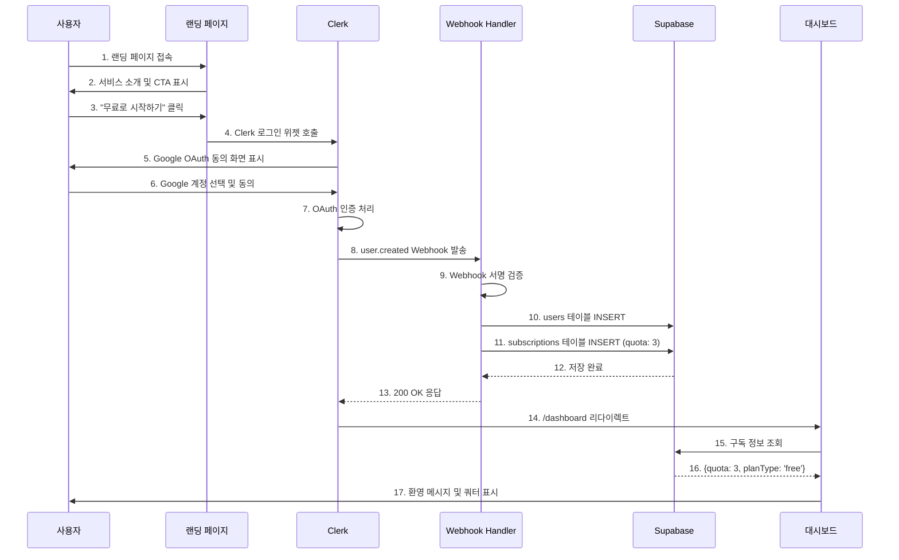

# UF-01: 신규 사용자 가입 및 무료 체험

**버전**: 1.0
**작성일**: 2025-10-26
**우선순위**: P0 (MVP 필수)
**연관 문서**: `/docs/userflow.md` (UF-01), `/docs/prd.md` (3.2.1)

---

## 목차

1. [개요](#1-개요)
2. [목표](#2-목표)
3. [액터](#3-액터)
4. [사전 조건](#4-사전-조건)
5. [기본 플로우](#5-기본-플로우)
6. [대체 플로우](#6-대체-플로우)
7. [예외 상황](#7-예외-상황)
8. [사후 조건](#8-사후-조건)
9. [비기능 요구사항](#9-비기능-요구사항)
10. [인터페이스 명세](#10-인터페이스-명세)

---

## 1. 개요

### 1.1 기능 요약
신규 방문자가 Google OAuth를 통해 회원가입하고, 무료 사주 분석 쿼터 3회를 자동으로 부여받는 기능입니다.

### 1.2 비즈니스 가치
- **진입 장벽 최소화**: 간편한 Google 로그인으로 회원가입 전환율 향상
- **무료 체험 제공**: 3회 무료 분석으로 서비스 품질 경험 후 유료 전환 유도
- **사용자 획득**: OAuth 기반 빠른 가입으로 초기 사용자 확보

### 1.3 핵심 플로우
```
랜딩 페이지 방문 → Google 로그인 → Clerk 인증 → Webhook 트리거
→ Supabase 동기화 → 무료 쿼터 3회 부여 → 대시보드 이동
```

---

## 2. 목표

### 2.1 사용자 목표
- 복잡한 회원가입 절차 없이 간편하게 서비스 이용 시작
- 무료로 사주 분석 서비스 품질 확인
- 3회 체험 후 유료 구독 전환 여부 결정

### 2.2 시스템 목표
- Clerk OAuth를 통한 안전한 사용자 인증
- Clerk과 Supabase 사용자 정보 자동 동기화
- 신규 가입자에게 무료 쿼터 3회 자동 부여
- 원활한 대시보드 온보딩 경험 제공

### 2.3 성공 지표
- 로그인 성공률: 98% 이상
- Webhook 동기화 성공률: 100%
- 가입 후 첫 분석 시도율: 60% 이상
- 평균 가입 소요 시간: 30초 이하

---

## 3. 액터

### 3.1 주요 액터
- **신규 방문자**: 서비스 미가입 상태의 잠재 사용자

### 3.2 시스템 액터
- **Clerk**: Google OAuth 인증 처리 및 Webhook 발송
- **Next.js Webhook Handler**: Clerk 이벤트 수신 및 처리
- **Supabase**: 사용자 정보 및 구독 데이터 저장

---

## 4. 사전 조건

### 4.1 시스템 조건
- Clerk SDK가 Next.js 앱에 정상 설정됨
- Clerk Webhook Endpoint가 배포 환경에 등록됨
- Supabase 데이터베이스 스키마가 마이그레이션 완료됨
- 환경 변수 설정 완료:
  - `NEXT_PUBLIC_CLERK_PUBLISHABLE_KEY`
  - `CLERK_SECRET_KEY`
  - `CLERK_WEBHOOK_SECRET`
  - `SUPABASE_SERVICE_ROLE_KEY`

### 4.2 사용자 조건
- Google 계정 보유
- 인터넷 연결 상태
- 서비스 미가입 상태

### 4.3 환경 조건
- 배포 환경 (Vercel)에서 실행 (로컬 환경에서는 ngrok 필요)
- HTTPS 통신 가능

---

## 5. 기본 플로우

### 5.1 플로우 다이어그램



### 5.2 단계별 상세

#### Step 1-3: 랜딩 페이지 진입 및 가입 유도
**사용자 액션**:
- 랜딩 페이지 (`/`) 접속
- 서비스 소개 확인 (AI 사주 분석, 무료 3회 제공)
- "무료로 시작하기" 버튼 클릭

**시스템 동작**:
- 랜딩 페이지 렌더링
- Clerk 로그인 CTA 표시

#### Step 4-7: Google OAuth 인증
**사용자 액션**:
- Clerk 로그인 위젯에서 Google 계정 선택
- OAuth 권한 동의 (이메일, 프로필 정보 접근)

**시스템 동작**:
- Clerk가 Google OAuth 2.0 플로우 실행
- 사용자 정보 수집:
  - `id`: Clerk User ID (예: `user_2abc123xyz`)
  - `email_addresses[0].email_address`: 이메일
  - `first_name`, `last_name`: 이름
- Clerk 세션 쿠키 생성

#### Step 8-13: Webhook 처리 및 Supabase 동기화
**Webhook Event**: `user.created`
**Endpoint**: `POST /api/webhooks/clerk`

**Webhook Payload**:
```json
{
  "type": "user.created",
  "data": {
    "id": "user_2abc123xyz",
    "email_addresses": [
      {"email_address": "user@example.com"}
    ],
    "first_name": "홍",
    "last_name": "길동"
  }
}
```

**시스템 동작**:

1. **Webhook 서명 검증**
```typescript
const wh = new Webhook(process.env.CLERK_WEBHOOK_SECRET);
const evt = wh.verify(payload, headers);
```

2. **Supabase users 테이블 생성**
```sql
INSERT INTO users (clerk_user_id, email, name)
VALUES ('user_2abc123xyz', 'user@example.com', '홍길동');
```

3. **Supabase subscriptions 테이블 생성**
```sql
INSERT INTO subscriptions (
  clerk_user_id,
  plan_type,
  quota,
  status
)
VALUES (
  'user_2abc123xyz',
  'free',
  3,
  'active'
);
```

4. **Webhook 응답**
```json
HTTP 200 OK
```

#### Step 14-17: 대시보드 리다이렉트 및 환영
**시스템 동작**:
- Clerk가 `/dashboard`로 자동 리다이렉트
- 대시보드에서 구독 정보 조회:
```sql
SELECT quota, plan_type, status
FROM subscriptions
WHERE clerk_user_id = 'user_2abc123xyz';
```

**사용자 화면**:
- 환영 메시지: "환영합니다, 홍길동님! 무료 분석 3회를 체험해보세요."
- 쿼터 표시: "남은 분석 횟수: 3회"
- CTA 버튼: "첫 분석 시작하기"

---

## 6. 대체 플로우

### 6.1 AF-01: 이미 가입한 사용자의 재로그인 시도

**트리거**: 기존 이메일로 로그인 시도

**플로우**:
1. Clerk가 기존 계정 감지
2. `user.created` Webhook **발송 안 함**
3. 기존 세션 생성
4. `/dashboard`로 리다이렉트
5. 기존 구독 정보 그대로 유지

**결과**: 기존 쿼터 및 구독 정보 유지

---

### 6.2 AF-02: 다른 OAuth 제공자 선택 (향후 확장)

**트리거**: Apple, Kakao 등 다른 OAuth 제공자 선택

**플로우**:
1. Clerk가 해당 제공자로 OAuth 플로우 시작
2. 나머지 플로우는 기본 플로우와 동일

**현재 상태**: Google OAuth만 지원 (v1.0)

---

## 7. 예외 상황

### 7.1 EX-01: OAuth 취소

**발생 조건**: 사용자가 Google OAuth 동의 화면에서 "취소" 클릭

**시스템 동작**:
1. Clerk 콜백 없음
2. 랜딩 페이지로 복귀
3. Toast 메시지 표시: "로그인이 취소되었습니다."

**복구 방안**: 사용자가 다시 "무료로 시작하기" 클릭

---

### 7.2 EX-02: Webhook 전송 실패

**발생 조건**: Clerk → Next.js Webhook Endpoint 통신 실패

**시스템 동작**:
1. Clerk Dashboard에서 자동 재시도 (최대 3회)
2. 재시도 간격: 지수 백오프 (5초, 25초, 125초)
3. 3회 실패 시 관리자에게 알림 발송 (Clerk Dashboard)

**사용자 영향**:
- 로그인은 성공하지만 Supabase 동기화 안 됨
- 첫 분석 시도 시 에러 발생: "사용자 정보를 불러올 수 없습니다."

**복구 방안**:
1. 관리자가 Webhook 로그 확인
2. Clerk Dashboard에서 수동 Webhook 재전송
3. 또는 Supabase에 수동으로 사용자 데이터 생성

---

### 7.3 EX-03: Supabase INSERT 실패

**발생 조건**: Webhook 수신 성공, Supabase 쿼리 실패 (DB 장애, 네트워크 오류)

**시스템 동작**:
1. Webhook Handler에서 500 에러 반환
2. Clerk가 자동 재시도 (EX-02와 동일)

**로그 기록**:
```typescript
console.error('Supabase insert failed:', error);
// Sentry 등 에러 추적 시스템으로 전송
```

**복구 방안**: EX-02와 동일

---

### 7.4 EX-04: 네트워크 연결 끊김

**발생 조건**: OAuth 중 사용자 네트워크 연결 끊김

**시스템 동작**:
1. Clerk SDK 타임아웃 (기본 30초)
2. 에러 화면 표시: "네트워크 연결을 확인해주세요."
3. "다시 시도" 버튼 표시

**사용자 액션**: 네트워크 복구 후 "다시 시도" 클릭

---

### 7.5 EX-05: Webhook 서명 검증 실패

**발생 조건**: 잘못된 Webhook Secret 또는 페이로드 변조

**시스템 동작**:
1. Webhook Handler에서 400 Bad Request 반환
2. 로그 기록:
```typescript
console.error('Webhook verification failed');
```
3. Clerk가 재시도하지 않음 (서명 오류는 재시도 불가)

**복구 방안**:
1. 환경 변수 `CLERK_WEBHOOK_SECRET` 확인
2. Clerk Dashboard에서 Webhook Secret 재생성
3. 배포 환경에 새 Secret 적용

---

### 7.6 EX-06: 동시 중복 가입 시도

**발생 조건**: 동일 사용자가 여러 브라우저/탭에서 동시 가입 시도

**시스템 동작**:
1. Clerk가 첫 번째 요청만 처리
2. 두 번째 요청은 기존 계정으로 간주
3. AF-01 (재로그인) 플로우 실행

**결과**: 중복 계정 생성 방지

---

## 8. 사후 조건

### 8.1 성공 시 데이터 상태

#### Clerk
- 사용자 계정 생성 완료
- 세션 쿠키 발급: `__session` (httpOnly, secure)
- 사용자 ID: `user_2abc123xyz`

#### Supabase - users 테이블
```sql
clerk_user_id | email              | name    | created_at
--------------|-------------------|---------|-------------------
user_2abc123xyz | user@example.com | 홍길동 | 2025-10-26 10:30:00
```

#### Supabase - subscriptions 테이블
```sql
clerk_user_id   | plan_type | status | quota | next_payment_date | created_at
----------------|-----------|--------|-------|------------------|-------------------
user_2abc123xyz | free      | active | 3     | NULL             | 2025-10-26 10:30:00
```

#### Supabase - analyses 테이블
- 데이터 없음 (아직 분석 시도 안 함)

### 8.2 UI 상태
- 현재 페이지: `/dashboard`
- 로그인 상태: `isSignedIn = true`
- 표시 정보:
  - 사용자 이름: "홍길동"
  - 남은 쿼터: "3회"
  - 구독 상태: "무료 체험 중"

### 8.3 세션 상태
- Clerk 세션 활성화
- 세션 만료: 7일 (Clerk 기본값)
- 자동 연장: 활동 시 자동 갱신

---

## 9. 비기능 요구사항

### 9.1 성능
- 로그인 → 대시보드 이동: 5초 이내 (네트워크 정상 시)
- Webhook 처리 시간: 2초 이내
- 대시보드 첫 렌더링: 1초 이내

### 9.2 보안
- OAuth 2.0 표준 준수
- HTTPS 통신 필수
- Webhook 서명 검증 필수 (HMAC SHA-256)
- 세션 쿠키: httpOnly, secure, sameSite=lax

### 9.3 가용성
- Clerk 가용성: 99.9% (Clerk SLA)
- Webhook 재시도: 최대 3회
- Supabase 가용성: 99.9% (Supabase SLA)

### 9.4 확장성
- 동시 가입 처리: 100명/초 (Vercel Serverless)
- Webhook 처리: 비동기, 큐 없이 직접 처리 (간단한 INSERT만 수행)

### 9.5 모니터링
- Webhook 성공/실패 로그 기록
- 가입 전환율 추적 (Vercel Analytics)
- 에러율 모니터링 (목표: <0.1%)

---

## 10. 인터페이스 명세

### 10.1 API 엔드포인트

#### POST /api/webhooks/clerk

**설명**: Clerk Webhook 수신 및 사용자 동기화

**요청 헤더**:
```http
Content-Type: application/json
svix-id: msg_xxxxxxxxxxxxx
svix-timestamp: 1234567890
svix-signature: v1,g0hM9SsE+OTPJTGt/tmIKtSyZlE3uFJELVlNIOLJ1OE=
```

**요청 본문**:
```json
{
  "type": "user.created",
  "data": {
    "id": "user_2abc123xyz",
    "email_addresses": [
      {
        "email_address": "user@example.com",
        "id": "idn_xxxxx"
      }
    ],
    "first_name": "홍",
    "last_name": "길동",
    "created_at": 1698765432000
  }
}
```

**응답 (성공)**:
```http
HTTP/1.1 200 OK
Content-Type: application/json

{
  "message": "Webhook processed successfully"
}
```

**응답 (실패)**:
```http
HTTP/1.1 400 Bad Request
Content-Type: application/json

{
  "error": "Webhook verification failed"
}
```

---

### 10.2 Supabase 테이블 스키마

#### users 테이블
```sql
CREATE TABLE users (
  clerk_user_id VARCHAR(255) PRIMARY KEY,
  email VARCHAR(255) NOT NULL,
  name VARCHAR(100),
  created_at TIMESTAMP NOT NULL DEFAULT NOW()
);
```

#### subscriptions 테이블
```sql
CREATE TABLE subscriptions (
  clerk_user_id VARCHAR(255) PRIMARY KEY
    REFERENCES users(clerk_user_id) ON DELETE CASCADE,
  plan_type VARCHAR(20) NOT NULL DEFAULT 'free',
  status VARCHAR(20) NOT NULL DEFAULT 'active',
  billing_key VARCHAR(255),
  quota INT NOT NULL DEFAULT 3,
  next_payment_date DATE,
  last_payment_date DATE,
  cancelled_at TIMESTAMP,
  created_at TIMESTAMP NOT NULL DEFAULT NOW(),

  CHECK (plan_type IN ('free', 'pro')),
  CHECK (status IN ('active', 'cancelled', 'terminated')),
  CHECK (
    (plan_type = 'free' AND quota BETWEEN 0 AND 3) OR
    (plan_type = 'pro' AND quota BETWEEN 0 AND 10)
  )
);
```

---

### 10.3 환경 변수

```bash
# Clerk
NEXT_PUBLIC_CLERK_PUBLISHABLE_KEY=pk_test_xxxxxxxxxxxxxxxxxxxxx
CLERK_SECRET_KEY=sk_test_xxxxxxxxxxxxxxxxxxxxx
CLERK_WEBHOOK_SECRET=whsec_xxxxxxxxxxxxxxxxxxxxx

# Supabase
NEXT_PUBLIC_SUPABASE_URL=https://xxxxxxxxxxxxx.supabase.co
NEXT_PUBLIC_SUPABASE_ANON_KEY=eyJhbGciOiJIUzI1NiIsInR5cCI6IkpXVCJ9...
SUPABASE_SERVICE_ROLE_KEY=eyJhbGciOiJIUzI1NiIsInR5cCI6IkpXVCJ9...
```

---

### 10.4 UI 컴포넌트

#### 랜딩 페이지 CTA 버튼
```tsx
<SignInButton mode="modal">
  <button className="bg-primary hover:bg-primary-dark px-6 py-3 rounded-lg">
    무료로 시작하기
  </button>
</SignInButton>
```

#### 대시보드 환영 메시지
```tsx
<div className="welcome-banner">
  <h2>환영합니다, {user.firstName}님!</h2>
  <p>무료 분석 3회를 체험해보세요.</p>
  <div className="quota-display">
    <span>남은 분석 횟수: {quota}회</span>
  </div>
</div>
```

---

## 11. 테스트 시나리오

### 11.1 정상 플로우 테스트

**Given**: 서비스 미가입 사용자
**When**: 랜딩 페이지에서 "무료로 시작하기" 클릭 → Google 계정으로 로그인
**Then**:
- ✅ Clerk 계정 생성 성공
- ✅ Supabase users 테이블에 레코드 추가
- ✅ Supabase subscriptions 테이블에 `quota=3` 레코드 추가
- ✅ 대시보드로 리다이렉트
- ✅ "남은 분석 횟수: 3회" 표시

---

### 11.2 중복 가입 방지 테스트

**Given**: 이미 가입한 이메일
**When**: 동일 이메일로 재로그인 시도
**Then**:
- ✅ `user.created` Webhook 발송 안 됨
- ✅ 기존 구독 정보 유지
- ✅ 대시보드로 리다이렉트
- ✅ 기존 쿼터 표시 (예: "남은 분석 횟수: 1회")

---

### 11.3 Webhook 재시도 테스트

**Given**: Supabase 일시 장애 상태
**When**: 신규 가입 시도
**Then**:
- ✅ Webhook Handler 500 에러 반환
- ✅ Clerk가 자동 재시도 (5초 후)
- ✅ Supabase 복구 후 재시도 성공
- ✅ 사용자 데이터 정상 생성

---

### 11.4 OAuth 취소 테스트

**Given**: 서비스 미가입 사용자
**When**: OAuth 동의 화면에서 "취소" 클릭
**Then**:
- ✅ 랜딩 페이지로 복귀
- ✅ Toast 메시지: "로그인이 취소되었습니다."
- ✅ Clerk 계정 생성 안 됨
- ✅ Supabase 레코드 생성 안 됨

---

## 12. 참고 자료

### 12.1 관련 문서
- `/docs/userflow.md` - 전체 사용자 플로우
- `/docs/prd.md` - 제품 요구사항 정의서
- `/docs/database.md` - 데이터베이스 스키마

### 12.2 외부 문서
- [Clerk Webhooks 공식 문서](https://clerk.com/docs/integrations/webhooks)
- [Clerk Next.js 통합 가이드](https://clerk.com/docs/quickstarts/nextjs)
- [Supabase PostgreSQL 가이드](https://supabase.com/docs/guides/database)

---

**문서 버전**: 1.0
**최종 수정일**: 2025-10-26
**작성자**: Product Team
**검토자**: Dev Team
**승인 상태**: Draft
