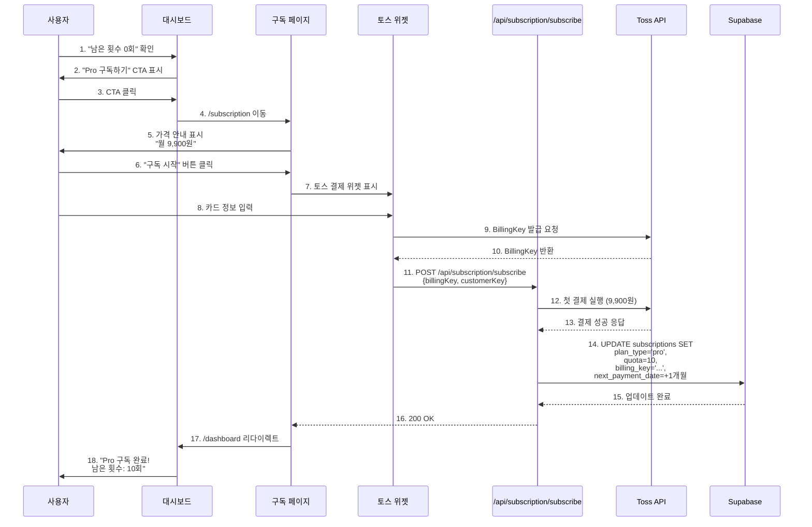
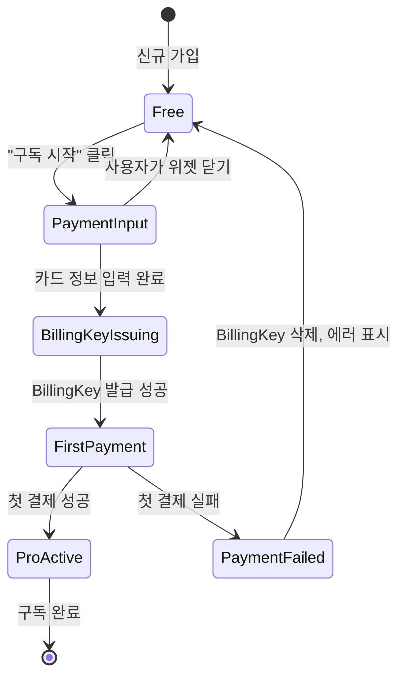

# UseCase Specification: UF-02 무료 사용자의 Pro 구독 전환

**버전**: 1.0
**작성일**: 2025-10-26
**우선순위**: P0 (MVP 필수)
**상태**: Draft

---

## 1. 개요

### 1.1 UseCase 정보

| 항목 | 내용 |
|------|------|
| **UseCase ID** | UF-02 |
| **UseCase 명** | 무료 사용자의 Pro 구독 전환 |
| **관련 페이지** | `/subscription` (구독 관리 페이지) |
| **주요 액터** | 무료 쿼터를 소진한 사용자 |
| **트리거** | 사용자가 "Pro 구독 시작" 버튼 클릭 |
| **선행 조건** | 1. 로그인 완료<br>2. `plan_type = 'free'` 상태<br>3. 유효한 결제 수단 (카드) 보유 |
| **결과** | Pro 구독 활성화 (월 10회 쿼터 부여, BillingKey 저장, 정기 결제 예약) |

### 1.2 비즈니스 목표

- **전환율 목표**: 무료 → Pro 전환율 15% 달성
- **수익 목표**: 월 구독 수익(MRR) 기여
- **사용자 경험**: 간편하고 신뢰할 수 있는 결제 프로세스 제공

---

## 2. 사용자 스토리

### 2.1 Primary 시나리오

> **"As a** 무료 체험 사용자,
> **I want to** 간편하게 Pro 구독을 시작하고,
> **So that** 매월 10회 사주 분석을 이용할 수 있다."

**상황**:
- 김민수(30세, 직장인)는 무료 쿼터 3회를 모두 사용했습니다.
- 서비스가 마음에 들어 계속 이용하고 싶어 Pro 구독을 결정했습니다.

**목표**:
- 복잡한 절차 없이 카드 정보만 입력하면 즉시 구독 시작
- 첫 결제 완료 후 바로 10회 쿼터 사용 가능

### 2.2 Alternative 시나리오

#### 시나리오 A: 결제 실패 → 재시도 성공

**상황**: 카드 잔액 부족으로 첫 결제 실패
**사용자 대응**: 다른 카드로 재시도
**시스템 대응**: BillingKey 미저장, 에러 메시지 표시, 재시도 유도

#### 시나리오 B: 결제 위젯 닫기 → 재방문

**상황**: 결제 진행 중 마음이 바뀌어 위젯 닫기
**사용자 대응**: 나중에 다시 방문하여 구독 시작
**시스템 대응**: 구독 상태 변화 없음, 언제든 재시도 가능

---

## 3. 플로우 다이어그램

### 3.1 전체 흐름



### 3.2 결제 상태 전이



---

## 4. 입력 (Input)

### 4.1 UI 상호작용

**위치**: `/subscription` 구독 관리 페이지

**액션 순서**:
1. "Pro 구독 시작" 버튼 클릭
2. 토스 결제 위젯 모달 오픈
3. 카드 정보 입력:
   - 카드 번호 (16자리)
   - 유효기간 (MM/YY)
   - CVC 번호 (3-4자리)
   - 카드 비밀번호 앞 2자리
   - 생년월일 6자리 (YYMMDD)
4. 약관 동의 체크
5. "결제하기" 버튼 클릭

### 4.2 시스템 입력

**클라이언트 → 백엔드 전달 데이터**:
```typescript
interface SubscribeRequest {
  billingKey: string;        // 토스 위젯에서 발급한 BillingKey
  customerKey: string;       // Clerk User ID (고객 식별자)
}
```

**환경 정보**:
- 현재 사용자: Clerk User ID
- 결제 금액: 9,900원 (고정)
- 결제 주기: 월 1회
- 결제 수단: 신용카드 (토스 지원 카드사)

### 4.3 검증 규칙

**프론트엔드 검증**:
- 로그인 상태 확인: `useAuth().userId` 존재
- 현재 플랜 확인: `plan_type === 'free'`
- BillingKey 발급 완료 확인: 토스 위젯 콜백 응답

**백엔드 검증**:
```typescript
// 1. 사용자 인증 확인
const { userId } = auth();
if (!userId) throw new Error('Unauthorized');

// 2. 현재 구독 상태 확인
const subscription = await supabase
  .from('subscriptions')
  .select('plan_type, status')
  .eq('clerk_user_id', userId)
  .single();

if (subscription.plan_type === 'pro') {
  throw new Error('이미 Pro 구독 중입니다.');
}

// 3. BillingKey 유효성 확인
if (!billingKey || billingKey.length < 10) {
  throw new Error('유효하지 않은 BillingKey입니다.');
}
```

---

## 5. 처리 (Processing)

### 5.1 Step 1: 토스 BillingKey 발급

**담당 주체**: 토스 결제 위젯 (클라이언트 사이드)

**동작**:
- 사용자가 입력한 카드 정보를 토스 서버로 전송
- 토스 서버는 카드 유효성 검증 후 `BillingKey` 발급
- 발급된 BillingKey는 클라이언트에 반환

**API 호출**:
```javascript
// 토스 위젯 SDK 사용 (자동 처리)
const tossPayments = TossPayments(clientKey);
const widget = tossPayments.widgets({ customerKey: userId });

widget.requestBillingAuth({
  method: '카드',
  successUrl: window.location.origin + '/subscription/success',
  failUrl: window.location.origin + '/subscription/fail',
});
```

**성공 응답**:
```json
{
  "billingKey": "billing_abc123xyz",
  "customerKey": "user_2abc123xyz",
  "method": "카드",
  "card": {
    "issuerCode": "51",
    "acquirerCode": "51",
    "number": "1234****1234",
    "cardType": "신용"
  }
}
```

### 5.2 Step 2: 첫 결제 실행

**담당 주체**: Next.js API `/api/subscription/subscribe`

**동작**:
- BillingKey를 사용하여 즉시 첫 결제(9,900원) 실행
- 결제 성공 여부에 따라 구독 활성화 또는 롤백

**토스 API 호출**:
```typescript
// /lib/toss/client.ts
export async function executeFirstPayment(billingKey: string, userId: string) {
  const response = await fetch(
    `https://api.tosspayments.com/v1/billing/${billingKey}`,
    {
      method: 'POST',
      headers: {
        'Authorization': `Basic ${Buffer.from(TOSS_SECRET_KEY + ':').toString('base64')}`,
        'Content-Type': 'application/json',
      },
      body: JSON.stringify({
        customerKey: userId,
        amount: 9900,
        orderId: `order_${userId}_${Date.now()}`,
        orderName: '사주분석 Pro 구독',
      }),
    }
  );

  return response.json();
}
```

**성공 응답**:
```json
{
  "mId": "tosspayments",
  "paymentKey": "5zJ4xY7m0kODnyRpQWGrN2xqGlNvLrKwv1M9ENjbeoPaZdL6",
  "orderId": "order_user_2abc123xyz_1698765432000",
  "orderName": "사주분석 Pro 구독",
  "status": "DONE",
  "requestedAt": "2025-10-26T15:30:00+09:00",
  "approvedAt": "2025-10-26T15:30:05+09:00",
  "totalAmount": 9900,
  "method": "카드",
  "card": {
    "number": "1234****1234",
    "approveNo": "00000000"
  }
}
```

### 5.3 Step 3: Supabase 구독 정보 업데이트

**담당 주체**: Next.js API `/api/subscription/subscribe`

**동작**:
- 결제 성공 시 구독 정보를 Pro로 업그레이드
- 쿼터 10회 부여, BillingKey 저장, 다음 결제일 설정

**SQL 쿼리**:
```sql
UPDATE subscriptions
SET
  plan_type = 'pro',
  status = 'active',
  quota = 10,
  billing_key = $1,  -- 'billing_abc123xyz'
  next_payment_date = CURRENT_DATE + INTERVAL '1 month',
  last_payment_date = CURRENT_DATE
WHERE clerk_user_id = $2  -- 'user_2abc123xyz'
  AND plan_type = 'free'  -- 동시성 방지
RETURNING *;
```

**트랜잭션 처리**:
```typescript
// /app/api/subscription/subscribe/route.ts
export async function POST(req: Request) {
  const { userId } = auth();
  const { billingKey } = await req.json();

  try {
    // 1. 첫 결제 실행
    const payment = await executeFirstPayment(billingKey, userId);

    if (payment.status !== 'DONE') {
      throw new Error('결제 실패');
    }

    // 2. 구독 정보 업데이트
    const { data, error } = await supabase
      .from('subscriptions')
      .update({
        plan_type: 'pro',
        quota: 10,
        billing_key: billingKey,
        next_payment_date: new Date(Date.now() + 30 * 24 * 60 * 60 * 1000).toISOString().split('T')[0],
        last_payment_date: new Date().toISOString().split('T')[0],
      })
      .eq('clerk_user_id', userId)
      .eq('plan_type', 'free')  // 동시성 방지
      .select()
      .single();

    if (error) throw error;

    return NextResponse.json({ success: true, subscription: data });
  } catch (error) {
    // 롤백: BillingKey 삭제
    await deleteBillingKey(billingKey);
    return NextResponse.json({ error: error.message }, { status: 400 });
  }
}
```

### 5.4 Step 4: 상태 동기화

**담당 주체**: React Context API (SubscriptionProvider)

**동작**:
- API 응답 성공 시 프론트엔드 상태 업데이트
- 대시보드로 리다이렉트 전 쿼터 정보 갱신

**클라이언트 코드**:
```typescript
// /app/subscription/page.tsx
const handleSubscribe = async (billingKey: string) => {
  setIsLoading(true);

  try {
    const response = await fetch('/api/subscription/subscribe', {
      method: 'POST',
      headers: { 'Content-Type': 'application/json' },
      body: JSON.stringify({ billingKey, customerKey: userId }),
    });

    if (!response.ok) throw new Error('구독 실패');

    // Context 업데이트
    await refreshSubscription();

    // 성공 안내
    toast.success('Pro 구독이 시작되었습니다! 이제 월 10회 분석을 이용하실 수 있습니다.');

    // 대시보드로 이동
    router.push('/dashboard');
  } catch (error) {
    toast.error('결제에 실패했습니다. 다시 시도해주세요.');
  } finally {
    setIsLoading(false);
  }
};
```

---

## 6. 출력 (Output)

### 6.1 성공 시

**UI 변화**:
- Toast 알림: "Pro 구독이 시작되었습니다! 이제 월 10회 분석을 이용하실 수 있습니다."
- 자동 리다이렉트: `/subscription` → `/dashboard`
- 대시보드 쿼터 표시: "남은 분석 횟수: 10회 | Pro 구독 중"
- 다음 결제일 표시: "다음 결제: 2025-11-26 (9,900원)"

**데이터베이스 변경**:

| 테이블 | 컬럼 | 변경 전 | 변경 후 |
|--------|------|---------|---------|
| subscriptions | plan_type | 'free' | 'pro' |
| subscriptions | status | 'active' | 'active' |
| subscriptions | quota | 0 | 10 |
| subscriptions | billing_key | NULL | 'billing_abc123xyz' |
| subscriptions | next_payment_date | NULL | '2025-11-26' |
| subscriptions | last_payment_date | NULL | '2025-10-26' |

**사이드이펙트**:
- 토스 페이먼츠에 BillingKey 저장 (정기 결제 예약)
- 다음 결제일(2025-11-26)에 Supabase Cron이 자동 결제 실행 예약
- 결제 성공 로그 기록 (향후 추가 예정)

### 6.2 실패 시

#### Case 1: 카드 정보 오류

**에러 메시지**: "카드 정보를 확인해주세요."
**사용자 대응**: 카드 정보 재입력
**시스템 대응**: 토스 위젯에서 입력 폼 유지, BillingKey 발급 안 됨

#### Case 2: 잔액 부족

**에러 메시지**: "카드 잔액이 부족합니다."
**사용자 대응**: 다른 카드 사용 또는 충전 후 재시도
**시스템 대응**: BillingKey는 발급되었으나 첫 결제 실패 → BillingKey 즉시 삭제

**롤백 로직**:
```typescript
// /app/api/subscription/subscribe/route.ts (catch 블록)
catch (error) {
  // BillingKey 삭제
  await fetch(`https://api.tosspayments.com/v1/billing/${billingKey}`, {
    method: 'DELETE',
    headers: {
      'Authorization': `Basic ${Buffer.from(TOSS_SECRET_KEY + ':').toString('base64')}`,
    },
  });

  // 구독 상태 롤백 (plan_type: 'free' 유지)
  await supabase
    .from('subscriptions')
    .update({ billing_key: null })
    .eq('clerk_user_id', userId);

  return NextResponse.json({ error: '결제에 실패했습니다.' }, { status: 400 });
}
```

#### Case 3: 카드사 거부

**에러 메시지**: "카드사에서 결제를 거부했습니다. 카드사에 문의해주세요."
**사용자 대응**: 카드사 확인 또는 다른 카드 사용
**시스템 대응**: BillingKey 삭제, 구독 상태 변화 없음

#### Case 4: 네트워크 오류

**에러 메시지**: "일시적인 오류가 발생했습니다. 다시 시도해주세요."
**사용자 대응**: 새로고침 후 재시도
**시스템 대응**: 타임아웃 처리 (10초), BillingKey 미저장

### 6.3 HTTP 응답

**성공 (200 OK)**:
```json
{
  "success": true,
  "subscription": {
    "clerk_user_id": "user_2abc123xyz",
    "plan_type": "pro",
    "quota": 10,
    "next_payment_date": "2025-11-26",
    "last_payment_date": "2025-10-26"
  }
}
```

**실패 (400 Bad Request)**:
```json
{
  "error": "결제에 실패했습니다. 카드 정보를 확인하고 다시 시도해주세요.",
  "code": "PAYMENT_FAILED"
}
```

---

## 7. 엣지 케이스 (Edge Cases)

### 7.1 EC-01: BillingKey 발급 성공 후 첫 결제 실패

**문제**: 카드 등록은 성공했으나 첫 결제가 거부됨 (잔액 부족, 한도 초과 등)

**감지 방법**:
- 토스 API 응답 `status: 'FAILED'` 또는 `status: 'ABORTED'`

**대응 방안**:
1. BillingKey 즉시 삭제 (토스 API DELETE 호출)
2. Supabase 구독 정보 롤백 (`plan_type: 'free'` 유지)
3. 사용자에게 명확한 에러 메시지 표시
4. "다시 시도" 버튼 제공

**코드**:
```typescript
if (payment.status !== 'DONE') {
  await deleteBillingKey(billingKey);
  throw new Error('결제에 실패했습니다. 카드 정보를 확인하고 다시 시도해주세요.');
}
```

### 7.2 EC-02: 이미 Pro 구독 중인 사용자

**문제**: Pro 상태에서 재구독 시도 (UI에서 차단해야 하지만 API 레벨 방어)

**감지 방법**:
- API에서 `plan_type === 'pro'` 확인

**대응 방안**:
1. HTTP 400 Bad Request 반환
2. 에러 메시지: "이미 Pro 구독 중입니다."
3. 구독 관리 페이지로 리다이렉트

**코드**:
```typescript
if (subscription.plan_type === 'pro') {
  return NextResponse.json(
    { error: '이미 Pro 구독 중입니다.' },
    { status: 400 }
  );
}
```

### 7.3 EC-03: 결제 위젯 닫기 (사용자 이탈)

**문제**: 사용자가 결제 위젯에서 "X" 버튼 클릭 또는 취소

**감지 방법**:
- 토스 위젯 콜백 없음 (timeout 발생)

**대응 방안**:
1. 구독 페이지 그대로 유지
2. 안내 메시지: "구독을 취소하셨습니다. 언제든 다시 시도하실 수 있습니다."
3. 구독 상태 변화 없음

**코드**:
```typescript
// 토스 위젯 취소 콜백
widget.on('cancel', () => {
  toast.info('구독을 취소하셨습니다.');
});
```

### 7.4 EC-04: 동시 요청 (Race Condition)

**문제**: 사용자가 "구독 시작" 버튼 중복 클릭 (네트워크 지연 등)

**감지 방법**:
- 프론트엔드: `isLoading` 상태로 버튼 비활성화
- 백엔드: `WHERE plan_type = 'free'` 조건으로 중복 처리 방지

**대응 방안**:
1. 첫 번째 요청만 처리
2. 두 번째 요청은 `plan_type === 'pro'` 조건 실패로 자동 차단
3. 프론트엔드에서 버튼 비활성화 처리

**코드**:
```typescript
// 프론트엔드
const [isLoading, setIsLoading] = useState(false);

<button onClick={handleSubscribe} disabled={isLoading}>
  {isLoading ? '처리 중...' : '구독 시작'}
</button>

// 백엔드
.update({ plan_type: 'pro', ... })
.eq('clerk_user_id', userId)
.eq('plan_type', 'free')  // 동시성 방지
```

### 7.5 EC-05: 토스 API 타임아웃

**문제**: 토스 API 응답이 10초 이상 지연 (드물지만 발생 가능)

**감지 방법**:
- `fetch` 타임아웃 설정 (10초)

**대응 방안**:
1. 타임아웃 에러 표시: "일시적인 오류가 발생했습니다. 다시 시도해주세요."
2. BillingKey 발급 여부 불명확하므로 사용자에게 재시도 요청
3. 로그 기록 (모니터링 필요)

**코드**:
```typescript
const controller = new AbortController();
const timeoutId = setTimeout(() => controller.abort(), 10000);

try {
  const response = await fetch(tossApiUrl, {
    signal: controller.signal,
    ...options
  });
} catch (error) {
  if (error.name === 'AbortError') {
    throw new Error('일시적인 오류가 발생했습니다. 다시 시도해주세요.');
  }
} finally {
  clearTimeout(timeoutId);
}
```

---

## 8. 외부 연동 서비스

### 8.1 토스페이먼츠 (Toss Payments)

**연동 목적**: 정기 구독 결제 처리

**사용 기능**:
1. **BillingKey 발급**: 카드 정보를 저장하여 정기 결제 가능
2. **즉시 결제**: BillingKey로 첫 결제 실행
3. **BillingKey 삭제**: 결제 실패 시 롤백

**API 엔드포인트**:

| 기능 | Method | URL | 용도 |
|------|--------|-----|------|
| BillingKey 발급 | POST | `/v1/billing/authorizations/card` | 카드 정보로 BillingKey 생성 |
| 즉시 결제 | POST | `/v1/billing/{billingKey}` | BillingKey로 결제 실행 |
| BillingKey 삭제 | DELETE | `/v1/billing/{billingKey}` | 정기 결제 해지 |

**인증 방식**:
- Basic Auth: `Base64(TOSS_SECRET_KEY + ':')`
- 환경 변수: `TOSS_SECRET_KEY`, `NEXT_PUBLIC_TOSS_CLIENT_KEY`

**에러 코드**:

| 코드 | 원인 | 대응 방안 |
|------|------|----------|
| `CARD_EXPIRED` | 카드 만료 | "카드 유효기간이 만료되었습니다." |
| `INSUFFICIENT_FUNDS` | 잔액 부족 | "카드 잔액이 부족합니다." |
| `INVALID_CARD` | 잘못된 카드 정보 | "카드 정보를 확인해주세요." |
| `PAYMENT_DENIED` | 카드사 거부 | "카드사에서 결제를 거부했습니다." |

### 8.2 Clerk (인증)

**연동 목적**: 사용자 인증 및 식별

**사용 기능**:
- `customerKey`: Clerk User ID를 토스에 전달하여 고객 식별

**코드**:
```typescript
import { auth } from '@clerk/nextjs';

export async function POST(req: Request) {
  const { userId } = auth();
  if (!userId) {
    return NextResponse.json({ error: 'Unauthorized' }, { status: 401 });
  }
  // ...
}
```

### 8.3 Supabase (데이터베이스)

**연동 목적**: 구독 정보 저장 및 조회

**사용 테이블**:
- `subscriptions`: 구독 상태, 쿼터, BillingKey 저장

**주요 쿼리**:
- 구독 상태 조회: `SELECT * FROM subscriptions WHERE clerk_user_id = ?`
- 구독 업데이트: `UPDATE subscriptions SET plan_type='pro', ... WHERE clerk_user_id = ?`

---

## 9. API 명세

### 9.1 POST /api/subscription/subscribe

**목적**: Pro 구독 시작 (BillingKey로 첫 결제 실행)

**인증**: Clerk 세션 필수

**요청**:
```typescript
{
  "billingKey": "billing_abc123xyz",
  "customerKey": "user_2abc123xyz"
}
```

**응답 (200 OK)**:
```json
{
  "success": true,
  "subscription": {
    "clerk_user_id": "user_2abc123xyz",
    "plan_type": "pro",
    "quota": 10,
    "next_payment_date": "2025-11-26",
    "last_payment_date": "2025-10-26"
  }
}
```

**에러 (400 Bad Request)**:
```json
{
  "error": "결제에 실패했습니다. 카드 정보를 확인하고 다시 시도해주세요.",
  "code": "PAYMENT_FAILED"
}
```

**에러 (401 Unauthorized)**:
```json
{
  "error": "로그인이 필요합니다.",
  "code": "UNAUTHORIZED"
}
```

---

## 10. 페이지 요구사항

### 10.1 `/subscription` 구독 관리 페이지

**표시 정보**:
- 현재 플랜: "무료 체험" (쿼터 0/3회 남음)
- Pro 플랜 안내:
  - 가격: 월 9,900원
  - 혜택: 월 10회 사주 분석
  - 모델: Gemini 2.5 Pro (고급 모델)
- CTA 버튼: "Pro 구독 시작"

**UI 컴포넌트**:
```tsx
// /app/subscription/page.tsx
'use client';

import { useState } from 'react';
import { useAuth } from '@clerk/nextjs';
import { toast } from 'sonner';
import { TossPayments } from '@/lib/toss';

export default function SubscriptionPage() {
  const { userId } = useAuth();
  const [isLoading, setIsLoading] = useState(false);

  const handleSubscribe = async () => {
    setIsLoading(true);

    try {
      // 토스 위젯 열기
      const tossPayments = TossPayments(process.env.NEXT_PUBLIC_TOSS_CLIENT_KEY);
      const widget = tossPayments.widgets({ customerKey: userId });

      await widget.requestBillingAuth({
        method: '카드',
        successUrl: window.location.origin + '/subscription/success',
        failUrl: window.location.origin + '/subscription/fail',
      });
    } catch (error) {
      toast.error('결제 위젯을 불러오는데 실패했습니다.');
    } finally {
      setIsLoading(false);
    }
  };

  return (
    <div className="max-w-2xl mx-auto p-6">
      <h1 className="text-3xl font-bold mb-8">구독 관리</h1>

      <div className="border rounded-xl p-6 mb-6">
        <h2 className="text-xl font-semibold mb-2">현재 플랜: 무료 체험</h2>
        <p className="text-gray-600 mb-4">남은 분석 횟수: 0회 / 3회</p>
      </div>

      <div className="border-2 border-purple-500 rounded-xl p-6">
        <div className="flex items-center justify-between mb-4">
          <h2 className="text-2xl font-bold">Pro 플랜</h2>
          <span className="text-3xl font-bold text-purple-600">₩9,900<span className="text-sm text-gray-500">/월</span></span>
        </div>

        <ul className="mb-6 space-y-2">
          <li className="flex items-center">
            <span className="mr-2">✅</span>
            월 10회 사주 분석
          </li>
          <li className="flex items-center">
            <span className="mr-2">✅</span>
            Gemini 2.5 Pro 모델 사용
          </li>
          <li className="flex items-center">
            <span className="mr-2">✅</span>
            분석 이력 무제한 보관
          </li>
          <li className="flex items-center">
            <span className="mr-2">✅</span>
            언제든 해지 가능
          </li>
        </ul>

        <button
          onClick={handleSubscribe}
          disabled={isLoading}
          className="w-full bg-purple-600 text-white py-3 rounded-lg font-semibold hover:bg-purple-700 disabled:opacity-50"
        >
          {isLoading ? '처리 중...' : 'Pro 구독 시작'}
        </button>
      </div>
    </div>
  );
}
```

---

## 11. 테스트 시나리오

### 11.1 정상 플로우 테스트

**테스트 케이스 ID**: TC-UF02-001

**사전 조건**:
- 로그인 완료
- `plan_type = 'free'`, `quota = 0`

**실행 단계**:
1. `/subscription` 페이지 접속
2. "Pro 구독 시작" 버튼 클릭
3. 토스 위젯에서 카드 정보 입력
4. 결제 완료

**예상 결과**:
- `/dashboard`로 리다이렉트
- 쿼터 표시: "남은 분석 횟수: 10회 | Pro 구독 중"
- DB 확인: `plan_type = 'pro'`, `quota = 10`, `billing_key` 저장됨

### 11.2 결제 실패 테스트

**테스트 케이스 ID**: TC-UF02-002

**사전 조건**:
- 로그인 완료
- 테스트 카드: 잔액 부족 카드

**실행 단계**:
1. `/subscription` 페이지 접속
2. "Pro 구독 시작" 버튼 클릭
3. 잔액 부족 카드 정보 입력

**예상 결과**:
- 에러 메시지: "카드 잔액이 부족합니다."
- 구독 페이지 유지
- DB 확인: `plan_type = 'free'` 유지, `billing_key = NULL`

### 11.3 중복 클릭 테스트

**테스트 케이스 ID**: TC-UF02-003

**사전 조건**:
- 로그인 완료

**실행 단계**:
1. "Pro 구독 시작" 버튼 연속 클릭 (2회)

**예상 결과**:
- 첫 번째 요청만 처리
- 버튼 비활성화로 중복 클릭 방지
- DB 확인: 중복 결제 없음

---

## 12. 비기능 요구사항

### 12.1 성능

- **결제 완료 시간**: 사용자가 "결제하기" 버튼 클릭 후 10초 이내 완료
- **API 응답 시간**: `/api/subscription/subscribe` 평균 3초 이내
- **토스 API 타임아웃**: 10초

### 12.2 보안

- **BillingKey 보호**: 클라이언트에 노출 금지, 서버 사이드만 접근
- **HTTPS 필수**: 모든 결제 관련 통신은 HTTPS
- **PCI DSS 준수**: 토스페이먼츠가 카드 정보 처리 (서비스는 저장 안 함)

### 12.3 사용성

- **명확한 가격 표시**: 월 9,900원 (부가세 포함) 명시
- **투명한 약관**: 정기 결제, 해지 정책 사전 고지
- **친절한 에러 메시지**: 결제 실패 시 구체적인 원인 및 해결 방법 안내

### 12.4 안정성

- **트랜잭션 보장**: 결제 성공과 DB 업데이트는 원자적으로 처리
- **롤백 메커니즘**: 결제 실패 시 BillingKey 즉시 삭제
- **멱등성**: 동일 요청 중복 처리 방지

---

## 13. 성공 지표 (KPI)

| 지표 | 목표 | 측정 방법 |
|------|------|----------|
| **전환율** | 15% | (Pro 구독자 수 ÷ 무료 가입자 수) × 100 |
| **결제 성공률** | 98% | (성공 건수 ÷ 시도 건수) × 100 |
| **구독 완료 시간** | < 60초 | 버튼 클릭 ~ 대시보드 도착 시간 측정 |
| **이탈률** | < 30% | 결제 위젯 열기 ~ 완료 전 이탈 비율 |

---

## 14. 참고 자료

- [토스페이먼츠 공식 문서 - 정기 결제](https://docs.tosspayments.com/guides/billing)
- [토스페이먼츠 위젯 SDK](https://docs.tosspayments.com/reference/widget-sdk)
- [Clerk 인증 가이드](https://clerk.com/docs/authentication/overview)
- [Supabase PostgreSQL](https://supabase.com/docs/guides/database)

---

**문서 버전**: 1.0
**최종 수정일**: 2025-10-26
**작성자**: Product Team
**검토자**: Dev Lead, QA Lead
**승인 상태**: Draft
