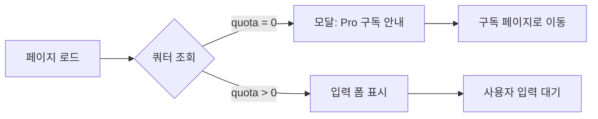

# 유스케이스 명세서: 사주 입력 및 분석

**문서 버전**: 1.0
**작성일**: 2025-10-25
**유스케이스 ID**: UC-002
**우선순위**: Must Have (필수)

---

## 1. 유스케이스 개요 (Use Case Overview)

### 1.1 유스케이스 이름
**사주 입력 및 분석** (Saju Analysis Request)

### 1.2 유스케이스 설명
사용자가 생년월일시 정보를 입력하여 AI 기반 사주팔자 분석을 요청하고, Gemini API를 통해 생성된 분석 결과를 조회하는 기능입니다. 무료/유료 플랜에 따라 서로 다른 AI 모델을 사용하며, 쿼터 기반으로 사용 횟수를 제한합니다.

### 1.3 유스케이스 목표
- 사용자가 간편하게 사주 정보를 입력하고 즉시 분석 결과를 받을 수 있도록 지원
- 무료(3회)/유료(월 10회) 쿼터 정책을 준수하여 비즈니스 모델 유지
- Gemini API 연동을 통한 고품질 AI 사주 분석 제공
- 분석 결과를 데이터베이스에 저장하여 이력 관리 기능 지원

### 1.4 유스케이스 범위
- **포함**: 사주 정보 입력, 유효성 검증, 쿼터 확인, Gemini API 호출, 결과 저장, 결과 페이지 표시
- **제외**: 분석 결과 공유, 결과 수정, 재분석 (동일 정보로 재요청 차단은 선택 사항)

---

## 2. 액터 (Actors)

### 2.1 주 액터 (Primary Actor)
- **인증된 사용자 (Authenticated User)**
  - 로그인 완료 상태
  - 무료 플랜 (Free) 또는 유료 플랜 (Pro) 보유
  - 남은 쿼터 ≥ 1회

### 2.2 지원 액터 (Supporting Actors)
- **Gemini API (Google AI)**
  - 사주 분석 프롬프트를 입력받아 마크다운 형식의 분석 결과 생성
  - 모델 선택: `gemini-2.5-flash` (Free) / `gemini-2.5-pro` (Pro)

- **Supabase Database**
  - 사용자 구독 정보 조회 (`subscriptions` 테이블)
  - 분석 결과 저장 (`analyses` 테이블)
  - 쿼터 차감 업데이트

- **Next.js API Route**
  - 클라이언트 요청 처리
  - Clerk 인증 검증
  - 트랜잭션 관리 (분석 저장 + 쿼터 차감 원자적 처리)

---

## 3. 사전 조건 (Preconditions)

### 3.1 필수 조건
1. **사용자 인증 완료**
   - Clerk 세션 유효
   - `userId` 존재 (`auth()` 미들웨어 통과)

2. **구독 정보 존재**
   - `subscriptions` 테이블에 해당 사용자 레코드 존재
   - `status = 'active'` 또는 `status = 'cancelled'` (결제일 전까지 Pro 유지)

3. **쿼터 확인**
   - `subscriptions.quota > 0`
   - 무료: 총 3회 (소진 시 Pro 구독 필요)
   - Pro: 월 10회 (매월 결제일에 리셋)

4. **Gemini API 연동 가능**
   - 환경 변수 `GEMINI_API_KEY` 설정 완료
   - API Rate Limit 미초과 (1분당 60회 제한 가정)

### 3.2 선택 조건
- 사용자가 이전에 동일 정보로 분석 요청한 경우: 1분 이내 재요청 방지 (선택 사항)

---

## 4. 기본 플로우 (Main Flow)

### 4.1 사주 정보 입력 단계

**단계 1-1: 분석 입력 페이지 진입**
- 사용자가 대시보드에서 "새 분석하기" 버튼 클릭
- 시스템이 `/analysis/new` 페이지로 라우팅
- Clerk 미들웨어가 인증 상태 확인 (미인증 시 로그인 페이지로 리다이렉트)

**단계 1-2: 쿼터 사전 확인**


- **API 호출**: `GET /api/subscription/status`
- **응답 예시**:
  ```json
  {
    "planType": "free",
    "quota": 2,
    "status": "active"
  }
  ```
- **쿼터 0일 경우**: "사용 가능한 횟수가 없습니다. Pro 구독이 필요합니다." 모달 표시
- **쿼터 > 0일 경우**: 입력 폼 렌더링

**단계 1-3: 사주 정보 입력**
사용자가 다음 정보를 입력:

| 필드명 | 필수 여부 | 입력 형식 | 예시 |
|--------|----------|----------|------|
| 이름 (name) | 필수 | 1-20자 한글/영문 | "홍길동" |
| 생년월일 (birthDate) | 필수 | YYYY-MM-DD | "1990-05-15" |
| 출생시간 (birthTime) | 선택 | HH:MM (24시간) | "14:30" 또는 비워둠 |
| 성별 (gender) | 필수 | 'male' 또는 'female' | "male" |

**단계 1-4: 클라이언트 측 유효성 검증**
```typescript
// 검증 규칙 (React Hook Form + Zod)
const schema = z.object({
  name: z.string()
    .min(1, "이름을 입력해주세요")
    .max(20, "이름은 20자 이내여야 합니다"),
  birthDate: z.string()
    .regex(/^\d{4}-\d{2}-\d{2}$/, "올바른 날짜 형식(YYYY-MM-DD)을 입력해주세요")
    .refine(date => {
      const d = new Date(date);
      const now = new Date();
      const minYear = 1900;
      return d.getFullYear() >= minYear && d <= now;
    }, "1900년 이후부터 오늘까지의 날짜를 입력해주세요"),
  birthTime: z.string()
    .regex(/^\d{2}:\d{2}$/, "올바른 시간 형식(HH:MM)을 입력해주세요")
    .optional(),
  gender: z.enum(['male', 'female'], {
    errorMap: () => ({ message: "성별을 선택해주세요" })
  })
});
```

**단계 1-5: 분석 시작 버튼 클릭**
- 사용자가 "분석 시작" 버튼 클릭
- 클라이언트가 로딩 스피너 표시
- 분석 중 메시지: "AI가 사주를 분석하고 있습니다... (약 15-30초 소요)"

### 4.2 Gemini API 분석 단계

**단계 2-1: API 요청**
```http
POST /api/analysis/create
Content-Type: application/json

{
  "name": "홍길동",
  "birthDate": "1990-05-15",
  "birthTime": "14:30",
  "gender": "male"
}
```

**단계 2-2: 서버 측 처리 (Next.js API Route)**

```typescript
// /app/api/analysis/create/route.ts
export async function POST(req: Request) {
  // Step 1: 인증 확인
  const { userId } = auth();
  if (!userId) {
    return NextResponse.json(
      { error: '인증이 필요합니다' },
      { status: 401 }
    );
  }

  // Step 2: 요청 데이터 파싱 및 검증
  const body = await req.json();
  const validationResult = schema.safeParse(body);
  if (!validationResult.success) {
    return NextResponse.json(
      { error: '입력값이 올바르지 않습니다', details: validationResult.error },
      { status: 400 }
    );
  }

  // Step 3: 쿼터 확인 및 잠금 (트랜잭션)
  const { data: subscription } = await supabase
    .from('subscriptions')
    .select('quota, plan_type, status')
    .eq('user_id', userId)
    .single();

  if (!subscription || subscription.quota <= 0) {
    return NextResponse.json(
      { error: '사용 가능한 횟수가 없습니다. Pro 구독이 필요합니다.' },
      { status: 403 }
    );
  }

  if (subscription.status === 'terminated') {
    return NextResponse.json(
      { error: '해지된 구독입니다. 재구독이 필요합니다.' },
      { status: 403 }
    );
  }

  // Step 4: Gemini API 호출
  try {
    const prompt = generateSajuPrompt(validationResult.data);
    const isPro = subscription.plan_type === 'pro';

    const result = await geminiClient.analyze(prompt, isPro);

    // Step 5: 결과 저장 + 쿼터 차감 (Transaction)
    const { data: analysis } = await supabase
      .from('analyses')
      .insert({
        user_id: userId,
        name: validationResult.data.name,
        birth_date: validationResult.data.birthDate,
        birth_time: validationResult.data.birthTime || null,
        gender: validationResult.data.gender,
        result_markdown: result.text,
        model_used: isPro ? 'gemini-2.5-pro' : 'gemini-2.5-flash'
      })
      .select()
      .single();

    await supabase
      .from('subscriptions')
      .update({ quota: subscription.quota - 1 })
      .eq('user_id', userId);

    // Step 6: 성공 응답
    return NextResponse.json({
      success: true,
      analysisId: analysis.id,
      redirectTo: `/analysis/${analysis.id}`
    });

  } catch (error) {
    // Gemini API 오류 처리
    console.error('Gemini API Error:', error);
    return NextResponse.json(
      { error: '분석 중 오류가 발생했습니다. 잠시 후 다시 시도해주세요.' },
      { status: 500 }
    );
  }
}
```

**단계 2-3: Gemini 프롬프트 생성**
```typescript
// /lib/prompts/saju.ts
export const generateSajuPrompt = (input: AnalysisInput): string => {
  return `당신은 20년 경력의 전문 사주팔자 상담사입니다.

**입력 정보**:
- 성함: ${input.name}
- 생년월일: ${input.birthDate}
- 출생시간: ${input.birthTime || '미상'}
- 성별: ${input.gender === 'male' ? '남성' : '여성'}

**분석 요구사항**:
1️⃣ 천간(天干)과 지지(地支) 계산
2️⃣ 오행(五行) 분석 (목, 화, 토, 금, 수)
3️⃣ 대운(大運)과 세운(歲運) 해석
4️⃣ 전반적인 성격, 재운, 건강운, 연애운 분석

**출력 형식**: 마크다운 (제목, 소제목, 리스트 활용)

**금지 사항**:
- 의료·법률 조언 금지
- 확정적 미래 예측 금지 (가능성으로 표현)
- 부정적·공격적 표현 금지

이제 분석을 시작해주세요.`;
};
```

**단계 2-4: Gemini API 응답 처리**
- **성공 시**: 마크다운 텍스트 반환 (평균 5-10KB)
- **예상 응답 시간**: 15-30초 (프롬프트 복잡도 및 모델에 따라 변동)
- **토큰 사용량**: 약 2,000-5,000 토큰 (입력 + 출력)

### 4.3 결과 저장 및 표시 단계

**단계 3-1: 데이터베이스 저장**
`analyses` 테이블에 다음 정보 저장:
```sql
INSERT INTO analyses (
  user_id,
  name,
  birth_date,
  birth_time,
  gender,
  result_markdown,
  model_used,
  created_at
) VALUES (
  'user_xxxxx',
  '홍길동',
  '1990-05-15',
  '14:30',
  'male',
  '# 홍길동님의 사주팔자 분석\n\n...',
  'gemini-2.5-flash',
  NOW()
);
```

**단계 3-2: 쿼터 차감**
```sql
UPDATE subscriptions
SET quota = quota - 1,
    updated_at = NOW()
WHERE user_id = 'user_xxxxx';
```

**단계 3-3: 클라이언트 리다이렉트**
- 서버 응답 수신 후 클라이언트가 `/analysis/:id` 페이지로 리다이렉트
- 로딩 스피너 종료
- "분석이 완료되었습니다!" 토스트 메시지 표시

**단계 3-4: 결과 페이지 렌더링**
```tsx
// /app/analysis/[id]/page.tsx
export default async function AnalysisDetailPage({ params }) {
  const { id } = params;
  const { userId } = auth();

  // 분석 결과 조회
  const { data: analysis } = await supabase
    .from('analyses')
    .select('*')
    .eq('id', id)
    .eq('user_id', userId) // 본인 소유 확인
    .single();

  if (!analysis) {
    return <NotFound />;
  }

  return (
    <div>
      <AnalysisHeader
        name={analysis.name}
        birthDate={analysis.birth_date}
        birthTime={analysis.birth_time}
        gender={analysis.gender}
        modelUsed={analysis.model_used}
        createdAt={analysis.created_at}
      />

      <MarkdownRenderer content={analysis.result_markdown} />

      <ActionButtons
        onBackToDashboard={() => router.push('/dashboard')}
        onShare={() => handleShare(analysis.id)} // 선택 사항
        onDelete={() => handleDelete(analysis.id)} // 선택 사항
      />
    </div>
  );
}
```

---

## 5. 대안 플로우 (Alternative Flows)

### 5.1 AF-1: 쿼터 소진 상태에서 접근

**트리거**: 사용자가 `/analysis/new` 접근 시 `quota = 0`

**플로우**:
1. 페이지 로드 시 쿼터 확인 API 호출
2. `quota = 0` 확인
3. 입력 폼 대신 안내 모달 표시:
   ```
   제목: "사용 가능한 횟수가 없습니다"
   내용: "무료 3회 체험이 모두 소진되었습니다.
          Pro 구독 시 월 10회 분석과 고급 AI 모델을 이용하실 수 있습니다."
   버튼: [Pro 구독하기] [대시보드로 돌아가기]
   ```
4. "Pro 구독하기" 클릭 시 `/subscription` 페이지로 이동

**종료 조건**: 사용자가 구독 페이지로 이동하거나 대시보드로 복귀

### 5.2 AF-2: 취소된 Pro 구독 (결제일 전)

**트리거**: `status = 'cancelled'`, `next_payment_date > today`

**플로우**:
1. 쿼터 확인 시 `status = 'cancelled'` 확인
2. `next_payment_date`가 아직 도래하지 않음을 확인
3. Pro 혜택 유지 (쿼터 사용 가능)
4. 분석 페이지 상단에 안내 배너 표시:
   ```
   ⚠️ 구독이 취소되었습니다. 2025-11-15까지 Pro 기능을 사용하실 수 있습니다.
   [재활성화하기] 버튼
   ```
5. 정상 분석 플로우 진행

**종료 조건**: 분석 완료 또는 재활성화 선택

### 5.3 AF-3: 해지된 구독

**트리거**: `status = 'terminated'`

**플로우**:
1. 쿼터 확인 시 `status = 'terminated'` 확인
2. 분석 요청 차단
3. 안내 모달 표시:
   ```
   제목: "구독이 해지되었습니다"
   내용: "분석 기능을 사용하시려면 재구독이 필요합니다."
   버튼: [재구독하기] [대시보드로 돌아가기]
   ```

**종료 조건**: 사용자가 재구독 페이지로 이동하거나 대시보드로 복귀

---

## 6. 예외 플로우 (Exception Flows)

### 6.1 EF-1: Gemini API 응답 실패

**트리거**: Gemini API 호출 중 오류 발생

**원인**:
- 네트워크 타임아웃 (30초 초과)
- Gemini API Rate Limit 초과 (429 Too Many Requests)
- 내부 서버 오류 (500 Internal Server Error)
- API 키 인증 실패 (401 Unauthorized)

**플로우**:
1. API 오류 catch
2. 쿼터 차감 **하지 않음** (트랜잭션 롤백)
3. 클라이언트에 에러 응답:
   ```json
   {
     "error": "분석 중 오류가 발생했습니다. 잠시 후 다시 시도해주세요.",
     "code": "GEMINI_API_ERROR",
     "retryable": true
   }
   ```
4. 사용자에게 에러 메시지 표시:
   ```
   제목: "분석 실패"
   내용: "일시적인 오류로 분석을 완료할 수 없습니다.
          사용 횟수는 차감되지 않았습니다.
          잠시 후 다시 시도해주세요."
   버튼: [다시 시도] [대시보드로 돌아가기]
   ```

**복구 방법**:
- "다시 시도" 버튼 클릭 시 동일 입력값으로 재요청
- 서버 측 로그 기록 및 모니터링 알림 발송

**종료 조건**: 사용자가 재시도하거나 대시보드로 복귀

### 6.2 EF-2: 입력값 유효성 검증 실패

**트리거**: 서버 측 Zod 스키마 검증 실패

**원인**:
- 클라이언트 측 검증 우회 (API 직접 호출)
- 날짜 범위 오류 (1900년 이전, 미래 날짜)
- 시간 형식 오류

**플로우**:
1. API Route에서 `schema.safeParse()` 실패
2. 400 Bad Request 응답:
   ```json
   {
     "error": "입력값이 올바르지 않습니다",
     "details": {
       "birthDate": ["1900년 이후부터 오늘까지의 날짜를 입력해주세요"]
     }
   }
   ```
3. 클라이언트가 필드별 에러 메시지 표시

**종료 조건**: 사용자가 올바른 입력값으로 수정 후 재제출

### 6.3 EF-3: 동시 요청으로 인한 쿼터 경합

**트리거**: 사용자가 동시에 여러 탭에서 분석 요청

**원인**:
- 쿼터가 1회 남은 상태에서 2개 이상의 요청 동시 발생
- 트랜잭션 격리 수준 미설정

**플로우**:
1. 첫 번째 요청이 쿼터 확인 (`quota = 1`)
2. 두 번째 요청도 동시에 쿼터 확인 (`quota = 1`)
3. 두 요청 모두 분석 진행 시도
4. Supabase 트랜잭션 처리:
   ```typescript
   // Optimistic Locking 또는 Row-Level Lock 사용
   const { data, error } = await supabase
     .from('subscriptions')
     .update({ quota: quota - 1 })
     .eq('user_id', userId)
     .eq('quota', quota) // WHERE 조건에 현재 quota 포함
     .select();

   if (!data || data.length === 0) {
     throw new Error('쿼터가 이미 소진되었습니다');
   }
   ```
5. 두 번째 요청은 쿼터 차감 실패로 403 반환

**종료 조건**: 한 요청만 성공, 나머지는 쿼터 부족 에러

### 6.4 EF-4: 데이터베이스 연결 실패

**트리거**: Supabase 일시적 장애

**플로우**:
1. 쿼터 조회 또는 분석 저장 중 DB 연결 오류
2. 500 Internal Server Error 응답
3. 사용자에게 에러 메시지:
   ```
   제목: "일시적인 오류"
   내용: "서버 연결에 문제가 발생했습니다.
          잠시 후 다시 시도해주세요."
   ```
4. 서버 측 재시도 로직 (최대 3회, 지수 백오프)

**종료 조건**: 재시도 성공 또는 최대 재시도 초과 후 에러 반환

### 6.5 EF-5: 인증 세션 만료

**트리거**: 분석 진행 중 Clerk 세션 만료

**플로우**:
1. API 요청 시 `auth()` 미들웨어가 세션 검증 실패
2. 401 Unauthorized 응답
3. 클라이언트가 `/sign-in?redirect_url=/analysis/new` 로 리다이렉트
4. 로그인 완료 후 분석 페이지로 복귀
5. 입력 데이터는 localStorage에 임시 저장 (선택 사항)

**종료 조건**: 재로그인 완료 후 분석 재개

---

## 7. 사후 조건 (Postconditions)

### 7.1 성공 시나리오
1. ✅ **분석 결과 저장 완료**
   - `analyses` 테이블에 신규 레코드 INSERT
   - `id`, `user_id`, `result_markdown`, `model_used`, `created_at` 모두 기록됨

2. ✅ **쿼터 차감 완료**
   - `subscriptions.quota` 값이 1 감소
   - `updated_at` 타임스탬프 갱신

3. ✅ **사용자 리다이렉트**
   - 분석 결과 페이지(`/analysis/:id`)로 이동
   - 토스트 메시지: "분석이 완료되었습니다!"

4. ✅ **분석 이력 추가**
   - 대시보드의 "내 분석 이력" 목록에 신규 항목 표시

### 7.2 실패 시나리오
1. ❌ **쿼터 미차감**
   - Gemini API 오류 시 트랜잭션 롤백으로 쿼터 원복

2. ❌ **사용자 입력 폼 유지**
   - 유효성 검증 실패 시 입력값 보존
   - 에러 메시지만 추가 표시

3. ❌ **에러 로그 기록**
   - 서버 측 오류는 모두 로깅 시스템에 기록
   - 모니터링 알림 발송 (Sentry, Datadog 등)

---

## 8. 비기능 요구사항 (Non-Functional Requirements)

### 8.1 성능 (Performance)

| 항목 | 목표치 | 측정 방법 |
|------|--------|----------|
| **분석 응답 시간** | 15-30초 (p95) | Gemini API 응답 시간 + DB I/O |
| **페이지 로드 시간** | < 1초 | Lighthouse Performance Score > 90 |
| **API 응답 시간** | < 200ms (쿼터 확인) | Next.js Middleware 측정 |
| **동시 처리 용량** | 100 req/min | Vercel Serverless Function 제약 |

### 8.2 정확도 (Accuracy)

| 항목 | 목표치 | 검증 방법 |
|------|--------|----------|
| **Gemini API 성공률** | > 95% | API 응답 성공/실패 비율 추적 |
| **쿼터 차감 정확도** | 100% | 트랜잭션 격리 수준 설정 |
| **유효성 검증 정확도** | 100% | Zod 스키마 테스트 커버리지 |

### 8.3 보안 (Security)

| 항목 | 요구사항 | 구현 방법 |
|------|---------|----------|
| **인증 검증** | 모든 요청 필수 | Clerk `auth()` 미들웨어 |
| **입력값 검증** | 서버 측 필수 | Zod 스키마 (클라이언트 검증 우회 방지) |
| **권한 확인** | 본인 데이터만 접근 | `user_id` WHERE 조건 필수 |
| **API 키 보호** | 환경 변수만 사용 | `GEMINI_API_KEY` 클라이언트 노출 금지 |

### 8.4 확장성 (Scalability)

| 항목 | 목표 | 전략 |
|------|------|------|
| **사용자 증가** | 월 10,000명 | Vercel Serverless 자동 스케일링 |
| **분석 요청 증가** | 월 100,000건 | Gemini API Rate Limit 관리 |
| **DB 증가** | 연간 120만 건 | Supabase 인덱싱 최적화 |

### 8.5 사용성 (Usability)

| 항목 | 요구사항 | 구현 방법 |
|------|---------|----------|
| **입력 편의성** | 최소 필드 (4개) | 출생시간 선택 사항 |
| **에러 메시지** | 명확한 한글 안내 | Zod 에러 메시지 한글화 |
| **로딩 피드백** | 진행 상황 표시 | 로딩 스피너 + 예상 시간 안내 |
| **모바일 지원** | 반응형 디자인 | Tailwind CSS 반응형 클래스 |

### 8.6 유지보수성 (Maintainability)

| 항목 | 요구사항 | 구현 방법 |
|------|---------|----------|
| **코드 품질** | TypeScript 타입 안전성 | strict mode 활성화 |
| **에러 추적** | 모든 오류 로깅 | Sentry 연동 (선택) |
| **프롬프트 버전 관리** | Git 이력 관리 | `/lib/prompts/saju.ts` 버전 주석 |

---

## 9. 인수 기준 (Acceptance Criteria)

### 9.1 기능 인수 기준

#### AC-1: 쿼터 확인 정확성
- [ ] 무료 사용자 (`plan_type = 'free'`)가 3회 분석 후 쿼터 0 확인
- [ ] Pro 사용자 (`plan_type = 'pro'`)가 10회 분석 후 쿼터 0 확인
- [ ] 쿼터 0일 때 분석 요청 시 403 에러 반환
- [ ] Pro 구독 안내 모달 정상 표시

#### AC-2: Gemini API 연동
- [ ] 무료 사용자는 `gemini-2.5-flash` 모델 사용 확인
- [ ] Pro 사용자는 `gemini-2.5-pro` 모델 사용 확인
- [ ] 분석 결과가 마크다운 형식으로 반환됨
- [ ] 프롬프트에 사용자 입력 정보 정확히 포함

#### AC-3: 유효성 검증
- [ ] 이름 미입력 시 "이름을 입력해주세요" 에러 표시
- [ ] 생년월일 형식 오류 시 "올바른 날짜 형식" 에러 표시
- [ ] 1900년 이전 날짜 입력 시 에러 표시
- [ ] 미래 날짜 입력 시 에러 표시
- [ ] 성별 미선택 시 에러 표시

#### AC-4: 결과 저장 및 쿼터 차감
- [ ] 분석 성공 시 `analyses` 테이블에 레코드 INSERT 확인
- [ ] 쿼터가 정확히 1 감소함
- [ ] Gemini API 실패 시 쿼터 차감 안 됨 (트랜잭션 롤백)
- [ ] 동시 요청 시 한 번만 쿼터 차감 (경합 제어)

#### AC-5: 결과 페이지 표시
- [ ] 분석 완료 후 `/analysis/:id` 페이지로 리다이렉트
- [ ] 마크다운 → HTML 변환 정상 작동
- [ ] 분석 대상 정보 (이름, 생년월일, 성별) 표시
- [ ] 사용된 모델명 표시 (`gemini-2.5-flash` 또는 `gemini-2.5-pro`)
- [ ] 분석 생성 일시 표시

### 9.2 비기능 인수 기준

#### AC-6: 성능
- [ ] 분석 응답 시간 < 30초 (10회 테스트 평균)
- [ ] 페이지 로드 < 1초 (Lighthouse 측정)
- [ ] 쿼터 확인 API < 200ms

#### AC-7: 보안
- [ ] 미인증 사용자 접근 시 로그인 페이지로 리다이렉트
- [ ] 타인의 분석 결과 접근 시 403 에러
- [ ] `GEMINI_API_KEY` 클라이언트 번들에 미포함 확인

#### AC-8: 에러 처리
- [ ] Gemini API 타임아웃 시 재시도 버튼 제공
- [ ] DB 연결 실패 시 에러 메시지 표시
- [ ] Rate Limit 초과 시 "서버가 혼잡합니다" 안내

#### AC-9: 사용성
- [ ] 모바일 화면에서 입력 폼 정상 작동
- [ ] 로딩 중 "분석 중..." 메시지 표시
- [ ] 에러 메시지 한글로 명확하게 표시

### 9.3 통합 테스트 시나리오

#### 시나리오 1: 무료 사용자 첫 분석
```gherkin
Given 무료 사용자가 로그인 완료
And 쿼터가 3회 남음
When "/analysis/new" 페이지에 접속
And 사주 정보를 입력하고 "분석 시작" 클릭
Then Gemini Flash 모델로 분석 실행
And 결과가 데이터베이스에 저장됨
And 쿼터가 2회로 감소
And 결과 페이지로 리다이렉트
And "분석이 완료되었습니다!" 토스트 표시
```

#### 시나리오 2: 쿼터 소진 상태
```gherkin
Given 무료 사용자가 로그인 완료
And 쿼터가 0회 남음
When "/analysis/new" 페이지에 접속
Then "사용 가능한 횟수가 없습니다" 모달 표시
And "Pro 구독하기" 버튼이 표시됨
And 입력 폼이 비활성화됨
```

#### 시나리오 3: Gemini API 실패 복구
```gherkin
Given Pro 사용자가 로그인 완료
And 쿼터가 5회 남음
When 사주 정보를 입력하고 "분석 시작" 클릭
And Gemini API가 500 에러 반환
Then "분석 중 오류가 발생했습니다" 메시지 표시
And 쿼터가 5회 유지됨 (차감 안 됨)
And "다시 시도" 버튼이 표시됨
When "다시 시도" 버튼 클릭
And Gemini API가 정상 응답
Then 분석 성공하고 쿼터 4회로 감소
```

---

## 10. UI/UX 요구사항

### 10.1 입력 폼 레이아웃

```
┌─────────────────────────────────────────┐
│  새 분석하기                             │
│                                         │
│  남은 분석 횟수: 2회 (무료 플랜)        │
│  ----------------------------------------│
│                                         │
│  이름 *                                 │
│  ┌───────────────────────────────────┐ │
│  │ 홍길동                             │ │
│  └───────────────────────────────────┘ │
│                                         │
│  생년월일 *                             │
│  ┌───────────────────────────────────┐ │
│  │ 1990-05-15      [📅]              │ │
│  └───────────────────────────────────┘ │
│                                         │
│  출생시간 (선택)                        │
│  ┌───────────────────────────────────┐ │
│  │ 14:30           [🕐]              │ │
│  └───────────────────────────────────┘ │
│                                         │
│  성별 *                                 │
│  ⚪ 남성   ⚪ 여성                      │
│                                         │
│  ┌───────────────────────────────────┐ │
│  │  분석 시작 (쿼터 1회 차감)         │ │
│  └───────────────────────────────────┘ │
│                                         │
│  💡 Pro 구독 시 월 10회 + 고급 AI 모델│
│     [Pro 자세히 보기 →]                │
└─────────────────────────────────────────┘
```

### 10.2 로딩 상태

```
┌─────────────────────────────────────────┐
│                                         │
│            ⏳ 분석 중...                │
│                                         │
│   AI가 사주를 분석하고 있습니다          │
│   약 15-30초 소요됩니다                 │
│                                         │
│   ████████░░░░░░░░░░ 40%                │
│                                         │
└─────────────────────────────────────────┘
```

### 10.3 결과 페이지 헤더

```
┌─────────────────────────────────────────┐
│  📊 홍길동님의 사주팔자 분석             │
│                                         │
│  생년월일: 1990년 5월 15일              │
│  출생시간: 14:30                        │
│  성별: 남성                             │
│  분석 모델: Gemini 2.5 Flash            │
│  분석 일시: 2025-10-25 14:32            │
│  ----------------------------------------│
│                                         │
│  # 천간과 지지                          │
│  - 연주: 庚午 (경오)                    │
│  - 월주: 辛巳 (신사)                    │
│  ...                                    │
│                                         │
│  [목록으로] [공유하기] [삭제하기]       │
└─────────────────────────────────────────┘
```

---

## 11. 데이터 모델 (관련 테이블)

### 11.1 subscriptions 테이블

| 컬럼명 | 타입 | 설명 | 이 유스케이스 사용 |
|--------|------|------|--------------------|
| `user_id` | VARCHAR(255) | Clerk User ID | ✅ 쿼터 조회 WHERE 조건 |
| `plan_type` | VARCHAR(20) | 'free' 또는 'pro' | ✅ Gemini 모델 선택 |
| `quota` | INTEGER | 남은 분석 횟수 | ✅ 사전 조건 확인 + 차감 |
| `status` | VARCHAR(20) | 'active', 'cancelled', 'terminated' | ✅ 구독 유효성 확인 |

### 11.2 analyses 테이블

| 컬럼명 | 타입 | 설명 | 이 유스케이스 저장 |
|--------|------|------|-------------------|
| `id` | UUID | 분석 고유 ID | ✅ 생성됨 |
| `user_id` | VARCHAR(255) | Clerk User ID | ✅ 현재 사용자 ID |
| `name` | VARCHAR(100) | 분석 대상 이름 | ✅ 입력값 |
| `birth_date` | DATE | 생년월일 | ✅ 입력값 |
| `birth_time` | VARCHAR(10) | 출생시간 (선택) | ✅ 입력값 |
| `gender` | VARCHAR(10) | 'male' 또는 'female' | ✅ 입력값 |
| `result_markdown` | TEXT | Gemini 분석 결과 | ✅ API 응답 |
| `model_used` | VARCHAR(50) | 'gemini-2.5-flash' 또는 'gemini-2.5-pro' | ✅ 플랜별 모델 |
| `created_at` | TIMESTAMP | 분석 생성 시간 | ✅ 자동 생성 |

---

## 12. API 명세

### 12.1 POST /api/analysis/create

**요청**:
```http
POST /api/analysis/create
Content-Type: application/json
Authorization: Bearer <Clerk-Session-Token>

{
  "name": "홍길동",
  "birthDate": "1990-05-15",
  "birthTime": "14:30",
  "gender": "male"
}
```

**응답 (성공)**:
```http
HTTP/1.1 200 OK
Content-Type: application/json

{
  "success": true,
  "analysisId": "a1b2c3d4-e5f6-7890-abcd-ef1234567890",
  "redirectTo": "/analysis/a1b2c3d4-e5f6-7890-abcd-ef1234567890"
}
```

**응답 (쿼터 부족)**:
```http
HTTP/1.1 403 Forbidden
Content-Type: application/json

{
  "error": "사용 가능한 횟수가 없습니다. Pro 구독이 필요합니다.",
  "code": "QUOTA_EXCEEDED"
}
```

**응답 (Gemini API 실패)**:
```http
HTTP/1.1 500 Internal Server Error
Content-Type: application/json

{
  "error": "분석 중 오류가 발생했습니다. 잠시 후 다시 시도해주세요.",
  "code": "GEMINI_API_ERROR",
  "retryable": true
}
```

### 12.2 GET /api/subscription/status

**요청**:
```http
GET /api/subscription/status
Authorization: Bearer <Clerk-Session-Token>
```

**응답**:
```http
HTTP/1.1 200 OK
Content-Type: application/json

{
  "planType": "free",
  "quota": 2,
  "status": "active",
  "nextPaymentDate": null
}
```

---

## 13. 외부 의존성

### 13.1 Gemini API

| 항목 | 값 |
|------|-----|
| **Provider** | Google AI (Gemini) |
| **모델** | `gemini-2.5-flash` (Free), `gemini-2.5-pro` (Pro) |
| **인증** | API Key (`GEMINI_API_KEY`) |
| **Rate Limit** | 1분당 60회 (Free), 1분당 600회 (Pro) 가정 |
| **타임아웃** | 30초 |
| **재시도 정책** | 없음 (사용자가 수동 재시도) |

### 13.2 Supabase

| 항목 | 값 |
|------|-----|
| **테이블** | `subscriptions`, `analyses` |
| **인증** | Service Role Key (서버 측) |
| **트랜잭션** | 격리 수준: READ COMMITTED |
| **Connection Pool** | 기본값 |

### 13.3 Clerk

| 항목 | 값 |
|------|-----|
| **기능** | 세션 검증 (`auth()` 미들웨어) |
| **인증 토큰** | JWT (자동 검증) |

---

## 14. 테스트 계획

### 14.1 단위 테스트

```typescript
// /lib/prompts/saju.test.ts
describe('generateSajuPrompt', () => {
  it('should include user input in prompt', () => {
    const input = {
      name: '홍길동',
      birthDate: '1990-05-15',
      birthTime: '14:30',
      gender: 'male' as const
    };

    const prompt = generateSajuPrompt(input);

    expect(prompt).toContain('홍길동');
    expect(prompt).toContain('1990-05-15');
    expect(prompt).toContain('14:30');
    expect(prompt).toContain('남성');
  });

  it('should handle missing birth time', () => {
    const input = {
      name: '김철수',
      birthDate: '1985-12-25',
      gender: 'male' as const
    };

    const prompt = generateSajuPrompt(input);

    expect(prompt).toContain('미상');
  });
});
```

### 14.2 통합 테스트

```typescript
// /app/api/analysis/create/route.test.ts
describe('POST /api/analysis/create', () => {
  it('should create analysis and decrement quota', async () => {
    // Mock Clerk auth
    mockAuth({ userId: 'user_123' });

    // Mock Supabase subscription data
    mockSupabase({
      subscriptions: [
        { user_id: 'user_123', quota: 3, plan_type: 'free', status: 'active' }
      ]
    });

    // Mock Gemini API
    mockGemini({ response: '# 분석 결과...' });

    const response = await POST({
      json: async () => ({
        name: '홍길동',
        birthDate: '1990-05-15',
        gender: 'male'
      })
    });

    expect(response.status).toBe(200);

    // Verify quota decremented
    const updatedSub = await getSubscription('user_123');
    expect(updatedSub.quota).toBe(2);
  });

  it('should return 403 when quota is 0', async () => {
    mockAuth({ userId: 'user_456' });
    mockSupabase({
      subscriptions: [
        { user_id: 'user_456', quota: 0, plan_type: 'free', status: 'active' }
      ]
    });

    const response = await POST({
      json: async () => ({ /* valid input */ })
    });

    expect(response.status).toBe(403);
    expect(response.json()).toMatchObject({
      error: expect.stringContaining('사용 가능한 횟수가 없습니다')
    });
  });
});
```

### 14.3 E2E 테스트 (Playwright)

```typescript
// e2e/analysis.spec.ts
test('무료 사용자 분석 플로우', async ({ page }) => {
  // 로그인
  await page.goto('/');
  await page.click('button:has-text("Google 로그인")');
  // ... Clerk OAuth 플로우

  // 새 분석하기 클릭
  await page.click('a:has-text("새 분석하기")');

  // 쿼터 확인
  await expect(page.locator('text=남은 분석 횟수: 3회')).toBeVisible();

  // 폼 입력
  await page.fill('input[name="name"]', '홍길동');
  await page.fill('input[name="birthDate"]', '1990-05-15');
  await page.fill('input[name="birthTime"]', '14:30');
  await page.click('input[value="male"]');

  // 분석 시작
  await page.click('button:has-text("분석 시작")');

  // 로딩 확인
  await expect(page.locator('text=분석 중')).toBeVisible();

  // 결과 페이지 확인 (최대 35초 대기)
  await expect(page.locator('h1:has-text("홍길동님의 사주팔자 분석")')).toBeVisible({ timeout: 35000 });

  // 쿼터 감소 확인
  await page.goto('/dashboard');
  await expect(page.locator('text=남은 분석 횟수: 2회')).toBeVisible();
});
```

---

## 15. 모니터링 및 알림

### 15.1 성공 지표 추적

| 지표 | 측정 도구 | 알림 조건 |
|------|----------|----------|
| **분석 완료율** | Supabase Analytics | < 90% |
| **평균 응답 시간** | Vercel Analytics | > 35초 |
| **Gemini API 성공률** | Custom Logging | < 95% |
| **쿼터 소진율** | Supabase Query | Free 사용자 50% 이상 소진 시 |

### 15.2 에러 추적

```typescript
// Sentry 연동 (선택 사항)
import * as Sentry from '@sentry/nextjs';

try {
  const result = await geminiClient.analyze(prompt, isPro);
} catch (error) {
  Sentry.captureException(error, {
    tags: {
      feature: 'analysis',
      userId: userId,
      planType: subscription.plan_type
    },
    extra: {
      prompt: prompt.substring(0, 100), // 첫 100자만 로깅
      modelUsed: isPro ? 'gemini-2.5-pro' : 'gemini-2.5-flash'
    }
  });

  throw new Error('Gemini API 호출 실패');
}
```

---

## 16. 향후 개선 사항

### 16.1 단기 개선 (v1.1)
- [ ] 분석 결과 PDF 다운로드 기능
- [ ] 출생시간 미상 시 "시간대별 분석" 제공
- [ ] 분석 이력 검색 및 필터링 (이름, 날짜)

### 16.2 중기 개선 (v1.2)
- [ ] 분석 결과 SNS 공유 기능
- [ ] 타로, 궁합 분석 추가
- [ ] 분석 결과 비교 기능 (과거 vs 현재)

### 16.3 장기 개선 (v2.0)
- [ ] 실시간 상담 기능 (WebSocket)
- [ ] 맞춤형 프롬프트 커스터마이징
- [ ] 다국어 지원 (영어, 중국어)

---

## 17. 참고 문서

- [PRD: 구독제 사주분석 서비스](/docs/prd.md)
- [UserFlow: 사주 입력 플로우](/docs/userflow.md) - 섹션 2
- [Database: analyses 테이블 스키마](/docs/database.md) - 섹션 2.3
- [Requirement: Gemini API 연동](/docs/requirement.md) - 섹션 9

---

**문서 버전**: 1.0
**최종 수정일**: 2025-10-25
**작성자**: Claude Code
**검토자**: -
