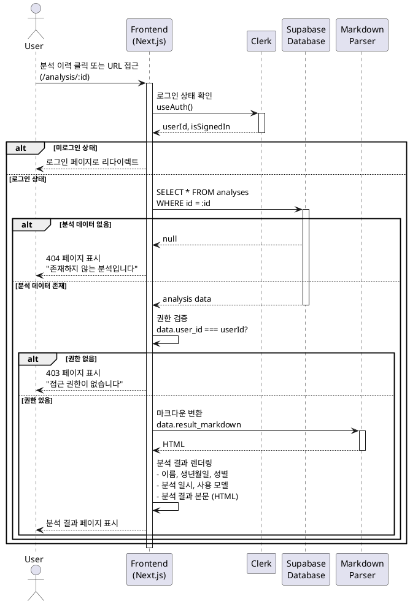

# 유스케이스 ID: UC-003

## 제목
사주 분석 결과 조회

---

## 1. 개요

### 1.1 목적
사용자가 과거에 생성한 사주 분석 결과를 조회하고, 마크다운 형식으로 렌더링된 상세 분석 내용을 확인할 수 있도록 한다.

### 1.2 범위
- 대시보드의 분석 이력에서 특정 분석 항목 클릭 시 상세 조회
- URL 직접 접근을 통한 분석 결과 조회
- 분석 완료 후 자동 리다이렉트를 통한 결과 표시
- 마크다운 → HTML 변환 및 렌더링
- 본인 소유 분석만 조회 가능 (권한 검증)

**제외 사항**:
- 분석 결과 수정 기능
- 분석 결과 공유 기능 (선택적 확장 기능)

### 1.3 액터
- **주요 액터**: 로그인한 사용자
- **부 액터**: Supabase Database, Markdown Parser

---

## 2. 선행 조건

- 사용자가 Clerk를 통해 로그인된 상태여야 함
- 조회하려는 분석 결과가 `analyses` 테이블에 존재해야 함
- 조회하려는 분석 결과의 `user_id`가 현재 로그인한 사용자의 `clerk_user_id`와 일치해야 함

---

## 3. 참여 컴포넌트

- **Frontend (Next.js Page)**: `/analysis/[id]/page.tsx` - 분석 결과 UI 렌더링
- **Clerk SDK**: `useAuth()`, `useUser()` - 사용자 인증 및 세션 관리
- **Supabase Client**: 분석 데이터 조회
- **Markdown Parser**: 마크다운 → HTML 변환 (예: `react-markdown`, `marked`)
- **Database**: `analyses` 테이블

---

## 4. 기본 플로우 (Basic Flow)

### 4.1 단계별 흐름

1. **사용자**: 대시보드에서 분석 이력 카드 클릭 또는 URL 직접 접근 (`/analysis/:id`)
   - 입력: 분석 ID (UUID 형식)
   - 처리: 페이지 라우팅
   - 출력: 분석 상세 페이지 로딩

2. **Frontend**: 사용자 인증 상태 확인
   - 입력: Clerk 세션
   - 처리: `useAuth()` 훅으로 로그인 여부 및 `userId` 확인
   - 출력: 로그인 상태 검증 완료 또는 로그인 페이지로 리다이렉트

3. **Frontend**: Supabase에서 분석 데이터 조회
   - 입력: 분석 ID, 사용자 ID
   - 처리:
     ```typescript
     const { data, error } = await supabase
       .from('analyses')
       .select('*')
       .eq('id', analysisId)
       .single();
     ```
   - 출력: 분석 데이터 객체 또는 에러

4. **Frontend**: 권한 검증
   - 입력: 조회된 `data.user_id`, 현재 사용자의 `clerk_user_id`
   - 처리: `data.user_id === userId` 비교
   - 출력: 권한 확인 완료 또는 403 에러

5. **Frontend**: 마크다운 → HTML 변환
   - 입력: `data.result_markdown` (텍스트)
   - 처리: Markdown Parser를 통한 HTML 변환
   - 출력: HTML 렌더링 가능한 객체

6. **Frontend**: 분석 결과 UI 렌더링
   - 입력: 변환된 HTML, 메타데이터 (이름, 생년월일, 성별, 분석일, 모델명)
   - 처리: React 컴포넌트로 렌더링
   - 출력: 완성된 분석 결과 페이지 표시

7. **사용자**: 분석 결과 확인
   - 입력: 렌더링된 페이지
   - 처리: 스크롤하며 내용 읽기
   - 출력: "목록으로", "공유하기(선택)", "삭제하기(선택)" 버튼 확인

### 4.2 시퀀스 다이어그램



---

## 5. 대안 플로우 (Alternative Flows)

### 5.1 대안 플로우 1: 새 분석 완료 후 자동 리다이렉트

**시작 조건**: 사용자가 `/analysis/new`에서 분석을 요청하고, Gemini API 분석이 성공적으로 완료됨

**단계**:
1. Backend API (`/api/analysis/create`)에서 분석 결과를 `analyses` 테이블에 INSERT
2. 생성된 분석 ID를 응답으로 반환
3. Frontend에서 `router.push(`/analysis/${analysisId}`)`로 자동 이동
4. 기본 플로우의 3단계부터 진행

**결과**: 사용자는 분석 완료 즉시 결과 페이지를 확인할 수 있음

### 5.2 대안 플로우 2: 마크다운 파싱 오류 발생

**시작 조건**: `result_markdown` 데이터가 손상되었거나 파싱 불가능한 형식

**단계**:
1. Markdown Parser에서 예외 발생
2. Frontend에서 예외를 catch하고 원본 텍스트를 `<pre>` 태그로 표시
3. 관리자에게 에러 로그 전송 (선택 사항)
4. 사용자에게 "일부 내용이 정상적으로 표시되지 않을 수 있습니다" 경고 메시지 토스트 표시

**결과**: 사용자는 최소한 원본 텍스트를 확인할 수 있음

---

## 6. 예외 플로우 (Exception Flows)

### 6.1 예외 상황 1: 잘못된 분석 ID 형식

**발생 조건**: URL에 UUID가 아닌 값이 전달됨 (예: `/analysis/invalid-id`)

**처리 방법**:
1. Frontend에서 UUID 형식 검증 실패
2. 404 페이지로 리다이렉트
3. "올바르지 않은 분석 ID입니다" 메시지 표시
4. "대시보드로 이동" 버튼 제공

**에러 코드**: N/A (클라이언트 측 검증)

**사용자 메시지**: "올바르지 않은 분석 ID입니다. 대시보드에서 다시 시도해주세요."

### 6.2 예외 상황 2: 분석 데이터 없음 (404)

**발생 조건**: 존재하지 않는 분석 ID로 조회 시도

**처리 방법**:
1. Supabase에서 `null` 반환
2. 404 페이지 렌더링
3. "존재하지 않는 분석입니다" 안내
4. "대시보드로 돌아가기" 버튼 제공

**에러 코드**: `404 NOT_FOUND`

**사용자 메시지**: "요청하신 분석 결과를 찾을 수 없습니다."

### 6.3 예외 상황 3: 권한 없음 (403)

**발생 조건**: 다른 사용자의 분석 결과에 접근 시도

**처리 방법**:
1. `data.user_id !== currentUserId` 검증 실패
2. 403 페이지 렌더링
3. "접근 권한이 없습니다" 안내
4. 로그에 접근 시도 기록 (보안 모니터링)

**에러 코드**: `403 FORBIDDEN`

**사용자 메시지**: "접근 권한이 없습니다. 본인의 분석 결과만 조회할 수 있습니다."

### 6.4 예외 상황 4: 데이터베이스 연결 오류

**발생 조건**: Supabase 서버 장애 또는 네트워크 오류

**처리 방법**:
1. Supabase Client에서 예외 발생
2. Frontend에서 에러 catch
3. "일시적인 오류가 발생했습니다" 토스트 메시지 표시
4. "다시 시도" 버튼 제공 (재조회 API 호출)

**에러 코드**: `500 INTERNAL_SERVER_ERROR`

**사용자 메시지**: "일시적인 오류가 발생했습니다. 잠시 후 다시 시도해주세요."

---

## 7. 후행 조건 (Post-conditions)

### 7.1 성공 시

- **데이터베이스 변경**: 없음 (조회만 수행)
- **시스템 상태**: 사용자가 분석 결과를 확인한 상태
- **외부 시스템**: 없음

### 7.2 실패 시

- **데이터 롤백**: 해당 사항 없음
- **시스템 상태**: 사용자는 에러 페이지 또는 에러 메시지를 확인한 상태

---

## 8. 비기능 요구사항

### 8.1 성능
- **초기 로딩 시간**: 1초 이내 (분석 데이터 조회 + 마크다운 파싱)
- **마크다운 렌더링**: 100KB 텍스트 기준 200ms 이내
- **페이지 크기**: 초기 로드 300KB 이하 (이미지 제외)

### 8.2 보안
- **인증**: Clerk JWT 토큰 검증 필수
- **권한**: `user_id` 일치 여부 확인 (본인 소유 데이터만 조회)
- **XSS 방지**: 마크다운 파서에서 `dangerouslySetInnerHTML` 대신 안전한 라이브러리 사용 (예: `react-markdown` with `rehype-sanitize`)

### 8.3 가용성
- **에러 복구**: DB 조회 실패 시 3회 재시도 (exponential backoff)
- **오프라인 대응**: 네트워크 오류 시 명확한 에러 메시지 제공

---

## 9. UI/UX 요구사항

### 9.1 화면 구성

**헤더 영역**:
- 분석 대상 정보 카드
  - 이름 (예: "홍길동")
  - 생년월일 (예: "1990년 1월 15일")
  - 출생 시간 (예: "오전 10시 30분" 또는 "미상")
  - 성별 (예: "남성")
  - 분석 일시 (예: "2025년 10월 25일 18시 30분")
  - 사용 모델 (예: "Gemini 2.5 Flash" 또는 "Gemini 2.5 Pro")

**본문 영역**:
- 마크다운으로 렌더링된 분석 결과
  - 천간/지지 (표 형태 또는 시각화)
  - 오행 분석 (막대 그래프 또는 텍스트)
  - 대운/세운 해석
  - 종합 운세 (성격, 재운, 건강, 연애)

**액션 버튼 영역**:
- "목록으로" 버튼 (필수)
- "공유하기" 버튼 (선택적)
- "삭제하기" 버튼 (선택적)

### 9.2 사용자 경험

- **로딩 상태**: Skeleton UI 또는 로딩 스피너 표시
- **스크롤 가능**: 긴 분석 결과를 자연스럽게 스크롤하며 확인
- **가독성**: 마크다운 스타일링으로 섹션 구분 명확히 (헤딩, 리스트, 강조)
- **모바일 최적화**: 반응형 디자인으로 모바일에서도 읽기 편하게

---

## 10. 테스트 시나리오

### 10.1 성공 케이스

| 테스트 케이스 ID | 입력값 | 기대 결과 |
|----------------|--------|----------|
| TC-003-01      | 본인 소유의 유효한 분석 ID | 분석 결과 페이지 정상 표시, 메타데이터 및 마크다운 렌더링 완료 |
| TC-003-02      | 새 분석 완료 후 자동 리다이렉트 | 분석 결과 페이지로 즉시 이동, "분석이 완료되었습니다" 토스트 표시 |

### 10.2 실패 케이스

| 테스트 케이스 ID | 입력값 | 기대 결과 |
|----------------|--------|----------|
| TC-003-03      | 존재하지 않는 분석 ID | 404 페이지 표시, "존재하지 않는 분석입니다" 메시지 |
| TC-003-04      | 다른 사용자의 분석 ID | 403 페이지 표시, "접근 권한이 없습니다" 메시지 |
| TC-003-05      | 잘못된 UUID 형식 | 404 페이지 표시, "올바르지 않은 분석 ID입니다" 메시지 |
| TC-003-06      | DB 연결 오류 시뮬레이션 | 에러 토스트 표시, "다시 시도" 버튼 제공 |
| TC-003-07      | 마크다운 파싱 오류 | 원본 텍스트 표시, 경고 메시지 토스트 |

---

## 11. 관련 유스케이스

- **선행 유스케이스**:
  - UC-001: 회원가입 및 로그인 (인증 필요)
  - UC-002: 사주 입력 및 분석 요청 (분석 데이터 생성)
- **후행 유스케이스**:
  - UC-005: 분석 이력 조회 (목록으로 돌아가기)
  - UC-006: 분석 결과 삭제 (선택적 기능)
- **연관 유스케이스**:
  - UC-004: 운세 조회 (분석 결과 내 통합 제공)

---

## 12. 변경 이력

| 버전 | 날짜 | 작성자 | 변경 내용 |
|------|------|--------|-----------|
| 1.0  | 2025-10-25 | Claude | 초기 작성 |

---

## 부록

### A. 용어 정의

- **Clerk**: 인증 서비스 제공자, Google OAuth를 통한 로그인 관리
- **Supabase**: PostgreSQL 기반 데이터베이스 서비스
- **Markdown Parser**: 마크다운 텍스트를 HTML로 변환하는 라이브러리
- **천간/지지**: 사주팔자의 기본 구성 요소
- **오행**: 목(木), 화(火), 토(土), 금(金), 수(水)의 다섯 가지 기본 원소
- **대운/세운**: 10년 단위 운세 흐름 및 매년 운세

### B. 참고 자료

- **Userflow 문서**: `/docs/userflow.md` 섹션 3 (사주 분석 결과 조회 플로우)
- **데이터베이스 스키마**: `/docs/database.md` - `analyses` 테이블 구조
- **Clerk 인증 문서**: https://clerk.com/docs
- **react-markdown 문서**: https://github.com/remarkjs/react-markdown
- **Supabase 클라이언트**: https://supabase.com/docs/reference/javascript
