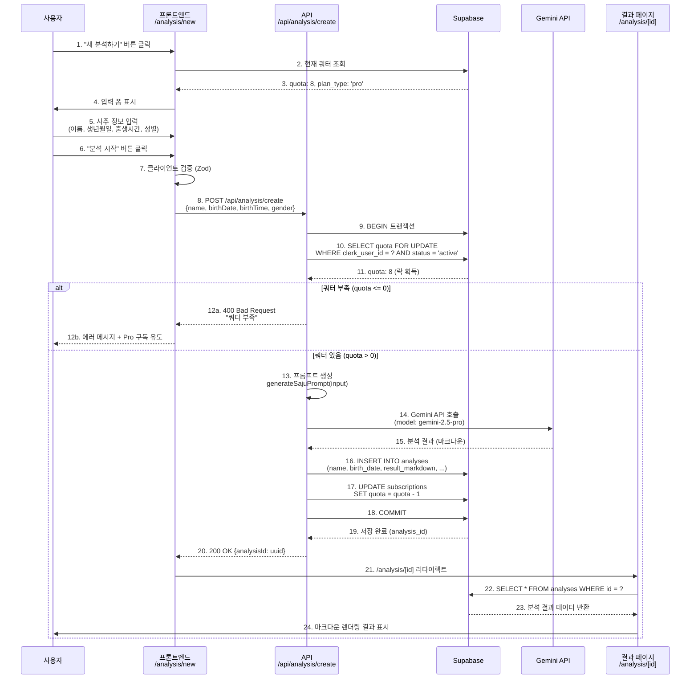
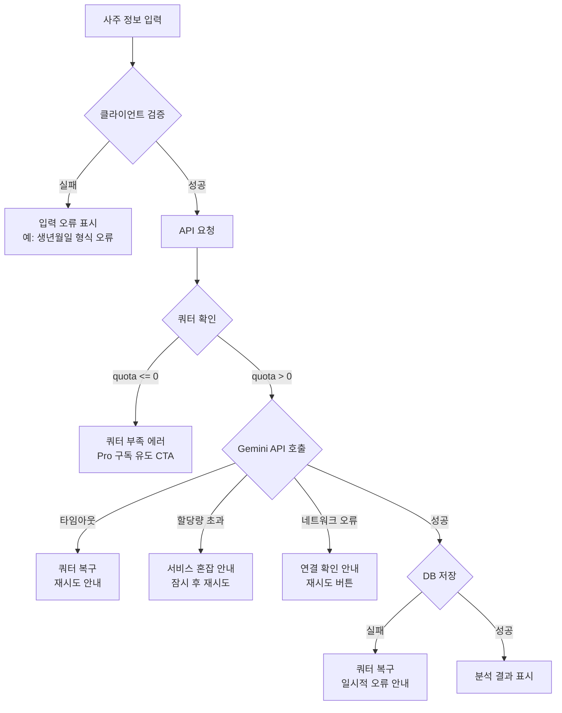

# UC-03: Pro 사용자의 사주 분석 이용

**작성일**: 2025-10-26
**버전**: 1.0
**상태**: Draft
**우선순위**: P0 (MVP 필수)

---

## 1. 유스케이스 개요

### 1.1 기본 정보

| 항목 | 내용 |
|------|------|
| **유스케이스 ID** | UC-03 |
| **유스케이스명** | Pro 사용자의 사주 분석 이용 |
| **액터** | Pro 구독 사용자 (또는 무료 쿼터 보유 사용자) |
| **목적** | Gemini API를 통해 사용자가 입력한 사주 정보를 AI가 분석하고 결과를 저장 및 제공 |
| **범위** | 사주 정보 입력 → 쿼터 확인 → AI 분석 → 결과 저장 → 결과 표시 |
| **선행 조건** | - 사용자가 로그인된 상태<br>- 구독 상태가 active<br>- quota > 0 (남은 분석 횟수 존재) |
| **후행 조건** | - 분석 결과가 analyses 테이블에 저장됨<br>- quota가 1 차감됨<br>- 사용자가 분석 결과를 확인 |

### 1.2 관련 문서

- **PRD**: 섹션 3.2.3 (새 분석 페이지), 섹션 9 (Gemini API 사주분석)
- **Userflow**: UF-03 (Pro 사용자의 사주 분석 이용)
- **Database**: 테이블 `analyses`, `subscriptions`
- **API Endpoint**: `POST /api/analysis/create`

---

## 2. 플로우 다이어그램

### 2.1 정상 플로우 (Happy Path)



### 2.2 에러 플로우



---

## 3. 사용자 시나리오

### 3.1 시나리오 1: Pro 구독자의 정상 분석

**배경**:
- 김철수 씨는 Pro 구독자 (남은 쿼터: 8회)
- 중요한 취업 면접을 앞두고 오늘의 운세를 확인하고 싶음

**단계**:
1. 대시보드에서 "새 분석하기" 버튼 클릭
2. `/analysis/new` 페이지 진입
3. 입력 폼 작성:
   - 이름: "김철수"
   - 생년월일: "1990-05-15"
   - 출생시간: "14:30"
   - 성별: "남성"
4. "사주 분석 시작" 버튼 클릭
5. 로딩 인디케이터 표시 (30초 소요)
6. 분석 완료 후 `/analysis/abc123...` 페이지로 자동 이동
7. 마크다운 형식의 상세 분석 결과 확인
8. 남은 쿼터: 7회로 감소

**예상 결과**:
- ✅ 분석 결과가 analyses 테이블에 저장
- ✅ quota: 8 → 7 (1 차감)
- ✅ 사용자가 분석 결과를 즉시 확인
- ✅ 대시보드 "최근 분석" 목록에 추가됨

### 3.2 시나리오 2: 무료 사용자의 마지막 쿼터 사용

**배경**:
- 이영희 씨는 무료 사용자 (남은 쿼터: 1회)
- 무료 체험 마지막 기회를 사용

**단계**:
1. "새 분석하기" 클릭
2. 상단 배너: "⚠️ 남은 무료 분석: 1회 (이후 Pro 구독 필요)"
3. 사주 정보 입력 및 제출
4. Gemini Flash 모델로 분석 (Pro보다 빠르지만 간략한 결과)
5. 분석 완료 후 결과 표시
6. 하단에 CTA 배너: "무료 체험이 종료되었습니다. Pro 구독하고 매월 10회 이용하세요 [구독하기]"

**예상 결과**:
- ✅ quota: 1 → 0 (소진)
- ✅ model_used: 'gemini-2.5-flash'
- ✅ Pro 전환 유도 UI 표시

### 3.3 시나리오 3: 쿼터 부족으로 분석 실패

**배경**:
- 박민수 씨는 무료 사용자 (남은 쿼터: 0회)

**단계**:
1. "새 분석하기" 클릭
2. 입력 폼은 보이지만 상단에 경고 메시지:
   - "남은 분석 횟수가 없습니다. Pro 구독을 시작해주세요."
3. 사주 정보 입력 후 "분석 시작" 클릭
4. API 응답: `400 Bad Request { error: "쿼터 부족" }`
5. Toast 알림: "남은 분석 횟수가 없습니다."
6. "Pro 구독하기" 버튼 강조

**예상 결과**:
- ❌ 분석 실패
- ✅ 사용자에게 명확한 다음 행동 제시 (Pro 구독)

---

## 4. 입력 (Input)

### 4.1 사용자 입력

| 필드 | 타입 | 필수 여부 | 제약 조건 | 예시 |
|------|------|---------|----------|------|
| name | string | 필수 | 2-50자 | "홍길동" |
| birthDate | string (ISO 8601) | 필수 | 1900-01-01 ~ 오늘 | "1990-01-01" |
| birthTime | string (HH:MM) | 선택 | HH:MM 형식 또는 null | "14:30" 또는 null |
| gender | enum | 필수 | 'male' \| 'female' | "male" |

### 4.2 검증 규칙 (Zod 스키마)

```typescript
const analysisInputSchema = z.object({
  name: z.string()
    .min(2, '이름은 2자 이상이어야 합니다')
    .max(50, '이름은 50자를 초과할 수 없습니다'),

  birthDate: z.string()
    .regex(/^\d{4}-\d{2}-\d{2}$/, '올바른 날짜 형식이 아닙니다 (YYYY-MM-DD)')
    .refine((date) => {
      const d = new Date(date);
      const min = new Date('1900-01-01');
      const today = new Date();
      return d >= min && d <= today;
    }, '생년월일은 1900년 이후 ~ 오늘 이전이어야 합니다'),

  birthTime: z.string()
    .regex(/^([01]\d|2[0-3]):([0-5]\d)$/, 'HH:MM 형식이어야 합니다')
    .optional()
    .nullable(),

  gender: z.enum(['male', 'female'], {
    errorMap: () => ({ message: '성별을 선택해주세요' })
  })
});
```

### 4.3 시스템 입력 (자동 수집)

| 필드 | 출처 | 용도 |
|------|------|------|
| clerk_user_id | Clerk 세션 | 사용자 식별 |
| plan_type | Supabase subscriptions 테이블 | AI 모델 선택 (free → flash, pro → pro) |
| quota | Supabase subscriptions 테이블 | 분석 가능 여부 판단 |

---

## 5. 처리 (Processing)

### 5.1 API 엔드포인트

**경로**: `POST /api/analysis/create`

**인증**: Clerk 세션 필수 (미들웨어)

**요청 본문**:
```json
{
  "name": "홍길동",
  "birthDate": "1990-01-01",
  "birthTime": "14:30",
  "gender": "male"
}
```

### 5.2 처리 단계 (Step-by-Step)

#### Step 1: 인증 확인

```typescript
const { userId } = auth(); // Clerk 미들웨어
if (!userId) {
  return new Response('Unauthorized', { status: 401 });
}
```

#### Step 2: 입력 검증

```typescript
const validatedInput = analysisInputSchema.parse(await request.json());
```

#### Step 3: 쿼터 확인 (트랜잭션 시작)

```sql
BEGIN;

SELECT quota, plan_type
FROM subscriptions
WHERE clerk_user_id = $1
  AND status = 'active'
FOR UPDATE; -- 락 획득 (동시성 제어)
```

**조건 검증**:
- `quota > 0` 필수
- `status === 'active'` 필수

#### Step 4: Gemini 프롬프트 생성

```typescript
const prompt = generateSajuPrompt({
  name: validatedInput.name,
  birthDate: validatedInput.birthDate,
  birthTime: validatedInput.birthTime || '시간 미상',
  gender: validatedInput.gender
});
```

**프롬프트 예시**:
```
당신은 20년 경력의 전문 사주팔자 상담사입니다.

**입력 정보**:
- 성함: 홍길동
- 생년월일: 1990-01-01
- 출생시간: 14:30
- 성별: 남성

**분석 요구사항**:
1️⃣ 천간(天干)과 지지(地支) 계산
2️⃣ 오행(五行) 분석 (목, 화, 토, 금, 수)
3️⃣ 대운(大運)과 세운(歲運) 해석
4️⃣ 전반적인 성격, 재운, 건강운, 연애운 분석

**출력 형식**: 마크다운

**금지 사항**:
- 의료·법률 조언 금지
- 확정적 미래 예측 금지
- 부정적·공격적 표현 금지
```

#### Step 5: Gemini API 호출

```typescript
const modelName = planType === 'pro'
  ? 'gemini-2.5-pro'
  : 'gemini-2.5-flash';

const genAI = new GoogleGenerativeAI(process.env.GEMINI_API_KEY!);
const model = genAI.getGenerativeModel({ model: modelName });

const result = await model.generateContent(prompt, {
  timeout: 60000 // 60초 타임아웃
});

const markdown = result.response.text();
```

#### Step 6: 분석 결과 저장

```sql
INSERT INTO analyses (
  clerk_user_id,
  name,
  birth_date,
  birth_time,
  gender,
  result_markdown,
  model_used
)
VALUES (
  $1, -- clerk_user_id
  $2, -- name
  $3, -- birth_date
  $4, -- birth_time
  $5, -- gender
  $6, -- markdown
  $7  -- model_used
)
RETURNING id;
```

#### Step 7: 쿼터 차감

```sql
UPDATE subscriptions
SET quota = quota - 1
WHERE clerk_user_id = $1;
```

#### Step 8: 트랜잭션 커밋

```sql
COMMIT;
```

### 5.3 에러 처리 (Error Handling)

| 에러 유형 | HTTP 상태 | 메시지 | 대응 |
|----------|----------|-------|------|
| **인증 실패** | 401 | "로그인이 필요합니다" | 로그인 페이지 리다이렉트 |
| **검증 실패** | 400 | "올바른 생년월일을 입력해주세요" | 입력 필드 에러 표시 |
| **쿼터 부족** | 400 | "남은 분석 횟수가 없습니다" | Pro 구독 유도 CTA |
| **Gemini 타임아웃** | 504 | "분석 시간이 초과되었습니다. 다시 시도해주세요" | 쿼터 복구 (rollback) |
| **Gemini 할당량 초과** | 429 | "서비스가 일시적으로 혼잡합니다" | 쿼터 복구 + 관리자 알림 |
| **DB 저장 실패** | 500 | "일시적인 오류가 발생했습니다" | 쿼터 복구 + 에러 로깅 |

**에러 복구 원칙**:
- Gemini API 호출 실패 시: **반드시 쿼터 복구** (quota + 1)
- DB 저장 실패 시: **트랜잭션 롤백**으로 자동 복구
- 네트워크 오류 시: **사용자에게 재시도 버튼** 제공

---

## 6. 출력 (Output)

### 6.1 성공 응답

**HTTP 상태**: `200 OK`

**응답 본문**:
```json
{
  "success": true,
  "data": {
    "analysisId": "a1b2c3d4-e5f6-7890-abcd-ef1234567890",
    "createdAt": "2025-10-26T14:30:00.000Z"
  }
}
```

**UI 변화**:
- 로딩 인디케이터 사라짐
- `/analysis/[analysisId]` 페이지로 자동 리다이렉트
- Toast 알림: "분석이 완료되었습니다!"

### 6.2 분석 결과 페이지 구성

**페이지 경로**: `/analysis/[id]`

**표시 정보**:

#### 6.2.1 메타 정보 (상단 카드)

| 항목 | 예시 |
|------|------|
| 이름 | 홍길동 |
| 생년월일 | 1990년 1월 1일 |
| 출생시간 | 오후 2시 30분 (또는 "시간 미상") |
| 성별 | 남성 |
| 분석일시 | 2025년 10월 26일 오후 2시 30분 |
| 사용 모델 | Gemini 2.5 Pro |

#### 6.2.2 분석 결과 (마크다운 렌더링)

**예시 구조**:
```markdown
# 사주팔자 종합 분석

## 1. 천간과 지지
- 년주(年柱): 경오(庚午) - 양의 금, 양의 화
- 월주(月柱): 무인(戊寅) - 양의 토, 양의 목
- 일주(日柱): 갑자(甲子) - 양의 목, 양의 수
- 시주(時柱): 신미(辛未) - 음의 금, 음의 토

## 2. 오행 분석
- **목(木)**: 강함 - 리더십, 도전정신
- **화(火)**: 중간 - 열정, 창의성
- **토(土)**: 약함 - 신중함 필요
- **금(金)**: 중간 - 계획성, 분석력
- **수(水)**: 강함 - 지혜, 적응력

## 3. 성격 분석
당신은 리더십과 도전정신이 강한 성격입니다...

## 4. 재운
현재 재운이 상승하는 시기입니다...

## 5. 건강운
목(木)이 강하므로 간 건강에 주의하세요...

## 6. 연애운
올해는 새로운 만남의 기회가 많습니다...
```

#### 6.2.3 액션 버튼

- **"다른 사람 분석하기"**: `/analysis/new` 이동 (쿼터 소진)
- **"대시보드로"**: `/dashboard` 이동
- **"공유하기"** (향후 기능)

### 6.3 데이터베이스 변경

#### subscriptions 테이블

**변경 전**:
```sql
clerk_user_id | quota | plan_type
user_123      | 8     | pro
```

**변경 후**:
```sql
clerk_user_id | quota | plan_type
user_123      | 7     | pro
```

#### analyses 테이블

**신규 레코드 추가**:
```sql
id                  | clerk_user_id | name   | birth_date | birth_time | gender | result_markdown | model_used        | created_at
abc123-def456-...   | user_123      | 홍길동 | 1990-01-01 | 14:30      | male   | # 사주팔자...   | gemini-2.5-pro   | 2025-10-26 14:30:00
```

---

## 7. 비기능 요구사항

### 7.1 성능 요구사항

| 항목 | 목표 | 측정 방법 |
|------|------|----------|
| **분석 완료 시간** | < 30초 (95 percentile) | Gemini API 응답 시간 + DB 저장 시간 |
| **API 응답 시간** | < 1초 (쿼터 확인만) | Vercel Analytics |
| **동시 요청 처리** | 10 RPS (초당 요청 수) | Vercel Edge Functions |
| **DB 쿼리 시간** | < 100ms (쿼터 조회) | Supabase 성능 모니터링 |

### 7.2 안정성 요구사항

| 항목 | 목표 | 대응 방안 |
|------|------|----------|
| **트랜잭션 일관성** | 100% | BEGIN-COMMIT, FOR UPDATE 락 사용 |
| **쿼터 동시성 제어** | Race Condition 0건 | Pessimistic Lock (FOR UPDATE) |
| **Gemini API 실패율** | < 1% | 타임아웃 60초, 재시도 없음 (쿼터 복구) |
| **DB 저장 실패율** | < 0.1% | 자동 롤백, 에러 로깅 |

### 7.3 보안 요구사항

| 항목 | 구현 방법 |
|------|----------|
| **인증** | Clerk 세션 검증 (미들웨어) |
| **권한** | clerk_user_id 기반 본인 데이터만 접근 |
| **입력 검증** | Zod 스키마 검증 (SQL Injection 방지) |
| **API Key 보호** | 환경 변수 (GEMINI_API_KEY), 서버 사이드만 사용 |
| **결과 접근 제어** | analyses 테이블 조회 시 clerk_user_id 조건 강제 |

---

## 8. 예외 상황 (Exception Cases)

### 8.1 EC-01: 동시 요청으로 인한 쿼터 경합

**상황**:
- 사용자가 "분석 시작" 버튼을 빠르게 2번 클릭 (또는 2개 탭에서 동시 요청)
- 현재 쿼터: 1회

**기대 동작**:
1. 첫 번째 요청: 쿼터 1 → 0, 분석 성공
2. 두 번째 요청: 쿼터 0 확인, `400 Bad Request` 반환

**구현 방법**:
```sql
-- FOR UPDATE 락으로 직렬화
SELECT quota FROM subscriptions WHERE clerk_user_id = $1 FOR UPDATE;
-- 첫 번째 트랜잭션이 완료될 때까지 두 번째 요청 대기
```

### 8.2 EC-02: Gemini API 타임아웃

**상황**:
- Gemini API 응답이 60초를 초과

**기대 동작**:
1. 타임아웃 에러 발생
2. 트랜잭션 롤백 (쿼터 복구)
3. 사용자에게 에러 메시지: "분석 시간이 초과되었습니다. 다시 시도해주세요."
4. 에러 로그 기록 (Sentry 등)

**구현**:
```typescript
try {
  const result = await Promise.race([
    model.generateContent(prompt),
    new Promise((_, reject) => setTimeout(() => reject(new Error('Timeout')), 60000))
  ]);
} catch (error) {
  await supabase.from('subscriptions').update({ quota: quota + 1 }); // 쿼터 복구
  throw new Error('분석 시간이 초과되었습니다');
}
```

### 8.3 EC-03: Gemini API 할당량 초과 (429 Error)

**상황**:
- Google Cloud 일일 할당량 소진

**기대 동작**:
1. API 응답 `429 Too Many Requests` 감지
2. 쿼터 복구 (quota + 1)
3. 사용자에게 메시지: "서비스가 일시적으로 혼잡합니다. 잠시 후 다시 시도해주세요."
4. **관리자 긴급 알림** (이메일/Slack)

**모니터링**:
- Google Cloud Console에서 일일 할당량 80% 도달 시 알림 설정

### 8.4 EC-04: 분석 결과 저장 실패

**상황**:
- Supabase 장애로 INSERT 쿼리 실패
- Gemini API는 정상 응답

**기대 동작**:
1. 트랜잭션 롤백 (쿼터 복구 자동)
2. 사용자에게 메시지: "일시적인 오류가 발생했습니다. 다시 시도해주세요."
3. **분석 결과는 사용자에게 표시하지 않음** (일관성 유지)
4. 에러 로그 기록

### 8.5 EC-05: 유효하지 않은 날짜 입력 (우회 시도)

**상황**:
- 프론트엔드 검증 우회하여 "2025-13-32" 같은 값 전송

**기대 동작**:
1. Zod 스키마 검증 실패
2. `400 Bad Request { error: "올바른 생년월일을 입력해주세요" }`
3. 프론트엔드에서 입력 필드 에러 표시

**방어 계층**:
- 1차: 프론트엔드 검증 (사용자 경험)
- 2차: API Zod 검증 (보안)
- 3차: DB CHECK 제약 (최종 방어)

---

## 9. 확장 가능성

### 9.1 향후 추가 가능 기능

| 기능 | 설명 | 테이블 변경 |
|------|------|-----------|
| **PDF 다운로드** | 분석 결과를 PDF로 변환 | 없음 (기존 데이터 활용) |
| **재분석** | 같은 정보로 새 쿼터 소진하여 재분석 | 없음 (새 레코드 생성) |
| **공유 링크** | 분석 결과를 타인과 공유 | analyses.share_token (VARCHAR) 추가 |
| **즐겨찾기** | 특정 분석을 즐겨찾기 | analyses.is_favorited (BOOLEAN) 추가 |
| **분석 메모** | 사용자가 메모 추가 | analyses.user_note (TEXT) 추가 |

### 9.2 AI 모델 업그레이드

| 시나리오 | 대응 |
|---------|------|
| **Gemini 2.6 출시** | 환경 변수로 모델명 관리 → 무중단 업그레이드 |
| **프롬프트 개선** | 버전 관리 (v1, v2, ...) → analyses.prompt_version 추가 |
| **다국어 지원** | 프롬프트 템플릿 분리 → analyses.language 추가 |

---

## 10. 테스트 시나리오

### 10.1 기능 테스트

| 테스트 케이스 | 입력 | 예상 결과 |
|------------|------|----------|
| **TC-01: 정상 분석** | 유효한 사주 정보 + quota > 0 | 200 OK, 분석 결과 저장, quota - 1 |
| **TC-02: 쿼터 부족** | 유효한 정보 + quota = 0 | 400 Bad Request, "쿼터 부족" |
| **TC-03: 인증 없음** | 로그아웃 상태 | 401 Unauthorized |
| **TC-04: 잘못된 날짜** | birthDate = "invalid" | 400 Bad Request, Zod 에러 |
| **TC-05: 빈 이름** | name = "" | 400 Bad Request, "2자 이상" |
| **TC-06: 성별 누락** | gender 없음 | 400 Bad Request, "성별 선택" |

### 10.2 성능 테스트

| 테스트 | 목표 | 방법 |
|--------|------|------|
| **부하 테스트** | 10 RPS 처리 | k6, Artillery |
| **동시성 테스트** | 동일 사용자 10개 요청 → 1개만 성공 | 병렬 API 호출 |
| **Gemini API 타임아웃** | 60초 이상 → 에러 반환 | Mock API |

### 10.3 엣지 케이스 테스트

| 케이스 | 검증 항목 |
|--------|----------|
| **출생시간 미상** | birthTime = null → "시간 미상"으로 프롬프트 생성 |
| **1900년 생년월일** | birthDate = "1900-01-01" → 정상 처리 |
| **오늘 생년월일** | birthDate = TODAY → 정상 처리 |
| **미래 날짜** | birthDate = "2030-01-01" → 400 에러 |

---

## 11. 의존성

### 11.1 외부 서비스

| 서비스 | 용도 | 장애 시 대응 |
|--------|------|------------|
| **Gemini API** | AI 분석 | 에러 메시지 + 쿼터 복구 + 관리자 알림 |
| **Supabase** | DB 저장 | 에러 메시지 + 재시도 안내 |
| **Clerk** | 인증 | 로그인 페이지 리다이렉트 |

### 11.2 내부 모듈

| 모듈 | 역할 |
|------|------|
| `lib/gemini/client.ts` | Gemini API 클라이언트 |
| `lib/prompts/saju.ts` | 프롬프트 생성 함수 |
| `lib/supabase.ts` | Supabase 클라이언트 |
| `app/api/analysis/create/route.ts` | API 핸들러 |

---

## 12. 성공 지표

### 12.1 정량 지표

| 지표 | 목표 | 측정 방법 |
|------|------|----------|
| **분석 성공률** | ≥ 99% | (성공 건수 ÷ 전체 시도) × 100 |
| **평균 분석 시간** | < 30초 | Gemini API 응답 시간 평균 |
| **쿼터 정확도** | 100% | 차감 오류 건수 (목표: 0건) |
| **재시도율** | < 5% | 에러 후 재시도 비율 |

### 12.2 정성 지표

| 지표 | 측정 방법 |
|------|----------|
| **사용자 만족도** | 설문 조사 "분석 결과가 도움이 되었나요?" (목표: 4.0/5.0) |
| **분석 품질** | 사용자 피드백, 재분석 비율 (< 10%) |

---

## 13. 참고 자료

### 13.1 관련 문서

- [PRD: 섹션 9 (Gemini API 사주분석)](/docs/prd.md#9-gemini-api-사주분석)
- [Userflow: UF-03](/docs/userflow.md#4-uf-03-pro-사용자의-사주-분석-이용)
- [Database: analyses 테이블](/docs/database.md#43-analyses)
- [Gemini API 공식 문서](https://ai.google.dev/docs)

### 13.2 프롬프트 엔지니어링 가이드

- [Gemini Prompting Best Practices](https://ai.google.dev/docs/prompting_guide)
- 사주팔자 전문 용어집 (내부 문서)

---

**문서 버전**: 1.0
**최종 수정일**: 2025-10-26
**작성자**: Product Team
**검토자**: Dev Lead, QA Lead
**승인 상태**: Draft (구현 전 검토 필요)
