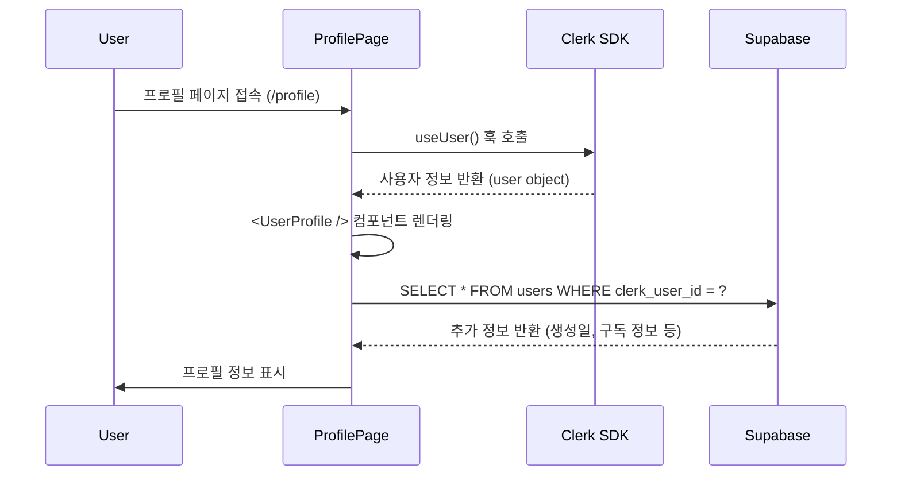
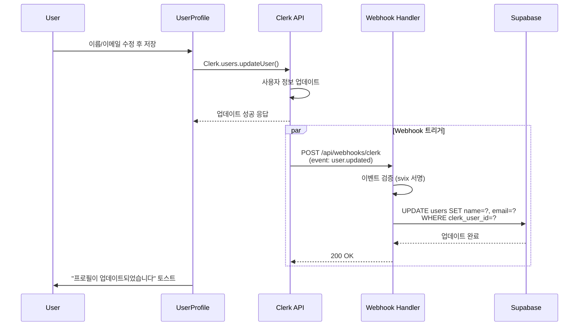
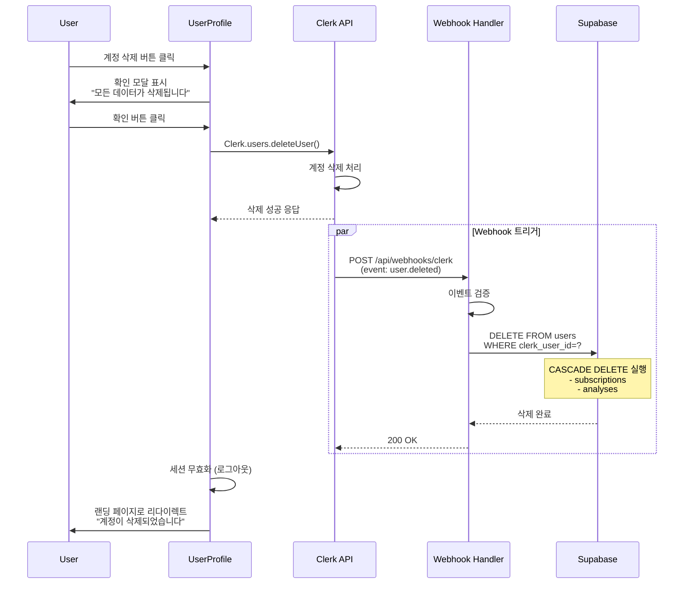

# 유스케이스 명세서: 프로필 관리

**유스케이스 ID**: UC-005
**유스케이스 명**: 프로필 관리 (Profile Management)
**작성일**: 2025-10-25
**버전**: 1.0
**우선순위**: Medium
**관련 문서**:
- `/docs/requirement.md` (섹션 11)
- `/docs/userflow.md` (섹션 6)
- `/docs/database.md` (섹션 2.1 - users 테이블)

---

## 1. 유스케이스 개요

### 1.1 목적
사용자가 자신의 프로필 정보를 조회하고 수정하며, 필요 시 계정을 삭제할 수 있도록 하는 기능을 제공합니다. Clerk SDK와의 긴밀한 연동을 통해 사용자 정보의 일관성을 보장하고, Supabase와의 동기화를 통해 서비스 내 데이터 무결성을 유지합니다.

### 1.2 범위
- **포함 사항**:
  - Clerk UserProfile 컴포넌트를 통한 프로필 조회
  - 사용자 정보 수정 (이름, 이메일, 프로필 사진)
  - 계정 삭제 및 관련 데이터 CASCADE 삭제
  - Clerk Webhook을 통한 Supabase 동기화

- **제외 사항**:
  - 비밀번호 변경 (Google OAuth 사용으로 해당 없음)
  - 이메일 인증 프로세스 (Clerk SDK에서 자동 처리)
  - 프로필 사진 직접 업로드 (Clerk UI 활용)

### 1.3 사전 조건
- 사용자가 Clerk 인증을 통해 로그인된 상태
- Clerk Webhook이 `/api/webhooks/clerk` 경로에 정상 연동됨
- Supabase `users` 테이블에 사용자 정보 동기화 완료

---

## 2. 액터 (Actors)

### 2.1 주요 액터 (Primary Actor)
- **로그인한 사용자 (Authenticated User)**
  - 역할: 자신의 프로필 정보 조회, 수정, 삭제
  - 권한: 본인 계정에 대한 모든 권한

### 2.2 시스템 액터 (System Actors)
- **Clerk SDK**
  - 역할: 사용자 인증 정보 관리, 프로필 UI 제공
  - 연동 방식: Next.js 클라이언트 컴포넌트 (<UserProfile />)

- **Clerk Webhook**
  - 역할: 사용자 정보 변경 이벤트 전달
  - 이벤트 타입: `user.updated`, `user.deleted`

- **Supabase**
  - 역할: 사용자 정보 저장 및 CASCADE 삭제 처리
  - 테이블: `users`, `subscriptions`, `analyses`

---

## 3. 사전 조건 (Preconditions)

### 3.1 시스템 상태
| 조건 | 검증 방법 | 실패 시 처리 |
|------|----------|-------------|
| 사용자 로그인 상태 | `useAuth().userId !== null` | 로그인 페이지로 리다이렉트 |
| Clerk UserProfile 컴포넌트 로드 가능 | `@clerk/nextjs` 패키지 정상 설치 | 에러 페이지 표시 |
| Webhook 엔드포인트 활성화 | `/api/webhooks/clerk` 200 응답 | 관리자 알림, 백그라운드 재시도 |
| Supabase 연결 정상 | `supabase.from('users').select('*').limit(1)` 성공 | 에러 토스트, 재시도 유도 |

### 3.2 데이터 요구사항
- `users` 테이블에 `clerk_user_id`로 사용자 레코드 존재
- Clerk에 사용자 세션 유효 (JWT 토큰 검증 통과)

---

## 4. 사후 조건 (Postconditions)

### 4.1 성공 시나리오
| 작업 | 결과 상태 |
|------|----------|
| **프로필 정보 수정** | - Clerk에 변경사항 반영<br>- Webhook 트리거 → Supabase `users` 테이블 UPDATE<br>- UI 즉시 갱신 (Clerk SDK 자동 처리) |
| **계정 삭제** | - Clerk 계정 삭제<br>- Webhook 트리거 → Supabase CASCADE DELETE<br>- 세션 무효화 및 로그아웃<br>- 랜딩 페이지로 리다이렉트 |

### 4.2 실패 시나리오
| 실패 유형 | 시스템 상태 | 사용자 피드백 |
|----------|-----------|-------------|
| Clerk API 오류 | 변경사항 롤백 | "수정 중 오류가 발생했습니다" 토스트 |
| Webhook 동기화 실패 | Clerk는 변경됨, Supabase 미반영 | 백그라운드 재시도 (사용자는 정상 진행) |
| 네트워크 타임아웃 | 변경사항 미반영 | "네트워크 오류. 다시 시도해주세요" 안내 |

---

## 5. 기본 플로우 (Main Flow)

### 5.1 프로필 조회 플로우



**단계별 설명**:

| 단계 | 액터 | 동작 | 결과 |
|------|------|------|------|
| 1 | User | 네비게이션에서 프로필 아이콘 클릭 | - |
| 2 | System | 로그인 상태 확인 (`useAuth()`) | 미로그인 시 `/sign-in`으로 리다이렉트 |
| 3 | ProfilePage | Clerk `<UserProfile />` 컴포넌트 렌더링 | Clerk UI 자동 표시 |
| 4 | Clerk SDK | 사용자 정보 조회 (이름, 이메일, 프로필 사진) | - |
| 5 | Supabase | `users` 테이블에서 추가 메타데이터 조회 | 가입일, 업데이트일 등 |
| 6 | UI | 통합된 프로필 정보 표시 | - |

### 5.2 프로필 정보 수정 플로우



**단계별 설명**:

| 단계 | 액터 | 동작 | 검증 사항 |
|------|------|------|----------|
| 1 | User | 이름 또는 이메일 입력 필드 수정 | - |
| 2 | User | "저장" 버튼 클릭 | Clerk UI 내장 검증 (이메일 형식 등) |
| 3 | Clerk UI | 변경사항 Clerk API로 전송 | - |
| 4 | Clerk API | 사용자 정보 업데이트 | 이메일 중복 검사, 형식 검증 |
| 5 | Clerk | `user.updated` 이벤트 Webhook 전송 | - |
| 6 | Webhook Handler | 이벤트 수신 및 서명 검증 | `CLERK_WEBHOOK_SECRET` 검증 |
| 7 | Webhook Handler | Supabase `users` 테이블 UPDATE | `clerk_user_id` 기준 |
| 8 | Supabase | `updated_at` 자동 갱신 (트리거) | - |
| 9 | UI | 토스트 메시지 표시 | "프로필이 업데이트되었습니다" |

### 5.3 계정 삭제 플로우



**단계별 설명**:

| 단계 | 액터 | 동작 | 데이터 영향 |
|------|------|------|-----------|
| 1 | User | Clerk UI에서 "계정 삭제" 메뉴 선택 | - |
| 2 | UI | 확인 모달 표시 | "모든 분석 이력과 구독 정보가 삭제됩니다" |
| 3 | User | "삭제 확인" 버튼 클릭 | - |
| 4 | Clerk API | 계정 삭제 요청 처리 | Clerk 데이터베이스에서 사용자 삭제 |
| 5 | Clerk | `user.deleted` 이벤트 Webhook 전송 | - |
| 6 | Webhook Handler | 이벤트 수신 및 검증 | - |
| 7 | Supabase | `users` 테이블 DELETE | CASCADE로 인해:<br>- `subscriptions` 자동 삭제<br>- `analyses` 자동 삭제 |
| 8 | System | Clerk 세션 무효화 | JWT 토큰 무효화 |
| 9 | UI | 랜딩 페이지(`/`)로 리다이렉트 | 토스트: "계정이 삭제되었습니다" |

---

## 6. 대안 플로우 (Alternative Flows)

### 6.1 이메일 변경 시 인증 필요

**트리거**: 사용자가 이메일 주소 변경 요청

**플로우**:
1. User → Clerk UI에서 새 이메일 입력
2. Clerk → 새 이메일로 인증 메일 발송
3. User → 인증 메일의 링크 클릭
4. Clerk → 이메일 변경 확정
5. Webhook → `user.updated` 이벤트 트리거
6. Supabase → `users.email` 업데이트

**특이사항**:
- 인증 완료 전까지 Clerk에서 "Pending" 상태 유지
- Webhook은 인증 완료 후에만 트리거
- 사용자에게 "인증 메일을 확인해주세요" 안내 표시

### 6.2 프로필 사진 변경

**트리거**: 사용자가 프로필 사진 업로드

**플로우**:
1. User → Clerk UI에서 이미지 업로드
2. Clerk → 이미지 검증 (크기, 형식)
3. Clerk → Clerk CDN에 이미지 저장
4. Clerk → `user.imageUrl` 업데이트
5. Webhook → `user.updated` 이벤트 트리거
6. Supabase → `users` 테이블에는 반영 안 함 (Clerk SDK에서 직접 조회)

**특이사항**:
- 이미지는 Clerk CDN에 저장 (Supabase에 별도 저장 불필요)
- 최대 크기: 10MB (Clerk 제한)
- 지원 형식: JPG, PNG, GIF

### 6.3 Google 계정 연동 해제

**트리거**: 사용자가 Google OAuth 연동 해제 시도

**플로우**:
1. User → Clerk UI에서 "Google 연동 해제" 클릭
2. Clerk → 다른 로그인 수단 확인
   - **경우 1**: 다른 OAuth 연동 있음 → 해제 허용
   - **경우 2**: Google만 연동됨 → 해제 차단
3. Clerk → "최소 1개의 로그인 수단이 필요합니다" 안내

**특이사항**:
- 본 서비스는 Google OAuth만 지원하므로 사실상 해제 불가
- 연동 해제 시 계정 로그인 불가 → 계정 삭제 유도

---

## 7. 예외 플로우 (Exception Flows)

### 7.1 Webhook 동기화 실패

**시나리오**: Clerk에서 사용자 정보 업데이트 성공했으나 Webhook 실패

**원인**:
- Webhook 엔드포인트 응답 지연 (타임아웃)
- Supabase 연결 오류
- 네트워크 장애

**처리 방법**:
```typescript
// /app/api/webhooks/clerk/route.ts
export async function POST(req: Request) {
  try {
    const evt = wh.verify(payload, headers);

    // Supabase 업데이트 시도 (최대 3회 재시도)
    await retryAsync(async () => {
      await supabase.from('users').update({
        email: evt.data.email_addresses[0].email_address,
        name: `${evt.data.first_name} ${evt.data.last_name}`,
      }).eq('clerk_user_id', evt.data.id);
    }, { retries: 3, delay: 1000 });

    return new Response('OK', { status: 200 });
  } catch (error) {
    // 실패 로그 기록 (Sentry 등)
    logger.error('Webhook sync failed', { error, userId: evt.data.id });

    // Clerk에는 성공 응답 (재시도 방지)
    return new Response('Accepted', { status: 202 });
  }
}
```

**사용자 영향**:
- Clerk UI에서는 정상적으로 변경사항 확인 가능
- Supabase 동기화는 백그라운드에서 재시도
- 최종 실패 시 관리자 알림 (Slack/Email)

### 7.2 계정 삭제 중 Supabase 오류

**시나리오**: Clerk 계정 삭제는 성공했으나 Supabase CASCADE DELETE 실패

**원인**:
- DB 연결 타임아웃
- 트랜잭션 충돌
- 외래 키 제약 조건 오류

**처리 방법**:
```typescript
// Webhook Handler
try {
  await supabase.from('users').delete().eq('clerk_user_id', userId);
} catch (error) {
  if (error.code === 'PGRST116') { // 이미 삭제됨
    logger.info('User already deleted', { userId });
    return new Response('OK', { status: 200 });
  }

  // 재시도 큐에 등록
  await enqueueRetry({
    type: 'USER_DELETE',
    userId,
    attempts: 0,
    maxAttempts: 5,
  });

  throw error; // Clerk에 재시도 유도
}
```

**영향 최소화**:
- Clerk 계정은 이미 삭제되어 로그인 불가
- Supabase 잔여 데이터는 백그라운드 작업으로 정리
- 사용자에게는 "계정이 삭제되었습니다" 안내 (정상 처리로 간주)

### 7.3 이메일 중복 오류

**시나리오**: 사용자가 이미 사용 중인 이메일로 변경 시도

**처리 방법**:
1. Clerk API에서 자동 검증
2. UI에 에러 메시지 표시:
   ```
   "이미 사용 중인 이메일입니다. 다른 이메일을 입력해주세요."
   ```
3. 입력 필드 포커스 유지
4. Webhook 트리거 안 됨 (Clerk에서 업데이트 실패)

### 7.4 네트워크 오류

**시나리오**: 프로필 수정 중 네트워크 연결 끊김

**처리 방법**:
```typescript
// ProfilePage.tsx
const handleUpdateProfile = async (data: FormData) => {
  try {
    setIsLoading(true);
    await clerk.user.update(data);
    toast.success('프로필이 업데이트되었습니다');
  } catch (error) {
    if (error.name === 'NetworkError') {
      toast.error('네트워크 연결을 확인해주세요', {
        action: {
          label: '재시도',
          onClick: () => handleUpdateProfile(data),
        },
      });
    } else {
      toast.error('수정 중 오류가 발생했습니다');
    }
  } finally {
    setIsLoading(false);
  }
};
```

---

## 8. 비기능 요구사항 (Non-Functional Requirements)

### 8.1 성능 요구사항

| 항목 | 목표치 | 측정 방법 |
|------|--------|----------|
| **프로필 페이지 로딩** | < 1초 (p95) | Next.js App Router SSR 활용 |
| **정보 수정 응답** | < 2초 (p95) | Clerk API 응답 시간 + Webhook 처리 |
| **Webhook 처리 시간** | < 500ms | `/api/webhooks/clerk` 응답 시간 |
| **계정 삭제 완료** | < 3초 | Clerk 삭제 + Supabase CASCADE |

### 8.2 보안 요구사항

| 요구사항 | 구현 방법 | 검증 방법 |
|---------|----------|----------|
| **Webhook 서명 검증** | Svix 라이브러리로 검증 | `wh.verify()` 호출 필수 |
| **CSRF 방지** | Clerk SDK 자동 처리 | - |
| **XSS 방지** | React 자동 이스케이핑 | - |
| **개인정보 보호** | Clerk CDN HTTPS 전송 | 이미지 URL HTTPS 확인 |
| **계정 삭제 확인** | 확인 모달 필수 | "정말 삭제하시겠습니까?" 표시 |

### 8.3 접근성 요구사항

| 항목 | 기준 | 구현 |
|------|------|------|
| **키보드 네비게이션** | WCAG 2.1 AA | Clerk UI에서 기본 제공 |
| **스크린 리더 지원** | ARIA 라벨 | `<UserProfile />` 컴포넌트에 내장 |
| **색상 대비** | 4.5:1 이상 | Tailwind CSS 색상 팔레트 준수 |
| **포커스 표시** | 명확한 포커스 링 | `focus:ring-2 focus:ring-primary` |

### 8.4 확장성 요구사항

| 시나리오 | 대응 방안 |
|---------|----------|
| **동시 프로필 수정 요청 급증** | Clerk API Rate Limit (100 req/s) 활용 |
| **Webhook 처리 지연** | Vercel Serverless Function 자동 스케일링 |
| **Supabase 동시 접속 증가** | Connection Pool 증설 (Supabase Pro 플랜) |

### 8.5 가용성 요구사항

| 항목 | 목표 | 모니터링 |
|------|------|----------|
| **서비스 가용성** | 99.9% (월 43분 이하 다운타임) | Vercel 상태 페이지 + Uptime Robot |
| **Clerk API 가용성** | 99.99% (Clerk SLA) | Clerk 대시보드 |
| **Webhook 성공률** | 95% 이상 | CloudWatch Logs 분석 |

---

## 9. 데이터 요구사항

### 9.1 저장 데이터

**Clerk (Primary)**:
```json
{
  "id": "user_2xxxxxxxxxxxxx",
  "email_addresses": [
    {
      "email_address": "user@example.com",
      "verification": {
        "status": "verified"
      }
    }
  ],
  "first_name": "홍",
  "last_name": "길동",
  "image_url": "https://img.clerk.com/...",
  "created_at": 1704067200000,
  "updated_at": 1704153600000
}
```

**Supabase (Sync)**:
```sql
-- users 테이블
{
  "id": "uuid",
  "clerk_user_id": "user_2xxxxxxxxxxxxx",
  "email": "user@example.com",
  "name": "홍길동",
  "created_at": "2025-01-01T00:00:00Z",
  "updated_at": "2025-01-02T00:00:00Z"
}
```

### 9.2 동기화 규칙

| Clerk 필드 | Supabase 필드 | 동기화 시점 | 비고 |
|-----------|-------------|----------|------|
| `id` | `clerk_user_id` | 가입 시 (user.created) | Primary Key 역할 |
| `email_addresses[0].email_address` | `email` | 변경 시 (user.updated) | 인증 완료 후 |
| `first_name + last_name` | `name` | 변경 시 (user.updated) | 공백으로 연결 |
| `image_url` | - | 동기화 안 함 | Clerk SDK에서 직접 조회 |
| - | `created_at` | 가입 시 | Supabase 자동 생성 |
| - | `updated_at` | 변경 시 | 트리거로 자동 갱신 |

### 9.3 CASCADE 삭제 정책

```sql
-- users 테이블 삭제 시 자동 삭제되는 관련 데이터
users (clerk_user_id)
  ↓ CASCADE DELETE
  ├── subscriptions (user_id)
  │   └── billing_key → 토스페이먼츠 BillingKey 삭제 (별도 API 호출)
  └── analyses (user_id)
      └── result_markdown → 분석 결과 텍스트 삭제
```

**GDPR 준수**:
- 사용자 요청 시 30일 이내 모든 개인정보 삭제
- 삭제 후 복구 불가 (백업 제외)
- 법적 보관 의무 데이터 없음 (결제 내역은 토스페이먼츠 보관)

---

## 10. 인수 기준 (Acceptance Criteria)

### 10.1 기능 검증 체크리스트

**프로필 조회**:
- [ ] 로그인 후 프로필 페이지(`/profile`) 접근 가능
- [ ] Clerk `<UserProfile />` 컴포넌트 정상 렌더링
- [ ] 이름, 이메일, 프로필 사진 정확히 표시
- [ ] 미로그인 시 로그인 페이지로 리다이렉트

**정보 수정**:
- [ ] 이름 변경 후 Clerk + Supabase 동기화 확인
- [ ] 이메일 변경 시 인증 메일 발송 확인
- [ ] 이메일 인증 후 Supabase 반영 확인
- [ ] 프로필 사진 업로드 후 UI 즉시 갱신
- [ ] 중복 이메일 시도 시 에러 메시지 표시

**계정 삭제**:
- [ ] 삭제 확인 모달 표시 ("모든 데이터가 삭제됩니다")
- [ ] 확인 후 Clerk 계정 삭제 완료
- [ ] Supabase `users`, `subscriptions`, `analyses` CASCADE 삭제
- [ ] 세션 무효화 및 로그아웃
- [ ] 랜딩 페이지로 리다이렉트 + 안내 메시지

### 10.2 성능 검증

**테스트 시나리오**:
```bash
# 1. 프로필 페이지 로딩 시간 (목표: < 1초)
curl -w "@curl-format.txt" -o /dev/null -s https://yourdomain.com/profile

# 2. 정보 수정 응답 시간 (목표: < 2초)
# Clerk UI에서 수동 테스트

# 3. Webhook 처리 시간 (목표: < 500ms)
curl -X POST https://yourdomain.com/api/webhooks/clerk \
  -H "svix-id: test" \
  -H "svix-timestamp: $(date +%s)" \
  -H "svix-signature: test" \
  -d '{"type": "user.updated", "data": {...}}'
```

### 10.3 보안 검증

**체크리스트**:
- [ ] Webhook 서명 없이 요청 시 400 에러 반환
- [ ] 타인의 프로필 페이지 접근 시도 시 403 에러
- [ ] XSS 테스트: `<script>alert('test')</script>` 입력 시 이스케이핑 확인
- [ ] CSRF 테스트: 외부 도메인에서 POST 요청 시 차단 확인

### 10.4 예외 처리 검증

**시나리오 테스트**:

| 테스트 케이스 | 예상 결과 |
|-------------|----------|
| Webhook 엔드포인트 다운 중 정보 수정 | Clerk 정상 반영, 백그라운드 재시도 |
| Supabase 연결 끊김 상태에서 계정 삭제 | Clerk 계정 삭제, 데이터 정리 큐 등록 |
| 네트워크 오류 중 이메일 변경 | "네트워크 연결 확인" 토스트 + 재시도 버튼 |
| 동일 이메일로 변경 시도 | "이미 사용 중인 이메일" 에러 메시지 |

---

## 11. 제약 사항 및 가정

### 11.1 기술적 제약사항

| 제약사항 | 영향 | 대응 방안 |
|---------|------|----------|
| **Clerk Webhook 지연** | 최대 5초까지 동기화 지연 가능 | 사용자에게 투명하게 처리 (백그라운드) |
| **Supabase RLS 비활성화** | 애플리케이션 레벨 접근 제어 필수 | API 라우트에서 `userId` 검증 |
| **이미지 크기 제한** | Clerk CDN 최대 10MB | UI에서 사전 검증 (파일 선택 시) |
| **계정 삭제 복구 불가** | 실수 방지 필수 | 확인 모달 + 경고 메시지 |

### 11.2 비즈니스 가정

- 사용자는 Google 계정만 사용 (다중 OAuth 미지원)
- 프로필 사진은 선택사항 (기본 아바타 제공)
- 이름 변경 횟수 제한 없음 (악용 방지는 Clerk Rate Limit 활용)
- 계정 삭제 후 재가입 가능 (동일 이메일 허용)

### 11.3 법적 요구사항

**GDPR 준수**:
- 개인정보 삭제 요청 시 30일 이내 처리
- 삭제 대상: 이름, 이메일, 프로필 사진, 분석 이력
- 예외: 법적 의무 보관 데이터 (없음)

**개인정보처리방침**:
- 수집 항목: 이름, 이메일, 프로필 사진 (선택)
- 수집 목적: 서비스 제공, 사용자 식별
- 보유 기간: 회원 탈퇴 시까지
- 제3자 제공: Clerk (인증), Supabase (저장)

---

## 12. 참고 자료

### 12.1 관련 문서
- [Clerk UserProfile Component Docs](https://clerk.com/docs/components/user/user-profile)
- [Clerk Webhooks Guide](https://clerk.com/docs/integrations/webhooks)
- [Supabase CASCADE DELETE](https://supabase.com/docs/guides/database/postgres/cascade-deletes)

### 12.2 코드 참고
```typescript
// /app/profile/page.tsx (예시)
import { UserProfile } from '@clerk/nextjs';

export default function ProfilePage() {
  return (
    <div className="container mx-auto py-8">
      <h1 className="text-3xl font-bold mb-6">프로필 관리</h1>
      <UserProfile
        appearance={{
          elements: {
            rootBox: 'w-full',
            card: 'shadow-xl',
          },
        }}
      />
    </div>
  );
}
```

### 12.3 테스트 시나리오

**수동 테스트 절차**:
1. 로그인 후 `/profile` 접속
2. 이름을 "테스트 사용자"로 변경
3. Supabase 대시보드에서 `users` 테이블 확인
4. 이메일 변경 시도 (인증 메일 확인)
5. 프로필 사진 업로드 (JPG, 5MB)
6. "계정 삭제" 버튼 클릭 → 확인 모달 확인
7. 삭제 후 Supabase 데이터 삭제 확인
8. 재로그인 시도 (실패 확인)

---

## 13. 변경 이력

| 버전 | 날짜 | 변경 내용 | 작성자 |
|------|------|----------|--------|
| 1.0 | 2025-10-25 | 초안 작성 | Claude |

---

**문서 상태**: ✅ 검토 완료
**다음 단계**: 구현 계획 수립 → UI 목업 → 개발 → QA 테스트
