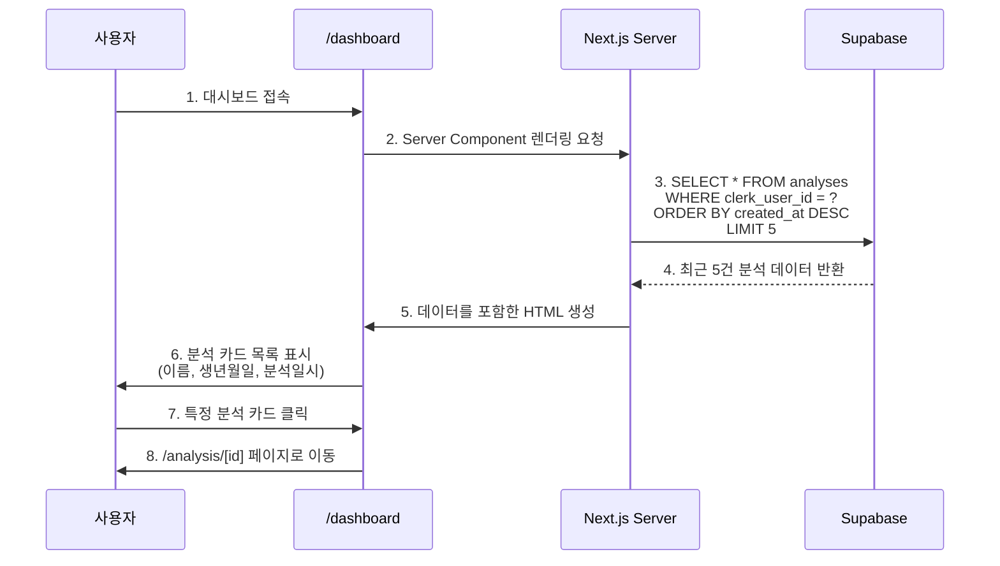
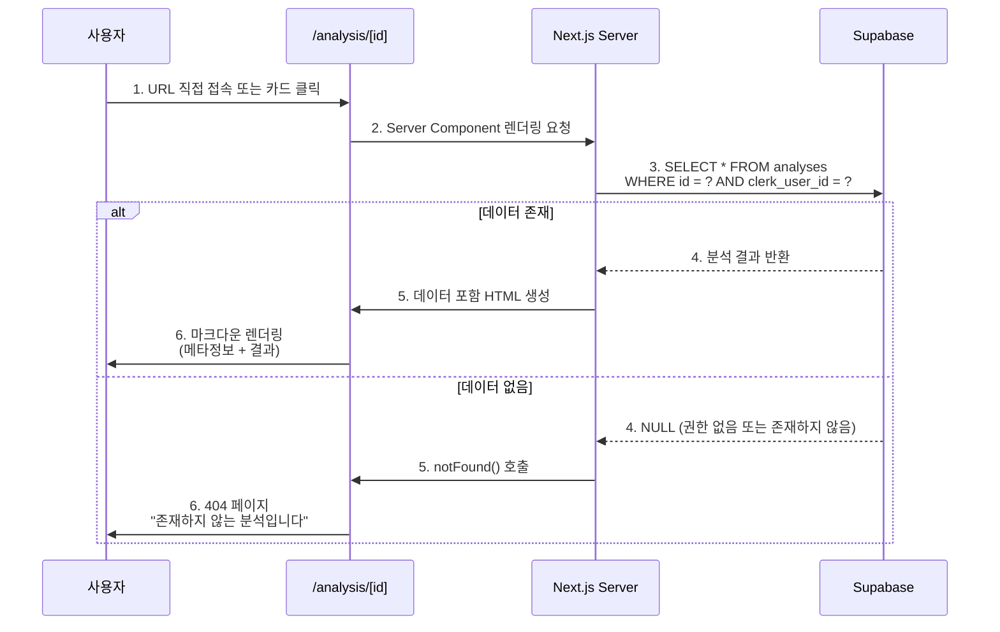

# UC-06: 분석 이력 조회

**프로젝트**: 구독제 사주분석 서비스
**Use Case ID**: UC-06
**Use Case명**: 분석 이력 조회
**관련 User Flow**: UF-06
**작성일**: 2025-10-26
**버전**: 1.0
**우선순위**: P1 (Should Have)

---

## 1. Use Case 개요

### 1.1 목적
사용자가 과거에 수행한 사주 분석 결과를 조회하고 재확인할 수 있는 기능을 제공합니다.

### 1.2 범위
- **대시보드**: 최근 분석 5건 요약 표시
- **분석 상세 페이지**: 특정 분석 결과의 전체 내용 조회
- **권한 제어**: 본인이 요청한 분석만 조회 가능

### 1.3 관련 페이지
- `/dashboard` - 대시보드 (최근 분석 카드 목록)
- `/analysis/[id]` - 분석 상세보기

---

## 2. Actors (액터)

| 액터 | 역할 | 권한 |
|------|------|------|
| **로그인 사용자** | 분석 이력을 조회하는 사용자 | 본인의 분석 결과만 조회 가능 |
| **무료 사용자** | Free 플랜 사용자 | 본인 분석 조회 (제한 없음) |
| **Pro 구독자** | Pro 플랜 사용자 | 본인 분석 조회 (제한 없음) |

---

## 3. Preconditions (사전 조건)

### 3.1 필수 조건
- [x] 사용자가 Clerk를 통해 로그인된 상태
- [x] 사용자가 최소 1건 이상의 분석을 수행한 이력 존재

### 3.2 시스템 상태
- [x] Supabase `analyses` 테이블에 사용자의 분석 데이터 존재
- [x] Next.js 애플리케이션이 정상 실행 중

### 3.3 데이터 요구사항
- [x] `analyses.clerk_user_id`와 현재 로그인 사용자 ID 일치
- [x] `analyses.result_markdown` 필드에 분석 결과 저장됨

---

## 4. Postconditions (사후 조건)

### 4.1 성공 시
- [x] 사용자가 자신의 과거 분석 결과를 확인함
- [x] 대시보드에서 최근 5건의 분석 카드가 표시됨
- [x] 분석 상세 페이지에서 마크다운 형식의 결과가 렌더링됨

### 4.2 실패 시
- [x] 권한 없는 분석 조회 시 404 페이지 표시
- [x] 잘못된 UUID 형식 입력 시 400 에러 반환

---

## 5. Main Flow (주요 흐름)

### 5.1 대시보드 - 최근 분석 목록 조회



**Steps**:

1. **사용자**: `/dashboard` 페이지 접속
2. **시스템**: Server Component에서 Supabase 쿼리 실행
   ```sql
   SELECT id, name, birth_date, gender, model_used, created_at
   FROM analyses
   WHERE clerk_user_id = $1
   ORDER BY created_at DESC
   LIMIT 5;
   ```
3. **시스템**: 쿼리 결과를 React 컴포넌트로 렌더링
4. **UI 출력**: 최근 5건의 분석 카드 표시
   - 카드 내용: 이름, 생년월일, 분석일시
   - 카드 클릭 시 `/analysis/[id]` 이동

---

### 5.2 분석 상세보기



**Steps**:

1. **사용자**: `/analysis/[id]` 페이지 접속
   - 대시보드 카드 클릭
   - URL 직접 입력
   - 새 분석 완료 후 자동 리다이렉트

2. **시스템**: 분석 데이터 조회 및 권한 검증
   ```sql
   SELECT *
   FROM analyses
   WHERE id = $1 AND clerk_user_id = $2;
   ```

3. **시스템**: 권한 검증
   - `clerk_user_id`가 현재 사용자와 일치하는지 확인
   - 불일치 시 쿼리 결과 빈 배열 (권한 오류로 간주)

4. **UI 출력**: 분석 결과 표시
   - **메타 정보 섹션**:
     - 분석일시: `2025-10-26 15:30`
     - 이름: `홍길동`
     - 생년월일: `1990-01-01`
     - 출생시간: `10:30` (또는 "시간 미상")
     - 성별: `남성` / `여성`
     - 사용 모델: `Gemini 2.5 Pro` / `Gemini 2.5 Flash`

   - **분석 결과 섹션**:
     - `result_markdown` 필드를 `react-markdown`로 렌더링
     - 섹션별 구분 (헤딩, 목록, 강조 등 마크다운 문법 지원)
     - 스크롤 가능한 긴 콘텐츠

   - **액션 버튼**:
     - "대시보드로 돌아가기" 버튼
     - (선택) "다시 분석하기" 버튼

---

## 6. Alternative Flows (대체 흐름)

### 6.1 분석 이력이 없는 경우

**Trigger**: 신규 가입 사용자가 대시보드 접속

**Flow**:
1. 시스템: `analyses` 테이블 쿼리 결과 빈 배열 반환
2. UI: Empty State 표시
   - 메시지: "아직 분석 이력이 없습니다"
   - CTA 버튼: "첫 분석 시작하기" → `/analysis/new` 이동

**Postcondition**: 사용자가 새 분석 페이지로 유도됨

---

### 6.2 다른 사용자의 분석 조회 시도

**Trigger**: 사용자 A가 사용자 B의 분석 ID로 URL 직접 입력

**Example**:
```
사용자 A (clerk_user_id: user_2abc123)
→ /analysis/uuid_belongs_to_user_B 접속
```

**Flow**:
1. 시스템: 쿼리 실행
   ```sql
   SELECT * FROM analyses
   WHERE id = 'uuid_belongs_to_user_B'
     AND clerk_user_id = 'user_2abc123';
   ```
2. 시스템: 쿼리 결과 빈 배열 (권한 없음)
3. UI: 404 페이지 표시
   - 메시지: "존재하지 않는 분석입니다"
   - "대시보드로 돌아가기" 버튼

**Security**:
- 권한 오류와 존재하지 않는 리소스를 동일하게 처리 (정보 유출 방지)
- 다른 사용자의 분석 존재 여부를 추측할 수 없음

---

### 6.3 잘못된 UUID 형식 입력

**Trigger**: 사용자가 잘못된 형식의 URL 입력

**Example**:
```
/analysis/invalid-id-format
```

**Flow**:
1. 시스템: UUID 형식 검증 실패
2. API: 400 Bad Request 반환
3. UI: 에러 페이지 표시
   - 메시지: "잘못된 요청입니다"

**Implementation**:
```typescript
// /app/analysis/[id]/page.tsx
import { z } from 'zod';

const uuidSchema = z.string().uuid();

export default async function AnalysisDetailPage({
  params,
}: {
  params: Promise<{ id: string }>;
}) {
  const { id } = await params;

  // UUID 검증
  const validationResult = uuidSchema.safeParse(id);
  if (!validationResult.success) {
    return <ErrorPage message="잘못된 요청입니다" />;
  }

  // 이후 데이터 조회...
}
```

---

## 7. Exception Flows (예외 흐름)

### 7.1 데이터베이스 연결 오류

**Trigger**: Supabase 장애 또는 네트워크 끊김

**Flow**:
1. 시스템: Supabase 쿼리 실패 (타임아웃 또는 연결 오류)
2. API: 500 Internal Server Error 반환
3. UI: 에러 페이지 표시
   - 메시지: "일시적인 오류가 발생했습니다. 잠시 후 다시 시도해주세요."
   - "새로고침" 버튼

**Logging**: Sentry 등 에러 추적 도구로 로깅

---

### 7.2 마크다운 렌더링 실패

**Trigger**: `result_markdown` 필드에 잘못된 데이터 저장됨

**Flow**:
1. 시스템: `react-markdown` 렌더링 중 에러 발생
2. UI: Fallback 표시
   - 원본 마크다운 텍스트를 `<pre>` 태그로 표시
   - 경고 메시지: "일부 내용이 정상적으로 표시되지 않을 수 있습니다"

**Prevention**:
- Gemini API 응답 검증
- 분석 생성 시 마크다운 문법 검증

---

## 8. Business Rules (비즈니스 규칙)

### 8.1 조회 권한
- **본인 분석만 조회 가능**: 다른 사용자의 분석은 조회 불가
- **플랜 무관**: Free/Pro 모두 동일한 조회 권한
- **시간 제한 없음**: 과거 분석 영구 보관 (회원 탈퇴 시까지)

### 8.2 데이터 보관
- **무제한 저장**: 분석 이력 개수 제한 없음
- **CASCADE DELETE**: 회원 탈퇴 시 모든 분석 이력 자동 삭제
- **백업 없음**: 삭제된 데이터 복구 불가 (GDPR 준수)

### 8.3 표시 규칙
- **대시보드**: 최근 5건만 표시
- **정렬 순서**: `created_at DESC` (최신순)
- **빈 상태**: 분석 0건일 때 Empty State 표시

---

## 9. Data Requirements (데이터 요구사항)

### 9.1 Input Data (입력 데이터)

#### 대시보드 조회
| 항목 | 타입 | 필수 | 설명 |
|------|------|------|------|
| `clerk_user_id` | VARCHAR(255) | ✅ | Clerk 세션에서 자동 추출 |

#### 분석 상세 조회
| 항목 | 타입 | 필수 | 검증 규칙 |
|------|------|------|---------|
| `id` | UUID | ✅ | UUID 형식 검증 |
| `clerk_user_id` | VARCHAR(255) | ✅ | Clerk 세션에서 자동 추출 |

---

### 9.2 Output Data (출력 데이터)

#### 대시보드 - 분석 카드 목록

```typescript
interface AnalysisCardData {
  id: string; // UUID
  name: string; // 분석 대상 이름
  birth_date: string; // YYYY-MM-DD
  gender: 'male' | 'female';
  model_used: 'gemini-2.5-flash' | 'gemini-2.5-pro';
  created_at: string; // ISO 8601 timestamp
}

type DashboardAnalyses = AnalysisCardData[]; // 최대 5건
```

**Example**:
```json
[
  {
    "id": "a1b2c3d4-e5f6-7890-abcd-ef1234567890",
    "name": "홍길동",
    "birth_date": "1990-01-01",
    "gender": "male",
    "model_used": "gemini-2.5-pro",
    "created_at": "2025-10-26T15:30:00Z"
  },
  {
    "id": "b2c3d4e5-f6a7-8901-bcde-f12345678901",
    "name": "김영희",
    "birth_date": "1995-05-15",
    "gender": "female",
    "model_used": "gemini-2.5-flash",
    "created_at": "2025-10-25T10:20:00Z"
  }
]
```

---

#### 분석 상세 - 전체 데이터

```typescript
interface AnalysisDetail {
  id: string;
  clerk_user_id: string;
  name: string;
  birth_date: string;
  birth_time: string | null; // "HH:MM" 또는 null
  gender: 'male' | 'female';
  result_markdown: string; // 마크다운 형식 분석 결과
  model_used: 'gemini-2.5-flash' | 'gemini-2.5-pro';
  created_at: string;
}
```

**Example**:
```json
{
  "id": "a1b2c3d4-e5f6-7890-abcd-ef1234567890",
  "clerk_user_id": "user_2abc123xyz",
  "name": "홍길동",
  "birth_date": "1990-01-01",
  "birth_time": "10:30",
  "gender": "male",
  "result_markdown": "# 사주팔자 분석 결과\n\n## 천간지지\n...",
  "model_used": "gemini-2.5-pro",
  "created_at": "2025-10-26T15:30:00Z"
}
```

---

### 9.3 Database Schema

**Table**: `analyses`

```sql
CREATE TABLE analyses (
  id UUID PRIMARY KEY DEFAULT uuid_generate_v4(),
  clerk_user_id VARCHAR(255) NOT NULL REFERENCES users(clerk_user_id) ON DELETE CASCADE,
  name VARCHAR(100) NOT NULL,
  birth_date DATE NOT NULL,
  birth_time VARCHAR(10),
  gender VARCHAR(10) NOT NULL CHECK (gender IN ('male', 'female')),
  result_markdown TEXT NOT NULL,
  model_used VARCHAR(50) NOT NULL CHECK (model_used IN ('gemini-2.5-flash', 'gemini-2.5-pro')),
  created_at TIMESTAMP NOT NULL DEFAULT NOW(),

  CHECK (birth_date BETWEEN '1900-01-01' AND CURRENT_DATE),
  CHECK (LENGTH(name) >= 2 AND LENGTH(name) <= 50)
);

CREATE INDEX idx_analyses_user_created ON analyses(clerk_user_id, created_at DESC);
```

---

## 10. UI/UX Requirements (UI/UX 요구사항)

### 10.1 대시보드 - 분석 카드 디자인

**레이아웃**:
```
┌─────────────────────────────────────┐
│ 최근 분석 이력                         │
├─────────────────────────────────────┤
│ ┌─────────────────────────────────┐ │
│ │ 📅 2025-10-26 15:30             │ │
│ │ 👤 홍길동 (남성)                  │ │
│ │ 🎂 1990-01-01                    │ │
│ │ 🤖 Gemini 2.5 Pro               │ │
│ └─────────────────────────────────┘ │
│ ┌─────────────────────────────────┐ │
│ │ 📅 2025-10-25 10:20             │ │
│ │ 👤 김영희 (여성)                  │ │
│ │ 🎂 1995-05-15                    │ │
│ │ 🤖 Gemini 2.5 Flash             │ │
│ └─────────────────────────────────┘ │
└─────────────────────────────────────┘
```

**인터랙션**:
- **Hover**: 카드 배경색 변경, 그림자 강조
- **Click**: `/analysis/[id]` 페이지로 이동
- **Responsive**: 모바일에서 1열, 태블릿 2열, 데스크톱 3열

---

### 10.2 분석 상세 페이지

**레이아웃**:
```
┌─────────────────────────────────────┐
│ [← 대시보드로]                         │
├─────────────────────────────────────┤
│ 📋 분석 정보                          │
│ ━━━━━━━━━━━━━━━━━━━━━━━━━━━━━━━━━━ │
│ 이름: 홍길동                          │
│ 생년월일: 1990-01-01                 │
│ 출생시간: 10:30                      │
│ 성별: 남성                            │
│ 분석일시: 2025-10-26 15:30           │
│ 사용 모델: Gemini 2.5 Pro            │
├─────────────────────────────────────┤
│ 📄 분석 결과                          │
│ ━━━━━━━━━━━━━━━━━━━━━━━━━━━━━━━━━━ │
│                                     │
│ # 사주팔자 분석 결과                   │
│                                     │
│ ## 천간지지                           │
│ ...                                 │
│                                     │
│ (마크다운 렌더링 영역)                  │
│                                     │
└─────────────────────────────────────┘
```

**스타일링**:
- 메타 정보: 카드 형태, 아이콘 사용
- 분석 결과: `prose` 클래스 적용 (Tailwind Typography)
- 스크롤: 긴 콘텐츠를 위한 세로 스크롤

---

### 10.3 Empty State (빈 상태)

**조건**: `analyses` 테이블에 데이터 0건

**디자인**:
```
┌─────────────────────────────────────┐
│                                     │
│         🔮                           │
│                                     │
│   아직 분석 이력이 없습니다            │
│                                     │
│   [ 첫 분석 시작하기 ]                │
│                                     │
└─────────────────────────────────────┘
```

**CTA**: "첫 분석 시작하기" 버튼 → `/analysis/new`

---

## 11. Technical Requirements (기술 요구사항)

### 11.1 Frontend

**Framework**: Next.js 14+ (App Router)

**Components**:
```typescript
// /app/dashboard/page.tsx (Server Component)
export default async function DashboardPage() {
  const { userId } = await auth();
  const analyses = await getRecentAnalyses(userId);

  return (
    <div>
      <h1>대시보드</h1>
      {analyses.length === 0 ? (
        <EmptyState />
      ) : (
        <AnalysisCardList analyses={analyses} />
      )}
    </div>
  );
}

// /app/analysis/[id]/page.tsx (Server Component)
export default async function AnalysisDetailPage({
  params,
}: {
  params: Promise<{ id: string }>;
}) {
  const { id } = await params;
  const { userId } = await auth();

  const analysis = await getAnalysisById(id, userId);

  if (!analysis) {
    notFound();
  }

  return (
    <div>
      <AnalysisMeta data={analysis} />
      <MarkdownRenderer content={analysis.result_markdown} />
    </div>
  );
}
```

**Libraries**:
- `react-markdown`: 마크다운 렌더링
- `@clerk/nextjs`: 인증 상태 확인
- `date-fns`: 날짜 포맷팅

---

### 11.2 Backend

**API 방식**: Server Components (직접 Supabase 쿼리)

**Helper Functions**:

```typescript
// /lib/services/analysis-service.ts
import { createClient } from '@/lib/supabase/server';

export async function getRecentAnalyses(userId: string) {
  const supabase = createClient();

  const { data, error } = await supabase
    .from('analyses')
    .select('id, name, birth_date, gender, model_used, created_at')
    .eq('clerk_user_id', userId)
    .order('created_at', { ascending: false })
    .limit(5);

  if (error) throw error;
  return data || [];
}

export async function getAnalysisById(id: string, userId: string) {
  const supabase = createClient();

  const { data, error } = await supabase
    .from('analyses')
    .select('*')
    .eq('id', id)
    .eq('clerk_user_id', userId)
    .single();

  if (error) {
    if (error.code === 'PGRST116') {
      return null; // Not found
    }
    throw error;
  }

  return data;
}
```

---

### 11.3 Database

**Queries**:

#### 대시보드 조회
```sql
-- 인덱스 활용: idx_analyses_user_created
SELECT
  id,
  name,
  birth_date,
  gender,
  model_used,
  created_at
FROM analyses
WHERE clerk_user_id = $1
ORDER BY created_at DESC
LIMIT 5;
```

**Performance**:
- 복합 인덱스 `(clerk_user_id, created_at DESC)` 활용
- 커버링 인덱스로 테이블 접근 불필요
- 예상 실행 시간: < 10ms

---

#### 분석 상세 조회
```sql
SELECT *
FROM analyses
WHERE id = $1 AND clerk_user_id = $2;
```

**Performance**:
- PK 인덱스 활용 (id)
- 추가 권한 검증 (clerk_user_id)
- 예상 실행 시간: < 5ms

---

## 12. Performance Requirements (성능 요구사항)

| 항목 | 목표 | 측정 방법 |
|------|------|----------|
| **페이지 로딩 속도** | < 1초 (TTI) | Lighthouse, Vercel Analytics |
| **데이터 조회 시간** | < 50ms | Supabase Query Logs |
| **마크다운 렌더링** | < 100ms | Chrome DevTools Performance |
| **이미지 최적화** | Next.js Image 사용 | - |

---

## 13. Security Requirements (보안 요구사항)

### 13.1 권한 제어
- **본인 확인**: `clerk_user_id` 검증 필수
- **SQL Injection 방지**: Parameterized Query 사용
- **정보 유출 방지**: 권한 오류 시 404 반환 (403 금지)

### 13.2 데이터 보호
- **민감 정보 마스킹**: 불필요 (사주 정보는 민감 정보 아님)
- **HTTPS 필수**: Vercel 기본 제공
- **XSS 방지**: `react-markdown` sanitize 옵션 활성화

**Example**:
```typescript
import ReactMarkdown from 'react-markdown';

<ReactMarkdown
  components={{
    // 위험한 태그 제거
    script: () => null,
    iframe: () => null,
  }}
>
  {content}
</ReactMarkdown>
```

---

## 14. Acceptance Criteria (인수 조건)

### 14.1 대시보드 조회
- [x] 로그인 사용자만 접근 가능
- [x] 최근 5건의 분석 카드 표시 (최신순)
- [x] 분석 0건 시 Empty State 표시
- [x] 카드 클릭 시 상세 페이지로 이동
- [x] 페이지 로딩 < 1초

### 14.2 분석 상세보기
- [x] 본인 분석만 조회 가능 (권한 검증)
- [x] 메타 정보 정확히 표시 (이름, 생년월일, 성별 등)
- [x] 마크다운 정상 렌더링
- [x] 잘못된 UUID 입력 시 400 에러
- [x] 권한 없는 분석 조회 시 404 페이지
- [x] "대시보드로 돌아가기" 버튼 동작

### 14.3 보안
- [x] 다른 사용자 분석 조회 불가
- [x] 로그아웃 사용자 대시보드 접근 차단
- [x] XSS 공격 방지 (마크다운 sanitize)

---

## 15. Test Scenarios (테스트 시나리오)

### 15.1 Functional Tests (기능 테스트)

#### TC-06-01: 대시보드 정상 조회
**Given**: 사용자가 로그인하고 분석 이력 3건 존재
**When**: `/dashboard` 접속
**Then**: 3건의 분석 카드가 최신순으로 표시됨

---

#### TC-06-02: Empty State 표시
**Given**: 사용자가 로그인하고 분석 이력 0건
**When**: `/dashboard` 접속
**Then**:
- "아직 분석 이력이 없습니다" 메시지 표시
- "첫 분석 시작하기" 버튼 표시

---

#### TC-06-03: 분석 상세 조회
**Given**: 사용자가 로그인하고 분석 ID `abc-123` 소유
**When**: `/analysis/abc-123` 접속
**Then**:
- 메타 정보 정확히 표시
- 마크다운 결과 렌더링

---

#### TC-06-04: 권한 없는 분석 조회
**Given**: 사용자 A가 로그인, 사용자 B의 분석 ID `xyz-789`
**When**: 사용자 A가 `/analysis/xyz-789` 접속
**Then**: 404 페이지 표시

---

### 15.2 Security Tests (보안 테스트)

#### TC-06-05: 로그아웃 사용자 차단
**Given**: 사용자가 로그아웃 상태
**When**: `/dashboard` 접속 시도
**Then**: Clerk 로그인 페이지로 리다이렉트

---

#### TC-06-06: XSS 공격 방지
**Given**: 분석 결과에 `<script>alert('XSS')</script>` 포함
**When**: 분석 상세 페이지 렌더링
**Then**:
- `<script>` 태그가 실행되지 않음
- 텍스트로만 표시되거나 제거됨

---

### 15.3 Performance Tests (성능 테스트)

#### TC-06-07: 대시보드 로딩 속도
**Given**: 사용자가 분석 이력 100건 보유
**When**: `/dashboard` 접속
**Then**:
- 페이지 로딩 < 1초
- 최근 5건만 쿼리 (LIMIT 5)

---

#### TC-06-08: 긴 마크다운 렌더링
**Given**: 분석 결과 마크다운이 10,000자 이상
**When**: 분석 상세 페이지 렌더링
**Then**: 렌더링 시간 < 100ms

---

## 16. Dependencies (의존성)

### 16.1 Internal Dependencies (내부 의존성)
- **UC-01**: 신규 사용자 가입 (분석 데이터 생성 전제)
- **UC-03**: 사주 분석 수행 (분석 데이터 저장)

### 16.2 External Dependencies (외부 의존성)
- **Clerk**: 사용자 인증 및 세션 관리
- **Supabase**: 분석 데이터 저장 및 조회
- **Next.js**: Server Components, Routing

---

## 17. Future Enhancements (향후 개선)

### 17.1 Phase 2 기능 (P2)
- [ ] **전체 분석 이력 페이지**: 페이지네이션으로 전체 조회
- [ ] **검색 기능**: 이름, 생년월일로 분석 검색
- [ ] **필터링**: 모델별, 날짜별 필터
- [ ] **정렬 옵션**: 이름순, 생년월일순 정렬

### 17.2 Phase 3 기능 (Could Have)
- [ ] **분석 결과 PDF 다운로드**: 인쇄 및 저장
- [ ] **분석 공유**: SNS 공유 링크 생성 (공개/비공개 설정)
- [ ] **즐겨찾기**: 중요한 분석 북마크
- [ ] **태그**: 분석별 태그 추가 (가족, 친구, 본인 등)

---

## 18. Related Documents (관련 문서)

- **User Flow**: `/docs/userflow.md` - UF-06
- **PRD**: `/docs/prd.md` - Section 3.2.4
- **Database Schema**: `/docs/database.md` - Section 4.3
- **API Specification**: (TBD)

---

## 19. Change Log (변경 이력)

| 버전 | 날짜 | 작성자 | 변경 내용 |
|------|------|-------|----------|
| 1.0 | 2025-10-26 | Claude | 초안 작성 |

---

**문서 상태**: Draft
**검토 필요**: Product Owner, Dev Lead
**다음 단계**: 구현 및 테스트
