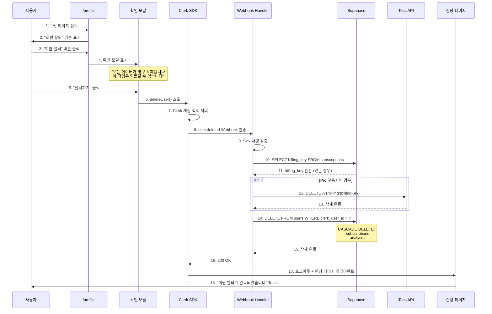

# UC-07: 회원 탈퇴 (Account Deletion)

**버전**: 1.0
**작성일**: 2025-10-26
**상태**: Draft
**우선순위**: P1 (Should Have - 론칭 직후)
**관련 플로우**: UF-07

---

## 1. 유스케이스 개요

### 1.1 목적

사용자가 서비스를 더 이상 사용하지 않을 때 계정과 모든 개인정보를 완전히 삭제할 수 있는 기능을 제공합니다. GDPR 및 개인정보보호법 준수를 위한 필수 기능입니다.

### 1.2 범위

**포함:**
- Clerk 계정 영구 삭제
- Supabase 사용자 데이터 완전 삭제 (CASCADE)
- 토스페이먼츠 BillingKey 삭제
- 모든 개인정보 및 분석 이력 삭제

**제외:**
- 탈퇴 철회 기능 (삭제는 즉시 실행, 복구 불가)
- 탈퇴 후 재가입 제한 (동일 이메일로 재가입 가능)
- 탈퇴 사유 수집 (향후 P2로 추가 가능)

### 1.3 사용자 가치

- **프라이버시 보호**: 사용자가 언제든 자신의 데이터를 완전히 삭제할 권리 보장
- **법적 준수**: GDPR, 개인정보보호법 등 법적 요구사항 충족
- **서비스 신뢰도**: 투명한 데이터 관리로 서비스 신뢰도 향상

---

## 2. 액터 (Actors)

### 2.1 주요 액터

**로그인 사용자 (Primary Actor)**
- 무료 사용자 또는 Pro 구독자
- 서비스 탈퇴를 원하는 사용자
- 자신의 계정만 삭제 가능

### 2.2 시스템 액터

**Clerk**
- 사용자 계정 삭제 처리
- `user.deleted` Webhook 발송

**Webhook Handler**
- Clerk Webhook 수신 및 검증
- Supabase 데이터 삭제 오케스트레이션
- 토스 BillingKey 삭제 요청

**Supabase**
- CASCADE DELETE를 통한 관련 데이터 자동 삭제
- users, subscriptions, analyses 테이블 처리

**토스페이먼츠 API**
- BillingKey 삭제 (Pro 구독자인 경우)
- 정기 결제 자동 중단

---

## 3. 사전 조건 (Preconditions)

### 3.1 필수 조건

- 사용자가 로그인 상태임
- 유효한 Clerk 세션이 존재함
- 프로필 페이지(`/profile`)에 접근 가능

### 3.2 시스템 조건

- Clerk API 정상 작동
- Supabase 데이터베이스 정상 작동
- Webhook 엔드포인트(`/api/webhooks/clerk`) 정상 작동
- 토스페이먼츠 API 접근 가능 (Pro 구독자인 경우)

---

## 4. 사후 조건 (Postconditions)

### 4.1 성공 시

**시스템 상태:**
- Clerk 계정 영구 삭제
- Supabase users 테이블에서 레코드 삭제
- subscriptions 테이블에서 레코드 삭제 (CASCADE)
- analyses 테이블에서 모든 분석 이력 삭제 (CASCADE)
- 토스 BillingKey 삭제 완료 (Pro 구독자인 경우)

**사용자 상태:**
- 자동 로그아웃 처리
- 랜딩 페이지로 리다이렉트
- 동일 이메일로 재가입 가능

### 4.2 실패 시

**부분 실패 (Webhook 오류):**
- Clerk 계정은 삭제되었으나 Supabase 데이터 삭제 실패
- 관리자에게 수동 처리 알림 발송
- 사용자에게는 탈퇴 완료로 표시 (사용자 경험 우선)

---

## 5. 기본 플로우 (Main Flow)

### 5.1 플로우 다이어그램



### 5.2 단계별 상세 설명

#### Step 1-2: 프로필 페이지 진입

**사용자 액션:**
- `/profile` 경로로 이동
- "내 정보" 메뉴에서 "회원 탈퇴" 버튼 확인

**UI 요소:**
```tsx
<Button variant="destructive" onClick={handleDeleteAccount}>
  회원 탈퇴
</Button>
```

**접근 권한:**
- 로그인된 사용자만 접근 가능
- Clerk 미들웨어로 자동 보호

#### Step 3-5: 탈퇴 확인

**확인 모달 내용:**
```
⚠️ 정말로 탈퇴하시겠습니까?

탈퇴 시 다음 정보가 영구 삭제됩니다:
• 계정 정보 (이메일, 이름)
• 구독 정보 (Pro 구독 즉시 해지)
• 모든 사주 분석 이력
• 결제 정보 (카드 정보)

⚠️ 이 작업은 되돌릴 수 없습니다.

[취소] [탈퇴하기]
```

**사용자 선택:**
- "취소": 모달 닫기, 프로필 페이지 유지
- "탈퇴하기": 계정 삭제 프로세스 시작

#### Step 6-7: Clerk 계정 삭제

**API 호출:**
```typescript
import { useUser } from '@clerk/nextjs';

const { user } = useUser();

const handleDeleteAccount = async () => {
  if (!user) return;

  try {
    await user.delete();
    // Clerk가 자동으로 로그아웃 및 리다이렉트 처리
  } catch (error) {
    toast.error('탈퇴 처리 중 오류가 발생했습니다.');
  }
};
```

**Clerk 내부 동작:**
- 사용자 계정 영구 삭제
- 모든 세션 무효화
- Webhook 트리거 (`user.deleted`)

#### Step 8-13: Webhook 처리

**Webhook 페이로드:**
```json
{
  "type": "user.deleted",
  "data": {
    "id": "user_2abc123xyz",
    "deleted": true,
    "object": "user"
  }
}
```

**Webhook Handler (`/api/webhooks/clerk/route.ts`):**
```typescript
export async function POST(req: Request) {
  const payload = await req.json();
  const evt = verifyWebhook(payload); // Svix 서명 검증

  if (evt.type === 'user.deleted') {
    const userId = evt.data.id;

    // 1. BillingKey 조회
    const { data: sub } = await supabase
      .from('subscriptions')
      .select('billing_key')
      .eq('clerk_user_id', userId)
      .single();

    // 2. BillingKey 삭제 (Pro 구독자인 경우)
    if (sub?.billing_key) {
      await deleteTossBillingKey(sub.billing_key);
    }

    // 3. Supabase 사용자 삭제 (CASCADE)
    await supabase
      .from('users')
      .delete()
      .eq('clerk_user_id', userId);

    return new Response('OK', { status: 200 });
  }
}
```

**토스 BillingKey 삭제:**
```typescript
async function deleteTossBillingKey(billingKey: string) {
  const response = await fetch(
    `https://api.tosspayments.com/v1/billing/authorizations/${billingKey}`,
    {
      method: 'DELETE',
      headers: {
        'Authorization': `Basic ${Buffer.from(TOSS_SECRET_KEY + ':').toString('base64')}`,
      },
    }
  );

  if (!response.ok) {
    // 실패해도 사용자 삭제는 진행 (관리자 알림 발송)
    console.error('BillingKey 삭제 실패:', billingKey);
  }
}
```

#### Step 14-15: Supabase CASCADE DELETE

**SQL 실행:**
```sql
DELETE FROM users WHERE clerk_user_id = 'user_2abc123xyz';
```

**자동 삭제되는 데이터:**
1. `subscriptions` 테이블 (ON DELETE CASCADE)
   - 구독 정보, BillingKey 참조 제거
2. `analyses` 테이블 (ON DELETE CASCADE)
   - 모든 사주 분석 이력

**삭제 확인:**
```sql
-- 외래키 제약으로 자동 CASCADE 설정 확인
SELECT
  tc.table_name,
  kcu.column_name,
  ccu.table_name AS foreign_table_name,
  rc.delete_rule
FROM information_schema.table_constraints AS tc
JOIN information_schema.key_column_usage AS kcu
  ON tc.constraint_name = kcu.constraint_name
JOIN information_schema.constraint_column_usage AS ccu
  ON ccu.constraint_name = tc.constraint_name
JOIN information_schema.referential_constraints AS rc
  ON rc.constraint_name = tc.constraint_name
WHERE tc.constraint_type = 'FOREIGN KEY'
  AND ccu.table_name = 'users';

-- 결과:
-- table_name: subscriptions, delete_rule: CASCADE
-- table_name: analyses, delete_rule: CASCADE
```

#### Step 16-18: 사용자 피드백

**성공 응답:**
- Webhook이 200 OK 반환
- Clerk가 자동으로 로그아웃 처리
- 랜딩 페이지로 리다이렉트

**Toast 메시지:**
```tsx
toast.success('회원 탈퇴가 완료되었습니다. 그동안 이용해 주셔서 감사합니다.');
```

---

## 6. 대안 플로우 (Alternative Flows)

### 6.1 AF-01: 사용자가 탈퇴 취소

**트리거**: Step 5에서 "취소" 버튼 클릭

**플로우:**
1. 확인 모달 닫기
2. 프로필 페이지 유지
3. 계정 삭제 프로세스 중단

**결과**: 데이터 변경 없음

### 6.2 AF-02: Clerk 계정 삭제 실패

**트리거**: Step 7에서 Clerk API 오류

**플로우:**
1. Clerk SDK에서 에러 반환
2. 에러 메시지 표시: "탈퇴 처리 중 오류가 발생했습니다. 잠시 후 다시 시도해주세요."
3. 사용자는 프로필 페이지에 유지
4. 다시 시도 가능

**복구 방법:**
- 네트워크 연결 확인 후 재시도
- 지속적인 실패 시 고객센터 안내

### 6.3 AF-03: Webhook 처리 실패 (Supabase 장애)

**트리거**: Step 14에서 Supabase DELETE 실패

**플로우:**
1. Webhook Handler에서 에러 발생
2. Clerk에게 500 응답 반환
3. Clerk가 자동으로 Webhook 재시도 (최대 3회, 지수 백오프)
4. 재시도 성공 시 정상 처리
5. 재시도 실패 시 관리자 알림 발송

**복구 방법:**
- Supabase 정상화 후 수동 데이터 삭제
- Clerk Dashboard에서 Webhook 재시도 수동 실행

**사용자 영향:**
- Clerk 계정은 이미 삭제되어 로그아웃 상태
- 재가입 시 새로운 계정으로 처리

### 6.4 AF-04: BillingKey 삭제 실패

**트리거**: Step 12에서 토스 API 오류

**플로우:**
1. 토스 API에서 에러 반환 (500, 타임아웃 등)
2. 에러 로그 기록 (Sentry, CloudWatch 등)
3. Supabase 사용자 삭제는 계속 진행 (사용자 경험 우선)
4. 관리자에게 알림 발송: "수동 BillingKey 삭제 필요"

**복구 방법:**
- 관리자가 토스 콘솔에서 수동 삭제
- 또는 토스 고객센터 요청

**리스크:**
- BillingKey가 남아있으면 이론적으로 결제 가능
- 실제로는 Supabase에 user_id가 없어 결제 처리 불가
- 보안 위험은 낮으나 데이터 정리 필요

---

## 7. 예외 플로우 (Exception Flows)

### 7.1 EF-01: Webhook 재시도 후에도 실패

**트리거**: Webhook 3회 재시도 모두 실패

**시스템 동작:**
1. Clerk Dashboard에 실패 로그 기록
2. 관리자 이메일 알림 발송
3. 모니터링 시스템 알림 (Sentry, Slack 등)

**복구 절차:**
```bash
# 1. Supabase에서 고아 데이터 조회
SELECT u.clerk_user_id, u.email
FROM users u
LEFT JOIN clerk_users c ON u.clerk_user_id = c.id
WHERE c.id IS NULL;

# 2. 수동 삭제
DELETE FROM users WHERE clerk_user_id = 'user_2abc123xyz';
```

**예방책:**
- Webhook 신뢰성 모니터링 (99.9% 목표)
- Supabase 가동률 모니터링
- 정기적인 고아 데이터 정리 Cron (주 1회)

### 7.2 EF-02: 동시에 여러 탈퇴 요청

**트리거**: 사용자가 "탈퇴하기" 버튼 중복 클릭

**시스템 동작:**
1. Clerk SDK는 첫 번째 요청만 처리
2. 두 번째 요청은 자동으로 무시 (계정 이미 삭제됨)
3. 사용자 경험 영향 없음

**방지 방법:**
```tsx
const [isDeleting, setIsDeleting] = useState(false);

const handleDeleteAccount = async () => {
  if (isDeleting) return; // 중복 클릭 방지
  setIsDeleting(true);

  try {
    await user.delete();
  } finally {
    setIsDeleting(false);
  }
};

<Button disabled={isDeleting}>
  {isDeleting ? '처리 중...' : '탈퇴하기'}
</Button>
```

### 7.3 EF-03: Webhook 검증 실패 (보안 공격)

**트리거**: 악의적인 Webhook 요청 (잘못된 Svix 서명)

**시스템 동작:**
1. Svix 서명 검증 실패
2. 401 Unauthorized 응답
3. 요청 거부, 데이터 변경 없음
4. 보안 로그 기록

**검증 로직:**
```typescript
import { Webhook } from 'svix';

export async function POST(req: Request) {
  const WEBHOOK_SECRET = process.env.CLERK_WEBHOOK_SECRET;

  const svix_id = req.headers.get('svix-id');
  const svix_timestamp = req.headers.get('svix-timestamp');
  const svix_signature = req.headers.get('svix-signature');

  if (!svix_id || !svix_timestamp || !svix_signature) {
    return new Response('Unauthorized', { status: 401 });
  }

  const payload = await req.text();
  const wh = new Webhook(WEBHOOK_SECRET);

  try {
    wh.verify(payload, {
      'svix-id': svix_id,
      'svix-timestamp': svix_timestamp,
      'svix-signature': svix_signature,
    });
  } catch (err) {
    console.error('Webhook verification failed:', err);
    return new Response('Unauthorized', { status: 401 });
  }

  // 정상 처리...
}
```

---

## 8. 비기능 요구사항 (Non-Functional Requirements)

### 8.1 성능

| 지표 | 목표 | 측정 방법 |
|------|------|----------|
| Clerk 계정 삭제 시간 | < 3초 | Clerk API 응답 시간 |
| Webhook 처리 시간 | < 5초 | Webhook Handler 실행 시간 |
| 전체 탈퇴 프로세스 | < 10초 | 사용자 클릭 → 랜딩 페이지 이동 |
| BillingKey 삭제 시간 | < 2초 | 토스 API 응답 시간 |

### 8.2 보안

**개인정보 보호:**
- 모든 개인정보 완전 삭제 (GDPR Right to Erasure 준수)
- Webhook 서명 검증 (Svix)으로 위조 방지
- BillingKey 삭제로 결제 정보 보호

**감사 추적:**
- Webhook 요청/응답 로그 기록 (CloudWatch, Sentry)
- 삭제 작업 타임스탬프 기록
- 관리자 알림 시스템

### 8.3 신뢰성

**Webhook 재시도:**
- Clerk 자동 재시도: 최대 3회, 지수 백오프
- 재시도 간격: 1분, 5분, 30분
- 최종 실패 시 관리자 알림

**멱등성 보장:**
- Webhook 중복 요청 시 안전하게 처리
- `DELETE` 쿼리는 이미 삭제된 데이터에도 안전
- 영향받은 행 수 0이어도 200 OK 반환

**트랜잭션 처리:**
```typescript
// Webhook Handler에서 트랜잭션 사용 (선택사항)
await supabase.rpc('delete_user_cascade', { p_user_id: userId });

-- Supabase Function (선택사항)
CREATE OR REPLACE FUNCTION delete_user_cascade(p_user_id VARCHAR)
RETURNS VOID AS $$
BEGIN
  DELETE FROM users WHERE clerk_user_id = p_user_id;
  -- CASCADE가 자동으로 처리하므로 추가 DELETE 불필요
END;
$$ LANGUAGE plpgsql;
```

### 8.4 사용성

**사용자 피드백:**
- 확인 모달: 명확한 경고 메시지
- 로딩 상태: "처리 중..." 표시
- 성공 피드백: Toast 메시지
- 에러 처리: 친화적인 에러 메시지

**접근성:**
- 키보드 네비게이션 지원 (Tab, Enter, Esc)
- 스크린 리더 지원 (ARIA 레이블)
- 색맹 고려 (빨간색 외 아이콘 추가)

---

## 9. 데이터 명세 (Data Specification)

### 9.1 입력 데이터

**없음**: 사용자 확인만 필요, 추가 입력 불필요

### 9.2 출력 데이터

**성공 응답:**
```json
{
  "success": true,
  "message": "회원 탈퇴가 완료되었습니다."
}
```

**실패 응답:**
```json
{
  "success": false,
  "error": "탈퇴 처리 중 오류가 발생했습니다.",
  "code": "DELETE_FAILED"
}
```

### 9.3 데이터 삭제 범위

| 테이블 | 삭제 방식 | 데이터 예시 |
|--------|----------|-----------|
| users | 직접 DELETE | clerk_user_id, email, name |
| subscriptions | CASCADE DELETE | plan_type, billing_key, quota |
| analyses | CASCADE DELETE | 모든 사주 분석 이력 |
| Clerk | Clerk SDK | 인증 정보, 세션 |
| Toss | API DELETE | BillingKey (정기 결제 토큰) |

**삭제 SQL:**
```sql
-- 1. 직접 삭제
DELETE FROM users WHERE clerk_user_id = 'user_2abc123xyz';

-- 2. 자동 CASCADE (외래키 제약)
-- subscriptions 테이블의 clerk_user_id FK → users.clerk_user_id
-- analyses 테이블의 clerk_user_id FK → users.clerk_user_id

-- 3. 삭제 확인
SELECT COUNT(*) FROM users WHERE clerk_user_id = 'user_2abc123xyz';
-- 결과: 0

SELECT COUNT(*) FROM subscriptions WHERE clerk_user_id = 'user_2abc123xyz';
-- 결과: 0

SELECT COUNT(*) FROM analyses WHERE clerk_user_id = 'user_2abc123xyz';
-- 결과: 0
```

---

## 10. UI/UX 명세

### 10.1 화면 레이아웃

**프로필 페이지 (`/profile`):**

```
┌─────────────────────────────────────┐
│ 내 정보                              │
├─────────────────────────────────────┤
│                                     │
│ 이름: 홍길동                         │
│ 이메일: hong@example.com            │
│                                     │
│ [프로필 수정]                        │
│                                     │
├─────────────────────────────────────┤
│ 위험 영역                            │
├─────────────────────────────────────┤
│                                     │
│ ⚠️ 회원 탈퇴                         │
│ 계정을 삭제하면 모든 데이터가 영구   │
│ 삭제되며 복구할 수 없습니다.          │
│                                     │
│ [회원 탈퇴]  (빨간색 버튼)           │
│                                     │
└─────────────────────────────────────┘
```

**확인 모달:**

```
┌─────────────────────────────────────┐
│ ⚠️ 정말로 탈퇴하시겠습니까?          │
├─────────────────────────────────────┤
│                                     │
│ 탈퇴 시 다음 정보가 영구 삭제됩니다: │
│                                     │
│ • 계정 정보 (이메일, 이름)           │
│ • 구독 정보 (Pro 구독 즉시 해지)     │
│ • 모든 사주 분석 이력                │
│ • 결제 정보 (카드 정보)              │
│                                     │
│ ⚠️ 이 작업은 되돌릴 수 없습니다.     │
│                                     │
├─────────────────────────────────────┤
│                                     │
│        [취소]      [탈퇴하기]        │
│      (회색)       (빨간색)           │
│                                     │
└─────────────────────────────────────┘
```

### 10.2 UI 컴포넌트 예시

**프로필 페이지 (React + shadcn/ui):**

```tsx
'use client';

import { useUser } from '@clerk/nextjs';
import { Button } from '@/components/ui/button';
import { Card, CardHeader, CardTitle, CardContent } from '@/components/ui/card';
import { AlertDialog, AlertDialogAction, AlertDialogCancel, AlertDialogContent, AlertDialogDescription, AlertDialogFooter, AlertDialogHeader, AlertDialogTitle, AlertDialogTrigger } from '@/components/ui/alert-dialog';
import { toast } from 'sonner';
import { useState } from 'react';

export default function ProfilePage() {
  const { user } = useUser();
  const [isDeleting, setIsDeleting] = useState(false);

  const handleDeleteAccount = async () => {
    if (!user) return;

    setIsDeleting(true);
    try {
      await user.delete();
      toast.success('회원 탈퇴가 완료되었습니다. 그동안 이용해 주셔서 감사합니다.');
      // Clerk가 자동으로 로그아웃 및 리다이렉트 처리
    } catch (error) {
      toast.error('탈퇴 처리 중 오류가 발생했습니다. 잠시 후 다시 시도해주세요.');
      setIsDeleting(false);
    }
  };

  return (
    <div className="max-w-2xl mx-auto p-6 space-y-6">
      {/* 내 정보 */}
      <Card>
        <CardHeader>
          <CardTitle>내 정보</CardTitle>
        </CardHeader>
        <CardContent className="space-y-4">
          <div>
            <p className="text-sm text-gray-500">이름</p>
            <p className="font-medium">{user?.fullName}</p>
          </div>
          <div>
            <p className="text-sm text-gray-500">이메일</p>
            <p className="font-medium">{user?.primaryEmailAddress?.emailAddress}</p>
          </div>
        </CardContent>
      </Card>

      {/* 위험 영역 */}
      <Card className="border-red-200">
        <CardHeader>
          <CardTitle className="text-red-600">위험 영역</CardTitle>
        </CardHeader>
        <CardContent className="space-y-4">
          <div>
            <p className="text-sm text-gray-700 mb-2">
              ⚠️ 회원 탈퇴
            </p>
            <p className="text-sm text-gray-500 mb-4">
              계정을 삭제하면 모든 데이터가 영구 삭제되며 복구할 수 없습니다.
            </p>

            <AlertDialog>
              <AlertDialogTrigger asChild>
                <Button variant="destructive" disabled={isDeleting}>
                  {isDeleting ? '처리 중...' : '회원 탈퇴'}
                </Button>
              </AlertDialogTrigger>
              <AlertDialogContent>
                <AlertDialogHeader>
                  <AlertDialogTitle>⚠️ 정말로 탈퇴하시겠습니까?</AlertDialogTitle>
                  <AlertDialogDescription className="space-y-4">
                    <p>탈퇴 시 다음 정보가 영구 삭제됩니다:</p>
                    <ul className="list-disc list-inside space-y-1 text-sm">
                      <li>계정 정보 (이메일, 이름)</li>
                      <li>구독 정보 (Pro 구독 즉시 해지)</li>
                      <li>모든 사주 분석 이력</li>
                      <li>결제 정보 (카드 정보)</li>
                    </ul>
                    <p className="font-semibold text-red-600">
                      ⚠️ 이 작업은 되돌릴 수 없습니다.
                    </p>
                  </AlertDialogDescription>
                </AlertDialogHeader>
                <AlertDialogFooter>
                  <AlertDialogCancel>취소</AlertDialogCancel>
                  <AlertDialogAction
                    onClick={handleDeleteAccount}
                    className="bg-red-600 hover:bg-red-700"
                  >
                    탈퇴하기
                  </AlertDialogAction>
                </AlertDialogFooter>
              </AlertDialogContent>
            </AlertDialog>
          </div>
        </CardContent>
      </Card>
    </div>
  );
}
```

### 10.3 인터랙션 명세

| 요소 | 상태 | 동작 |
|------|------|------|
| "회원 탈퇴" 버튼 | 기본 | 빨간색 배경, 마우스 오버 시 어두워짐 |
| "회원 탈퇴" 버튼 | 로딩 | 비활성화, 텍스트 "처리 중...", 스피너 |
| 확인 모달 | 열림 | 배경 어둡게, 모달 중앙 표시, ESC로 닫기 |
| "취소" 버튼 | 클릭 | 모달 닫기, 데이터 변경 없음 |
| "탈퇴하기" 버튼 | 클릭 | Clerk 계정 삭제 시작, 모달 닫기 |

---

## 11. 테스트 시나리오

### 11.1 기본 플로우 테스트

**TC-01: 무료 사용자 탈퇴**

1. **Given**: 무료 플랜 사용자가 로그인 상태
2. **When**: 프로필 페이지에서 "회원 탈퇴" → 확인 모달 → "탈퇴하기" 클릭
3. **Then**:
   - Clerk 계정 삭제 성공
   - Supabase users, subscriptions, analyses 모두 삭제
   - 랜딩 페이지로 리다이렉트
   - "회원 탈퇴가 완료되었습니다" Toast 표시

**TC-02: Pro 구독자 탈퇴**

1. **Given**: Pro 플랜 구독 중인 사용자가 로그인 상태
2. **When**: 프로필 페이지에서 "회원 탈퇴" → 확인 모달 → "탈퇴하기" 클릭
3. **Then**:
   - Clerk 계정 삭제 성공
   - 토스 BillingKey 삭제 성공
   - Supabase users, subscriptions, analyses 모두 삭제
   - 정기 결제 자동 중단
   - 랜딩 페이지로 리다이렉트

### 11.2 대안 플로우 테스트

**TC-03: 탈퇴 취소**

1. **Given**: 사용자가 "회원 탈퇴" 버튼 클릭
2. **When**: 확인 모달에서 "취소" 버튼 클릭
3. **Then**:
   - 모달 닫기
   - 프로필 페이지 유지
   - 데이터 변경 없음

**TC-04: Clerk API 오류**

1. **Given**: Clerk API가 일시적으로 장애 상태
2. **When**: "탈퇴하기" 버튼 클릭
3. **Then**:
   - 에러 메시지 표시: "탈퇴 처리 중 오류가 발생했습니다."
   - 사용자는 프로필 페이지에 유지
   - 재시도 가능

### 11.3 예외 플로우 테스트

**TC-05: Webhook 실패**

1. **Given**: Supabase가 일시적으로 장애 상태
2. **When**: Clerk 계정 삭제 후 Webhook 발송
3. **Then**:
   - Webhook Handler에서 에러 발생
   - Clerk가 자동으로 재시도 (3회)
   - 재시도 성공 시 정상 삭제
   - 재시도 실패 시 관리자 알림

**TC-06: BillingKey 삭제 실패**

1. **Given**: 토스 API가 일시적으로 장애 상태
2. **When**: Pro 구독자 탈퇴 시도
3. **Then**:
   - BillingKey 삭제 실패 로그 기록
   - Supabase 사용자 삭제는 계속 진행
   - 관리자에게 알림 발송
   - 사용자 경험 영향 없음 (탈퇴 완료)

**TC-07: Webhook 검증 실패**

1. **Given**: 악의적인 Webhook 요청 (잘못된 서명)
2. **When**: `/api/webhooks/clerk` 엔드포인트로 POST 요청
3. **Then**:
   - Svix 서명 검증 실패
   - 401 Unauthorized 응답
   - 데이터 변경 없음
   - 보안 로그 기록

### 11.4 성능 테스트

**TC-08: 응답 시간**

1. **Given**: 정상 시스템 상태
2. **When**: 탈퇴 프로세스 시작
3. **Then**:
   - Clerk 계정 삭제: < 3초
   - Webhook 처리: < 5초
   - 전체 프로세스: < 10초

**TC-09: 동시 탈퇴 요청**

1. **Given**: 1000명의 사용자가 동시에 탈퇴 시도
2. **When**: 부하 테스트 실행
3. **Then**:
   - 모든 요청 성공적으로 처리
   - Webhook 재시도율 < 5%
   - 시스템 가동률 > 99%

### 11.5 보안 테스트

**TC-10: 타인 계정 삭제 시도**

1. **Given**: 사용자 A가 로그인 상태
2. **When**: 사용자 B의 clerk_user_id로 삭제 요청
3. **Then**:
   - Clerk SDK에서 자동 차단
   - 본인 계정만 삭제 가능
   - 403 Forbidden 또는 자동 무시

**TC-11: CSRF 공격 시도**

1. **Given**: 악의적인 사이트에서 탈퇴 요청 전송
2. **When**: 사용자가 해당 사이트 방문
3. **Then**:
   - Clerk SDK의 CSRF 보호 활성화
   - 요청 차단
   - 계정 삭제 안 됨

---

## 12. 모니터링 및 알림

### 12.1 모니터링 지표

| 지표 | 목표 | 알림 조건 |
|------|------|----------|
| Webhook 성공률 | > 99% | < 95% 시 알림 |
| BillingKey 삭제 성공률 | > 98% | < 95% 시 알림 |
| 평균 탈퇴 처리 시간 | < 10초 | > 15초 시 알림 |
| Webhook 재시도율 | < 5% | > 10% 시 알림 |
| 일일 탈퇴 건수 | - | 급증 시 알림 (전일 대비 200%) |

### 12.2 로그 수집

**Webhook 요청 로그:**
```json
{
  "timestamp": "2025-10-26T15:30:00Z",
  "event_type": "user.deleted",
  "user_id": "user_2abc123xyz",
  "status": "success",
  "duration_ms": 4500,
  "billing_key_deleted": true,
  "supabase_deleted": true
}
```

**에러 로그:**
```json
{
  "timestamp": "2025-10-26T15:30:00Z",
  "event_type": "user.deleted",
  "user_id": "user_2abc123xyz",
  "status": "failed",
  "error": "Supabase connection timeout",
  "retry_count": 1
}
```

### 12.3 관리자 알림

**Slack 알림 (예시):**
```
⚠️ 회원 탈퇴 처리 실패

사용자: user_2abc123xyz
이메일: hong@example.com
실패 원인: BillingKey 삭제 실패 (Toss API 타임아웃)
재시도 횟수: 3/3

조치 필요:
1. 토스 콘솔에서 수동 BillingKey 삭제
2. Supabase에서 데이터 삭제 확인

[Sentry 로그 보기] [Supabase 대시보드]
```

---

## 13. 법적 준수 (Compliance)

### 13.1 GDPR (유럽 일반 개인정보 보호법)

**Right to Erasure (삭제권):**
- 사용자가 요청 시 개인정보 즉시 삭제
- 30일 이내 처리 (본 서비스는 즉시 처리)
- 삭제 확인 메시지 제공

**데이터 최소화:**
- 필수 데이터만 수집 (이름, 이메일, 사주 분석 입력)
- 불필요한 데이터 보관 안 함

### 13.2 개인정보보호법 (한국)

**회원 탈퇴 시 처리:**
- 즉시 삭제 원칙 (5년 보관 예외 사항 없음)
- 삭제 확인 메시지 표시
- 재가입 가능

**개인정보 파기:**
- 전자적 파일: 완전 삭제 (복구 불가능)
- 백업 데이터: 정기 백업 사이클 후 자동 삭제

### 13.3 PCI DSS (결제 정보 보안)

**BillingKey 처리:**
- 토스페이먼츠가 PCI DSS 준수
- 카드 정보 직접 저장 안 함
- BillingKey만 저장, 탈퇴 시 즉시 삭제

---

## 14. 향후 개선 사항 (P2)

### 14.1 탈퇴 사유 수집

**목적**: 서비스 개선 및 이탈 방지

**UI 추가:**
```
탈퇴 사유를 선택해주세요 (선택사항):
○ 사용 빈도가 낮아서
○ 가격이 부담스러워서
○ 원하는 기능이 없어서
○ 서비스 품질이 만족스럽지 않아서
○ 기타 (직접 입력)

[___________________________]
```

**저장:**
- 익명 통계로만 저장 (user_id 연결 안 함)
- 개인정보로 간주하지 않음

### 14.2 탈퇴 유예 기간

**목적**: 실수로 탈퇴한 사용자 복구 가능

**변경 사항:**
- 즉시 삭제 → 7일 유예 기간 후 삭제
- 유예 기간 동안 로그인 불가, 데이터 보관
- 7일 이내 복구 요청 시 재활성화
- 7일 후 자동 영구 삭제

**구현:**
```sql
-- subscriptions 테이블
ALTER TABLE subscriptions ADD COLUMN deletion_scheduled_at TIMESTAMP;

-- Cron으로 7일 지난 계정 삭제
SELECT * FROM users
WHERE deletion_scheduled_at < NOW() - INTERVAL '7 days';
```

### 14.3 데이터 다운로드 (GDPR Right to Data Portability)

**목적**: 사용자가 탈퇴 전 자신의 데이터 다운로드

**기능:**
- "탈퇴하기" 버튼 옆에 "내 데이터 다운로드" 버튼 추가
- JSON 파일로 모든 분석 이력 제공
- 이메일로 전송 또는 즉시 다운로드

**데이터 포맷:**
```json
{
  "user": {
    "email": "hong@example.com",
    "name": "홍길동",
    "joined_date": "2025-01-01"
  },
  "subscription": {
    "plan_type": "pro",
    "status": "active",
    "quota": 8
  },
  "analyses": [
    {
      "id": "uuid-1",
      "name": "홍길동",
      "birth_date": "1990-01-01",
      "result_markdown": "# 사주팔자 분석 결과...",
      "created_at": "2025-10-26T15:30:00Z"
    }
  ]
}
```

---

## 15. 참고 자료

### 15.1 관련 문서

- [Clerk User Management API](https://clerk.com/docs/reference/backend-api/tag/Users#operation/DeleteUser)
- [Clerk Webhooks](https://clerk.com/docs/integrations/webhooks/overview)
- [Supabase CASCADE DELETE](https://supabase.com/docs/guides/database/tables#foreign-key-constraints)
- [Toss BillingKey 삭제 API](https://docs.tosspayments.com/reference/billing#billing-키-삭제)
- [GDPR Right to Erasure](https://gdpr-info.eu/art-17-gdpr/)

### 15.2 관련 유스케이스

- UC-01: 신규 사용자 가입 (회원가입 프로세스 역과정)
- UC-04: 구독 취소 및 재활성화 (구독 해지 로직 재사용)

### 15.3 코드 예시

**Webhook Handler 전체 코드:**
- `/app/api/webhooks/clerk/route.ts`

**프로필 페이지:**
- `/app/profile/page.tsx`

**토스 BillingKey 삭제:**
- `/lib/toss/delete-billing-key.ts`

---

## 16. 체크리스트

### 16.1 개발 완료 기준

- [ ] 프로필 페이지에 "회원 탈퇴" 버튼 추가
- [ ] 확인 모달 구현 (경고 문구, 취소/탈퇴 버튼)
- [ ] Clerk SDK `user.delete()` 호출 구현
- [ ] Webhook Handler 구현 (`user.deleted` 이벤트)
- [ ] Supabase CASCADE DELETE 설정 확인
- [ ] 토스 BillingKey 삭제 API 호출
- [ ] Toast 성공 메시지 표시
- [ ] 에러 처리 (Clerk API, Webhook, 토스 API)

### 16.2 테스트 완료 기준

- [ ] TC-01: 무료 사용자 탈퇴 성공
- [ ] TC-02: Pro 구독자 탈퇴 성공
- [ ] TC-03: 탈퇴 취소 동작 확인
- [ ] TC-04: Clerk API 오류 처리
- [ ] TC-05: Webhook 재시도 동작
- [ ] TC-06: BillingKey 삭제 실패 처리
- [ ] TC-07: Webhook 검증 실패 차단
- [ ] TC-08: 응답 시간 < 10초
- [ ] TC-09: 동시 탈퇴 요청 처리
- [ ] TC-10: 타인 계정 삭제 차단

### 16.3 배포 전 확인

- [ ] Clerk Webhook 엔드포인트 등록 (`https://yourdomain.com/api/webhooks/clerk`)
- [ ] Webhook Secret 환경 변수 설정 (`CLERK_WEBHOOK_SECRET`)
- [ ] Supabase 외래키 제약 ON DELETE CASCADE 확인
- [ ] 토스 API 키 환경 변수 설정 (`TOSS_SECRET_KEY`)
- [ ] 프로덕션 환경에서 탈퇴 플로우 1회 테스트
- [ ] Sentry 에러 트래킹 설정
- [ ] Slack 알림 채널 설정

---

**문서 버전**: 1.0
**최종 수정일**: 2025-10-26
**작성자**: Product Team
**승인자**: Dev Lead, QA Lead
**다음 리뷰**: 구현 완료 후
