# 사용자 플로우 문서 (Userflow)

**프로젝트**: 구독제 사주분석 서비스
**버전**: 2.0
**작성일**: 2025-10-26
**상태**: Draft

---

## 목차

1. [플로우 개요](#1-플로우-개요)
2. [UF-01: 신규 사용자 가입 및 무료 체험](#2-uf-01-신규-사용자-가입-및-무료-체험)
3. [UF-02: 무료 사용자의 Pro 구독 전환](#3-uf-02-무료-사용자의-pro-구독-전환)
4. [UF-03: Pro 사용자의 사주 분석 이용](#4-uf-03-pro-사용자의-사주-분석-이용)
5. [UF-04: 구독 취소 및 재활성화](#5-uf-04-구독-취소-및-재활성화)
6. [UF-05: 정기 결제 자동화 (Cron)](#6-uf-05-정기-결제-자동화-cron)
7. [UF-06: 분석 이력 조회](#7-uf-06-분석-이력-조회)
8. [UF-07: 회원 탈퇴](#8-uf-07-회원-탈퇴)
9. [공통 에러 처리](#9-공통-에러-처리)

---

## 1. 플로우 개요

### 1.1 핵심 사용자 여정

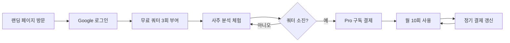

### 1.2 주요 페이지 전환 흐름

```mermaid
graph TD
    Landing[/ 랜딩 페이지] -->|로그인| Dashboard[/dashboard 대시보드]
    Dashboard -->|새 분석하기| NewAnalysis[/analysis/new 새 분석]
    NewAnalysis -->|분석 완료| AnalysisDetail[/analysis/id 분석 상세]
    Dashboard -->|분석 카드 클릭| AnalysisDetail
    Dashboard -->|구독 관리| Subscription[/subscription 구독 관리]
    Subscription -->|Pro 구독| Payment[토스 결제 위젯]
    Payment -->|결제 완료| Dashboard
```

### 1.3 인증 상태별 접근 제어

| 페이지 | 비로그인 | 무료 사용자 | Pro 사용자 |
|--------|---------|------------|----------|
| `/` (랜딩) | ✅ 접근 | ✅ 접근 | ✅ 접근 |
| `/dashboard` | ❌ 로그인 필요 | ✅ 접근 | ✅ 접근 |
| `/analysis/new` | ❌ 로그인 필요 | ⚠️ 쿼터 필요 | ⚠️ 쿼터 필요 |
| `/analysis/[id]` | ❌ 로그인 필요 | ✅ 본인 분석만 | ✅ 본인 분석만 |
| `/subscription` | ❌ 로그인 필요 | ✅ 접근 | ✅ 접근 |

---

## 2. UF-01: 신규 사용자 가입 및 무료 체험

### 2.1 플로우 다이어그램

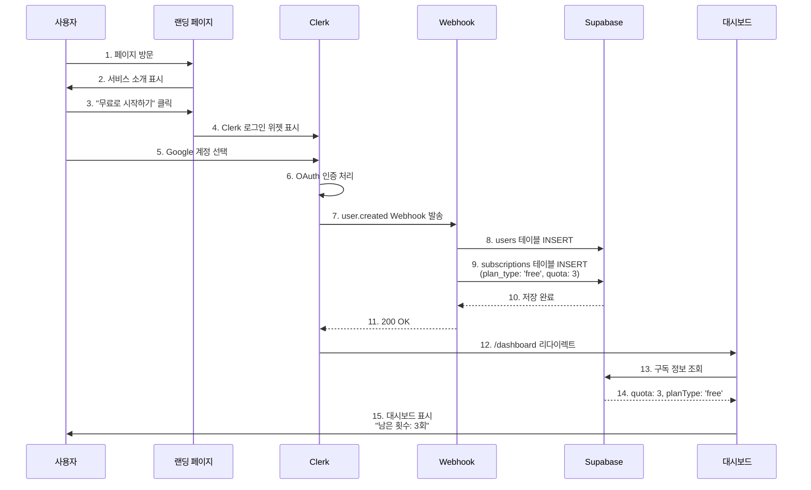

### 2.2 입력 (Input)

**UI 상호작용:**
- 위치: 랜딩 페이지 `/`
- 액션: "무료로 시작하기" 버튼 클릭
- 사용자 선택: Google 계정 선택 및 OAuth 동의

**시스템 입력:**
- Clerk OAuth: Google 사용자 정보 (email, name, id)

### 2.3 처리 (Processing)

**Step 1: Clerk OAuth 인증**
- Clerk SDK가 Google OAuth 2.0 플로우 실행
- 사용자 정보 수집: email, first_name, last_name, id

**Step 2: Webhook 트리거**
- Event: `user.created`
- Endpoint: `POST /api/webhooks/clerk`
- 인증: Svix 서명 검증
- Payload:
  ```json
  {
    "type": "user.created",
    "data": {
      "id": "user_2abc123xyz",
      "email_addresses": [{"email_address": "user@example.com"}],
      "first_name": "홍",
      "last_name": "길동"
    }
  }
  ```

**Step 3: Supabase 동기화**
1. users 테이블 INSERT
   ```sql
   INSERT INTO users (clerk_user_id, email, name)
   VALUES ('user_2abc123xyz', 'user@example.com', '홍길동');
   ```

2. subscriptions 테이블 INSERT
   ```sql
   INSERT INTO subscriptions (user_id, plan_type, quota, status)
   VALUES ('user_2abc123xyz', 'free', 3, 'active');
   ```

**Step 4: 세션 생성 및 리다이렉트**
- Clerk가 세션 쿠키 생성
- `/dashboard`로 자동 리다이렉트

### 2.4 출력 (Output)

**성공 시:**
- 대시보드 페이지로 자동 이동
- 환영 메시지: "환영합니다, 홍길동님! 무료 분석 3회를 체험해보세요."
- 쿼터 표시: "남은 분석 횟수: 3회"

**실패 시:**
- Clerk 로그인 실패: "로그인에 실패했습니다. 다시 시도해주세요."
- Webhook 오류: 사용자에게는 영향 없음 (백그라운드 재시도)

**데이터 변경:**
- users 테이블: 신규 레코드 1건 추가
- subscriptions 테이블: 신규 레코드 1건 추가 (quota: 3)

**사이드이펙트:**
- Clerk 세션 쿠키 생성
- Supabase RLS 정책 활성화 (clerk_user_id 기반)

### 2.5 엣지 케이스

**EC-01: Webhook 실패 (Supabase 장애)**
- 문제: Webhook이 Supabase에 데이터 저장 실패
- 감지: Webhook 응답 500 에러
- 대응:
  1. Clerk Dashboard에서 Webhook 재시도 자동 실행 (최대 3회)
  2. 재시도 실패 시 관리자 알림 발송
  3. 사용자는 로그인 성공 상태지만 쿼터 없음 → 첫 분석 시도 시 에러 표시

**EC-02: 중복 가입 시도**
- 문제: 이미 가입한 이메일로 재가입 시도
- 감지: Clerk가 기존 계정 감지
- 대응:
  1. Clerk가 자동으로 기존 계정 로그인 처리
  2. `user.created` Webhook 발송 안 됨
  3. 기존 구독 정보 그대로 유지

**EC-03: OAuth 취소**
- 문제: 사용자가 Google OAuth 동의 화면에서 "취소" 클릭
- 감지: Clerk 콜백 없음
- 대응:
  1. 랜딩 페이지로 복귀
  2. 에러 메시지: "로그인이 취소되었습니다."

**EC-04: 네트워크 끊김**
- 문제: OAuth 중 네트워크 연결 끊김
- 감지: Clerk SDK 타임아웃
- 대응:
  1. 에러 메시지: "네트워크 연결을 확인해주세요."
  2. "다시 시도" 버튼 표시

---

## 3. UF-02: 무료 사용자의 Pro 구독 전환

### 3.1 플로우 다이어그램

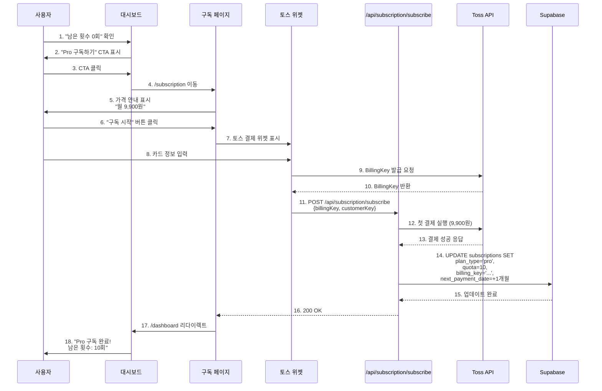

### 3.2 입력 (Input)

**UI 상호작용:**
- 위치: `/subscription` 구독 관리 페이지
- 액션: "Pro 구독 시작" 버튼 클릭
- 토스 위젯 입력:
  - 카드 번호
  - 유효기간 (MM/YY)
  - CVC 번호
  - 카드 비밀번호 앞 2자리
  - 생년월일 6자리

**시스템 입력:**
- 현재 사용자: Clerk User ID
- 결제 금액: 9,900원 (고정)
- 결제 주기: 월 1회

### 3.3 처리 (Processing)

**Step 1: 토스 BillingKey 발급**
- 토스 결제 위젯에서 카드 정보 수집
- API 호출: `POST https://api.tosspayments.com/v1/billing/authorizations/card`

**Step 2: 첫 결제 실행**
- API 호출: `POST https://api.tosspayments.com/v1/billing/{billingKey}`
- 금액: 9,900원
- 주문명: "사주분석 Pro 구독"

**Step 3: Supabase 구독 정보 업데이트**
```sql
UPDATE subscriptions
SET
  plan_type = 'pro',
  status = 'active',
  quota = 10,
  billing_key = 'billing_abc123xyz',
  next_payment_date = CURRENT_DATE + INTERVAL '1 month',
  last_payment_date = CURRENT_DATE,
  updated_at = NOW()
WHERE user_id = 'user_2abc123xyz';
```

### 3.4 출력 (Output)

**성공 시:**
- Toast 알림: "Pro 구독이 시작되었습니다! 이제 월 10회 분석을 이용하실 수 있습니다."
- 대시보드로 리다이렉트
- 쿼터 표시: "남은 분석 횟수: 10회 | Pro 구독 중"
- 다음 결제일 표시: "다음 결제: 2025-11-26 (9,900원)"

**실패 시:**
- 카드 정보 오류: "카드 정보를 확인해주세요."
- 잔액 부족: "카드 잔액이 부족합니다."
- 결제 거부: "카드사에서 결제를 거부했습니다. 카드사에 문의해주세요."
- 네트워크 오류: "일시적인 오류가 발생했습니다. 다시 시도해주세요."

**데이터 변경:**
- subscriptions 테이블:
  - `plan_type`: 'free' → 'pro'
  - `quota`: 0 → 10
  - `billing_key`: NULL → 'billing_abc123xyz'
  - `next_payment_date`: NULL → 2025-11-26
  - `last_payment_date`: NULL → 2025-10-26

**사이드이펙트:**
- 토스 페이먼츠에 BillingKey 저장
- 다음 결제일에 자동 결제 예약

### 3.5 엣지 케이스

**EC-01: BillingKey 발급 성공 후 첫 결제 실패**
- 문제: 카드 등록은 성공했으나 첫 결제가 거부됨
- 감지: 토스 API 응답 `status: 'FAILED'`
- 대응:
  1. BillingKey 즉시 삭제 (토스 API 호출)
  2. Supabase 구독 정보 롤백 (plan_type: 'free' 유지)
  3. 사용자에게 에러 메시지: "결제에 실패했습니다. 카드 정보를 확인하고 다시 시도해주세요."

**EC-02: 이미 Pro 구독 중인 사용자**
- 문제: Pro 상태에서 재구독 시도
- 감지: API에서 `plan_type === 'pro'` 확인
- 대응:
  1. 에러 응답: `400 Bad Request`
  2. 메시지: "이미 Pro 구독 중입니다."
  3. 구독 관리 페이지로 리다이렉트

**EC-03: 결제 위젯 닫기**
- 문제: 사용자가 결제 위젯에서 "X" 버튼 클릭
- 감지: 토스 위젯 콜백 없음
- 대응:
  1. 구독 페이지 그대로 유지
  2. "구독을 취소하셨습니다." 메시지 표시

**EC-04: 동시 요청 (Race Condition)**
- 문제: 사용자가 "구독 시작" 버튼 중복 클릭
- 감지: API에서 중복 요청 감지 (order_id 중복)
- 대응:
  1. 첫 번째 요청만 처리
  2. 두 번째 요청은 `409 Conflict` 반환
  3. 프론트엔드에서 버튼 비활성화 처리

---

## 4. UF-03: Pro 사용자의 사주 분석 이용

### 4.1 플로우 다이어그램

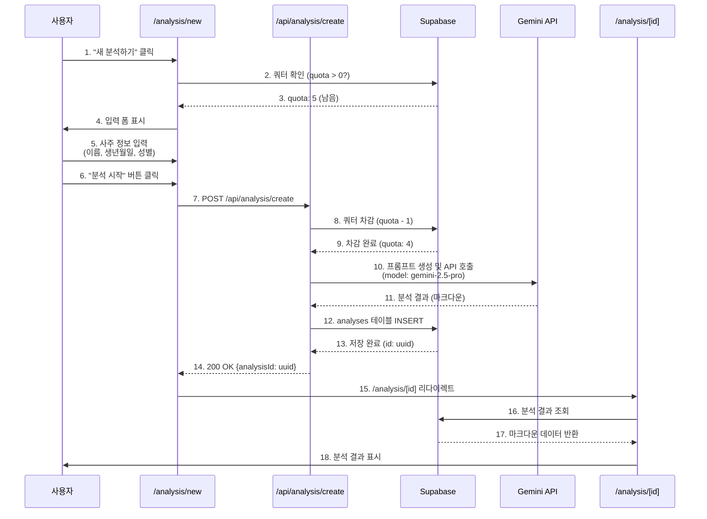

### 4.2 입력 (Input)

**UI 상호작용:**
- 위치: `/analysis/new` 새 분석 페이지
- 필수 입력:
  - 이름: `text` (2-50자)
  - 생년월일: `date` (1900-01-01 ~ 오늘)
  - 성별: `radio` (남성/여성)
- 선택 입력:
  - 출생시간: `time` (HH:MM 또는 "시간 미상")

**검증 규칙:**
```typescript
const schema = z.object({
  name: z.string().min(2).max(50),
  birthDate: z.string().regex(/^\d{4}-\d{2}-\d{2}$/),
  birthTime: z.string().optional(),
  gender: z.enum(['male', 'female']),
});
```

### 4.3 처리 (Processing)

**Step 1: 쿼터 확인**
```sql
SELECT quota, plan_type
FROM subscriptions
WHERE user_id = 'user_2abc123xyz'
  AND status = 'active';
```

**Step 2: 쿼터 차감 (트랜잭션)**
```sql
BEGIN;

UPDATE subscriptions
SET quota = quota - 1,
    updated_at = NOW()
WHERE user_id = 'user_2abc123xyz'
  AND quota > 0;

-- 영향받은 행 수 확인 (0이면 동시성 문제)
IF (ROW_COUNT = 0) THEN
  ROLLBACK;
  RAISE EXCEPTION '쿼터 부족';
ELSE
  COMMIT;
END IF;
```

**Step 3: Gemini API 호출**
- 모델 선택:
  - Free: `gemini-2.5-flash`
  - Pro: `gemini-2.5-pro`

**Step 4: 분석 결과 저장**
```sql
INSERT INTO analyses (
  user_id,
  name,
  birth_date,
  birth_time,
  gender,
  result_markdown,
  model_used
)
VALUES (
  'user_2abc123xyz',
  '홍길동',
  '1990-01-01',
  '10:30',
  'male',
  '# 사주팔자 분석 결과...',
  'gemini-2.5-pro'
)
RETURNING id;
```

### 4.4 출력 (Output)

**성공 시:**
- 로딩 인디케이터: "AI가 사주를 분석 중입니다... (30초 소요)"
- 분석 완료 후 자동 리다이렉트: `/analysis/[id]`
- 결과 페이지에서 마크다운 렌더링
- 남은 쿼터 업데이트: "남은 분석 횟수: 4회"

**실패 시:**
- 쿼터 부족: "남은 분석 횟수가 없습니다. Pro 구독을 이용해주세요."
- Gemini API 오류: "AI 분석 중 오류가 발생했습니다. 잠시 후 다시 시도해주세요."
- 네트워크 오류: "인터넷 연결을 확인해주세요."

**데이터 변경:**
- subscriptions 테이블: `quota`: 5 → 4
- analyses 테이블: 신규 레코드 1건 추가

**사이드이펙트:**
- Gemini API 할당량 소진 (토큰 사용량 증가)

### 4.5 엣지 케이스

**EC-01: 쿼터 동시성 문제**
- 문제: 두 개의 요청이 동시에 쿼터 차감 시도
- 감지: 트랜잭션에서 `quota > 0` 조건 실패
- 대응:
  1. 두 번째 요청은 롤백
  2. 에러 응답: "분석 횟수가 부족합니다."
  3. 클라이언트에서 쿼터 갱신 요청

**EC-02: Gemini API 타임아웃**
- 문제: API 응답이 60초 이상 지연
- 감지: `fetch` 타임아웃
- 대응:
  1. 쿼터 복구 (quota + 1)
  2. 에러 응답: "분석 시간이 초과되었습니다. 다시 시도해주세요."
  3. 로그 기록 (모니터링 필요)

**EC-03: Gemini API 할당량 초과**
- 문제: Google Cloud 일일 할당량 소진
- 감지: Gemini API 응답 `429 Too Many Requests`
- 대응:
  1. 쿼터 복구 (quota + 1)
  2. 에러 응답: "서비스가 일시적으로 혼잡합니다. 잠시 후 다시 시도해주세요."
  3. 관리자에게 긴급 알림 발송

**EC-04: 분석 결과 저장 실패**
- 문제: Supabase 장애로 INSERT 실패
- 감지: DB 응답 에러
- 대응:
  1. 쿼터 복구 (quota + 1)
  2. 에러 응답: "일시적인 오류가 발생했습니다."
  3. 분석 결과는 사용자에게 표시하지 않음 (일관성 유지)

**EC-05: 유효하지 않은 날짜 입력**
- 문제: 생년월일 "2025-13-32" 같은 잘못된 값
- 감지: Zod 스키마 검증 실패
- 대응:
  1. API 호출 전 프론트엔드에서 차단
  2. 에러 메시지: "올바른 생년월일을 입력해주세요."

---

## 5. UF-04: 구독 취소 및 재활성화

### 5.1 구독 취소 플로우

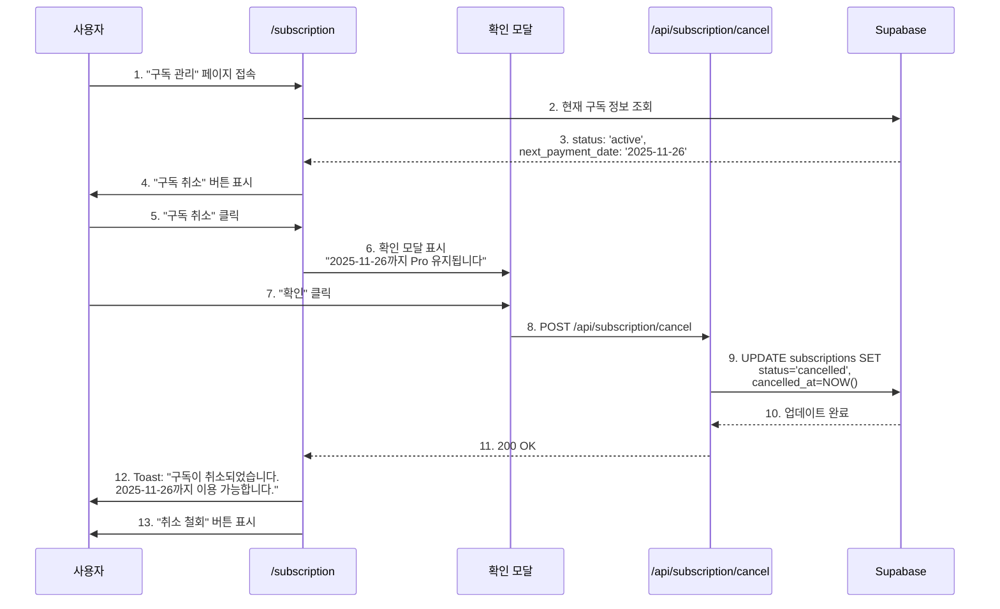

**입력:**
- 위치: `/subscription` 구독 관리 페이지
- 액션: "구독 취소" 버튼 클릭 → 확인 모달 → "확인" 클릭

**처리:**
```sql
UPDATE subscriptions
SET
  status = 'cancelled',
  cancelled_at = NOW(),
  updated_at = NOW()
WHERE user_id = 'user_2abc123xyz'
  AND status = 'active';
```

**출력:**
- UI 변경: "구독 취소" 버튼 → "취소 철회" 버튼으로 변경
- 안내 문구: "구독이 취소 예정입니다. 2025-11-26까지 Pro 혜택이 유지됩니다."
- 데이터 변경:
  - `status`: 'active' → 'cancelled'
  - `cancelled_at`: 2025-10-26 15:30:00

### 5.2 구독 재활성화 플로우

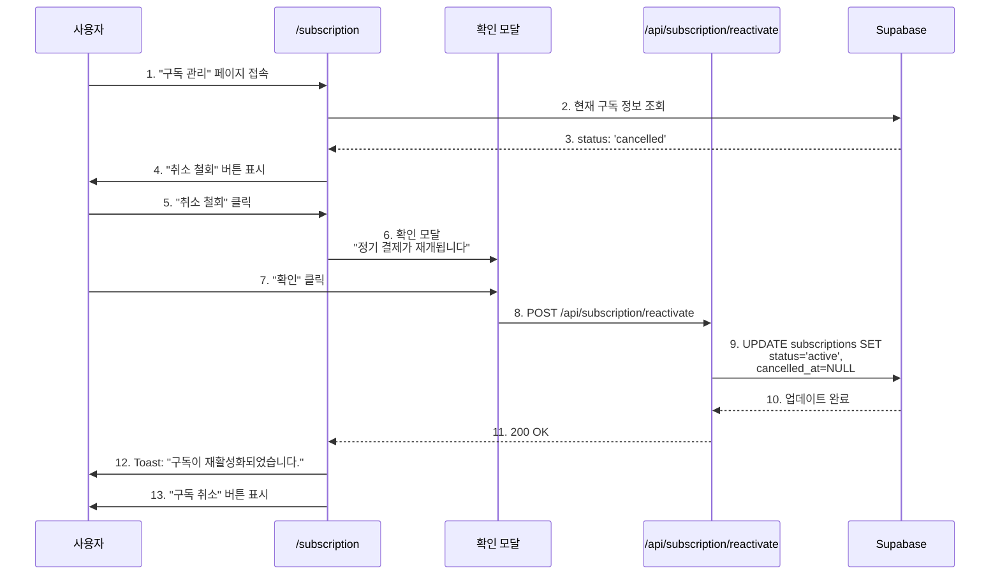

**입력:**
- 위치: `/subscription` 구독 관리 페이지
- 액션: "취소 철회" 버튼 클릭 → 확인 모달 → "확인" 클릭
- 조건: `status === 'cancelled'` AND `next_payment_date > TODAY()`

**처리:**
```sql
UPDATE subscriptions
SET
  status = 'active',
  cancelled_at = NULL,
  updated_at = NOW()
WHERE user_id = 'user_2abc123xyz'
  AND status = 'cancelled'
  AND next_payment_date > CURRENT_DATE;
```

**출력:**
- UI 변경: "취소 철회" 버튼 → "구독 취소" 버튼으로 변경
- 안내 문구: "Pro 구독이 활성 상태입니다."
- 데이터 변경:
  - `status`: 'cancelled' → 'active'
  - `cancelled_at`: NULL

### 5.3 엣지 케이스

**EC-01: 결제일 이후 취소 철회 시도**
- 문제: `next_payment_date` 지난 후 재활성화 시도
- 감지: SQL 조건 `next_payment_date > CURRENT_DATE` 실패
- 대응:
  1. 에러 응답: "구독 기간이 만료되어 재활성화할 수 없습니다."
  2. "새로 구독하기" 버튼 표시

**EC-02: 이미 해지된 구독 취소 시도**
- 문제: `status === 'terminated'` 상태에서 취소 시도
- 감지: API에서 `status !== 'active'` 확인
- 대응:
  1. 에러 응답: "이미 해지된 구독입니다."

**EC-03: 무료 사용자 취소 시도**
- 문제: `plan_type === 'free'` 사용자가 취소 시도
- 감지: API에서 `plan_type !== 'pro'` 확인
- 대응:
  1. 에러 응답: "구독 중인 플랜이 없습니다."

---

## 6. UF-05: 정기 결제 자동화 (Cron)

### 6.1 플로우 다이어그램

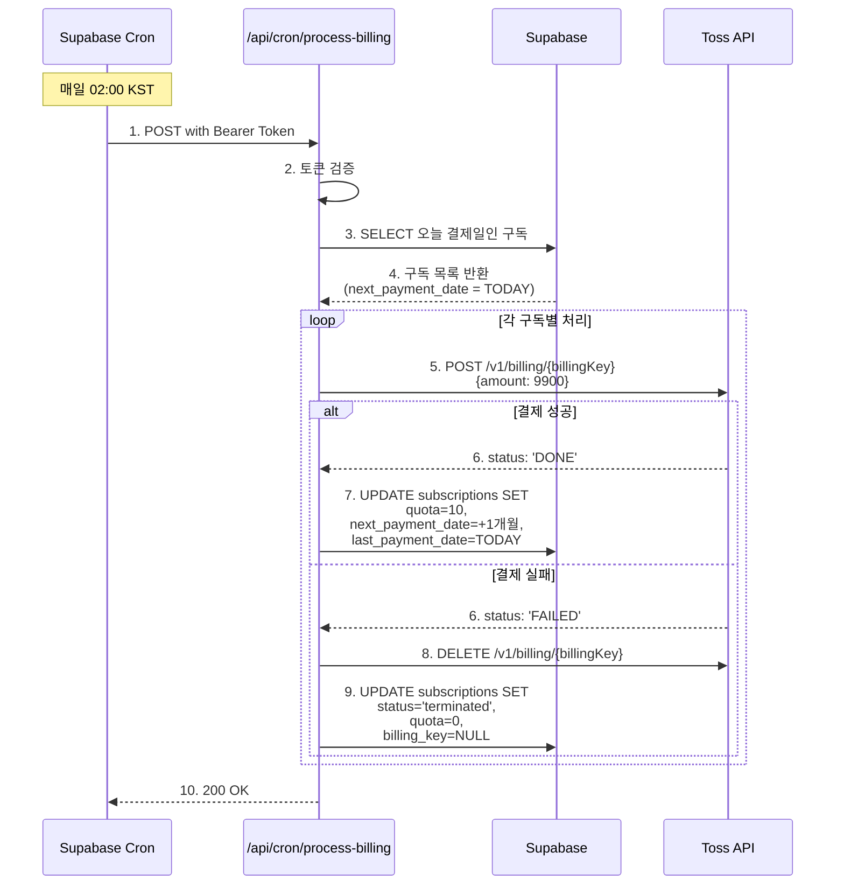

### 6.2 입력 (Input)

**시스템 입력:**
- 트리거: Supabase Cron (매일 02:00 KST = UTC 17:00 전날)
- 인증: Bearer Token (`CRON_SECRET_TOKEN`)
- 처리 대상:
  ```sql
  SELECT * FROM subscriptions
  WHERE status = 'active'
    AND plan_type = 'pro'
    AND next_payment_date = CURRENT_DATE;
  ```

### 6.3 처리 (Processing)

**Step 1: 인증 확인**
```typescript
const authHeader = req.headers.get('authorization');
const token = authHeader?.replace('Bearer ', '');

if (token !== process.env.CRON_SECRET_TOKEN) {
  return new Response('Unauthorized', { status: 401 });
}
```

**Step 2: 결제 대상 조회**
```sql
SELECT
  id,
  user_id,
  billing_key,
  next_payment_date
FROM subscriptions
WHERE status = 'active'
  AND plan_type = 'pro'
  AND next_payment_date = CURRENT_DATE;
```

**Step 3: 각 구독별 결제 처리**
- 토스 API 호출하여 결제 시도
- 결제 성공: 쿼터 리셋, 다음 결제일 설정
- 결제 실패: 구독 해지, BillingKey 삭제

### 6.4 출력 (Output)

**성공 케이스:**
- DB 변경:
  - `quota`: 0 → 10 (리셋)
  - `next_payment_date`: 2025-10-26 → 2025-11-26
  - `last_payment_date`: 2025-10-26
- 사용자 알림 (선택사항): 이메일 "Pro 구독이 갱신되었습니다. (9,900원 결제 완료)"

**실패 케이스:**
- DB 변경:
  - `status`: 'active' → 'terminated'
  - `quota`: 5 → 0
  - `billing_key`: 'billing_abc' → NULL
- 사용자 알림: 이메일 "결제에 실패하여 구독이 해지되었습니다. 카드 정보를 확인해주세요."

### 6.5 엣지 케이스

**EC-01: Cron 중복 실행**
- 문제: Supabase Cron이 실수로 2회 실행
- 감지: `next_payment_date = CURRENT_DATE` 조건으로 필터링
- 대응: 이미 결제된 구독은 `next_payment_date`가 다음 달로 변경되어 쿼리에서 제외

**EC-02: Toss API 타임아웃**
- 문제: 토스 API 응답이 30초 이상 지연
- 감지: `fetch` 타임아웃
- 대응: 해당 구독 건너뛰기 (다음 날 재시도), 로그 기록

**EC-03: 부분 실패 (일부 구독만 결제 성공)**
- 문제: 10건 중 7건 성공, 3건 실패
- 감지: 각 구독은 독립적으로 처리
- 대응: 성공한 7건은 쿼터 리셋, 실패한 3건은 해지 처리, 전체 프로세스는 성공으로 간주

**EC-04: Cron 인증 실패**
- 문제: `CRON_SECRET_TOKEN` 불일치
- 감지: API에서 401 반환
- 대응: Cron은 재시도하지 않음, 관리자 알림 발송

---

## 7. UF-06: 분석 이력 조회

### 7.1 대시보드 최근 분석 표시

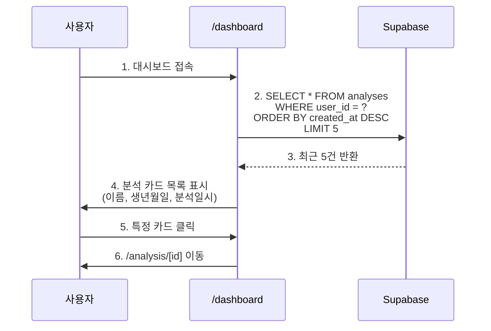

### 7.2 분석 상세보기

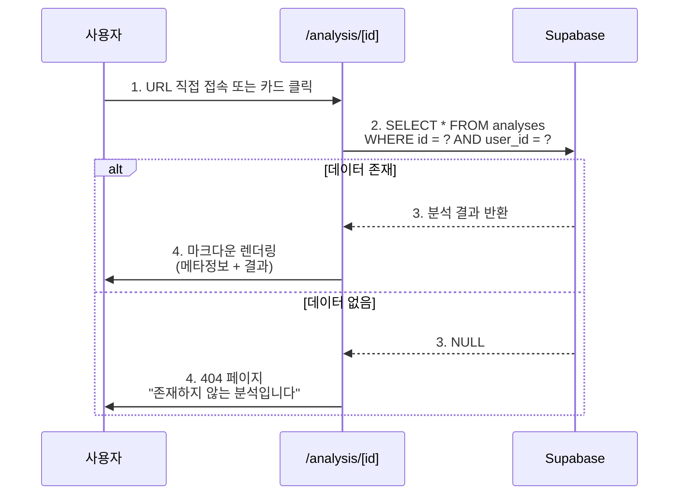

### 7.3 권한 제어

**RLS (Row Level Security) 정책:**
```sql
CREATE POLICY "Users can only view their own analyses"
ON analyses
FOR SELECT
USING (auth.uid() = user_id);
```

### 7.4 엣지 케이스

**EC-01: 다른 사용자 분석 조회 시도**
- 문제: 사용자 A가 사용자 B의 분석 ID로 접근
- 감지: RLS 정책으로 차단
- 대응: 쿼리 결과 빈 배열 반환, 404 페이지 표시

**EC-02: 유효하지 않은 UUID**
- 문제: `/analysis/invalid-id` 접근
- 감지: UUID 형식 검증 실패
- 대응: 400 Bad Request, 메시지 "잘못된 요청입니다."

---

## 8. UF-07: 회원 탈퇴

### 8.1 플로우 다이어그램

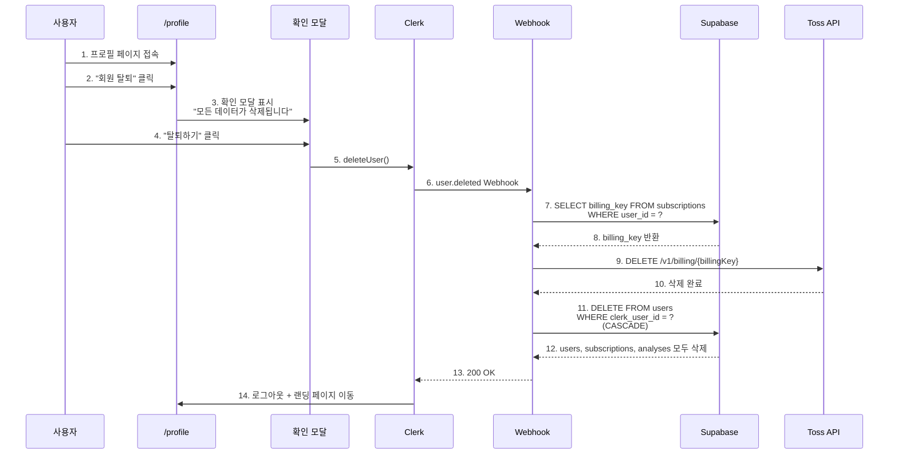

### 8.2 입력 (Input)

**UI 상호작용:**
- 위치: `/profile` 프로필 페이지
- 액션: "회원 탈퇴" → 확인 모달 → "탈퇴하기" 클릭

### 8.3 처리 (Processing)

**Step 1: Clerk 사용자 삭제**
```typescript
await clerkClient.users.deleteUser(userId);
```

**Step 2: Webhook 처리**
```typescript
if (eventType === 'user.deleted') {
  const { id } = evt.data;

  // BillingKey 조회
  const { data: sub } = await supabase
    .from('subscriptions')
    .select('billing_key')
    .eq('user_id', id)
    .single();

  // Toss BillingKey 삭제
  if (sub?.billing_key) {
    await fetch(
      `https://api.tosspayments.com/v1/billing/${sub.billing_key}`,
      {
        method: 'DELETE',
        headers: {
          'Authorization': `Basic ${Buffer.from(TOSS_SECRET_KEY + ':').toString('base64')}`,
        },
      }
    );
  }

  // Supabase 사용자 삭제 (CASCADE)
  await supabase
    .from('users')
    .delete()
    .eq('clerk_user_id', id);
}
```

**Step 3: CASCADE DELETE**
```sql
-- users 테이블 삭제 시 자동으로 연쇄 삭제
DELETE FROM users WHERE clerk_user_id = 'user_2abc123xyz';

-- 자동 삭제되는 테이블:
-- 1. subscriptions (ON DELETE CASCADE)
-- 2. analyses (ON DELETE CASCADE)
```

### 8.4 출력 (Output)

**성공 시:**
- 로그아웃 처리
- 랜딩 페이지로 리다이렉트
- Toast: "회원 탈퇴가 완료되었습니다."

**데이터 변경:**
- users 테이블: 레코드 삭제
- subscriptions 테이블: 레코드 삭제 (CASCADE)
- analyses 테이블: 모든 분석 이력 삭제 (CASCADE)
- Toss BillingKey: 삭제

**사이드이펙트:**
- Clerk 계정 영구 삭제
- 모든 개인정보 삭제 (GDPR 준수)

### 8.5 엣지 케이스

**EC-01: BillingKey 삭제 실패**
- 문제: Toss API 장애로 BillingKey 삭제 실패
- 감지: Toss API 응답 500 에러
- 대응: Webhook은 성공으로 처리 (사용자 데이터는 삭제), 관리자에게 수동 삭제 요청 알림

**EC-02: Webhook 재시도**
- 문제: Webhook 처리 실패 후 Clerk가 재시도
- 감지: `users` 테이블에 이미 레코드 없음
- 대응: `DELETE` 쿼리 실행 (영향받은 행 0), 200 OK 반환 (멱등성 보장)

---

## 9. 공통 에러 처리

### 9.1 네트워크 에러

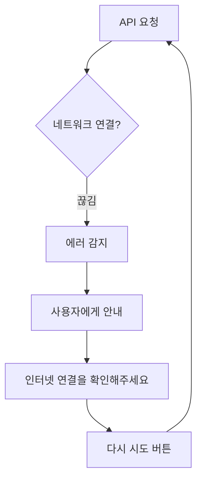

**처리 방식:**
- 사용자 친화적 메시지
- 자동 재시도 (최대 3회)
- 실패 시 수동 재시도 버튼

### 9.2 인증 에러

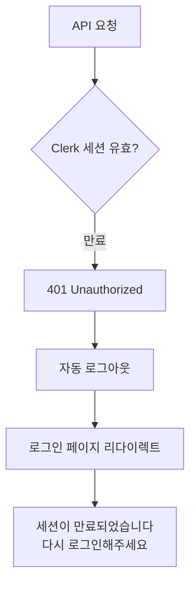

**처리 방식:**
- 세션 만료 시 자동 로그아웃
- 로그인 페이지로 리다이렉트
- 원래 페이지 URL 저장 (로그인 후 복귀)

### 9.3 권한 에러

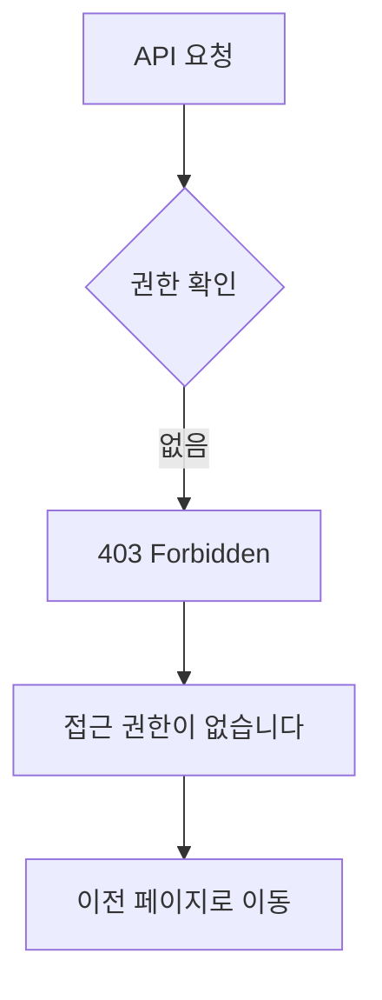

### 9.4 서버 에러

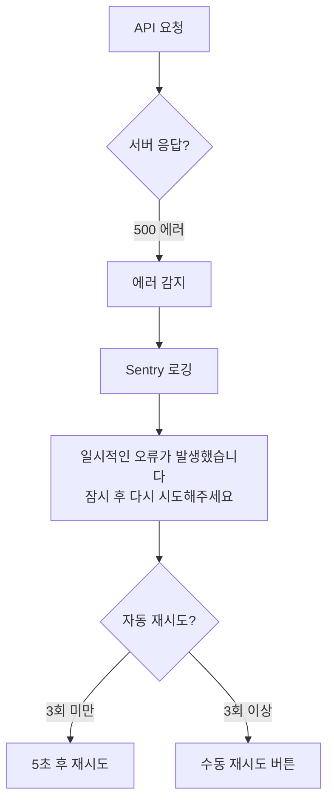

### 9.5 결제 에러

| 에러 코드 | 원인 | 사용자 메시지 | 대응 방안 |
|----------|------|-------------|----------|
| `CARD_EXPIRED` | 카드 만료 | "카드 유효기간이 만료되었습니다. 새 카드를 등록해주세요." | 카드 재등록 유도 |
| `INSUFFICIENT_FUNDS` | 잔액 부족 | "카드 잔액이 부족합니다." | 다른 카드 사용 유도 |
| `INVALID_CARD` | 잘못된 카드 정보 | "카드 정보를 확인해주세요." | 입력 정보 재확인 |
| `PAYMENT_DENIED` | 카드사 거부 | "카드사에서 결제를 거부했습니다. 카드사에 문의해주세요." | 고객센터 안내 |

---

## 10. 상태 다이어그램

### 10.1 구독 상태 머신

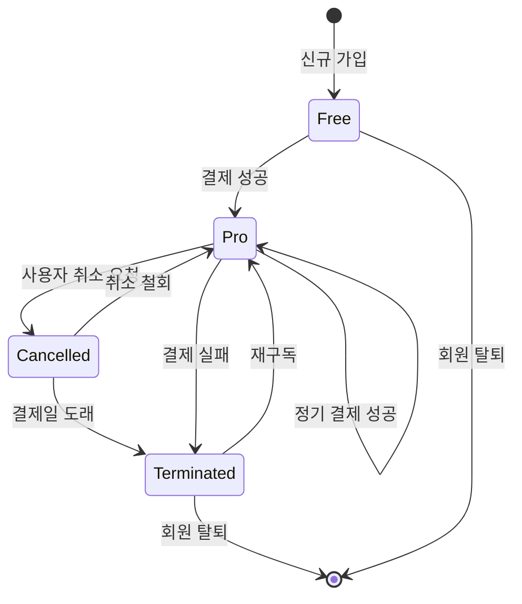

**상태 설명:**
- **Free**: 무료 사용자 (quota: 3)
- **Pro**: 활성 구독자 (quota: 10)
- **Cancelled**: 취소 예약 (결제일까지 Pro 유지)
- **Terminated**: 해지 상태 (quota: 0, BillingKey 삭제)

### 10.2 분석 요청 상태

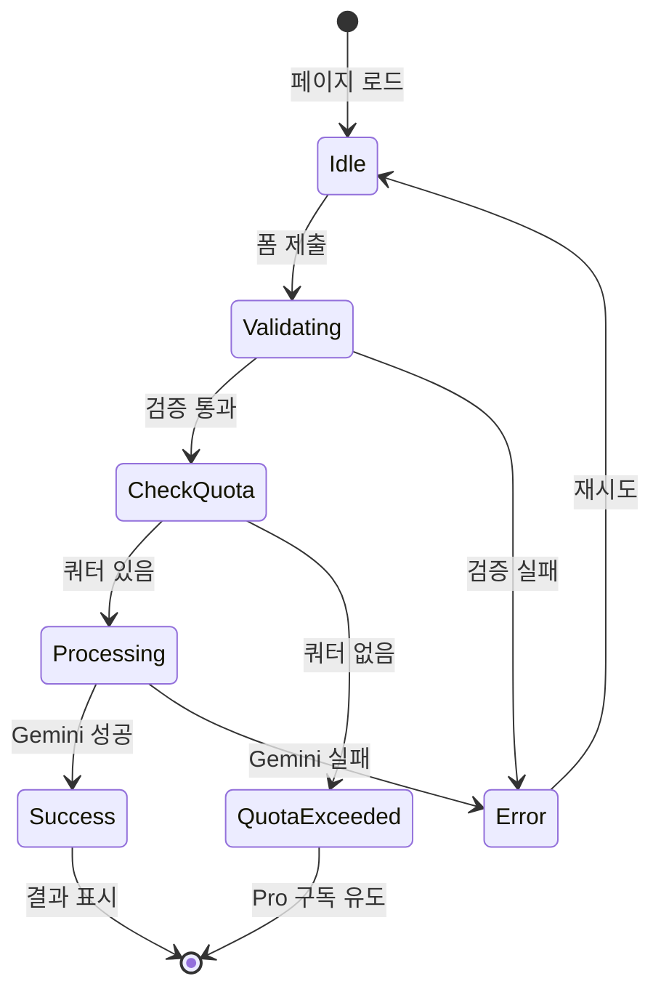

---

## 11. 정리

본 문서는 구독제 사주분석 서비스의 모든 사용자 플로우를 **입력-처리-출력** 구조로 상세히 정의했습니다.

### 11.1 핵심 플로우 요약

| 플로우 ID | 플로우명 | 핵심 페이지 | 중요도 |
|----------|---------|----------|--------|
| UF-01 | 신규 사용자 가입 | `/` → `/dashboard` | P0 |
| UF-02 | Pro 구독 전환 | `/subscription` | P0 |
| UF-03 | 사주 분석 이용 | `/analysis/new` | P0 |
| UF-04 | 구독 취소/재활성화 | `/subscription` | P0 |
| UF-05 | 정기 결제 자동화 | Cron → API | P0 |
| UF-06 | 분석 이력 조회 | `/dashboard`, `/analysis/[id]` | P1 |
| UF-07 | 회원 탈퇴 | `/profile` | P1 |

### 11.2 구현 시 주의사항

1. **Clerk Webhook**: 배포 환경에서만 작동 (로컬 테스트 시 ngrok 필요)
2. **쿼터 동시성**: 트랜잭션으로 Race Condition 방지
3. **결제 실패 처리**: BillingKey 즉시 삭제 (재시도 없음)
4. **Cron 멱등성**: 중복 실행 시에도 안전하게 처리
5. **에러 로깅**: Sentry 등으로 모든 API 에러 추적

---

**문서 버전**: 2.0
**최종 수정일**: 2025-10-26
**승인 상태**: Draft
