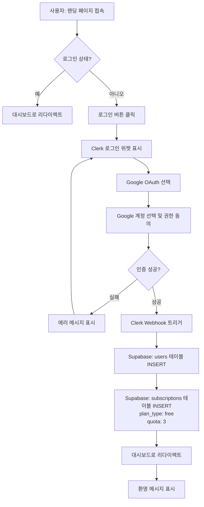
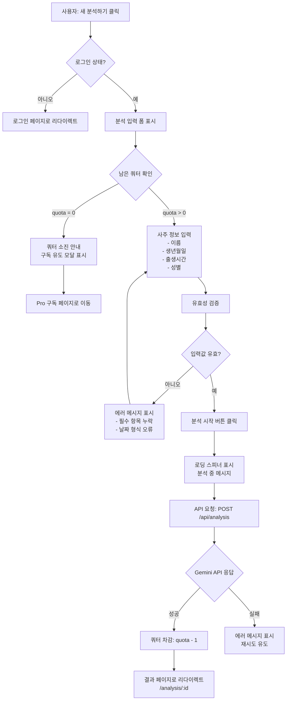
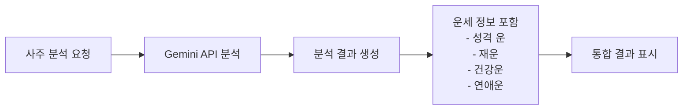
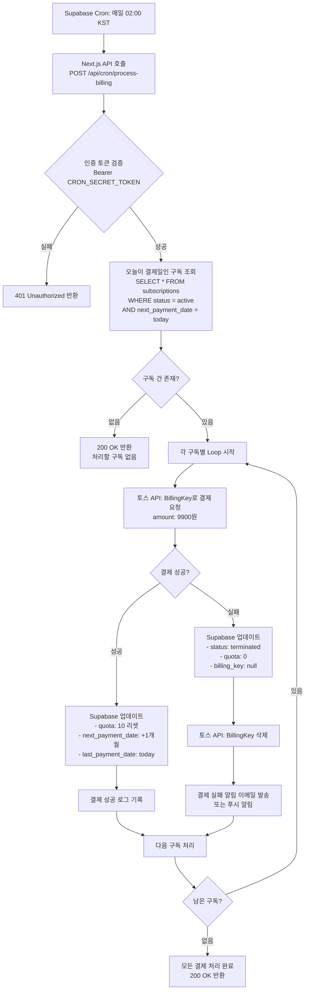
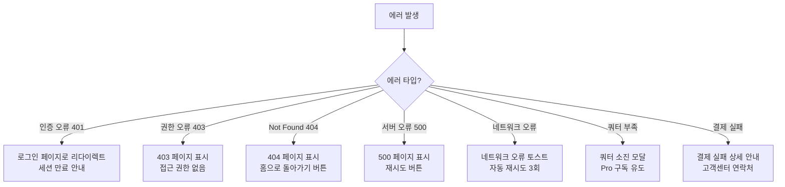

# 사주풀이 서비스 사용자 플로우 (User Flow)

본 문서는 구독제 사주분석 서비스의 주요 사용자 플로우를 정의합니다.

---

## 1. 회원가입 및 로그인 플로우

### Entry Point
- 사용자가 랜딩 페이지(`/`) 방문
- 로그인이 필요한 페이지 접근 시도 (예: `/dashboard`, `/analysis/new`)

### 플로우



### 시스템 응답

**성공 시**:
1. Clerk 세션 생성 및 JWT 발급
2. Clerk Webhook → Supabase 사용자 데이터 동기화
3. 무료 쿼터 3회 자동 할당
4. 대시보드(`/dashboard`)로 리다이렉트
5. 환영 메시지 토스트 표시

**실패 시**:
1. Google OAuth 인증 오류 → 에러 메시지 표시 및 재시도 유도
2. Webhook 동기화 실패 → 로그 기록 후 관리자 알림 (사용자는 정상 진입)

### 예외 처리

| 예외 상황 | 처리 방법 |
|----------|----------|
| Google 계정 권한 거부 | "로그인이 취소되었습니다" 메시지 표시, 로그인 화면 유지 |
| Clerk API 응답 지연 | 로딩 스피너 표시 (최대 10초), 타임아웃 시 재시도 유도 |
| Webhook 실패 | 백그라운드 재시도 (3회), 실패 시 관리자 알림 |
| 중복 가입 시도 | "이미 가입된 계정입니다" 메시지, 로그인 페이지로 유도 |

### Exit Point
- 대시보드(`/dashboard`) 페이지 진입 완료

---

## 2. 사주 입력 플로우 (생년월일시 입력)

### Entry Point
- 대시보드에서 "새 분석하기" 버튼 클릭
- URL 직접 접근: `/analysis/new`

### 플로우



### 시스템 응답

**성공 시**:
1. Gemini API 호출 (모델: Free → `gemini-2.5-flash`, Pro → `gemini-2.5-pro`)
2. 분석 결과를 `analyses` 테이블에 INSERT
3. 쿼터 차감 (`subscriptions.quota - 1`)
4. 분석 결과 상세 페이지로 리다이렉트
5. "분석이 완료되었습니다" 토스트 메시지

**실패 시**:
1. Gemini API 오류 → "분석 중 오류가 발생했습니다. 잠시 후 다시 시도해주세요"
2. 쿼터 차감 실패 → 트랜잭션 롤백, 에러 로그 기록
3. 네트워크 타임아웃 → 재시도 버튼 제공

### 입력 필드 유효성 규칙

| 필드 | 필수 여부 | 검증 규칙 | 에러 메시지 |
|------|----------|----------|-----------|
| 이름 | 필수 | 1-20자 한글/영문 | "이름을 입력해주세요" |
| 생년월일 | 필수 | YYYY-MM-DD 형식, 1900-현재 범위 | "올바른 생년월일을 입력해주세요" |
| 출생시간 | 선택 | HH:MM 형식 (00:00-23:59) | "올바른 시간 형식을 입력해주세요" |
| 성별 | 필수 | 'male' 또는 'female' | "성별을 선택해주세요" |

### 예외 처리

| 예외 상황 | 처리 방법 |
|----------|----------|
| 쿼터 0회 상태에서 접근 | 분석 불가 안내 모달 표시, "Pro 구독하기" 버튼 제공 |
| Gemini API Rate Limit | "서버가 혼잡합니다. 잠시 후 다시 시도해주세요" 안내 |
| API 응답 지연 (30초+) | 타임아웃 처리, 재시도 버튼 제공 |
| 중복 분석 방지 | 동일 정보로 1분 이내 재분석 시 경고 메시지 (선택적 차단) |

### Exit Point
- 분석 결과 상세 페이지(`/analysis/:id`) 진입
- 또는 쿼터 소진 시 구독 페이지로 이동

---

## 3. 사주 분석 결과 조회 플로우

### Entry Point
- 대시보드에서 과거 분석 이력 클릭
- URL 직접 접근: `/analysis/:id`
- 새 분석 완료 후 자동 리다이렉트

### 플로우

```mermaid
flowchart TD
    A[사용자: 분석 이력 클릭] --> B{로그인 상태?}
    B -->|아니오| C[로그인 페이지로 리다이렉트]
    B -->|예| D[분석 ID로 데이터 조회<br>SELECT * FROM analyses WHERE id = :id]
    D --> E{분석 데이터 존재?}
    E -->|아니오| F[404 페이지 표시<br>"존재하지 않는 분석입니다"]
    E -->|예| G{본인 소유 확인<br>user_id = clerk_user_id?}
    G -->|아니오| H[403 페이지 표시<br>"접근 권한이 없습니다"]
    G -->|예| I[분석 결과 렌더링]
    I --> J[마크다운 → HTML 변환]
    J --> K[분석 정보 표시<br>- 이름, 생년월일시, 성별<br>- 사용 모델 gemini-2.5-flash or pro<br>- 분석 일시]
    K --> L[분석 결과 본문 표시<br>- 천간/지지<br>- 오행 분석<br>- 대운/세운<br>- 성격/재운/건강/연애운]
    L --> M[액션 버튼 표시<br>- 목록으로<br>- 공유하기 선택<br>- 삭제하기 선택]
```

### 시스템 응답

**성공 시**:
1. Supabase에서 분석 데이터 조회
2. Markdown → HTML 변환 (마크다운 파서 사용)
3. 분석 결과 UI 렌더링
4. 메타데이터 표시 (분석 일시, 사용 모델)

**실패 시**:
1. 분석 ID 없음 → 404 페이지
2. 권한 없음 → 403 페이지
3. DB 조회 오류 → 500 에러 페이지 또는 재시도 버튼

### 분석 결과 구성 요소

| 섹션 | 내용 | 표시 형식 |
|------|------|----------|
| 헤더 | 분석 대상 정보 | 카드 형태 (이름, 생년월일, 성별, 분석일) |
| 천간/지지 | 사주팔자 기본 구조 | 표 형태 또는 시각화 |
| 오행 분석 | 목/화/토/금/수 균형 | 막대 그래프 또는 텍스트 |
| 대운/세운 | 운세 흐름 해석 | 마크다운 텍스트 |
| 종합 운세 | 성격, 재운, 건강, 연애 | 마크다운 텍스트 (섹션별 구분) |
| 메타데이터 | 사용 모델, 분석 일시 | 푸터 영역 |

### 예외 처리

| 예외 상황 | 처리 방법 |
|----------|----------|
| 잘못된 ID 형식 | "올바르지 않은 분석 ID입니다" 메시지, 대시보드로 이동 버튼 |
| 타인의 분석 접근 시도 | 403 에러 페이지, "접근 권한이 없습니다" 안내 |
| 마크다운 파싱 오류 | 원본 텍스트 표시 + 관리자 알림 |
| DB 연결 오류 | "일시적인 오류입니다" 안내, 재시도 버튼 제공 |

### Exit Point
- 분석 결과 페이지 표시 완료
- 또는 목록/대시보드로 이동

---

## 4. 운세 조회 플로우

> **참고**: 본 서비스는 "사주 분석" 단일 기능 제공으로, 별도의 "운세 조회" 기능은 없습니다.
> 운세 정보는 사주 분석 결과에 포함되어 제공됩니다.

### 통합 플로우
사주 분석 결과 내에서 다음 운세 정보가 자동 포함됩니다:



### Entry Point
- 사주 분석 결과 페이지(`/analysis/:id`)에서 자동 표시

### 운세 정보 구성

| 운세 유형 | 포함 내용 | 표시 위치 |
|----------|----------|----------|
| 성격 운 | 타고난 성격, 성향 분석 | 분석 결과 본문 섹션 1 |
| 재운 | 재물 운, 경제적 성향 | 분석 결과 본문 섹션 2 |
| 건강운 | 건강 주의사항, 체질 분석 | 분석 결과 본문 섹션 3 |
| 연애운 | 연애 성향, 인간관계 | 분석 결과 본문 섹션 4 |

### Exit Point
- 분석 결과 페이지 내에서 통합 제공

---

## 5. 히스토리/저장된 사주 조회 플로우

### Entry Point
- 대시보드(`/dashboard`) 접속
- 네비게이션에서 "내 분석 이력" 메뉴 클릭

### 플로우

```mermaid
flowchart TD
    A[사용자: 대시보드 접속] --> B{로그인 상태?}
    B -->|아니오| C[로그인 페이지로 리다이렉트]
    B -->|예| D[분석 이력 조회<br>SELECT * FROM analyses<br>WHERE user_id = :userId<br>ORDER BY created_at DESC]
    D --> E{분석 이력 존재?}
    E -->|아니오| F[빈 상태 UI 표시<br>"아직 분석 이력이 없습니다"<br>새 분석하기 버튼]
    E -->|예| G[분석 목록 렌더링<br>- 카드 또는 테이블 형태]
    G --> H[각 항목 정보 표시<br>- 이름<br>- 생년월일<br>- 분석 일시<br>- 사용 모델]
    H --> I{사용자 액션}
    I -->|상세보기 클릭| J[/analysis/:id로 이동]
    I -->|삭제 클릭| K[삭제 확인 모달 표시]
    K --> L{확인?}
    L -->|취소| H
    L -->|확인| M[DELETE FROM analyses<br>WHERE id = :id]
    M --> N[목록 새로고침<br>삭제 완료 토스트]
    I -->|필터/정렬| O[클라이언트 측 필터링<br>- 날짜순<br>- 이름순]
    O --> H
```

### 시스템 응답

**성공 시**:
1. 사용자의 모든 분석 이력 조회 (최신순 정렬)
2. 페이지네이션 적용 (10개/페이지) 또는 무한 스크롤
3. 각 항목 카드 형태로 표시
4. 클릭 시 상세 페이지로 이동

**실패 시**:
1. DB 조회 오류 → "데이터를 불러올 수 없습니다" 안내, 재시도 버튼
2. 네트워크 오류 → 로딩 스피너 유지 후 타임아웃 처리

### 목록 화면 구성

| 요소 | 내용 | 액션 |
|------|------|------|
| 헤더 | "내 분석 이력" 제목, 새 분석하기 버튼 | 버튼 클릭 → `/analysis/new` |
| 필터/정렬 | 날짜순, 이름순 정렬 옵션 | 클라이언트 측 정렬 |
| 분석 카드 | 이름, 생년월일, 분석일, 모델 표시 | 클릭 → 상세 페이지 |
| 삭제 버튼 | 각 카드에 삭제 아이콘 | 확인 모달 후 삭제 |
| 빈 상태 | 이력 없을 때 안내 메시지 | 새 분석 유도 |

### 예외 처리

| 예외 상황 | 처리 방법 |
|----------|----------|
| 이력 없음 | 빈 상태 UI 표시, "첫 분석을 시작해보세요" 안내 |
| 삭제 실패 | "삭제 중 오류가 발생했습니다" 토스트, 재시도 유도 |
| 페이지네이션 오류 | 첫 페이지로 리셋, 에러 로그 기록 |
| 동시 삭제 요청 | 낙관적 업데이트 후 서버 응답 기반 롤백 |

### Exit Point
- 대시보드 목록 화면 표시 완료
- 또는 상세 페이지로 이동

---

## 6. 프로필 관리 플로우

### Entry Point
- 네비게이션에서 프로필 아이콘 클릭
- URL 직접 접근: Clerk 제공 페이지 활용

### 플로우

```mermaid
flowchart TD
    A[사용자: 프로필 아이콘 클릭] --> B{로그인 상태?}
    B -->|아니오| C[로그인 페이지로 리다이렉트]
    B -->|예| D[Clerk UserProfile 컴포넌트 표시]
    D --> E[프로필 정보 조회<br>- 이름<br>- 이메일<br>- 프로필 사진]
    E --> F{사용자 액션}
    F -->|정보 수정| G[Clerk UI에서 수정]
    G --> H[Clerk API 업데이트]
    H --> I[Webhook: user.updated 트리거]
    I --> J[Supabase users 테이블 동기화]
    J --> K[수정 완료 토스트 표시]
    K --> E
    F -->|비밀번호 변경| L[Clerk 비밀번호 변경 UI<br>Google OAuth는 해당 없음]
    F -->|계정 삭제| M[삭제 확인 모달 표시<br>"모든 데이터가 삭제됩니다"]
    M --> N{확인?}
    N -->|취소| E
    N -->|확인| O[Clerk 계정 삭제 요청]
    O --> P[Webhook: user.deleted 트리거]
    P --> Q[Supabase CASCADE DELETE<br>- users<br>- subscriptions<br>- analyses]
    Q --> R[로그아웃 처리]
    R --> S[랜딩 페이지로 리다이렉트<br>탈퇴 완료 메시지]
```

### 시스템 응답

**정보 수정 성공 시**:
1. Clerk에서 사용자 정보 업데이트
2. Webhook을 통해 Supabase `users` 테이블 동기화
3. "프로필이 업데이트되었습니다" 토스트 메시지
4. UI 즉시 반영

**계정 삭제 성공 시**:
1. Clerk 계정 삭제 요청
2. Webhook → Supabase CASCADE DELETE 실행
3. 세션 무효화 및 로그아웃
4. 랜딩 페이지로 리다이렉트
5. "계정이 삭제되었습니다" 메시지

**실패 시**:
1. Clerk API 오류 → "수정 중 오류가 발생했습니다" 안내
2. Webhook 동기화 실패 → 백그라운드 재시도, 사용자는 정상 진행
3. 네트워크 오류 → 재시도 버튼 제공

### 관리 가능 항목

| 항목 | 수정 가능 여부 | 비고 |
|------|-------------|------|
| 이름 (First/Last Name) | ✅ | Clerk UI 제공 |
| 이메일 주소 | ✅ | 인증 메일 확인 필요 |
| 프로필 사진 | ✅ | Clerk UI 제공 |
| 비밀번호 | ❌ | Google OAuth 사용 시 해당 없음 |
| Google 연동 해제 | ✅ | Clerk UI 제공 |
| 계정 삭제 | ✅ | 확인 모달 필수 |

### 예외 처리

| 예외 상황 | 처리 방법 |
|----------|----------|
| 이메일 중복 | Clerk에서 자동 검증, "이미 사용 중인 이메일입니다" 안내 |
| 계정 삭제 실패 | "삭제 중 오류가 발생했습니다" 안내, 고객 지원 안내 |
| Webhook 지연 | 사용자는 정상 진행, 백그라운드 동기화 |
| 동시 수정 요청 | Clerk에서 낙관적 업데이트 후 서버 응답 기반 조정 |

### Exit Point
- 프로필 페이지 유지 (수정 완료)
- 또는 랜딩 페이지로 이동 (계정 삭제)

---

## 7. Pro 구독 플로우

### Entry Point
- 쿼터 소진 후 "구독하기" 버튼 클릭
- 네비게이션에서 "구독 관리" 메뉴 클릭
- URL 직접 접근: `/subscription`

### 플로우

```mermaid
flowchart TD
    A[사용자: 구독 페이지 접속] --> B{로그인 상태?}
    B -->|아니오| C[로그인 페이지로 리다이렉트]
    B -->|예| D[현재 구독 상태 조회<br>SELECT * FROM subscriptions<br>WHERE user_id = :userId]
    D --> E{구독 상태?}
    E -->|Free| F[Pro 플랜 소개<br>- 월 10회 분석<br>- Gemini Pro 모델<br>- 월 9,900원]
    F --> G[구독하기 버튼 클릭]
    G --> H[토스페이먼츠 위젯 로드]
    H --> I[결제 정보 입력<br>- 카드 번호<br>- 유효기간<br>- CVC]
    I --> J[약관 동의 체크]
    J --> K[결제 진행 클릭]
    K --> L[토스 서버: BillingKey 발급]
    L --> M{첫 결제 성공?}
    M -->|실패| N[에러 메시지 표시<br>재시도 유도]
    M -->|성공| O[API: POST /api/payments/subscribe]
    O --> P[Supabase 업데이트<br>- billing_key 저장<br>- plan_type: pro<br>- quota: 10<br>- status: active<br>- next_payment_date: +1개월]
    P --> Q[구독 완료 페이지 표시<br>축하 메시지]

    E -->|Pro Active| R[구독 정보 표시<br>- 다음 결제일<br>- 남은 횟수<br>- 결제 금액]
    R --> S{사용자 액션}
    S -->|구독 취소| T[취소 확인 모달<br>"다음 결제일까지 유지됩니다"]
    T --> U{확인?}
    U -->|취소| R
    U -->|확인| V[API: POST /api/subscription/cancel]
    V --> W[status: cancelled<br>cancelled_at 기록]
    W --> X[취소 완료 안내<br>next_payment_date까지 사용 가능]

    E -->|Pro Cancelled| Y[취소된 구독 정보 표시<br>- 종료 예정일<br>- 남은 횟수]
    Y --> Z{사용자 액션}
    Z -->|재활성화| AA[API: POST /api/subscription/reactivate]
    AA --> AB[status: active<br>cancelled_at: null]
    AB --> AC[재활성화 완료 안내]
    Z -->|해지하기| AD[즉시 해지 확인 모달<br>"BillingKey가 삭제됩니다"]
    AD --> AE{확인?}
    AE -->|취소| Y
    AE -->|확인| AF[API: POST /api/subscription/terminate]
    AF --> AG[토스 API: BillingKey 삭제]
    AG --> AH[status: terminated<br>quota: 0]
    AH --> AI[해지 완료 안내]
```

### 시스템 응답

**구독 성공 시**:
1. 토스페이먼츠에서 BillingKey 발급 및 첫 결제 (9,900원)
2. Supabase `subscriptions` 테이블 업데이트
   - `plan_type: 'pro'`
   - `quota: 10`
   - `status: 'active'`
   - `next_payment_date: 현재일 + 1개월`
3. "Pro 구독이 완료되었습니다!" 토스트 메시지
4. 대시보드로 리다이렉트

**구독 취소 시**:
1. `status: 'cancelled'` 업데이트
2. `cancelled_at` 현재 시간 기록
3. BillingKey는 유지 (재활성화 가능)
4. 다음 결제일까지 Pro 기능 유지
5. "구독이 취소되었습니다. [날짜]까지 사용 가능합니다" 안내

**재활성화 시**:
1. `status: 'active'` 복원
2. `cancelled_at: null`
3. 기존 BillingKey로 다음 결제일에 자동 결제
4. "구독이 재활성화되었습니다" 토스트

**해지 시**:
1. 토스페이먼츠 API로 BillingKey 삭제
2. `status: 'terminated'`, `quota: 0`
3. "구독이 해지되었습니다" 안내
4. 재구독 시 새로운 BillingKey 필요

### 구독 상태별 화면 구성

| 상태 | 표시 정보 | 액션 버튼 |
|------|----------|----------|
| Free | "무료 플랜 (3회)", 남은 횟수 | "Pro 구독하기" |
| Pro Active | 다음 결제일, 남은 횟수, 결제 금액 | "구독 취소" |
| Pro Cancelled | 종료 예정일, 남은 횟수 | "재활성화", "즉시 해지" |
| Terminated | "구독이 해지되었습니다" | "다시 구독하기" |

### 예외 처리

| 예외 상황 | 처리 방법 |
|----------|----------|
| 결제 실패 (카드 오류) | 토스 에러 메시지 표시, 카드 정보 재입력 유도 |
| BillingKey 발급 실패 | "결제 수단 등록에 실패했습니다" 안내, 고객센터 연락 안내 |
| 중복 구독 시도 | "이미 Pro 구독 중입니다" 안내, 구독 정보 페이지로 이동 |
| 재활성화 기간 초과 | "결제일이 지나 재활성화할 수 없습니다" 안내, 재구독 유도 |
| BillingKey 삭제 실패 | 로그 기록 후 관리자 수동 처리, 사용자에게는 완료 안내 |

### Exit Point
- 구독 관리 페이지 유지
- 또는 대시보드로 이동

---

## 8. 정기 결제 자동화 플로우 (시스템 내부)

### Entry Point
- Supabase Cron: 매일 UTC 17:00 (KST 02:00) 트리거

### 플로우



### 시스템 처리 로직

**결제 성공 시**:
1. 토스페이먼츠 BillingKey로 자동 결제 (9,900원)
2. `subscriptions` 테이블 업데이트:
   - `quota: 10` (쿼터 리셋)
   - `next_payment_date: 현재일 + 1개월`
   - `last_payment_date: 현재일`
3. 결제 성공 로그 기록 (`payment_logs` 테이블)
4. 선택적: 결제 완료 이메일 발송

**결제 실패 시**:
1. `subscriptions` 테이블 업데이트:
   - `status: 'terminated'`
   - `quota: 0`
   - `billing_key: null`
2. 토스페이먼츠 API로 BillingKey 삭제
3. 결제 실패 로그 기록 (사유 포함)
4. 사용자에게 실패 알림 (이메일/앱 푸시)

### 예외 처리

| 예외 상황 | 처리 방법 |
|----------|----------|
| Cron 인증 실패 | 401 반환, 로그 기록, 관리자 알림 |
| 토스 API 일시 장애 | 3회 재시도 (5분 간격), 실패 시 다음 날 재처리 |
| BillingKey 삭제 실패 | 수동 처리 큐 등록, 관리자 알림 |
| 동시 결제 요청 충돌 | DB 트랜잭션으로 방지, 중복 결제 차단 |

### Exit Point
- Cron 작업 완료, 다음 날 02:00까지 대기

---

## 9. 에러 처리 및 엣지케이스

### 전역 에러 처리



### 주요 엣지케이스

| 시나리오 | 처리 방법 |
|---------|----------|
| 중복 분석 요청 (1분 내) | Debounce 적용, "이미 분석 중입니다" 안내 |
| 쿼터 0 상태에서 API 직접 호출 | 서버 측에서 차단, 403 반환 |
| 결제일에 취소 재활성화 | 결제 전까지만 가능, 이후 시도 시 안내 메시지 |
| Webhook 순서 보장 실패 | 멱등성 키 사용, 중복 처리 방지 |
| Gemini API Rate Limit | 큐잉 시스템 적용 또는 대기 안내 |
| 토스 결제 위젯 로드 실패 | CDN 폴백, 에러 시 고객센터 안내 |
| 세션 만료 중 폼 작성 | 자동 저장 (localStorage), 로그인 후 복원 |
| 동시 쿼터 차감 요청 | DB 트랜잭션 Isolation Level 설정 |

---

## 10. 성능 최적화 고려사항

### 로딩 상태 관리

| 페이지/기능 | 로딩 전략 | 목표 시간 |
|-----------|----------|----------|
| 대시보드 초기 로드 | Skeleton UI | < 1초 |
| 분석 이력 조회 | 페이지네이션 (10개/페이지) | < 500ms |
| Gemini API 분석 | Progress Bar + 예상 시간 표시 | 15-30초 |
| 결제 위젯 로드 | Lazy Loading | < 2초 |

### 캐싱 전략

| 데이터 | 캐싱 방법 | TTL |
|--------|----------|-----|
| 사용자 구독 정보 | React Context + SWR | 5분 |
| 분석 이력 목록 | SWR with Revalidate | 1분 |
| 분석 결과 상세 | 정적 데이터, 캐시 무한 | - |

---

## 11. 접근성 (Accessibility) 고려사항

### WCAG 2.1 준수

| 항목 | 구현 방법 |
|------|----------|
| 키보드 네비게이션 | 모든 인터랙션 요소 Tab/Enter 지원 |
| 스크린 리더 | ARIA 라벨 적용 (aria-label, aria-describedby) |
| 색상 대비 | WCAG AA 기준 (최소 4.5:1) |
| 포커스 표시 | Focus Ring 항상 표시 |
| 에러 메시지 | role="alert"로 즉시 읽기 |

---

## 문서 정보

- **버전**: 1.0
- **작성일**: 2025-10-25
- **기반 문서**: `/docs/requirement.md`
- **담당**: 사주풀이 서비스 개발팀
